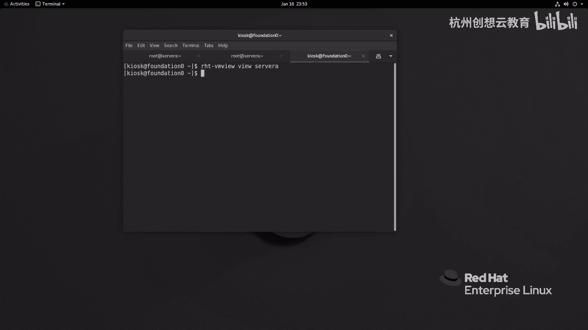
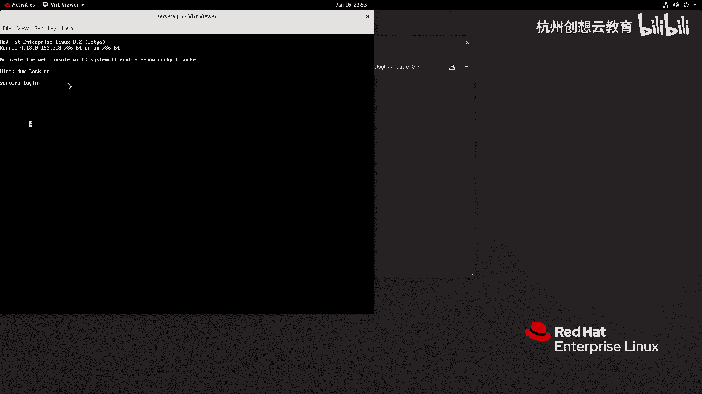
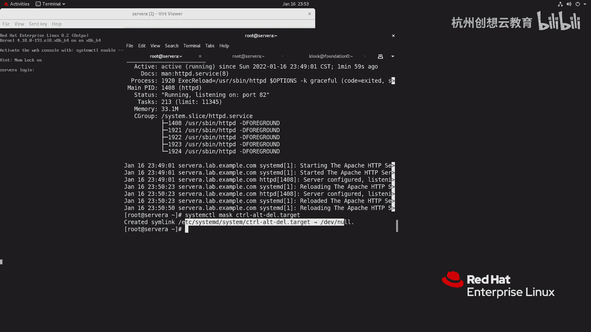
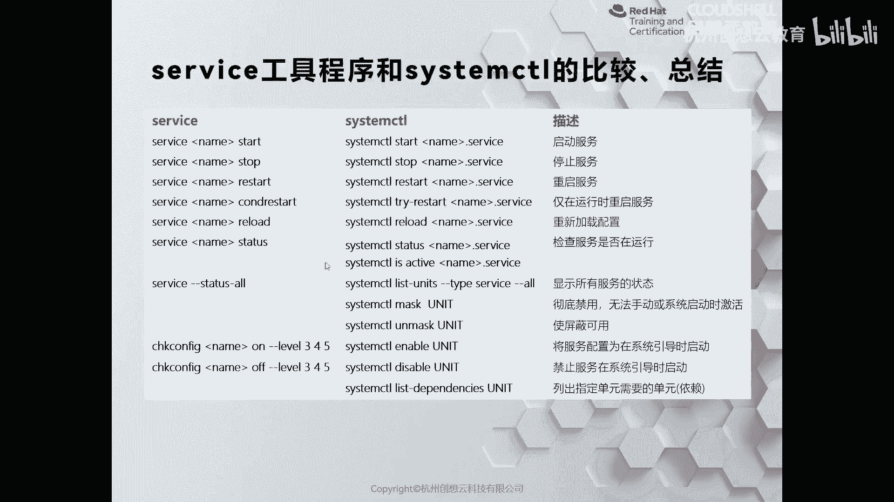

# 红帽认证系列工程师RHCE RH124-Chapter09-控制服务和守护进程 - P2：09-2-控制服务和守护进程-控制系统服务 - 杭州创想云教育 - BV1NN4y1c7u4

好，我们来看一看具体呢如何通过system CTL指令啊来控制我们性登服务啊。因为我们在管理服务器的时候呢，那么某些原因啊，我们可能需要啊把某些服务呀停止掉，或者启动起来，甚至呢有可能是重新启动，对吧？

等等啊，那么我们可以通过sstemCTL啊star啊或者stop来。控制啊我们某些啊单元的什么呀启动和停止啊停止。好，那么我们举个例子啊，比如说呢呃我现在呀我想把我的这个呃服务哪个服务呢？

我想把我的IHTDBD点serv呢给它停止掉啊，停止掉。那么我就可以通过sstem cTL什么呀stoptop啊，把它给它停止掉即可。然后呢，我们再盘状态就被我们停了下来了。

现在是inactive待状态。O。O。啊，那么还有的时候呀，我们可能需要对什么呀？还需要对我们这些服务呢给他一个重启，对吧？哎，重启，那么就需要走一个restart啊ret。啊。

那么指定的就是stmo CTL啊restar。啊，这个HTTPD。啊，就起来了。那么通过re star之后呢，相当于是把这个服务呢关闭掉再起来。因此它的进程号呀一定会发生变化。

那么对于某些特殊的服务呢啊不需要重启就可以生效。那么我们需要呢去加载那它的配置文件，对吧？可以通过reload啊reload。但是如果你不确定它是reload就能就可以，还是必须要restar。

那么你可以走一个reload orre就可以了那就可以了。O。啊，那么就能去判断啊就判断。因为在呃real器之后呀，这个很多的服务其实啊走reload的就。啊，不是的那么的完美啊。

大部分还是需要做restart的restart。那么比如说举个例子啊，我这个去把这个。去把我们的外部服务的端口呢我它简单改一改。啊，我把这个。listen啊去把这个80啊改成啊这个82好吧，82。

然后因为涉及到Sin，我们还没学，所以呢我先把它临时的关一下。那么我去把这个服务呢也不重启啊，我去reload一下，我们看看有什么效果。然后呢，我们再来看一看的状态，适用的是82吗？哎，这个就可以对吧？

变成了82啊82O那如果你不确定的话呢，就走一个什么呀，走上一个reload。啊，Al very start。哎，那么我们来刚才对比一下，你看刚才信型号是1408，那么我们来看看有没有变化。哎。

140码没有变化，对吧？因为你主要是判断，说他根据情况呢去执行的啊去执行的。好，接着呢我们再来看啊。那么如果呀我想去看一看某个单元啊，对这个它到底是依赖于哪些内容。哎。

我可以通过这个list啊depends啊这样一个指令来查看我们的依赖啊，依赖O。啊，那么我这里呢就。啊，不去执行了啊不去执行了ok然后呢，还有呢就是还可以干嘛呀？去屏蔽某些服务啊，某些服务。

那么某些服务的话呢，这里啊提到的有啊这个post，比如说post fix和send mail啊，send啊SEND啊，我这里少写的字母啊，send mail。那么这两种的话呢。

它都是来提供发送邮件服务的啊，提供发送邮件服务的。那么但是呢这个。😊，那么如果你同时呀把这两个符呢起来，它肯定会冲突，那么怎么办呢？哎，我们可以把某个服务呀给它屏蔽掉啊，当我们执行屏蔽指令的时候呢。

它会自动啊把这个服务呀重定向到哪里呢？给它做一个做了一个软链接啊，指向了DV下的no啊，那么你当你尝试手动把这个服务给起来，那么就会提示该服务呀被屏蔽掉了。那同样你也可以适用于目标啊，目标啊。

我这里呢以目标的方式来举例啊，那么因为有的时候我们可能会按一下键盘啊，这个发送了一个cr out delete的信号，导致呢服务呢重启了，服务器重启了。那么我就可以通过ste cL啊，这个mask啊。

后面跟上什么呀？跟上我们的这个指令。啊，跟按指令来来确保呀我们的这个呃服服务是否是可以去给他。那个把它屏蔽掉O回车。

那这时候呢我如果发送一个contrl out delete是没有意义的那我现在呀通过终端啊，把这个虚拟化的这个虚拟机的这个推拉界面啊给它拿出来。

然后呢，我给他发送一个什么呀？control data啊，没有任何的反应，对吧？没有任何反应。OK这就是屏蔽掉了一个啊单元啊，屏蔽掉了。你看它的软链接指向了DVR的no啊，指向no。

那如果我们想让某个服务啊，这个在系统啊启动的时候啊也跟着起来，你可以使用inable啊，后面跟上你的名字就可以了啊就可以了啊。

啊，那么这里呢做了一个早期的命令和现在stem sit条的一个比较啊，我们来看一下。那如果呢我想通过把某个服务呢起来，那早期的时候呢就是servs，跟上服务的名称，跟上个start就okK了。

那现在呢就是sytem sitstar动词放在中间了，后面可以跟上一个或多个服务都是没问题啊，那么停止也是一样的，restar也是一样的O。哎，那么还有个呢就是这里有一个叫做什么呀？叫做reload。

对吧？相当于早期的reload，还有这个tatters状态，对吧？哎，这个还有屏蔽啊，屏蔽的话是我们的stem地特有的啊特有的mask和an mask取消屏蔽啊，就使屏蔽可用就是取消屏蔽啊。

那么使我们的服务啊在run level3run level4和run level5能够运营起来，那么只需要able一下就可以了。啊，OK那么这些呢都是有个对比啊，我们左边的这个s的命令呢就不再执行了。

都是通过的是stmore cR。那么但是也不绝对啊，如果我们去安装了一个服务啊，它还是走了传统的那种脚本方式，那么我们还可以使用s来管理啊，当你执行的时候，它会提示你啊，提示你ok你去选择就行了啊。

选择就行了。

