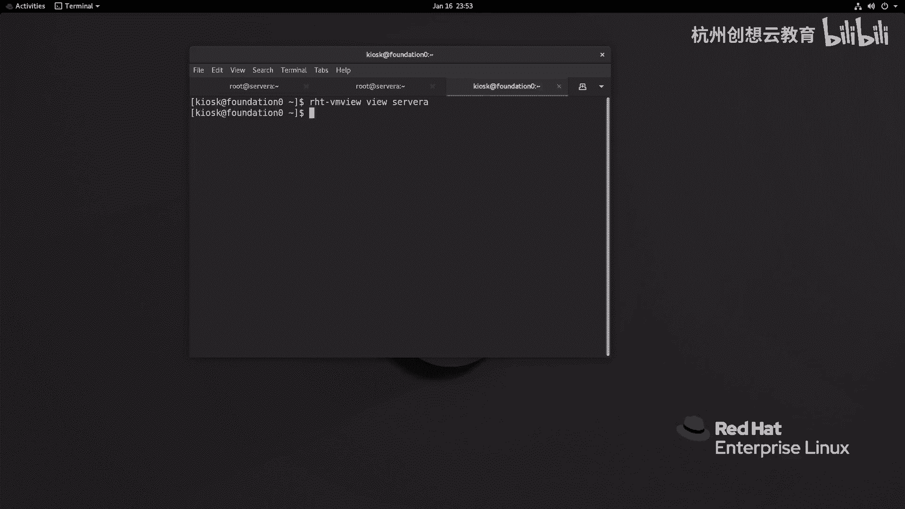
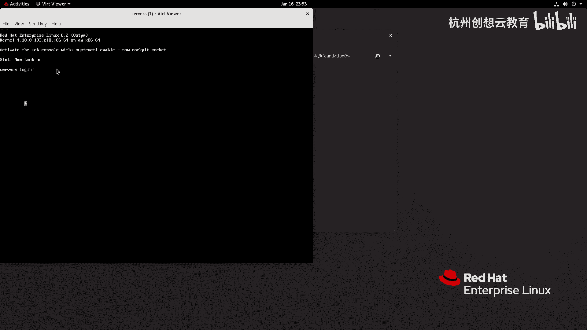
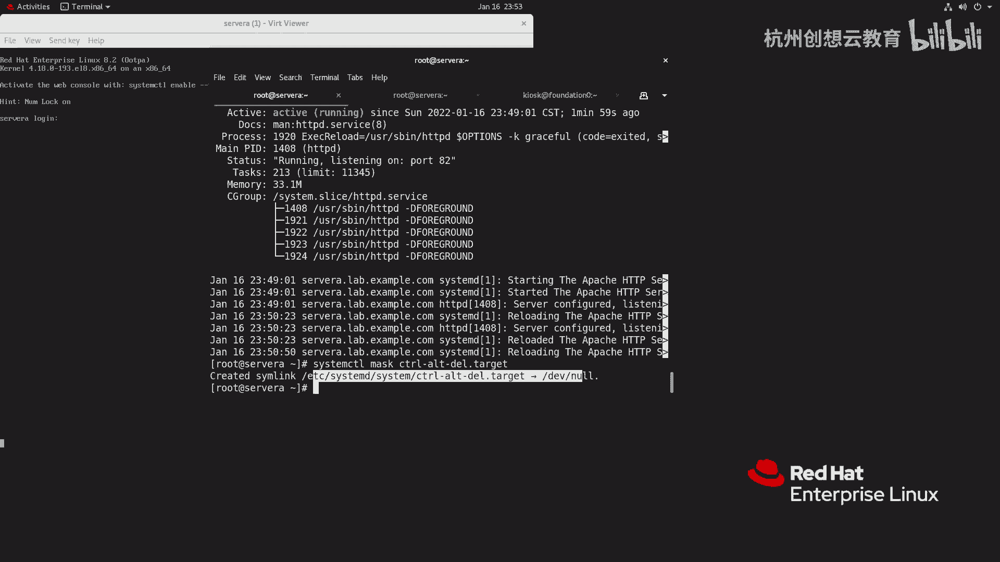
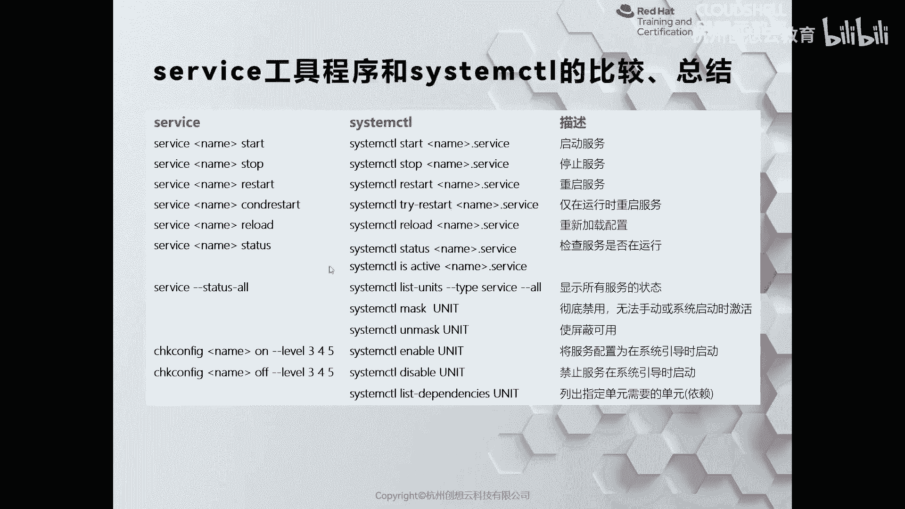

# 红帽认证系列工程师RHCE RH124-Chapter09-控制服务和守护进程：09-2：控制系统服务 🛠️

在本节课中，我们将学习如何使用 `systemctl` 命令来控制系统服务的启动、停止、重启等操作。这是管理Linux服务器上各种服务的基础技能。

上一节我们介绍了服务和守护进程的基本概念，本节中我们来看看如何具体地控制它们。

## 使用 systemctl 控制服务状态

在管理服务器时，出于各种原因，我们可能需要停止、启动或重启某些服务。我们可以通过 `systemctl` 命令配合 `start`、`stop` 等子命令来控制特定单元的启动与停止。

以下是控制服务状态的核心命令：

*   **启动服务**：`systemctl start UNIT_NAME.service`
*   **停止服务**：`systemctl stop UNIT_NAME.service`
*   **重启服务**：`systemctl restart UNIT_NAME.service`
*   **重新加载配置（不重启服务）**：`systemctl reload UNIT_NAME.service`
*   **检查服务状态**：`systemctl status UNIT_NAME.service`

例如，要停止 `httpd` 服务，可以执行：
```bash
systemctl stop httpd.service
```
执行后，服务状态将变为 `inactive`（未激活）。

重启服务会先关闭再启动，因此其进程号一定会发生变化。执行命令：
```bash
systemctl restart httpd.service
```

对于某些服务，修改配置后无需完全重启，只需重新加载配置即可生效。这时可以使用 `reload` 命令。如果不确定服务是支持 `reload` 还是必须 `restart`，可以使用 `reload-or-restart` 命令，系统会自动判断。
```bash
systemctl reload-or-restart httpd.service
```

## 查看服务依赖与屏蔽服务

有时我们需要了解某个服务单元依赖于哪些其他组件。可以通过以下命令查看依赖关系：
```bash
systemctl list-dependencies UNIT_NAME.service
```

此外，系统上可能存在功能冲突的服务（例如 `postfix` 和 `sendmail` 都是邮件服务）。为了避免冲突，我们可以“屏蔽”某个服务。执行屏蔽指令后，系统会创建一个指向 `/dev/null` 的软链接，此后尝试手动启动该服务将会失败。

屏蔽一个服务单元（例如屏蔽 `ctrl-alt-del.target` 以防止误按 Ctrl+Alt+Del 导致系统重启）：
```bash
systemctl mask ctrl-alt-del.target
```
屏蔽后，发送 Ctrl+Alt+Del 信号将不再有反应。若要取消屏蔽，则使用：
```bash
systemctl unmask ctrl-alt-del.target
```



## 设置服务开机自启



如果希望某个服务在系统启动时自动运行，可以使用 `enable` 命令：
```bash
systemctl enable UNIT_NAME.service
```
相应地，禁用开机自启使用：
```bash
systemctl disable UNIT_NAME.service
```



## 新旧命令对比

早期的 Linux 系统使用 `service` 命令管理服务，而现代系统（使用 Systemd）则统一使用 `systemctl`。以下是两者对比：

| 操作 | 旧命令 (service) | 新命令 (systemctl) |
| :--- | :--- | :--- |
| 启动服务 | `service NAME start` | `systemctl start NAME.service` |
| 停止服务 | `service NAME stop` | `systemctl stop NAME.service` |
| 重启服务 | `service NAME restart` | `systemctl restart NAME.service` |
| 重载配置 | `service NAME reload` | `systemctl reload NAME.service` |
| 查看状态 | `service NAME status` | `systemctl status NAME.service` |
| 开机启用 | `chkconfig NAME on` | `systemctl enable NAME.service` |
| 开机禁用 | `chkconfig NAME off` | `systemctl disable NAME.service` |
| 屏蔽服务 | 无直接对应命令 | `systemctl mask NAME.service` |
| 取消屏蔽 | 无直接对应命令 | `systemctl unmask NAME.service` |

需要注意的是，如果安装了仍使用传统脚本方式管理的服务，`service` 命令依然可用，但通常会提示你使用 `systemctl`。



本节课中我们一起学习了如何使用 `systemctl` 命令来启动、停止、重启、重载服务，以及如何查看服务依赖、屏蔽服务和设置服务开机自启。掌握这些命令是有效管理Linux系统服务的基础。