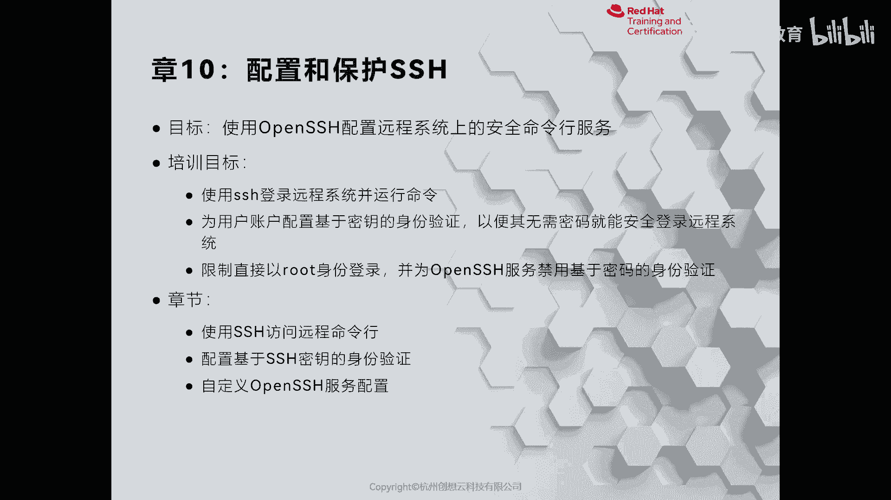
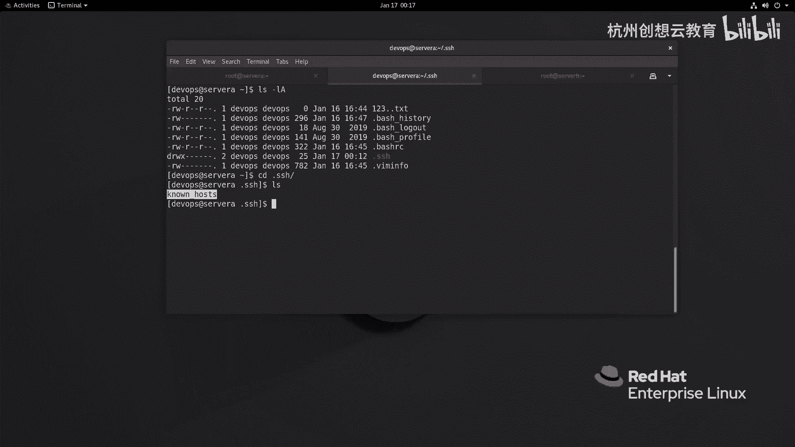
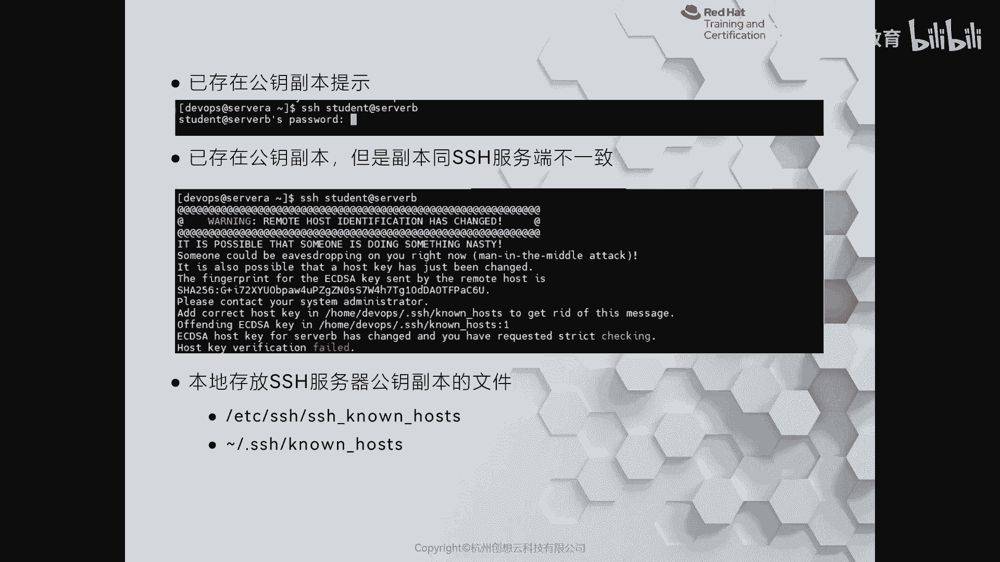
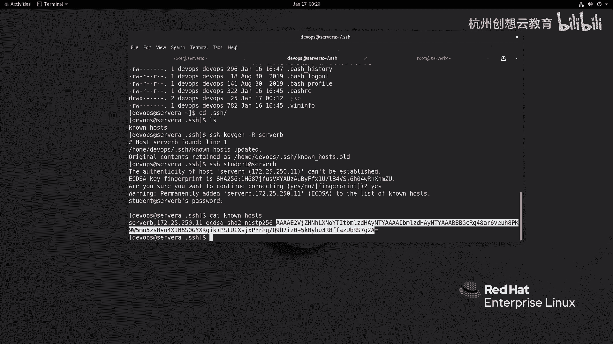
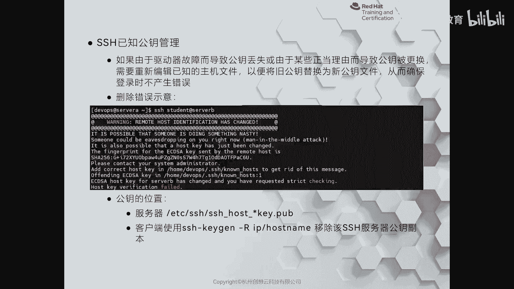

# 红帽认证系列工程师RHCE RH124-Chapter10-配置和保护SSH - P1：10-1-配置和保护SSH-使用SSH访问远程命令行 - 杭州创想云教育 - BV1eG4y1r7oK

啊第十章啊配置和保护s区，那么这张我们主要讲的是如何呢，通过客户端啊，使用s谐音的去登录到服务器上啊，以及在服务器上去执行命令，那么第二部分呢则是通过配置一个什么s h啊。

这个密钥认证的方式来实现一个免密码的认证登录，那么最后一部分呢将会给大家来介绍如何简单的设置s去服务器，然后呢提高它的安全性好，我们来看第一小节，第一小节呢给我们来介绍一下如何使用sg命令。

那么首先我们来说一说为什么使用i s h e啊，那么在早期的时候呢，我们啊去连接网络设备也好，连接服务器也好呢，会通过tnt啊去登录，但tnt本身呢是一个铭文的，那么就意味着呢是存在极大的可能性啊。

然后呢把我们的账户和密码呀暴露到互联网上，或者是暴露给其他人，那是非常危险的，那么因此呢就催生了一种啊加密的协议，那么称之为是secret shell，简称呢s h啊，简称s h，那么s h协议的话呢。

在啊这个linux版本的服务器啊，都是默认开通的啊，只要是面向服务器的linux都是开着的，那么它的端口呢走的是22号的端口，tcp的ok哎所以说呢我们可以默认情况下直接去连上去啊，连上去。

那么如何去连呢，我们可以通过s级命令直接跟上主界名，那么我们来连一下试一试，效果好，那我现在呢以啊这个我这里呢以sora的身份啊，然后呢在啊root root用户身份啊，在sora上去连谁呢。

server b我试一下，ok那么我在连的时候呢，我并没有指定用户的身份啊，那么这时候呢提醒了一句话啊，那么这句话呢是问我们要不要添加这个服务器server be什么呀。

这个e c s d这个密钥的一个指纹啊，它是以哈希256的方式给我们展现出来的，那么我去填成一个yes，那么这时候呢同意之后呀，那么他询问我的是server be上面root账户的密码啊。

他怎么知道是root呢，是因为我当前身份呢正是root，那么如果啊如果我没有用书的身份啊，我可能换了别的身份，比如说我换成谁呀，dv o p s，那么我再去点啊，去年sb k好，sorry。

刚才我这个这个地方加了用户名对吧，我现在不加啊，你看他也会啊，dio用户名是谁呀，是dps，因为我们在远程连接的时候，如果没有指定用户名，那么它会以客户端的当前用户身份去尝试登录到扶梯上面。

那如果运气好，正好你本地和服务器同名，哎那你把密码一输呢，就登上去了，那万一不一样呢，那这样方式肯定不太好用了，所以一般这种情况下我们用的很少的啊，很少的，所以说用的最多呀，还是我刚才第一种情况。

就是说我s h啊，后面的跟上用户名，at服务器的主机名或ip地址，通过这种方式，人为的呢去指定我到底用什么样的用户身份去登录服务器，ok我现在输入密码就登上来了，登上成功之后，如果你执行完任务了。

那么你可以退出即可啊，退出即可，ok这是命令登录，那么有的时候呀，我们可能只需要在服务器上啊执行的命令，而不需要啊登进去，敲完了再退出，这么麻烦啊，我直直接呢把这个要执行的命令啊。

通过s型隧道呢发送过去执行就可以了，那我就可以啊，在啊这个命令后端呀将增加一个试药指令，比如说现在呢我去干嘛呢，我去s h的时候呀，啊s i g的时候，然后呢我去执行一个命令，叫谁呢。

叫做who am i唉，那么输入用户的密码，那么执行之后反馈的结果就要打印在我们的控台上面了啊，控台上面了，那么当我们登录之后啊，登录之后，那么我们现在再登录一遍好吧，再登录一遍，那么登录之后呀。

我们的服务器上面，那么就可以啊通过一系列指令啊去判断啊，哪些用户登录到了我的server b啊，登录到的server be，ok那么怎么去判断呢，好我们来看一个命令啊。

我们可以通过w啊来查看到底有哪些用户登录到了我的服务器上面，注意，那么之前我们也学习过w，对不对，那么我们再再再来看一看啊，看一看效果好，我现在呢正在server b上面啊，然后呢我执行一个w。

那么就能看到啊，看到诶这里spen用户啊，那这个一看就是什么呀，从远程登过来的，为什么呀，哎ip地址啊，ip地址不是我的ip地址，我的sb的地址呢是172025年250。11对吧。

同样入的也是通过远程的分类登上来的啊，那么我们也可以呀，什么呀，有使用我们的后面还会讲到一些啊网络管理的命令啊，比如说i s s s s命令呢也可以去看到，还有日志啊，好我们来感受一下啊。

我现在呢去敲一个s杠t p l n a，然后呢去筛选s h t，那么试炼出来呢，就能看到这个所有通过远程的方式来连接上面的规划啊绘画，那么你可以通过这种方式呢哎来判断你的客户端呀是从哪里来的对吧。

呃比如说我们放在云主机上面的这个一些业务呀，那么有的时候可能中招对吧，准备肉机哎，可能看到i p地址呀来源于某某国家，是不是，那那你肯定是中招了对吧，那么当然了。

我们也可以通过日志的方式来筛选关键词s g d去找挖下面的log啊，secret也能够看到啊，哪些啊这个呃客户端通过啊什么用户的身份来登录上面来的，都是能够看到的啊，都是可以看到的，ok好。

那么这个呢就是我们给大家这演示的一个啊登录以及啊，这个如何呢去检查啊，那么哪些口端来登录到我们服务器的一个方式啊，那么我们刚才通过s命令啊，在登录的时候呢，我们看到了一个这样的啊一个提示符啊。

那么这个提示符的作用呢，我们现在呢给大家详细的来介绍一下啊，那么在我们的客户端呀，他的家目录里面啊，这个会有一个这样的目录啊，是个隐藏的目录啊，啊我现在呢来到server a好吧。

server a通过正面来吧，好我现在在server a上面啊，在我们的家目录里面也会有一个这样的隐藏目录叫点s h，我们进来看一看。

那么在点s区里面默认情况下呢是没有一个叫做no house文件是空白的，是没有的，那么只有我们第一次使用s命令啊，它还要生成一个点s h，当我们在尝试通过密码认证的方法连接服务端的时候呀。

那么本地会生成一个no house的文件，那么这个no号文件呢是干嘛用的呢，啊我们来继续看刚才的这张图。

当我们啊从客户端连远程连接到服务器的时候，那么我们的客户端呀啊会收到服务器啊，服务端呢提供了一个什么呀公钥，那么这个公钥它肯定不会直接给你展现出来，而是把公钥啊通过哈希256啊进行一个什么计算。

打印出来的信息，把它称之为什么呀，指纹信息，那么通过这个指纹信息呢，那么指纹信息呢会告知你啊要做继续，那如果没有提示啊，如果没有提示。

就说明刚才本地的点s h的no house里面已经存在了服务器的什么呀，公钥当你看到这个提示的时候呢，就意味着你的本地的no house文件里面是没有这个公钥的啊，没有这个公钥的，ok那么没有公钥啊。

那么是这样提示，那有公钥呢，哎就是直接会提示你要求输密码啊，输密码，那如果服务端啊的公钥和你本地存放的公钥存在不一致的情况下，那么会提示一个警告，并且呢断开连接，那么为什么呢，因为当你不一致的时候呢。

他就认为啊中间可能遭受了中年人的劫持啊，禁止我们去远程连接发下链接，ok呃如果如果是因为这个你自己的原因啊，比如说啊我自己的服务器啊，我把这个公钥做了更新啊，导致我的客户端连的时候出现了这样一个问题。

那么我们可以使用标准的方法就是什么呢。

通过i s区啊，这个kt gr，然后呢来移除啊，爆粗的这台服务器，即可啊即可啊，有的人说哎，那我把这个no house全部删掉，可不可以也可以啊，或者我把这个文件里面这个存在有公钥的那一行删掉也可以。

但是呢这两种方法呢我们是不推荐的，因为它不属于标准的啊，方法有可能有可能删的多了是吧，哎导致你后面还要增加新的功效啊，那么我们再次连一下试一试效果，哎效果，那么又提示这个功能的问题了对吧。

我们存储一下啊，存储一下，搜了之后呢，我们的no house文件里呀就会有对方的公钥，你看以c d c a的算法，那我们公钥信息啊，共享信息，ok好，那么这是我们的公钥啊，那么好。

我们接着呢再来看我们的ppt来深化一下我们的这个印象啊，那么这里提到了通过这个s h杠kg啊，这个gr 2啊来移除我们的主机或者ip地址的公钥副本即可啊，即可这种情况呢如果出现一定要小心啊。

哎你看你看是不是你这个同事或者个人的人为的原因导致的，还是真正的中间人坚持啊。

