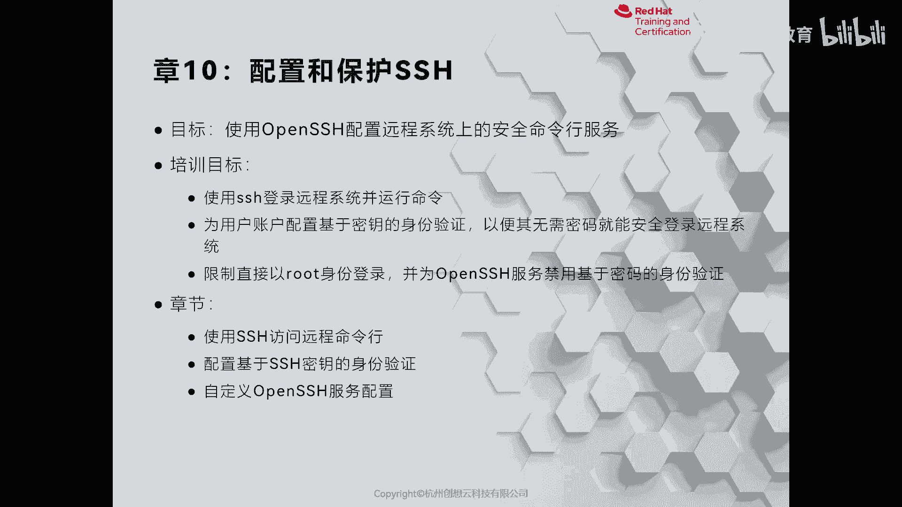
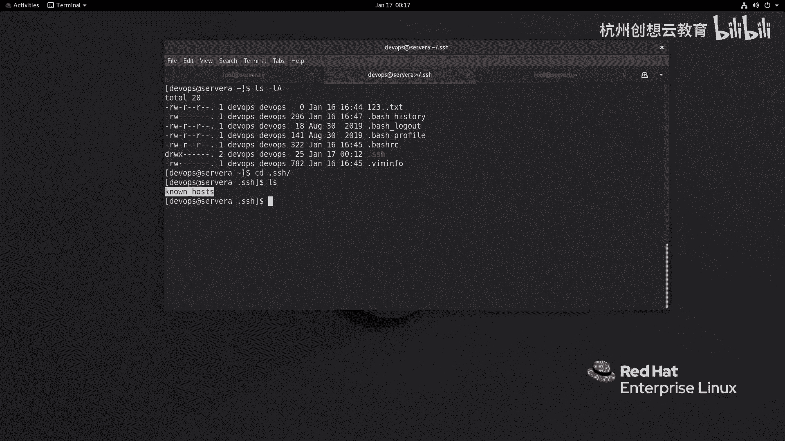
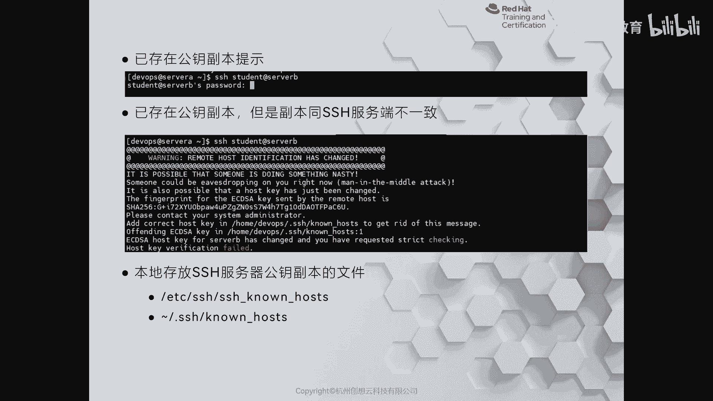
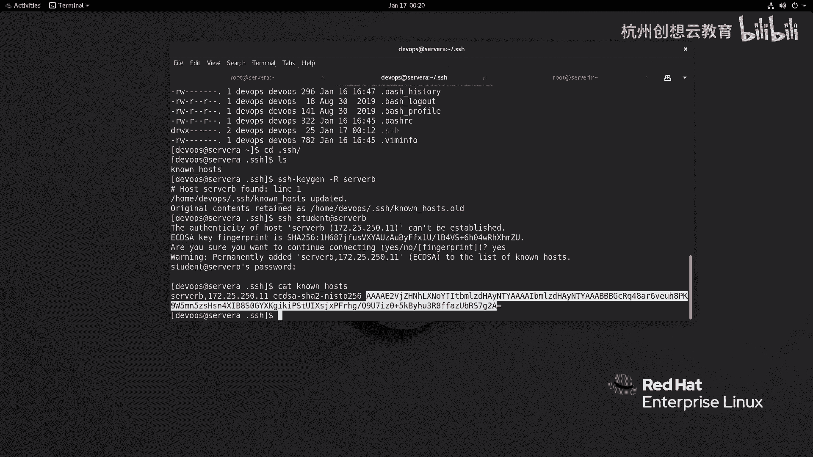
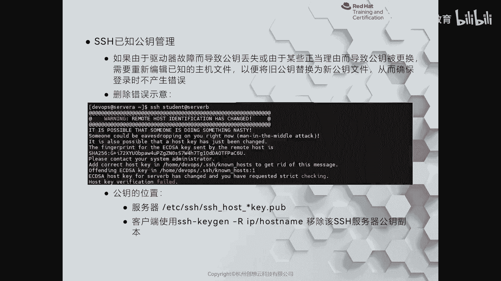

# 红帽认证系列工程师RHCE RH124-Chapter10：配置和保护SSH - P1：10-1-配置和保护SSH-使用SSH访问远程命令行 🔐



在本节课中，我们将要学习如何使用SSH协议安全地连接到远程Linux服务器，并执行命令。我们将了解SSH的基本工作原理、连接方式以及如何验证服务器的身份。

## 为什么使用SSH？ 🔑

在早期，连接网络设备或服务器通常使用Telnet协议。但Telnet本身是明文传输的，这意味着账户和密码等信息在网络上传输时存在极大的暴露风险。因此，催生了一种加密的协议，称为Secure Shell，简称SSH。

SSH协议在面向服务器的Linux发行版中默认是开启的。它使用TCP协议的22号端口进行通信。因此，在默认情况下，我们可以直接连接到开启了SSH服务的服务器。

## 如何使用SSH命令连接？ 💻

要连接到远程服务器，可以使用`ssh`命令后跟主机名或IP地址。

**基本连接命令格式：**
```bash
ssh [用户名]@[主机名或IP地址]
```

如果未指定用户名，SSH客户端会尝试使用本地当前的用户身份去登录远程服务器。但更常见的做法是显式指定用户名。

**示例：以root用户身份连接**
```bash
ssh root@serverb.example.com
```
首次连接时，系统会提示您确认服务器的公钥指纹。输入`yes`后，需要输入远程服务器上对应用户的密码。

**示例：以其他用户身份连接**
```bash
ssh devops@serverb.example.com
```

登录成功后，您将进入远程服务器的命令行界面。执行完任务后，输入`exit`命令即可退出。

## 如何在远程服务器上执行单条命令？ ⚡

有时，我们可能只需要在远程服务器上执行一条命令，而不需要进入完整的交互式会话。这时，可以直接在`ssh`命令后附加要执行的命令。

**命令格式：**
```bash
ssh [用户名]@[主机名或IP地址] [要执行的命令]
```

**示例：在远程服务器上执行 `whoami` 命令**
```bash
ssh root@serverb.example.com whoami
```
输入密码后，命令的执行结果将直接显示在本地控制台上。

## 如何检查谁登录了服务器？ 👥

上一节我们介绍了如何连接服务器，本节中我们来看看如何从服务器端查看当前的登录用户。

在服务器上，管理员可以使用一些命令来查看哪些用户已经登录。

**使用 `w` 命令：**
`w` 命令可以显示当前登录系统的用户及其正在执行的进程。
```bash
w
```
输出结果中，`FROM` 列显示了用户的来源IP地址，可以据此判断是否为远程登录。

**使用 `ss` 命令：**
`ss` 命令用于查看系统的网络连接情况。可以结合筛选来查看SSH连接。
```bash
ss -tplna | grep sshd
```
这条命令会列出所有通过SSH建立的连接。



**查看系统日志：**
此外，还可以通过查看系统日志文件（如 `/var/log/secure`）来获取SSH登录的详细记录。
```bash
sudo grep sshd /var/log/secure
```

## 理解SSH主机密钥验证 🔐

在首次使用SSH连接服务器时，客户端会收到一个关于服务器公钥指纹的提示。这个机制是SSH安全性的重要组成部分。

在客户端用户的家目录下，有一个隐藏的 `.ssh` 目录。首次成功通过密码认证连接服务器后，该目录下会生成一个名为 `known_hosts` 的文件。

**`known_hosts` 文件的作用：**
*   当客户端首次连接服务器时，服务器会发送其公钥。
*   客户端会计算该公钥的哈希值（指纹）并提示用户确认。
*   用户确认后，服务器的公钥信息会被保存在客户端的 `~/.ssh/known_hosts` 文件中。
*   后续再次连接同一台服务器时，客户端会将收到的公钥与 `known_hosts` 文件中存储的公钥进行比对。
    *   如果一致，则直接进入密码认证环节。
    *   如果不一致，客户端会发出严重警告并断开连接。这通常意味着可能存在“中间人攻击”，或者服务器本身的公钥发生了变更（例如服务器重装系统）。



**处理公钥变更警告：**
如果确认是因为服务器公钥合法变更（如服务器重建）导致的警告，需要从客户端的 `known_hosts` 文件中移除旧的公钥记录。

**标准移除方法：**
```bash
ssh-keygen -R [服务器主机名或IP地址]
```
例如：
```bash
ssh-keygen -R serverb.example.com
```
执行此命令后，下次连接该服务器时会再次提示确认新的公钥指纹。

**不推荐的做法：**
手动删除整个 `known_hosts` 文件或直接编辑该文件删除对应行。这可能导致意外删除其他有效记录，不是标准的管理方式。



## 总结 📝



本节课中我们一起学习了SSH的基础知识。我们了解了SSH作为一种加密协议，如何替代不安全的Telnet。我们掌握了使用 `ssh` 命令连接远程服务器、执行单条命令的方法。同时，我们也学会了从服务器端查看登录用户。最后，我们深入理解了SSH主机密钥验证的机制，知道了 `known_hosts` 文件的作用以及如何安全地处理服务器公钥变更的情况。这些是安全进行远程管理的基础。