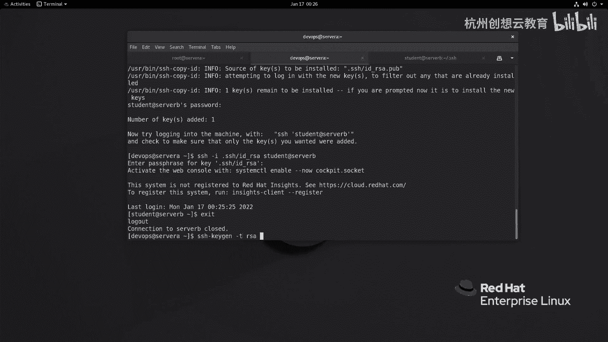

# 红帽认证系列工程师RHCE RH124-Chapter10-配置和保护SSH - P2：10-2-配置和保护SSH-配置基于SSH密钥的身份验证 - 杭州创想云教育 - BV1eG4y1r7oK

那么刚才呢我们提到了啊密码认证啊，存在这种啊中间人劫持的这种风险，那么因此呀s区呢还提供了另外一种身份验证啊，我们称之为是s h密钥身份验证，那么这种身份验证的方法呢和刚才呢是完全是不一样的。

那么首先呢在这个客户端和服务端呀都是互相啊，在一个比较信任的网络的架构下呢，那么客户端啊这个任意一个口端都行啊，甚至在服务器生成也是可以的，那么生成一个密钥对啊，然后呢把这个密钥对的公钥。

然后呢传送给服务器啊，传送给服务器之后呢，那么这个司药呢一定要保留好任何一个客户端拿着把私钥呢就可以啊，直接连接到我们的服务器，那么在连接的时候发生了什么事情呢，当抠端拿到这把私钥啊。

私钥去这个连接服务端的时候，那么服务端会使用啊，之前客户端提供的公钥来加密一段随机生成的字符串，然后呢将这个随机生成的字符串呢反馈给啊这个请求连接的客户端，请用的扣端，这个客户端收到之后呢，使用私钥啊。

然后来解密，解密之后把这个解密的字符串呀再发送给服务端，那么服务端呢会进行比对，那么看解密后的这个字符串和字字自己生成的这个字符串呀，是否是一致的，如果是一致的，那么就允许扣端呀，使用这个密钥进行登录。

把登录，ok那么整个过程啊，整个过程，那么我们给大家演示一下啊，那么首先啊我们这个可以通过s kg命令啊，通过交互的方式把密钥存放在，把密钥对存放在当前用户加目录的点s区里面，那么默认情况下呢。

他走的是rs的算法，因此呢生成的文件呀叫什么呢，叫做id下划线rc和id下划线rc。pub，那么如果你在执行的过程当中啊，不需要它进行交互啊，那么你可以使用i s h k g gt来指定啊。

你的算法走了r i c a杠b加密的长度啊，以及存放的文件的位置，杠f跟上文件名杠n跟上你的加密密钥的密码，那么我这个ppt上展示的这个就是没有给私钥加密，ok然后呢接着呢再把加密后的公钥啊。

通过i s h q b d指令，把通过gui来选定我们的这个啊，这个公钥把它传送给哪一个服务器的哪个用户啊，那个用户，那么你就可以使用这个私钥进行连接了，当然了，你也可以使用u盘呀。

或者其他的方法把这个公钥啊拷贝到对应的文件里面也是可以的，好那么我们来演示一下啊，那么刚才呢我们在sa啊啊连连接我们sb的时候呢。

是需要输入密码认证的。

那么我现在呢就去走一个密钥认证s区杠k进啊，杠k进好回车，那么生成一个密钥队来问我放在哪里，你看家目录里面回车啊，问我要不要对四要输入密码呢，我这里呢就先输个密码啊，输个red hat。

然后呢就生成了一个密钥对，然后呢我呢把这个庙对啊，给他拷贝给谁呀，拷贝给啊。

server be啊，我要拷贝server be的哪个用户呢，student的用户好吧，那么新的用户的话呢，加目录里面在呢已经有一个点s去了，那么为了为了看得更清楚呢，我切换到普通用户好吧。

那么现在的目录里面是只有一个no house啊。

server b上面好，那我sa呀，通过c cb i d啊，那么杠i啊，点s i g下面的i d下划线rs a pub啊，去拷贝给student at server。

那么这时候呀经过的认证呢还是密码认证，输入对方的密码student。

那么就把这个公钥啊考给服务器了，那么服务器上呢就会多一个文件啊。

多一个文件，那么这个文件里面存放的就是它的公钥啊。

公钥，然后我就在客户端呀。

就可以通过啊刚才的这个公钥去登录我们的服务器了。

然后输入私钥的密码啊，就登录上去了。

ok这是走密码了，那么我们也可以干嘛呢，啊也可以生成一个空的密码，就是免密码登录，那么我这次呀走一个非教式的命令i s h杠k进啊，k进我用安静模式啊，t r i c r i s啊。

然后呢杠b长度呢是2048，然后呢i文件呢s h下面我们就起个长一点吧，live key什么呀，without pass，啊不包含密码的对吧。

密码呢就是空了啊，空的啥都没有生成一个，那么接着呢我再把这个新生成的公钥给他，拷贝给谁呀，拷贝给这个服务器，这个就必须要加上一个杠i了啊，因为我们的名字是非常规的名字，这次呢我要拷贝给谁呀。

拷贝给dev ops啊，dops的用户。

啊经过密码认证啊就可以了，好我登录一下试试s啊，杠i。s h下面的啊live啊，这个私钥啊，跟上这个dios啊，dops at server b啊。

没有输密码就登录上去了啊，就登录上去了。

ok啊这是两种方法啊，一个呢是对四要进行加密，一种呢是对四要没有加密，那么对没有加密的这种死要一般适用于在局域网内部，那么如果是怕互联网一定要给私钥加密，并且要妥善的保管保管。

ok但是呢有的时候呀我们保管之后呢，发现这个每次连呀我都要输一次密码，对不对，哎我都要说一次密码。

你看输一次密码，特别的麻烦啊，特别的麻烦，那么我能否在短时间内啊只输一次密码呢，当然也是可以的，唉我们可以通过代理的方式啊，代理的方式啊怎么做呢，我们可以通过这个命令啊，叫做什么呀。

evil通过iphone的话呢，可以把这个代理这个第一次呢只要通过sk进这个代理啊，把这个密码输进去啊，那么它会把这个密码呀缓存在内存里面，然后呢我们再登的时候呀，就不用输密码了，好我们来试一下。

好来试一下，ok那么首先啊我现在呢通过这个啊evil去生成我们的这个私钥私钥，ok那么生成一个s h干什么呀。

这个engine回车啊，那么代理呢已经起来了，进程号是2457，然后呢接着呢s h什么呀，把这个需要用到的私钥啊加进去，那么我们的私钥呢是i d r s啊。

密码输进去，输完之后我再次呢去干嘛呀，通过s h去登录student at server b。

唉就不用输密码了，不用输密码，因为我们上面这个代理已经替我们把密码输进去了啊，输进去了，ok这是给大家演示的啊，这个通过ssh密钥认证，那么这种认证方式安全性更高啊。

