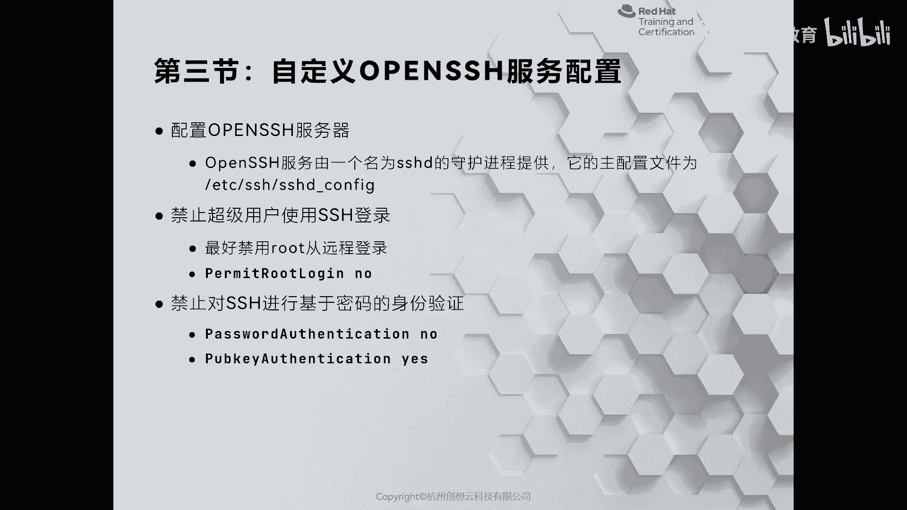
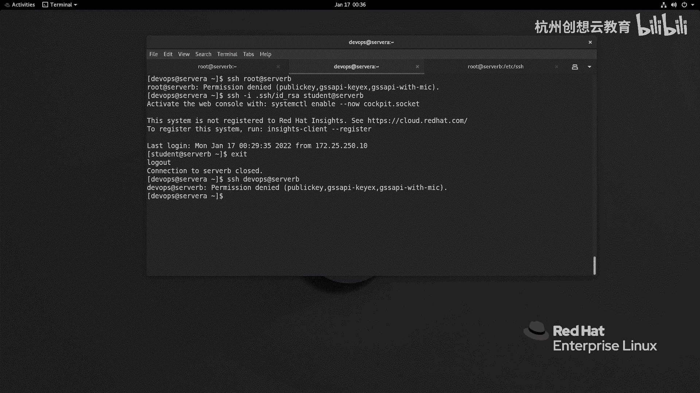

# 红帽认证系列工程师RHCE RH124-Chapter10-配置和保护SSH - P3：10-3-配置和保护SSH-自定义OpenSSH服务配置 - 杭州创想云教育 - BV1eG4y1r7oK

那么刚才呢我们增加了一个密码认证啊，但是呢会有一个这样的一个问题所在。什么问题呢？我们来感受一下啊，我现在呢退出了啊，然后呢我换了一个终端，然后呢切换到啊这个ds。啊，然后呢。

因为我刚才呀在这里生成了一个喵队，对吧？然后呢，我这次呀再次呢去通过使用点SHID下划线2C呢去连接student艾serv B。那么这次在连的时候呢，我没有输入私钥密码回车了。

反而呢他要求输入账户的密码，也就意味着在我们的服务器上啊，它优先让我们去使用密码这个密钥认证。接着呢才会去使用密码认证，而密码认证呢又存在什么呀？中间人劫持的风险，这是其一。其二。

我还可以使用root的身份呀去登录到serb。对吧那么很多人在云主机上啊去这个公共云上呢购买一个云音主机之后，哎，那么就默认使用root来登录。那这样风险是很高的，为什么呢？

因为互联网上啊每时每刻呀都有这个啊想办法呢去呃使用暴力破解的方法来登录到你的服务器里面啊，所以我们最好呢是干嘛呀？禁用root远程登录，这样可以啊这个提高啊这个黑客扫描到你的这个。啊，端口。

并且呢使用root来暴力登录的一个可能性。OK好，那么提高它的门槛啊，降低的可能性。那么怎么去保护呢？我们这里呢就以serverb为例啊，servb为例。那么要想去提高我们SH服务的安全性。

那么我们可以来到ATTC啊SH目录下面在这个目录下面呀有一个文件呢叫做SHD啊fi。那么这个文件呢是专门来负责啊这个配置SHD服务器的。那么我们通过VM编辑把它打开。啊，那么打开之后呢。

在这里面呀有非常多的配置啊，我给大家解释一下啊。那么首先呢注释的地方是有井字号的，你像这里的1到20啊，前面都有个井字号，那么代表的是注释，注释呢就是说明或者没有生效啊，而下面的这种啊则是生效了的。

那么首先端口。端口的话呢，我们可以改成一个非常规的端口。但是云主机你是没有办法改的。因为它走的是什么呀？走的是那个安全组，对吧？啊，安全组。那因此呢我们这里呢也不改了，就走这个。然后呢。

这个地址哎根据需要的，你可以真听啊，比如说你有内网的地址，还有个外网的，然后呢，你这个只允许内网真听，对吧？你写个内网的IP。😊，比如说我写172。25。250。11。啊。

然后呢这是IPV4的IPV6地址呢，我没有就不用写了。再往下呢，我们继续找啊，那再往下呢，我们有一个这样的功能啊，46行允许root登录啊，允许root登录。那我们建议呢把它干嘛呀关闭掉啊，关闭掉。

并且下面还有一些关于认证的次数的一个限制。那么这个限制的话呢，我们建议呢结合PAM一起使用效果更好啊。那在这里呢我们就不去改了，并且呢把51行的公钥认证啊强制啊打开，就是显示声明打开。

OK打开的同时呢别忘了55行啊，那么一定要记得啊这个啊公钥的位置是在这个地方一定要注意啊。当然你可还可以自定义。你像我这道环境啊，我就做了个自定义放在ETC下面，并且叫做隐藏的RHT这样一个文件OK。

😊，呃，那么再加固的话呢，就是我们关闭掉密码的认证，我们把这个密码认证啊给它关闭掉。这样呢就堵住了啊密码认证的这样一个缺口。那么除此之外呢，我们还可以结合什么呀？c boss来做认证等等，限定IP地址。

限定用户都是可以实现的啊，都是可以实现的。okK那么我这里呢就不做那么复杂了啊，只对我们的SHD啊做了禁止若登录以及强制使用公钥认证。那么小提示，当你确定要开启公钥认证的时候。

一定要先把啊这个客户端生成的这个公钥啊拷贝到服务器上面。否则呢你只能通过物理的方式来拷贝，你没有办法通过SA协议来拷贝了啊，保存并推出想让它生效，我们走一个命令啊，ressort SHD。

那么我们去看一看这个。啊，他的真听的情况。冒号22，那你会发现都是我们的IPV4地址啊，不再有0。0。0了。那么我这时候呀口户端要去连一连SHroot at server B密码是啊。

还没来得及输密码就不让我登了，对不对？好，然后呢，接着呢我换一个身份，我用谁呢？用student啊，然后呢，这个跟上一个密钥。啊密钥。那么密钥的话用IDRC。啊，RDICO登上去了啊，登上去了啊。

这是一种方法，然后还可以啊还可以啊。那么我现在呢再尝试一下密码登录，好吧，IH student。艾哦换一个身份吧，DVOPS艾 serverB。哎，不让登啊不让灯，因为我没有给他分配公钥啊，公钥。

