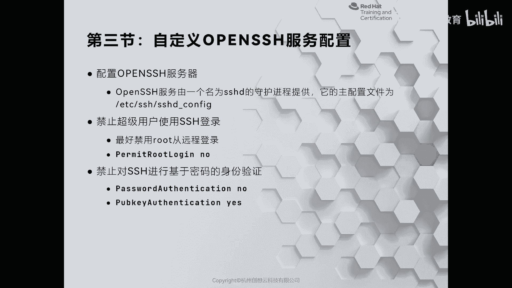
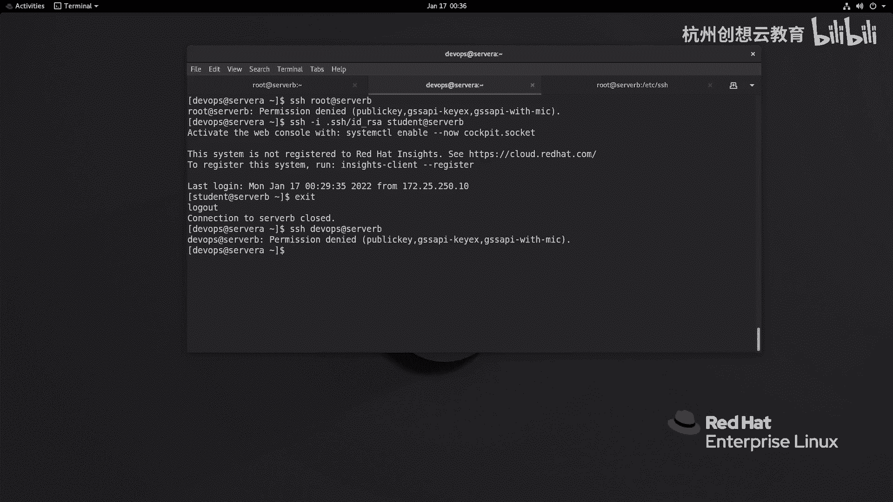

# 红帽认证系列工程师RHCE RH124-Chapter10：配置和保护SSH - P3：10-3-自定义OpenSSH服务配置




在本节中，我们将学习如何通过修改OpenSSH服务器的配置文件来增强其安全性。我们将重点介绍禁用密码认证、禁止root用户远程登录等关键配置，以降低服务器被攻击的风险。

上一节我们介绍了如何配置基于密钥的认证。然而，默认配置下，服务器可能仍允许密码认证，这存在安全风险。此外，允许root用户直接远程登录也增加了被暴力破解的可能性。本节中，我们来看看如何通过自定义SSH服务配置来解决这些问题。

## 识别默认配置的安全隐患

首先，我们通过一个例子来感受默认配置可能带来的问题。在配置了密钥认证后，尝试连接服务器时，系统可能仍然优先提示输入账户密码，而不是直接使用密钥。这意味着密码认证通道依然开放。

更严重的是，攻击者可以直接尝试使用root账户进行远程登录。在公共云环境中，许多用户默认使用root登录，这使其成为黑客暴力破解的主要目标。为了提高安全性，我们需要修改SSH服务端的配置。

## 定位并编辑SSH服务配置文件

SSH服务端的配置主要通过 `/etc/ssh/sshd_config` 文件进行管理。该文件包含了所有SSH守护进程（sshd）的运行参数。

以下是修改配置文件的步骤：

1.  使用文本编辑器（如vim）打开配置文件：
    ```bash
    vim /etc/ssh/sshd_config
    ```

2.  配置文件中，以 `#` 开头的行是注释，用于说明或表示该配置未生效。没有 `#` 的行是当前生效的配置。

## 关键安全配置项详解

我们将逐一修改几个关键的安全配置项。

### 1. 修改监听地址（可选）

`ListenAddress` 选项用于指定sshd监听的网络接口地址。如果服务器有多个IP（如内网和外网），可以将其设置为特定的内网IP，以限制访问来源。例如：
```
ListenAddress 172.25.250.11
```

### 2. 禁止Root用户远程登录

找到 `PermitRootLogin` 配置项，默认可能是 `yes` 或 `prohibit-password`。为了安全，我们应将其改为 `no`。
```
PermitRootLogin no
```
此配置将完全禁止root用户通过SSH远程登录。

### 3. 启用并强制公钥认证

确保公钥认证是强制开启的。找到 `PubkeyAuthentication` 选项，将其设置为 `yes`。
```
PubkeyAuthentication yes
```
同时，确认 `AuthorizedKeysFile` 选项指定的公钥存储路径正确。默认路径通常是 `.ssh/authorized_keys`。

### 4. 禁用密码认证

这是加固SSH最关键的一步。找到 `PasswordAuthentication` 选项，将其设置为 `no`。
```
PasswordAuthentication no
```
此配置将彻底关闭密码认证通道，只允许使用密钥登录。

**重要提示**：在禁用密码认证之前，**必须**确保所有需要远程登录的用户都已将其公钥正确上传至服务器。否则，一旦禁用密码认证，你将无法再通过SSH登录服务器。

## 应用配置并验证

完成所有修改后，保存并退出编辑器。接下来，需要重新加载SSH服务配置以使更改生效。

1.  重新加载sshd服务：
    ```bash
    systemctl reload sshd
    ```

2.  验证服务监听状态，确认监听地址已更新：
    ```bash
    ss -ntlp | grep :22
    ```

现在，我们可以验证配置是否生效：
*   尝试使用 `root` 用户登录将被拒绝。
*   尝试使用密码登录（如 `devops` 用户）将被拒绝。
*   只有配置了有效公钥的用户（如 `student` 用户）才能成功登录。

## 其他可选加固措施

除了上述配置，你还可以根据需求进行更多加固：
*   **修改默认端口**：通过修改 `Port` 选项，将SSH服务运行在非22端口，可以减少自动化扫描攻击。
*   **使用Fail2ban**：结合PAM模块或Fail2ban等工具，可以自动封锁多次尝试失败登录的IP地址。
*   **限制用户和IP**：使用 `AllowUsers`、`DenyUsers`、`AllowGroups`、`DenyGroups` 等指令，可以精确控制允许登录的用户和用户组。

本节课中我们一起学习了如何通过自定义 `/etc/ssh/sshd_config` 文件来显著提升OpenSSH服务器的安全性。核心操作包括：**禁止root远程登录**、**强制启用公钥认证**以及**彻底禁用密码认证**。记住，在禁用密码认证前，务必确认密钥认证已配置无误。这些措施能有效抵御暴力破解和中间人攻击，是服务器安全管理的基石。



