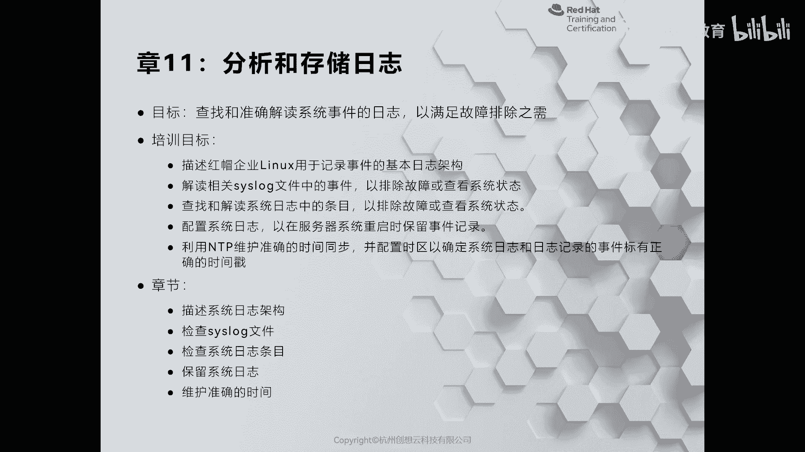
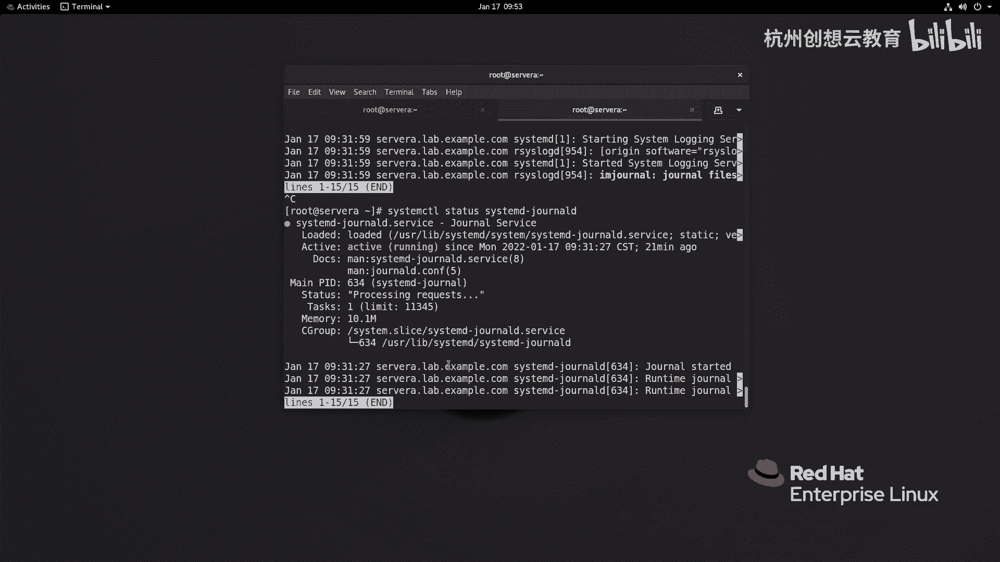

# 红帽认证系列工程师RHCE RH124-Chapter11-分析和存储日志 - P1：11-1-分析和存储日志-描述系统日志架构 - 杭州创想云教育 - BV11g411r7JP

啊第11章啊分析和存储日志，那么这张呢我们将会了解啊，在啊这个红帽切板linux当中啊，我们的日志架构是如何的，那虽然这里呢提到的是红帽的日志架构，其实呢所有的linux发行版呀。

它的日志架构呢都是一样的，那么然后呢我们会带着大家来了解一下啊，在现在的红帽且把那个当中啊，那么里面呢有两种啊日志服务器来分别记录了我们的日志啊，以及针对不同的知识服务器。

我们如何呢去查看他的日志文件啊，那么最后一部分呢我们会啊给大家介绍的，如何将我们的服务器啊配置成n g p的客端，来保证所有的服务器的时间的一致性好我们现在呢来看第一小节，第一节的话呢是给我们来记述了。

介绍了我们的这个系统的日志架构啊，那么我们知道系统在运行的时候呀，多多少少呢都会出现一些问题，那么这个问题可能是系统本身的，也可能是应用程序的啊，那么为了便于我们进行故障排除。

因此呀负责啊这个日志记录的进程和我们的内核呀，会把这些事情呢记录下来，并且存放在我们的vlog里面，而这个目录下面的文件呢，我们把它称为是日志啊，称为日志。

那么对于日志我们可以使用诸如li或者tae的命令呢，去查看啊，去打开，ok那么我们这里要知道的是，在我们的红帽770到红帽780呀，它首先呢呃有一个默认的日志服务呢，叫什么叫rc log。

那么还有一个呢是专门记录cd的这种日志啊，叫做cd general的，无论是哪种，他们都遵循的是二设，是我们的谁呀，我们的cslog这种协议来负责记录日志的，ok嗯那么其中cmd这种这种负责记录的呢。

它的日志格式呀比较特殊啊，那么它的默认情况下呢是存放在我们的内存里面的，那么也就意味着如果我们部队sd general这种服务啊，做一些特殊的设置，那么一旦系统重启呀，日志呢就消失不见了啊，消失不见了。

ok好，那么我们现在呢去来到vlog里面去看一看这种啊使用啊，cs log这种标准的日志啊，长得什么样子，好那现在呢我已经登录到了sora上面啊，登录sora上面，我切换到y下面的啊log啊。

那么在这里呢有非常多的啊这种日志文件啊，那么这些日志文件都是做什么用的呢，首先呀在这里呢第一个呢就重要的呢叫审计啊，在审计当中的保留的日志呢，唉其实在正常情况下呀。

是由我们内核里面的审计模块来负责记录的啊，那么为了保证我们的审计能够万无一失啊，因此啊我们的系统里面有一个这样的机制，当内核里面的神经模块没有办法正常工作的时候啊。

他会把这个日志呀哎托付给我们的rc log来记录，但是呢记录的地方还是在我们的审计里面，那么因此啊这个里面的东西啊，我们不能把它称为日志，只能称为是神迹，ok那么接着剩下的这些比如说boot。

log则是记录了我们啊这个系统啊，在启动时候啊，相关的日志，那么还有一些比如说这里提到一个dnf啊，dnf的话是什么呢，在我们的real 8上面啊，啊已经不再使用亚姆来负责任装软件了啊。

而是换了一个更先进的软件管理工具啊，叫dnf啊，tf ok那么在real 7或者说要六这种早期的linux发行版当中啊，你看到的就是谁呀，就是ym底log记录的是我们安装日志啊。

安装这个软件啊等等相关的日志，ok然后呢再往下呢，这里有一个叫什么呀，叫做last log啊，还有一个mail log，我们来说一下mail log，mail log的话呢是记录什么呢。

记录的是我们这个啊和邮件服务器相关的一些日志啊，一日志，ok那么下面还有一个叫做messages啊，messages的话呢是记录了我们心目当中的大部分的日志，ok还有这种什么安全相关的。

那么记录的是啊和用户认证啊，啊远程登录呀，哎这种这种相关的日志啊，那么这些日志呢都是标准的啊，这个啊unicode编码的这个日志格式啊，那么我们可以通过啊less或者tail命令啊去查看。

但是呢我们用的更多的呢还是谁呀，还是tale啊，因为我们在查看日志的时候呀，更关心的是啊最新生成的日志内容，因此我们可以使用太阳命令啊来去读取我们的这个内容，那么比如说我想去看20行。

那么就去跟上一个日志文件啊，那么打印出来一个20行的日志，那如果我想监控日志啊，那么就是用tell啊跟f跟上我们的日志啊，日志哎就即可啊即可，ok那么新的日志呀都会在我们光标闪烁的位置打印出来。

那如果你只想去查看最近新生成的日志，而不去看一点点的历史啊，那么就加一个n啊，杠零即可啊，那么就会记录下来全新的日内容啊，那么这些日志呀都是啊标准的unit code编码的啊，标准啊，我们来看一下啊。

uni cook，而刚才提到的这个审计啊，它呢和日志是不一样的啊，我们来看一下，那么通过time being a去看我们的审计啊，你会发现它的格式和刚才的格式完全就是不不是一个风格啊，不是一个风格。

就审计啊，那么审计的作用呢，我们后面再讲这个一个叫做i c linux的时候呢，会给大家介绍一点啊，好我们这是整个日日所存放的位置，那么接着呢我们再来看一看我们系统里面的两个日志服务器。

其中呢一个呢叫做r cslog啊，这样一个日志服务器，ok啊它是来记录我们的日志的啊，然后呢还有一个呢叫谁呢，还有一个呢叫做啊我们的system d啊，然后呢general，这样一个日志服务。

ok日志服务啊，这是我们两个不同的日志服务啊，不同的日志服务。

