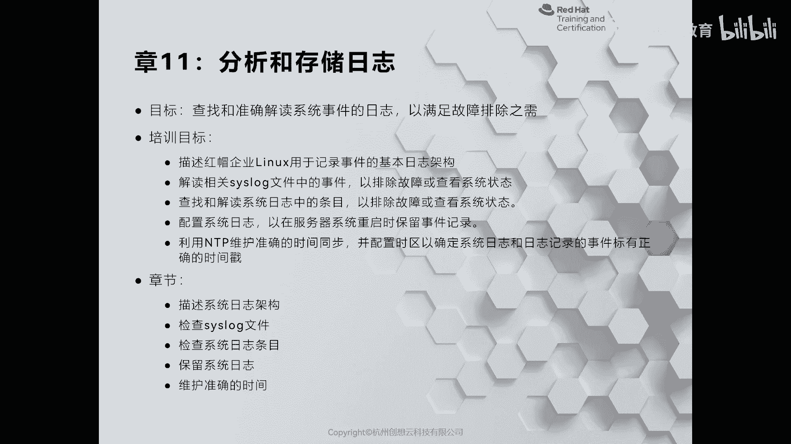
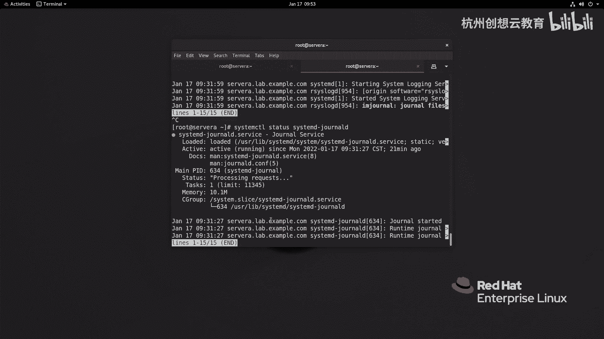

# 红帽认证系列工程师RHCE RH124：Chapter11：分析和存储日志 - P1：11-1-分析和存储日志-描述系统日志架构 🗂️



在本节课中，我们将要学习红帽企业版Linux（RHEL）中的系统日志架构。了解日志如何生成、存储以及如何查看，是进行系统故障排除和管理的基础。虽然这里以红帽系统为例，但所介绍的日志架构是所有Linux发行版通用的。

## 概述

系统在运行时，无论是系统本身还是应用程序，都可能出现问题。为了便于故障排除，负责日志记录的进程和内核会将相关事件记录下来，并存储在 `/var/log` 目录中。这个目录下的文件被称为日志。

我们可以使用诸如 `less` 或 `tail` 等命令来查看这些日志文件。在RHEL 7到RHEL 8中，默认的日志服务是 `rsyslog`。此外，还有一个专门记录 `systemd` 相关日志的服务，称为 `systemd-journald`。这两种服务都遵循 `syslog` 协议来记录日志。其中，`systemd-journald` 默认将日志存储在内存中，这意味着如果不进行特殊配置，系统重启后这些日志就会消失。

## 日志文件目录结构

现在，让我们进入 `/var/log` 目录，查看遵循 `syslog` 标准的日志文件是什么样子的。

以下是 `/var/log` 目录下一些重要日志文件的说明：

*   **audit/**: 此目录存放的是审计日志，由内核中的审计模块负责记录。为确保审计万无一失，系统有一个机制：当内核审计模块无法正常工作时，会将日志委托给 `rsyslog` 服务记录，但存放位置仍在 `audit/` 目录中。因此，这里的内容应称为审计记录，而非普通日志。
*   **boot.log**: 此文件记录了系统启动时的相关日志。
*   **dnf.log**: 在RHEL 8中，系统使用更先进的软件包管理工具 `dnf` 替代了 `yum`。此文件记录了软件安装等相关的日志。在RHEL 7或更早的版本中，对应的文件通常是 `yum.log`。
*   **lastlog**: 此文件记录了所有用户的最近登录信息。
*   **maillog**: 此文件记录了与邮件服务器相关的日志。
*   **messages**: 此文件记录了系统中的大部分常规日志，是非常重要的日志文件。
*   **secure**: 此文件记录了与用户认证、远程登录等安全相关的日志。

这些日志文件大多采用标准的文本编码格式（如UTF-8），我们可以使用命令直接查看。

## 查看日志的常用命令

对于标准的文本日志，我们通常使用 `tail` 命令进行查看，因为我们更关心最新生成的日志内容。

以下是查看日志的几种常用命令示例：

*   **查看日志末尾若干行**：使用 `tail -n [行数] [日志文件]` 命令。例如，查看 `/var/log/messages` 文件的最后20行：
    ```bash
    tail -n 20 /var/log/messages
    ```
*   **实时监控日志**：使用 `tail -f [日志文件]` 命令。新生成的日志会实时显示在终端上。
    ```bash
    tail -f /var/log/secure
    ```
*   **仅查看新增日志**：使用 `tail -F [日志文件]` 命令。与 `-f` 类似，但如果日志文件被轮转（如被重命名并新建），此命令会跟踪新文件。
    ```bash
    tail -F /var/log/messages
    ```

## 审计日志的特殊性

之前提到的审计日志（`/var/log/audit/` 中的文件）格式与上述标准日志不同。我们可以使用 `tail` 命令查看，会发现其格式是结构化的，专为审计事件设计。

```bash
tail /var/log/audit/audit.log
```

审计日志的作用将在后续学习SELinux等相关内容时详细介绍。

## 系统日志服务

在系统中，主要有两个日志服务协同工作：

1.  **rsyslog**: 这是一个传统的、功能强大的系统日志守护进程，负责收集、过滤和存储大部分系统及应用程序的日志到 `/var/log` 目录下的文件中。
2.  **systemd-journald**: 这是 `systemd` 系统和服务管理器自带的日志服务。它收集来自内核、启动过程、系统服务以及标准输出/错误的所有日志。默认情况下，其日志存储在内存或临时文件系统中（路径为 `/run/log/journal/`），但可以配置为持久化存储。

## 总结



本节课我们一起学习了红帽企业版Linux的系统日志架构。我们了解到日志存储在 `/var/log` 目录，并认识了 `messages`、`secure` 等重要日志文件的作用。我们掌握了使用 `tail` 命令查看和监控日志的基本方法。最后，我们明确了系统中并存着 `rsyslog` 和 `systemd-journald` 两个核心日志服务，它们共同负责记录系统的运行轨迹，为运维管理提供关键信息。