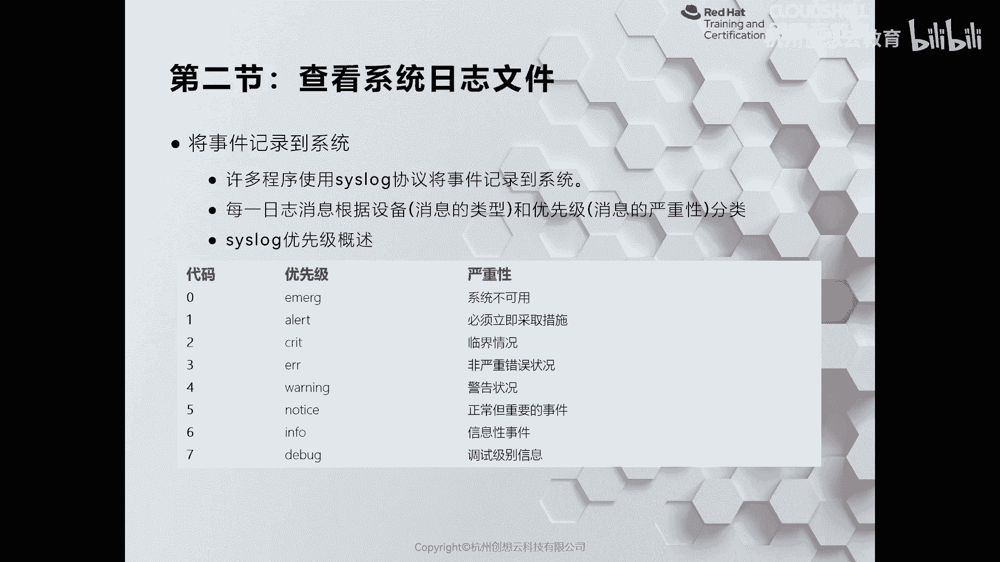
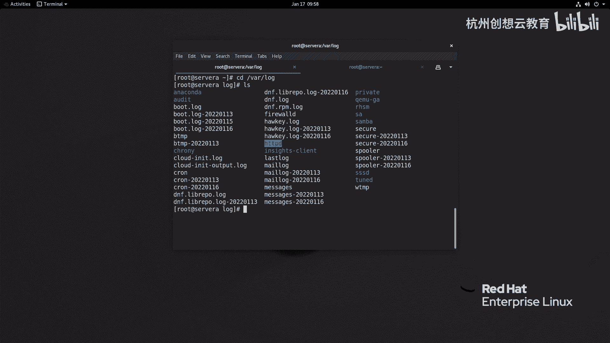
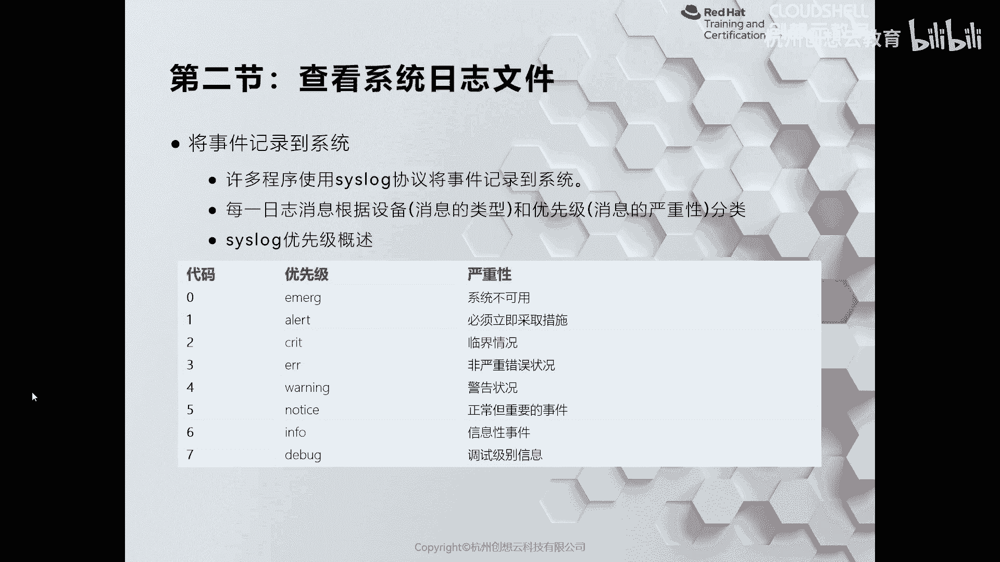
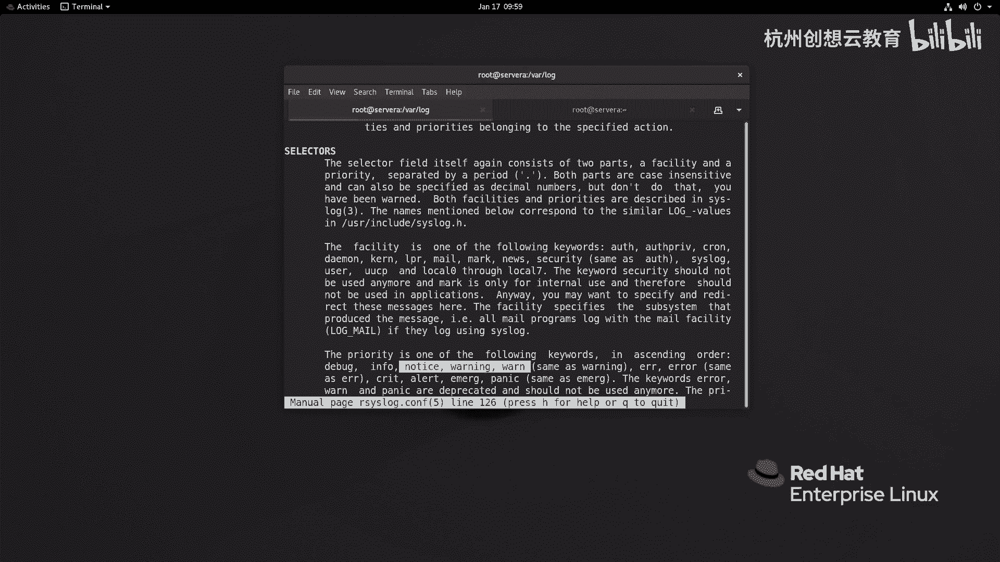
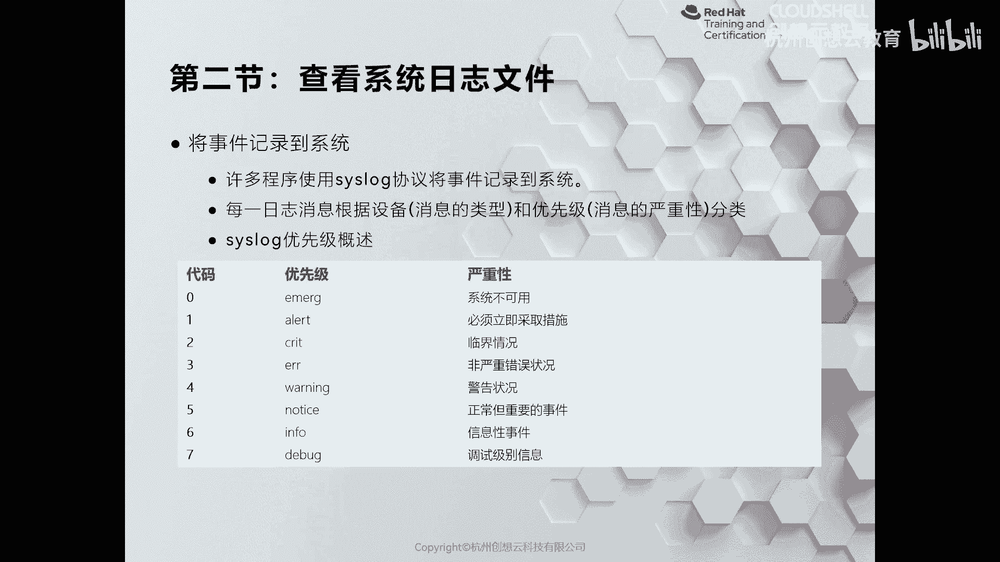
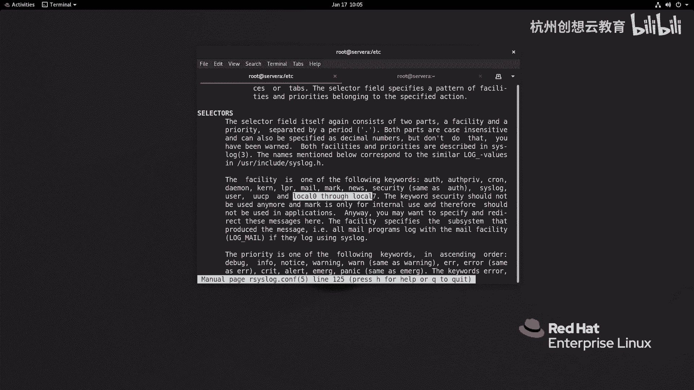
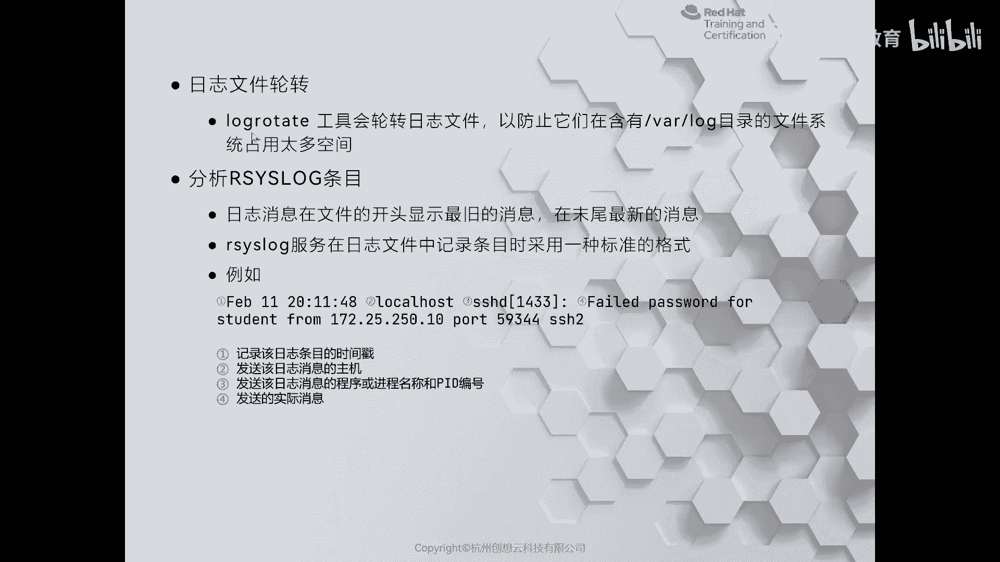
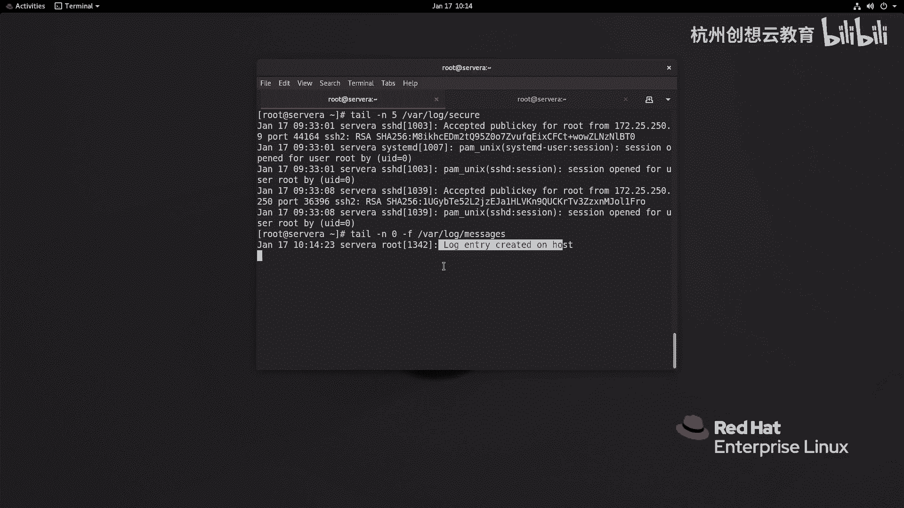

# 红帽认证系列工程师RHCE RH124-Chapter11-分析和存储日志 - P2：11-2-分析和存储日志-检查Syslog文件(勘误) - 杭州创想云教育 - BV11g411r7JP

哎，第二节啊查看系统日志文件啊，那么我们刚才提到了，那么很多的应用程序呀，那么为了和我们的RC log或者严格应来说啊，是和Clog呢打通啊，所以呢这些呢都是支持Clog协议的。

然后呢可以把我们的日志呀记录在walog里面。比如说我们现在系统里面所看到的啊外部的服务啊，那么就会有一个单独的目录。

那么目录里面能看到你看这里有一个谁呀？叫做IHGTPD对吧？那么除此之外呢，还有其他的，你看这种这个负责时间同步的啊，负责系统安全时候进程的，负责调优的等等。

那么这些呢并没有在我们的日志服务器里面去定义，而是通过啊自己的啊这个应用配置文件来实现的。OK那么无论是哪种方法呀？那么我们的日志呢，它都是遵循了一个规则。就是说那么在记录的时候呢。

它会把自己的这个啊每一条日志到底是啊什么时间啊什么时间啊，这个是有什么应用程序产生的啊，然后优先级啊，那么啊记录下来啊，那么请优先级呢，我们可以啊通过这个表格呢进行查看。

也可以呢通过查看我们RC log的配置文件的帮助呢来获取啊。那如果我们后期呢要想阅读啊，那么可以使用慢。

啊，5啊 log点com啊来查看我们的文档。那么在这里啊，它会记录我们的这个日志的优先级啊，优先级啊，那么会告诉我们啊，优先级呢？一共是啊有多少个，对吧？还有多少个，那么首先它的设备呢又分了多少个啊。

优先级在这里啊，分别代表的是有什么debug呀in啊等等这些都是有的。那么为了方便呢我这里呀啊已经给大家总结好了啊，那么日志的话呢，它的优先级啊，一共是8个啊，一共是8个。

那么这8个的话呢是从0到7来记录的数字越大呢，优先级越低，数字越小，优先级越高啊，那么我们这里呢就从这个优先级最低的开始说起。

当我们的先级呢处于是debug模式情况下，那么它属于是调试级别的啊，基本上呀所有的啊这个应用程序呢都会有debug信息的输出啊。那么第第六个这个级别呢哎就是我们的infer级别了啊，infer级别了。

那么infer的话呢是一种正常的啊信息性事件。O那么接着呢就是notice noticeice的话呢是正常，但比infer呢更加的重要。那么这时候的日志呀相对来说呢，字体呢可能会更粗一点啊。

但不绝对啊不绝对ok。那么接着呢是我们的这个优先级呢是四的。那么它的这个呃代表的是warming啊警告啊警告啊，那么就开始引起我们重视了。但是呢呃我们也可以忽略啊忽略。那么ever的话呢。

则代表的是非严重的错误情况。那么这种情况呢要具体对待某些呢可能会导致我们的某些服务呀没有办法正常启动起来啊，但是呢有时候呢又可以忽略掉啊，所以说啊所以说呢是非严重的啊错误状况。

那么接着呢再往上呀就开始变得严重起来了。那么如果优先级是二的，代表的creat啊，那么就属于是个临界情况啊，那么必须要啊这个去把这个问题呢搞定解决。啊，然后再猛一点的话呢。

就是啊这个alaralar的话呢，需要我们必须立即采取措施啊，那么已经非常的危险了啊，非常危险了。如果再危险呢，就是什么呀？这里的零啊，那么代表是这个emerage是吧？代表的是系统不可用啊。

那么系统不可用，基本上就处于是啊这个服务器啊崩溃掉了啊，崩溃掉了。OK那么越往下呢，这个出现的概率呢越高啊，越往上呢出现概率越低啊，越概越低。这是我们的日志的优先级啊，那么这些日间优先级啊，再结合啊。

我们刚才帮助里面的这个内容啊，就可以来定义。啊，来定义我们的一些内容。比如说啊比如说我们在根目录下呢，有一个叫做R cilog点c的文件，或者呢啊有一些叫做ETCRClog点D目录下面以fi来结尾的。

那么这些文件呢都是来定义了啊我们系统里面啊，那么到底记录哪些日志啊，并且呢存放在哪些文件里面啊，那么我们可以去来到这个路径下呢去查看一下。

好，我来到这个ETC下面啊，去编辑我们的RC log点com啊。那么这个文件呀是一个默认的。那么打开你看这里啊有非常多的内容，对吧？这样做内容。比如说在这里个mo啊，那么mo代表的是什么呢？

就是说我这个啊日志服务器啊啊可以记录哪些类型的日志对吧？那么我支持记载的是啊这种unix的日志。那么同时呢我也支持记录什么呀？新的gene的这种日志啊，新的gene日志啊。

每个版本呢这里的配置文件呢内容呢稍微有点变化，但是大同小异啊，那么七的版本和80的版本不一样，同样六和7的版本呢也是不一样的啊，6和7啊，就是红帽前红帽前7的版本是不一样的。

那么再往下呢这里还提供了两个。啊，两个这个哎。端口啊，那么我们可以选择呀启用啊这个UDP或者是TCP啊，把当前的服务器啊当做一个日志服务器啊，负责记录其他服务器发送过来的日志啊，OK那么除此之外呢。

最重要的我们关心的是谁呢？就是这里的规则了啊，规则。那么这个规则的左边呀就代表了什么意思呢？这里啊。注意了。好，这里面的每一列啊，那么是用分号隔开的啊，多个啊用分号隔开的，它有不同的含义啊。

具体代表什么含义呢？哎，我们来去啊再次掰一下。加班的时候呢，我们呃往下看啊，这里呢有一个这样的内容啊。在这个selects里面啊，会告诉我们的日志呀啊在记录的时候呢是分成了两个部分。那么一个呢叫设备名。

一个呢叫优先级，中间呢用据点隔开。而我们啊刚才看到这个文件呀，正好是这种格式，看到没有啊，据点隔开，左边呢是设备名，右边呢是我们的优先级。那么其中设备名啊包含的有这些啊，比如说这个什么os opre。

对吧？那这些呢都是和认证相关的啊，那么Cn呢是计划任务ok那么demon呢是手候定程啊，coron呢是内核啊，LPR呢是我们的打印机啊，mail邮件服务器啊，mark标记类的啊，news新闻类的啊。

securreity啊，那么安全类的。啊，然后呢sslog啊系统的日志类的啊，用户的啊UCP啊unix和unix之接通信的啊，还有保留了logo0到logo7的8个设备啊，用于自定义啊。

是设备名O那么设备名里面的话呢，还包括有什么呀？接着我们来看我们的PPT啊，那么我们的PPT上呢是刚才的文件的一个截图啊截图。那么在这个里面我们就能看到呀。这个你像这里的这一行啊。

就代表的是所有的设备点infer呢就是我们的优先级了，对吧？啊，记录啊infer级别或infer级别以上的。

啊，或记录infer级别以上的日志，然后呢封号还记录谁呢？mail的设备的，但mail的什么优先级呢？那没有优先级，就那么那么就相当于个排除法了吧，对吧？我记录所有的设备，但不记录谁呀，邮件的。

同时我也不记录什么呀？ospre的还有计划任务的啊，那么就说我系统当中所有的设备的日志，除了邮件啊，osprive chrom之外，剩下的日志啊。

我把它的infer和infer级别以上的全部保存在wall log message里面。OK这是这一行的意思。那么下面呢这里的一个preve呢得代表该优先级啊。

该设备的所有优先级呢都记录在wall log secret里面。下面邮件的邮件的设备的所有呢都记录在we log mail log里面。但是呢这个路径啊，前面加了一个大代表什么意思呢？

就是说如果呀邮件服务器产生了日志，它不会将日志呢立即写入到磁盘文件里面，而是呢先放在这个什么呀，放在内存里面啊，等待这个IO这个这个不繁忙，或者说某个时间段的时候呢，才会把日志呀记录在文件里面。

OK那么Cown呢则是计划任务相关的。然后呢，紧急事件的啊优先级最高的这个零啊，任何的设备只要出现这种级别的，它会把消息呢发送给我们系统上面的用户哪些用户呢星号所有的用户。那么这时候呢。

所有用户呢都会在终端上啊收到一个广播信息啊，告诉我们系统不可用啊，性不可用啊，这是这个配置文件啊。那么配置文件的话呢，我们在C里面呢是不需要自己去编辑的啊，不需要自己去编辑的O啊。啊。

但是呢我们的这个这种日志呀，它有一个缺点啊，虽然虽然这些日志呢放在这里看起来很很美好，但是有个缺点，什么缺点呢？就是说这种日志呀，在存放的时候呢，它啊占用的磁盘空间呢比较庞大啊比较庞大。

因此呢它会干嘛呀？它会把我们的磁盘呢一直写爆。所以在早期的时候呢，我们装系统呢会把这个啊蛙呢作为一个独立的分区啊，做一个独立的分区来用啊，那么如何避免这种情况呢？

哎我们可以呀使用系统里面一个工具叫做什么呢？叫做logro啊，叫日志轮转工具。那么通过这个日轮转工具呢，可以将我们的日志呀啊进行一个轮转，再结合计划任务啊，让他们去实时的去啊做这个监控啊。

定时的去做一个轮转啊，那么它的命令呢就是我们看到的这个啊log啊，这个roed啊，那么通过这个命令来进行轮转啊，轮转。那么轮转的时候是什么样子呢？

你看我们的教室里面这台讯机呀，那么在哇下面的log里面，那么会看到这里有非常多的啊以日期来结尾的文件。那么这些文件呢都是被轮转过的啊，轮转的时间对吧？这个是在啊这个1月13号啊，这个呢在1月16号啊。

三天一轮转啊，三天一轮转OK那么那么这些轮转到底是怎么定义的呢？哎，我们来看一下它的文件。那么在这个文件当中啊，它给我们定义了这个全局情况下，日志是如何轮转的。你看每周啊这个轮转一次。那么轮转之后呢。

保留4个日志文件啊，那么在轮转之后呀会创建新的空白文件。在轮转的时候呢会以日期为后缀啊，日记为后缀，那么自定义的呢，你可以把它放在ETC log的点D里面啊。

那么结构呢基本上和这个是差不多的但是呢你需要去定义具体的我们的日志的这个啊轮转哪些啊，比如说我们这里的DNF啊，那么DF的话呢。

就是来定义了啊一个呢是wa logDF点 log啊的日志的一个轮转的规则还一个呢是 log啊这个什么呀？啊，这个hucky啊点log的一个啊日志的一个轮转规格。那么这些规格你旦定义了。

我们可以通过手动的方式。啊，输动方式来跟上我们的配置文件。啊，或者是什么呀？或者是我们刚刚写了，假如说写了一个D眼负的，哎，我我只想这个轮转，那么去执行就可以了。那么在正常情况下呢。

我们是不需要去关心的啊，因为我们系统里面有一个。啊，有一个这样的一个文件啊，我们来找一找。哎，我记得是在dy里面啊。OK你看这里呢有一个啊叫做loggo rotate的一个脚本。

那么这个脚本呢就是负责呀定时的每天检查我们的日志是否有没有做轮转啊，有没有做轮转O然后呢再根据我们的这个。轮转的策略呢进行轮转啊进行轮转，这是日志轮转啊啊，那么轮转也知道了。

那么如何呢去啊查看我们的呃阅读我们的日志呢？哎，我们可以啊通过tail或者less命令呢去阅读。那么在阅读的时候呢，哎我们来看一下这个日志的格式。好吧。那么在看之前呀，我们先在终端里面去啊输出一段。

比如说呢我现在呢只打印出来这个。五行对吧？Y下面的log secret。你看这个日志格式是吧，日期时间吧拉巴拉。那么这个内容呢和我们的截图呢基本上是一样的啊是一样的。O因此我们看这里就可以了。

那么我为了标识的方便呀，我呢把每一列呢都加了一个啊这个一个标识符啊，那么这些格式呢都是标准的s log格式啊，那么第一列呢则代表的是我们日志的时间啊和日期啊。

第二列呢则代表的是我们记录的啊这个日志发生的这个主机信息。第三列呢则代表的是什么呀？代表的是我们的这个产生啊日志消息的服务或者是进程啊，或者是它的一个PID那么四的话呢则代表的是具体啊具体的。啊。

这个产生日志的内容啊，你比如这个就是在这个2月11号的啊晚上8点11点48秒的时候呢，在本地的SID啊能发送一个日志。那么这个日志呢告诉我们那么有一个设备叫172。25。250110。这台服务器啊。

它通过自己的5932端口使用SH版本协议2来连接我当前的这台服务器的时候呀，密码认证输错了，并且尝试使用stdent的用户来登录哎，这就是小日志内容了啊，日志呢看起来看似很简单。

其实我们真正在处理的时候呀，日志里面有些会隐藏一些信息啊，需要我们有丰富的经验呢进行去管理。那么无论是任何的日志，我们都可以通过啊，只要是slog的，那么都可以通过t杠F来监控。啊，监控。

那么如果我们要想测试我们的日志服务器是否正常，哎，我们可以通过呀loger命令来发送一段话，哎，看看我们的日志啊能不能接收到来测试。你比如说我这里啊就通过一个loger杠P的指令啊来指定优先级。

我指定一个设备啊叫logo7优先级呢走一份默认啊，叫nice noticeice，然后发送条消息啊，我们来感受一下。好，现在呢我呢去监控一下我的日志啊，太阳我只看新的好了。

哇下面的log message。然后呢，我在右边的终端里面呢，我发送你刚才那条日志消息啊，logger啊这个杠P啊，local7点 noticeice。啊，然后呢背上一句话。啊，log entry。啊。

create created on host回车。然后呢，我们左边看一看啊，那么这时候呢就收到了一个谁呀在。啊，10点14分23秒的时候呢，就收到了啊在四维主机上root用户啊发送了一条日志内容啊。好。

这是我们如何呢去查看日志，以及做一个日志的轮转。

