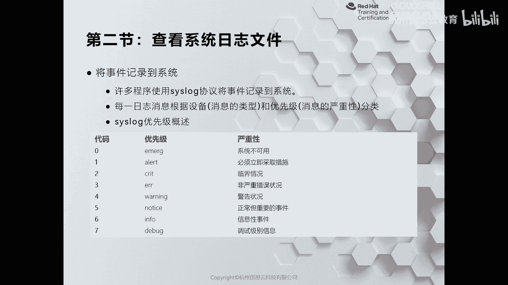
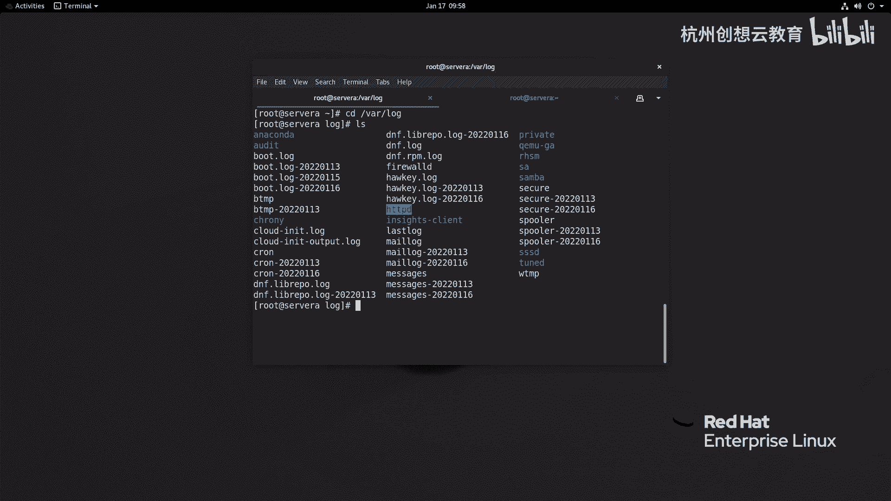
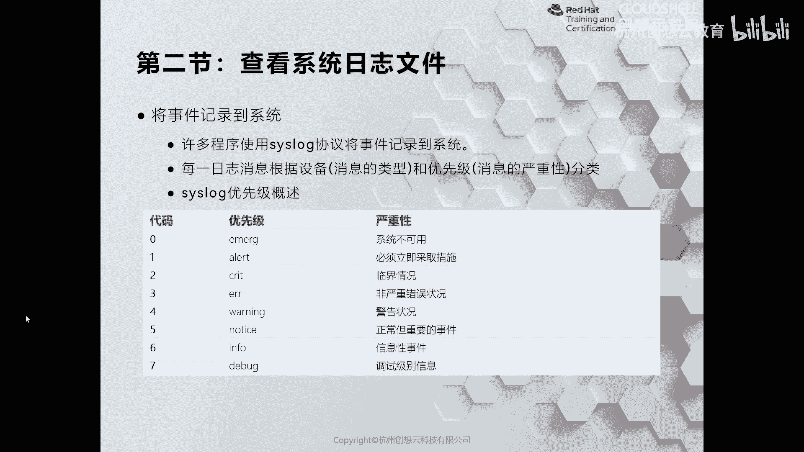
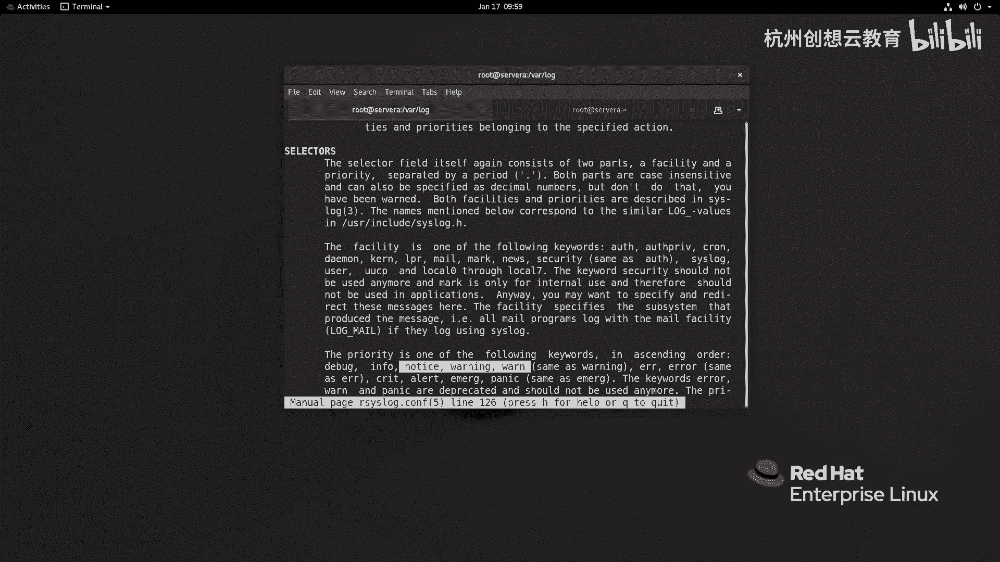
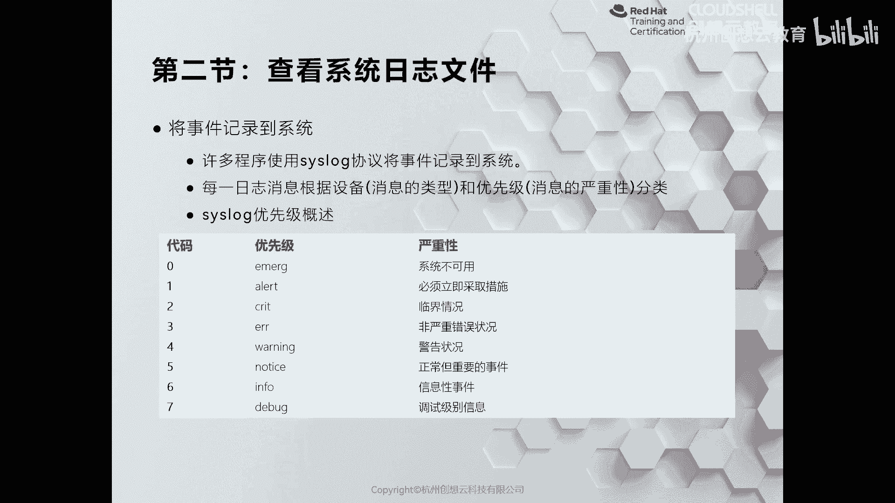
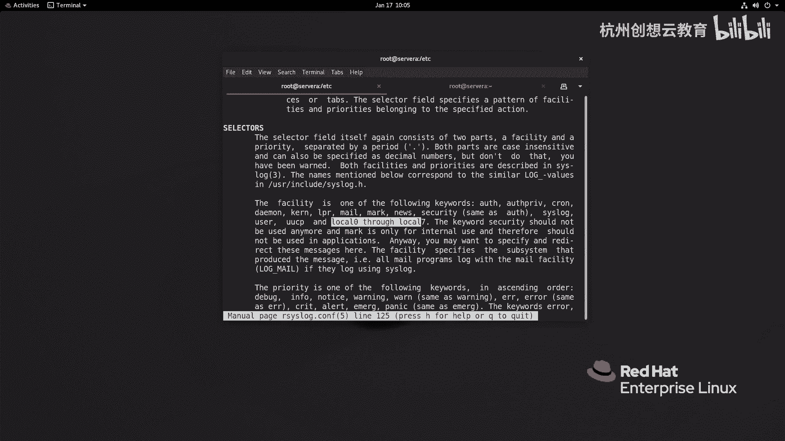
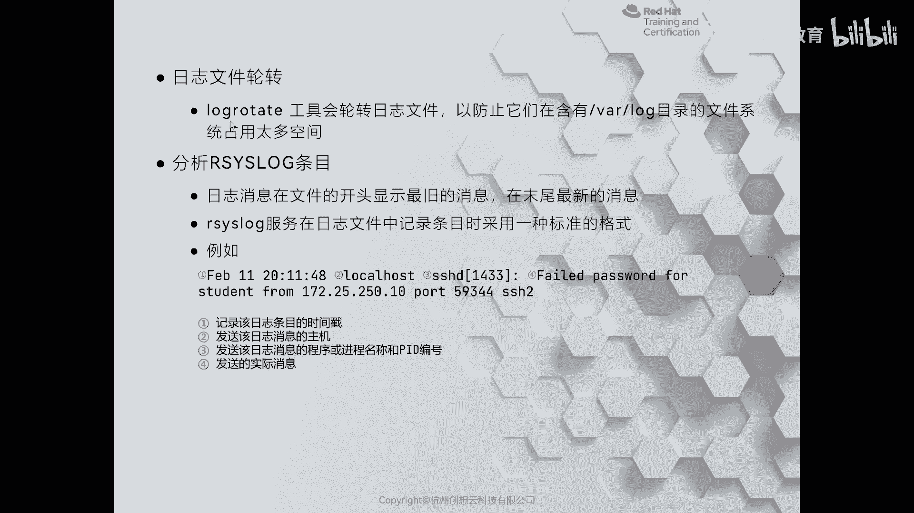
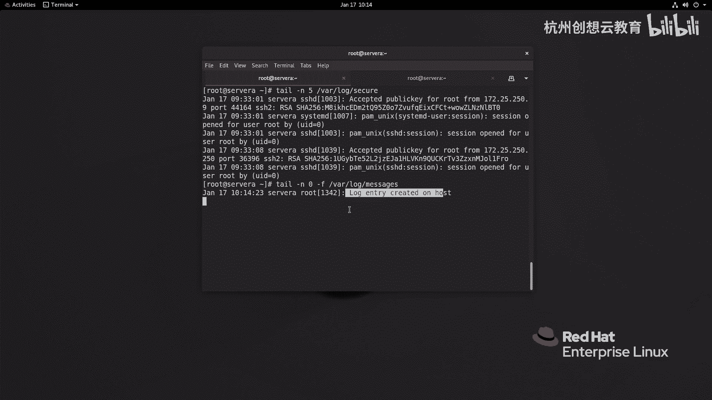

# 红帽认证系列工程师RHCE RH124-Chapter11：分析和存储日志 - P2：11-2-分析和存储日志-检查Syslog文件(勘误) 🔍



在本节课中，我们将要学习如何查看和分析系统日志文件，理解日志的优先级、记录规则以及如何进行日志轮转管理。

---



## 日志记录规则与优先级



上一节我们介绍了日志服务的基本概念，本节中我们来看看日志是如何被记录和分类的。

许多应用程序为了与系统日志服务（如 `rsyslog`）集成，都支持 `syslog` 协议，并将日志记录在 `/var/log` 目录下。例如，Web 服务 `httpd` 就有自己的日志目录。



无论是通过日志服务器配置，还是应用程序自身的配置文件，日志记录都遵循统一的规则。每条日志都会记录时间、产生日志的应用程序、以及优先级等信息。

日志的优先级是理解日志重要性的关键。优先级共分为 8 个等级，从 0 到 7，数字越小，优先级越高。

以下是 8 个优先级的详细说明：

*   **7 - Debug**：调试信息，用于程序开发或故障排查。
*   **6 - Info**：正常的、信息性的事件。
*   **5 - Notice**：正常但比 `Info` 更重要的事件。
*   **4 - Warning**：警告信息，需要引起注意但可以暂时忽略。
*   **3 - Err**：非严重的错误情况，可能影响部分功能。
*   **2 - Crit**：临界情况，必须立即解决问题。
*   **1 - Alert**：警报，需要立即采取措施，情况非常危险。
*   **0 - Emerg**：系统不可用，通常意味着服务器崩溃。

优先级越低（数字越大）的日志出现频率越高，优先级越高（数字越小）的日志出现频率越低。



---

## 配置文件解析

了解了优先级后，我们来看看如何通过配置文件定义日志的记录规则。

系统日志的配置主要位于 `/etc/rsyslog.conf` 文件以及 `/etc/rsyslog.d/` 目录下以 `.conf` 结尾的文件中。这些文件定义了哪些日志被记录，以及记录在哪个文件里。

打开 `/etc/rsyslog.conf` 文件，可以看到许多配置行。其中最重要的部分是规则定义。每条规则通常由“设备名.优先级”的格式构成，中间用点号隔开。

设备名代表日志的来源，例如：
*   `auth`, `authpriv`：认证相关
*   `cron`：计划任务
*   `daemon`：守护进程
*   `kern`：内核
*   `mail`：邮件
*   `syslog`：系统日志
*   `user`：用户程序
*   `local0` - `local7`：用户自定义设备

规则示例：
```
*.info;mail.none;authpriv.none;cron.none                /var/log/messages
```
这条规则表示：记录所有设备（`*`）优先级为 `info` 及以上的日志，但排除（`none`）`mail`、`authpriv` 和 `cron` 设备的日志，并将它们保存到 `/var/log/messages` 文件中。



另一个例子：
```
mail.*                                                  -/var/log/maillog
```
`-` 符号表示日志会先被缓存到内存中，在 I/O 不繁忙时再写入磁盘文件 `/var/log/maillog`，这有助于提升性能。

---

## 日志轮转管理

系统日志会持续增长，占用大量磁盘空间。为了避免磁盘被写满，我们需要使用日志轮转工具 `logrotate`。

`logrotate` 工具可以定期对日志文件进行归档、压缩或删除旧日志，并结合计划任务实现自动化管理。轮转命令的基本格式是 `logrotate`。

执行轮转后，日志文件通常会加上日期后缀，例如 `messages-20231016`。轮转的策略由配置文件定义。

全局配置文件是 `/etc/logrotate.conf`，其中定义了默认的轮转周期、保留的日志文件数量等。针对特定服务的轮转配置则放在 `/etc/logrotate.d/` 目录下。



系统通过 `/etc/cron.daily/logrotate` 脚本每天自动执行日志轮转检查，我们通常无需手动干预。

---

## 查看与测试日志

现在，我们来看看如何查看日志内容以及测试日志系统是否工作正常。

我们可以使用 `tail`、`less` 或 `cat` 命令来查看日志文件。标准的 `syslog` 格式日志通常包含以下几列信息：

1.  **日期与时间**
2.  **主机名**
3.  **服务/进程名**（有时包含进程ID PID）
4.  **具体的日志内容**

例如，一条 SSH 登录失败的日志会详细记录时间、来源 IP、尝试的用户名等信息。分析日志需要一定的经验来识别关键信息。

若要实时监控最新日志，可以使用 `tail -f` 命令：
```bash
tail -f /var/log/messages
```

我们可以使用 `logger` 命令向系统日志中发送一条测试消息，以验证日志记录功能是否正常。

测试命令示例：
```bash
logger -p local7.notice “This is a test log entry.”
```
这条命令会以 `local7` 设备、`notice` 优先级记录一条消息。之后，我们可以在 `/var/log/messages` 文件中查看到这条新记录。

---



本节课中我们一起学习了系统日志的优先级分类、配置文件的解析方法、如何使用 `logrotate` 管理日志文件生命周期，以及查看和测试日志的基本操作。掌握这些技能是进行系统维护和故障排查的基础。