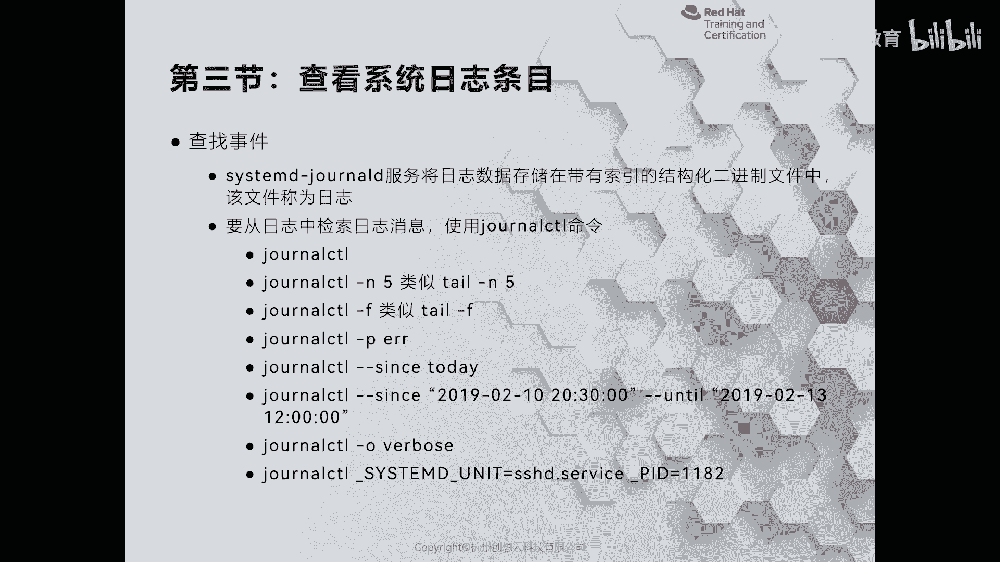
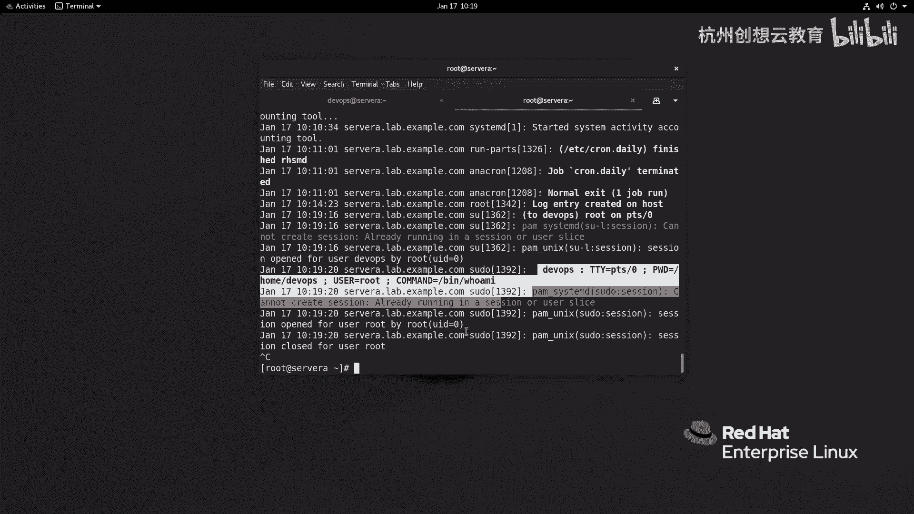
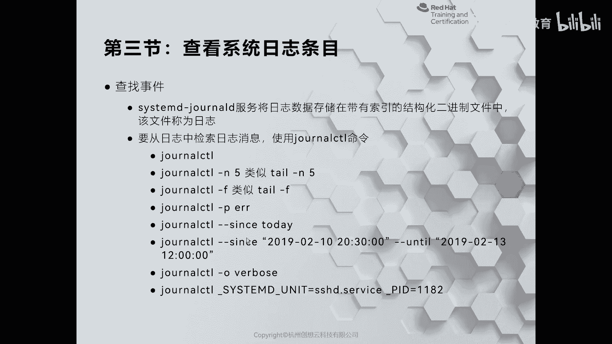
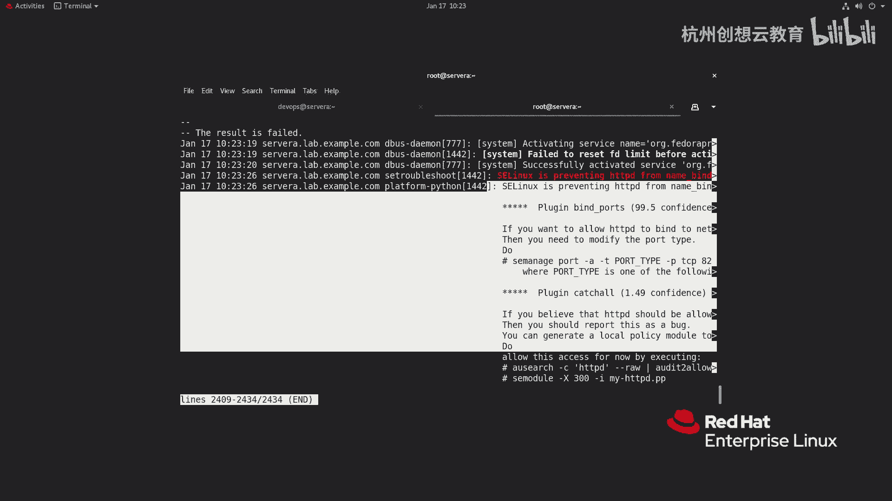

# 红帽认证系列工程师RHCE RH124-Chapter11-分析和存储日志 - P3：11-3-分析和存储日志-检查系统日志条目 - 杭州创想云教育 - BV11g411r7JP

好第三节啊，查看系统日志的条目啊，那么第三节呢我们主要介绍的是如何呢，通过啊合适的工具来阅读啊，有cs logo啊，这个之外的另外一个日志服务器叫做谁呀，叫做c字母d general的这个日志啊。

这个产生的日志内容啊，那么为什么我们要找一个合适的工具呢，好我们来先去感受一下啊，那么对于我们的日志服务器而言啊，那c他们d的这种日志呀，它记录的日志在哪里呢，在我们的啊这个根目录的run啊。

log general这个目录里面，那么这里呢有两个16进制的文件目录名啊，我们去打开这个f87 这个那么打开之后呢，那么里面就有一个是系统的日志啊，叫做system dej，你看它的后缀都不一样啊。

然后呢我们通过非要命令啊去判断的时候呢，它会告诉我们是一个什么呀啊日志型的文件啊，并且是在线的，就是实记录的，那么我们如果按照传统的方法呢去看一看能不能看到内容，那么我使用太阳啊，杠n写三行。

那么跟上我的日志回车，那么我们发现呀这个日志内容呢全是乱码，为什么呢，就是因为我们的啊systemd的这种日志呀，它的数据格式呢是一个二进制的啊，二进制的。

因此我们没有办法使用传统的啊这个命令呢去阅读支持，那怎么办呢，唉我们有一个专门啊看这种啊，这个cmd的这种日志叫做general的啊，c t l啊，general啊，c t l这个命令。

那么这个命令的用法基本上和tale呢差不多，但是呢要比它功能更多啊，功能更多啊，那么这里提到了，那么如果使用啊general ctrl指令什么都不加啊，那么就相当于把我们知识的都打印出来。

如果使用gf呢，则代表是监控我们的支持，好我们来感受一下，那么现在呢我去找个命令啊，只能说啊什么都不加回车来，那么我们看到的是系统啊，在启动的时候啊产生的日志啊，其中的时候产生的日志。

你看我们的日志的第一条呢就是什么内核是内核加载，然后加载镜像啊，然后这个啊bells巴拉巴拉很多的，ok然后呢我呢接着呢再进行一个什么呀，刚n哎我只想看下最近一次啊生成的日志，哎这是最近新生成的日志啊。

你会发现和刚才认识其实差不多对吧，唉因为两个呀他们既有内容啊，基本上都是一样的，那我要想监控的话呢，就general啊，c t l杠f啊，那么就会动态，那么假如说呢我现在呢哎干嘛呢。

这次呢去切换到一个用户叫dave os，然后呢去速度啊，who am i一下，我们看看有没有消息称成啊，那这里呢就记录下来了啊，记录下来了，然后呢这个通过icu啊切换到了啊dios用户。

然后呢dios用户呢又通过了修度来做了提权啊，提权还是能看得到的，那么除此之外我们的啊general cl还可以做一些比较高级的功能。

比如说可以通过啊这个杠p选项来指定啊。

只查看啊优先级的这支也可以呢，通过since这个指令呢和you tell啊啊，来查看某个时间段的，如果呢我们如果对这些日志呢信息的不够详细，还可以使用general什么呀，港o来获得非常非常详细的内容。

甚至呀我们还可以指定单元啊和技能号，哎好我们来感受一下，那么现在呢我去干嘛呢，我想去看一看新闻当中啊，有没有报错的日志，唉那么红色的对吧，这是报错的，但这些报错呢哎不重要啊不重要。

比如说这里呢有一条消息啊，你看说我的这个cpu 0啊，stock啊，这个146秒哈，诶这个我发现这个瑞尔八呀，在这个虚拟机里面啊，这个直接跑，那么我们红帽制造环境还是有点费这个资源的，还有点费资源的。

但是还好啊还好，ok ok然后呢如果我想只开屏啊，有info级别的推车，那这信息量就多了去了对吧，基本上都是音符级别的啊，音符级别的，ok那么有没有a lot呢啊就是一条对吧，就是一条啊我们内核的啊。

好那么接着呢我再去想看一看什么呀，我想看一看呀，这个从啊这个十点开始的日志，没车唉，我们就能看到，那么我们最新的日志呢是在09：31开始记录的，但是呢我们看到的是十点的啊，日志开始下来的，这是开日志。

但如果你觉得不够详细，我们可以加个杠o verbs，它会把每条日志呀分析的非常详细，你看这是一条日志，一条日志啊，事件的编号呀，对不对啊，然后优先级啊啊等等啊，都会记录下来啊，那么这里的每一个内容啊。

等号左边的东西啊，都是可以当做一个条件啊来输出的，比如说呢我只想看这个呃日日志啊，属于是cslog什么呀，identifer的这个，那么我就可以啊，cmcl啊，把它等于时间k呢写进来。

哎哟这里面提到了一个什么呀，没有内容，那我加一个下划线试一试啊，港o ko，看来这个直接看这个选项可能不太适用啊，我看个换一个id试一下吧，回车即可对吧，那么所有的和这个什么呀。

主机号一致的日志就出来了啊，就出来了好，那么这个命令呢大家呢一定要善于使用啊，我们后面再出一些服务的时候呢，他可能会有一些报错，我这里呢举个例子，比如说我人为的啊，人为的啊。

把我们的这个我们我们来看一下这个符吧，叫做i h t t p d啊，现在是没有起来对吧，那么我现在呢给它重新启动一次，哎他就会报错，那么报错的时候呢就会告诉我们呀。

使用general cl杠x e来获得详细的日志信息，那么我们就可以通过这个命令呢去阅读日志，那他会告诉我们发生了什么事情，对不对啊，什么事情以及甚至有些还要提醒我们如何去解决，还是非常友好的啊。

这是我们如何呢。

