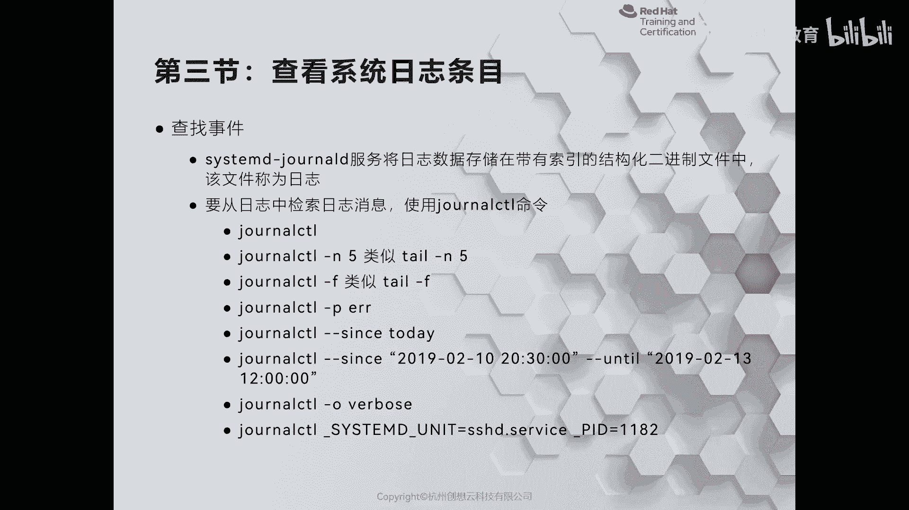
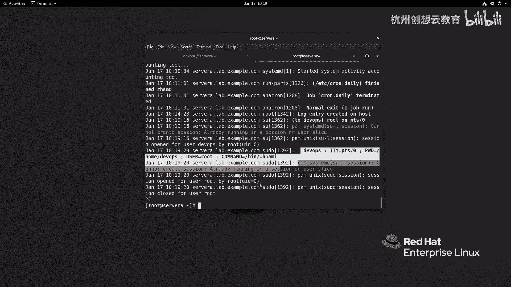
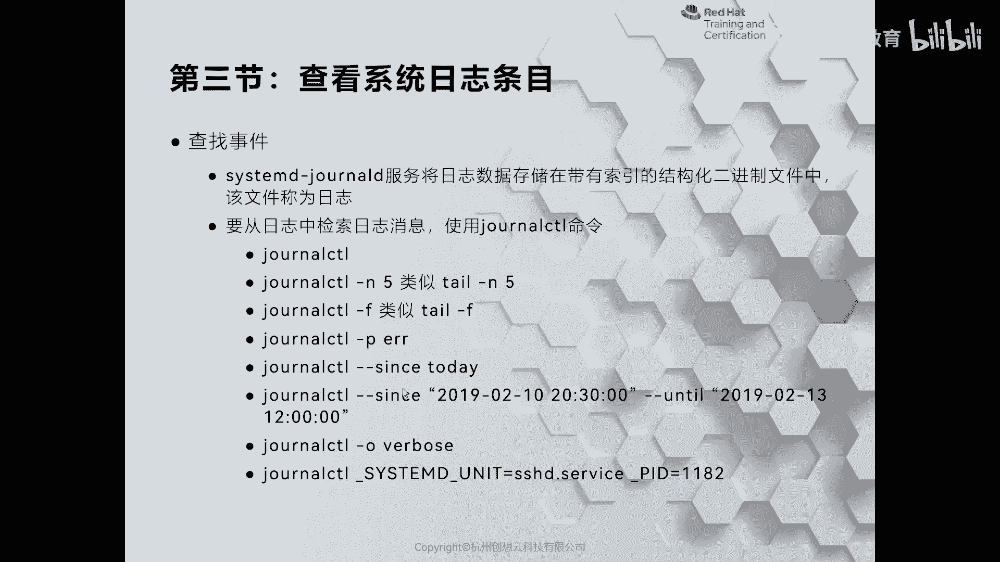
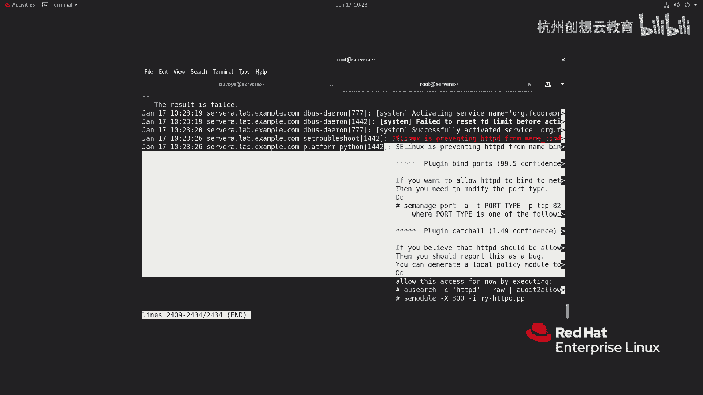

# 红帽认证系列工程师RHCE RH124-Chapter11：分析和存储日志 - P3：11-3-分析和存储日志-检查系统日志条目 📋



在本节中，我们将学习如何使用专门的工具来查看和分析由 `systemd-journald` 服务生成的系统日志。与传统的 `rsyslog` 不同，`systemd-journald` 的日志是二进制格式，需要使用特定的命令来读取。

## 为何需要专用工具？🔍

`systemd-journald` 服务生成的日志文件位于 `/run/log/journal/` 目录下，其文件名通常为十六进制格式。这些文件是二进制格式，无法使用传统的文本查看命令（如 `cat`、`tail`）直接阅读，否则会显示为乱码。

例如，尝试使用 `tail` 命令查看日志：
```bash
tail -n 3 /run/log/journal/f87.../system.journal
```
输出将是无法理解的乱码，这证实了直接阅读的不可行性。

## 使用 `journalctl` 命令 📖

为了查看 `systemd-journald` 的日志，我们使用 `journalctl` 命令。这个命令功能强大，是管理此类日志的主要工具。

以下是 `journalctl` 的基本用法：

*   **查看所有日志**：直接运行 `journalctl` 会显示系统启动以来的所有日志。
*   **查看最新日志**：使用 `journalctl -n` 可以查看最近生成的日志条目。
*   **实时监控日志**：使用 `journalctl -f` 可以实时跟踪和显示新生成的日志，类似于 `tail -f` 的功能。





## `journalctl` 的高级过滤功能 ⚙️

`journalctl` 提供了多种选项来精确过滤和查看日志，这对于故障排查至关重要。

以下是几种常用的高级过滤方法：

*   **按优先级筛选**：使用 `-p` 选项可以只查看特定优先级的日志。例如，`journalctl -p err` 只显示错误级别的日志。
*   **按时间范围筛选**：使用 `--since` 和 `--until` 选项可以查看指定时间段的日志。例如，`journalctl --since “10:00”` 显示从上午10点开始的日志。
*   **显示详细输出**：使用 `-o verbose` 选项可以获取每条日志的非常详细的结构化信息，包括事件ID、优先级、时间戳等。
*   **按特定字段筛选**：可以根据日志中的特定字段进行过滤。例如，使用 `journalctl _HOSTNAME=hostname` 可以查看与指定主机名相关的所有日志。

## 实践：排查服务故障 🛠️

当系统服务出现问题时，`journalctl` 是首选的诊断工具。例如，如果 `httpd` 服务启动失败，系统通常会提示使用 `journalctl -xe` 来获取详细的错误信息。

执行该命令后，`journalctl` 会显示与服务启动失败相关的详细日志，这些信息通常包括错误原因甚至解决方案建议，对于解决问题非常有帮助。

## 总结 📝



在本节中，我们一起学习了如何检查 `systemd-journald` 生成的系统日志条目。我们了解到，由于日志是二进制格式，必须使用 `journalctl` 命令进行查看。我们掌握了该命令的基本用法，如查看全部、最新或实时监控日志，也学习了其高级过滤功能，包括按优先级、时间、详细格式或特定字段进行筛选。最后，我们看到了 `journalctl` 在诊断服务故障时的实际应用。熟练使用 `journalctl` 是系统管理员进行日志分析和故障排查的一项核心技能。