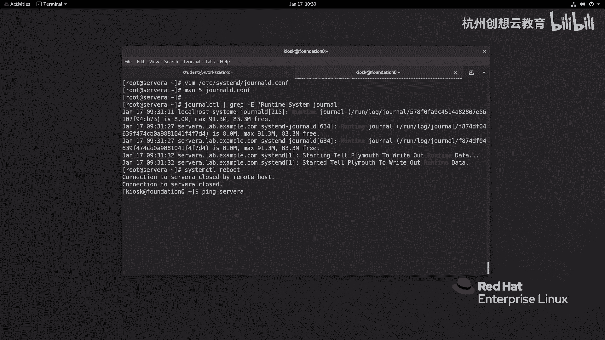
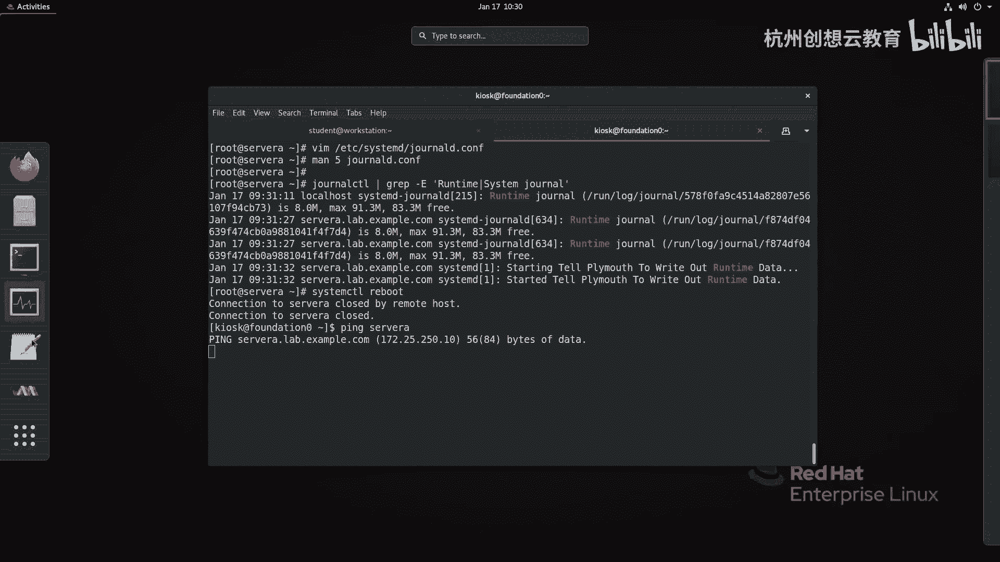
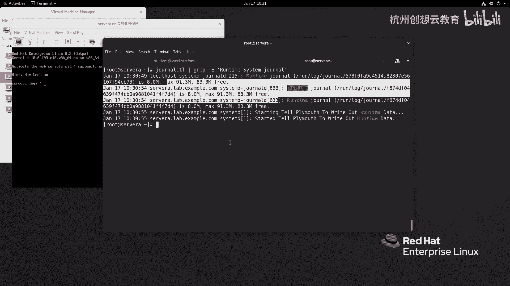
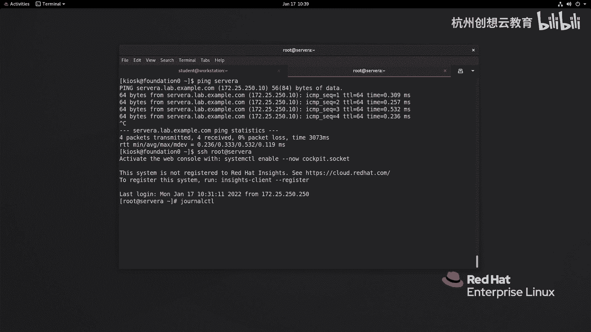

# 红帽认证系列工程师RHCE RH124-Chapter11-分析和存储日志 - P4：11-4-分析和存储日志-保留系统日志 - 杭州创想云教育 - BV11g411r7JP

啊第四节啊，保留系统日志啊，那么刚才提到呀，我们这个cd journal的这个日志服务产生的认知呢，是默认保留在run loop channel里面的，而run呢则是内存运行时的一个数据。

那么也就意味着如果啊我们经历了系统的重启啊，这样一个操作，那么就会干嘛呀，就会这个那么日志呢就会自动被清除掉啊，那么为了避免这种情况的发生啊，我们可以呢对啊。

etc system d下面有个配置文件呢叫做general啊进行修改，那么把它的参数呢改成啊present对吧，这个volatile啊，还有auto来进行设置啊，我们来先看一下这个文件长什么样子啊。

那么我们vm a t c下面啊，找到steam d journal的啊，这样一个文件啊打开，那么打开之后呢，这里面大部分呢都是一个注释啊注释。

那么注释里面的general这个啊部分有一个选项呢叫strange，那么它默认值呢是auto，ok那么具体的这个存储的值啊，我们可以通过啊查看这个啊配置文件的帮助来获取，那么在这个里面它会告诉我们啊。

那么日志呢在存放的时候，那么存储这个选项它对应的值，你看三个值啊，这三个值ok那么这三个值默认情况下呢走的是auto，那么auto的话呢就意味着如果他先去判断啊，这个有没有啊，挖log接到这个目录。

如果有，那么就走永久性的存储，如果没有，他就会把日志呀放在run log general里面，这是auto啊，那如果你选择present呢，则代表的是强制啊。

将我们的日志呀存放在vlog general里面，那如果是这个这个选项呢，就代表的是我们把日志呀存放在这个目录里面，ok这是这是这个啊这个配置文件里面对应的参数，我们稍后呢会把它给它做一个配置，好吧好。

那现在呢我们先去做一些事情，就是说那么你说那呃放在日志里面也有好处，放在那个内存里面也有好处，什么好处呢，它一旦我们的服务器啊重启，那么日志就清空了，就不会出现像啊。

像我们这个呃asset logo一样对吧，去做这是轮转了，其实不是这样的，那么我们的这个general的这个日志呀，它其实也是有轮轮转的，但不需要通过这个logo rot来实现，它内置就有啊。

那么默认情况下呢，我们的日志呢是不会超过我们文件系统的10%的，并且呢也不会啊，使我们的整个的文件系统的空间呀低于15%啊，来保证我们的这个空间的有效性，那如何去查看我们当前的服务器里面啊。

这个啊cd啊，general的这个日志符，那么它会记录哪些限额啊，那么我们可以通过执行这个命令来查看，通过这个啊general c tl啊，然后呢通过grape呢去筛选找谁呢，找run time啊。

或者是这个啊system general这样一个字符串去匹配啊，就可以去查到，好我们来看一看，好现在呢我同样的在我的server a上去执行这个命令啊，general ctrl管道符grape。

去筛选多个条件呢，加上一个e，其中第一个呢叫run time，第二个条件呢叫做system，就那种，啊回车，那么这时候呢我们会看到啊，那么对于我们当前的服务器而言，那么是刚才记录的这个日志啊。

大小是多少呀，18兆，那么最大的是91。3兆，那么还有83。3兆空间，也就意味着我还可以记录记录对吧，一直在记录到记录83。3兆啊，ok那么f87 呢，这个呢也是八兆啊。

你会发现这两个是大小是一样的对吧，哎是一样的，ok那么如果呢我现在呢把我的siri重启一下，然后呢我们去等待这个sa有没有运行起来，那么如果你直接拼的话呢。

感觉不舒服，你可以干嘛呀，来使用我们的环境里面的虚拟管理工具啊。

把这个sa的console呢把它打开，啊这样去监控也是可以的，已经起来了，好起来之后呢，我现在呀再去的远程连接到我们的server a啊，通过刚才命令我们再来看一看，然后再来看一看，ok啊。

那么这是我们新产生的日志的位置啊，这位置那么表面上看起来呀大小没有什么变化啊，对大小没有什么变化，但是里面内容呢就没有了。

那么我们可以通过general control杠b来查看启动的日志，那么你会发现呀这个最新的日志呢只是在10：30开始记录的，而我们刚才看到十点的日志没有了，因为它被删除掉了，ok被删除掉了啊。

那么现在我们就把这个日志呀给他永久的存储到我们的磁盘里面，那怎么去存放呢，好好我们来看ppt啊，那么我们可以啊将啊etc啊。

c m d general的康复这个文件的存储改为percent就可以了啊，好我们来自己尝试一下，啊好我们去编辑啊，etc下面的system d啊，这个journal的啊，这个文件我们把这个找到存储。

把这个auto呀换成什么呀，换成这个啊present即可，啊present，ok好，然后呢保存并退出，然后呢重新启动我们的这个服务，把我们reload一下试试好不好，reload一下，走一个什么呀。

就要reload，我玩restart systemd gta的回车，那么我们再来啊，这个run log啊，就在这里面看看有没有诶，还有还有的话，那么有可能就是reload是不行的啊，或者说我刚才写错了。

那么我们再重新的去卖一下好吧，买一下，我们来看看这个里面的这个参数是不是我哪写错了，好我们去找到这个文件啊，好这个写快太快了，写成pa啊，pa ok好，然后呢保存并退出啊，重新走一次这个指令好。

然后呢我们再来去看一下run log啊，那么在这里其实已经发现了run log里面是不是空的了，现在是空了的啊，没有东西了，去哪儿了呢，去挖下面的logo里面，我们去看一看。

你会发现这里多了一个目录叫做general，然后呢我们来到jo里面啊，就会发现呀我们f87 的知识呢就就有了好，然后呢我们我们干嘛呢，我们这个重新启动一下，我们记一下当前时间好吧，当年时间呢是10：

34，我们重启之后呀，看看能不能看到10：34以前的日志，我把系统呢重新启动一次，好我们来拼一下啊，这样可以看看他有没有起来，好我们的网络已经通了，好现在呢我去登录上去啊。

root at server a啊，好那么登来之后呀，我做个命令叫general cl gb。

我去加一个什么呀，一那么代表的是上一次启动的啊，就最近一次啊启动的，那我还可以加个二，看两次情的，就是对啊，都能看到第二次的啊，这第一次启动的，你看10：30的就记录下来啊。

这是把我们的日志呀啊存储在磁盘当中啊，大家一定要记住这个配置啊。