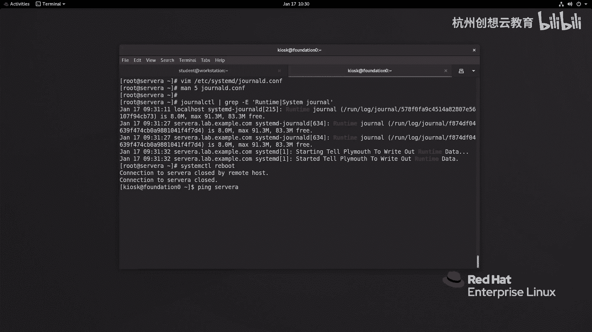
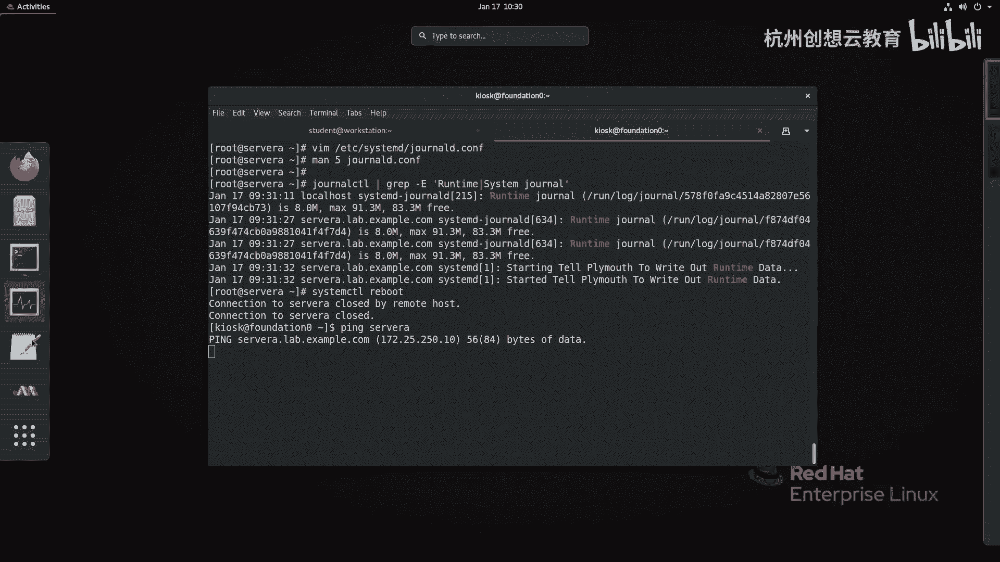
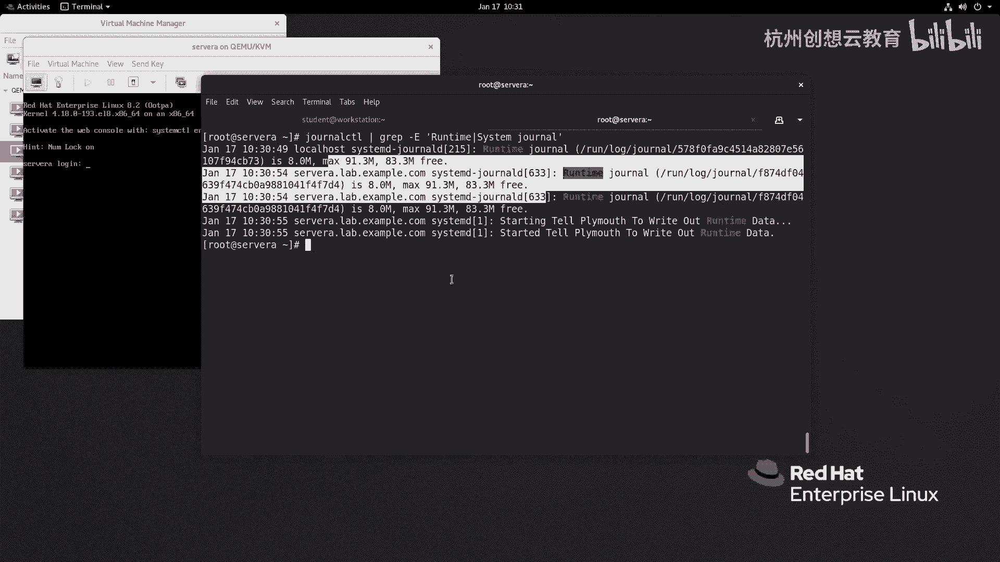
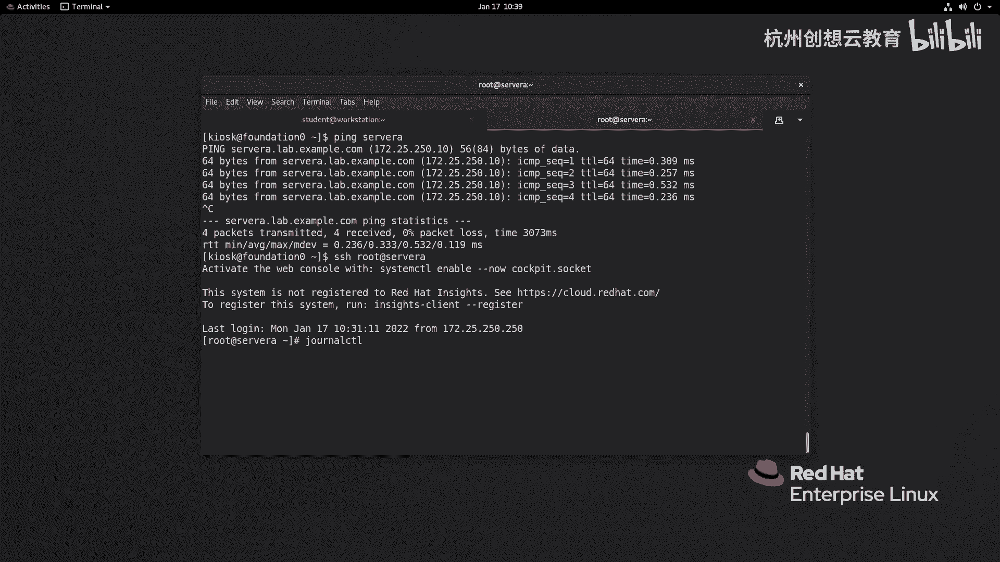

# 红帽认证系列工程师RHCE RH124-Chapter11：分析和存储日志 - P4：保留系统日志 📂

在本节课中，我们将要学习如何配置系统，使其在重启后依然能够保留由 `systemd-journald` 服务生成的日志。默认情况下，这些日志存储在内存中，重启后会丢失。通过学习修改配置文件，我们可以确保日志被持久化保存到磁盘上。

## 日志的默认存储与问题

上一节我们介绍了使用 `journalctl` 命令查看和分析日志。本节中我们来看看如何长期保存这些日志。

由 `systemd-journald` 服务产生的日志，默认存储在 `/run/log/journal/` 目录下。`/run/` 是一个内存中的临时文件系统（tmpfs），这意味着如果系统重启，所有日志将**自动被清除**。

## 配置持久化存储

为了避免日志在重启后丢失，我们可以修改 `/etc/systemd/journald.conf` 配置文件中的 `Storage` 参数。

首先，让我们查看这个配置文件的内容：
```bash
cat /etc/systemd/journald.conf
```
文件内大部分是注释。在 `[Journal]` 部分，可以找到 `Storage=` 选项，其默认值是 `auto`。

以下是 `Storage` 参数可用的三个选项及其含义：
*   **`auto`**：默认值。系统会检查 `/var/log/journal/` 目录是否存在。如果存在，日志将永久存储在该目录；如果不存在，则存储在 `/run/log/journal/`。
*   **`persistent`**：强制将日志永久存储在 `/var/log/journal/` 目录中。如果目录不存在，系统会自动创建它。
*   **`volatile`**：强制将日志仅存储在内存中的 `/run/log/journal/` 目录。

为了持久化存储，我们需要将 `Storage` 的值修改为 `persistent`。



## 日志的自动轮转与空间管理



`systemd-journald` 服务内置了日志轮转机制，无需依赖 `logrotate` 工具。默认情况下，日志占用的空间不会超过文件系统总空间的 **10%**，并且会确保文件系统的剩余空间不低于 **15%**。



我们可以使用以下命令查看当前日志服务的磁盘使用情况和限制：
```bash
journalctl --disk-usage
```

## 实践：启用日志持久化


现在，让我们通过实际操作来启用日志的持久化存储。

1.  编辑配置文件：
    ```bash
    vim /etc/systemd/journald.conf
    ```
2.  找到 `#Storage=auto` 这一行，删除开头的 `#` 注释符，并将值改为 `persistent`：
    ```
    Storage=persistent
    ```
3.  保存并退出编辑器。
4.  重新启动 `systemd-journald` 服务以应用更改：
    ```bash
    systemctl restart systemd-journald
    ```
5.  配置生效后，系统会在 `/var/log/` 目录下创建 `journal` 文件夹用于存储持久化日志。此时，`/run/log/journal/` 目录下的内容将被清空。

## 验证配置效果

配置完成后，我们可以重启系统来验证日志是否被成功保留。

1.  记录当前时间（例如 10:34）。
2.  重启系统。
3.  系统启动后，使用以下命令查看最近一次启动的日志：
    ```bash
    journalctl -b -1
    ```
    或者查看所有启动记录的日志：
    ```bash
    journalctl --list-boots
    ```
4.  如果配置正确，你将能看到重启前（如 10:34）的日志记录，这证明日志已被成功持久化到磁盘。



## 总结

本节课中我们一起学习了如何保留系统日志。关键点在于理解 `systemd-journald` 日志的默认内存存储特性，并通过修改 `/etc/systemd/journald.conf` 配置文件中的 `Storage=persistent` 参数，将日志永久保存到 `/var/log/journal/` 目录。这样，即使系统重启，重要的日志信息也不会丢失，便于后续的审计和故障排查。