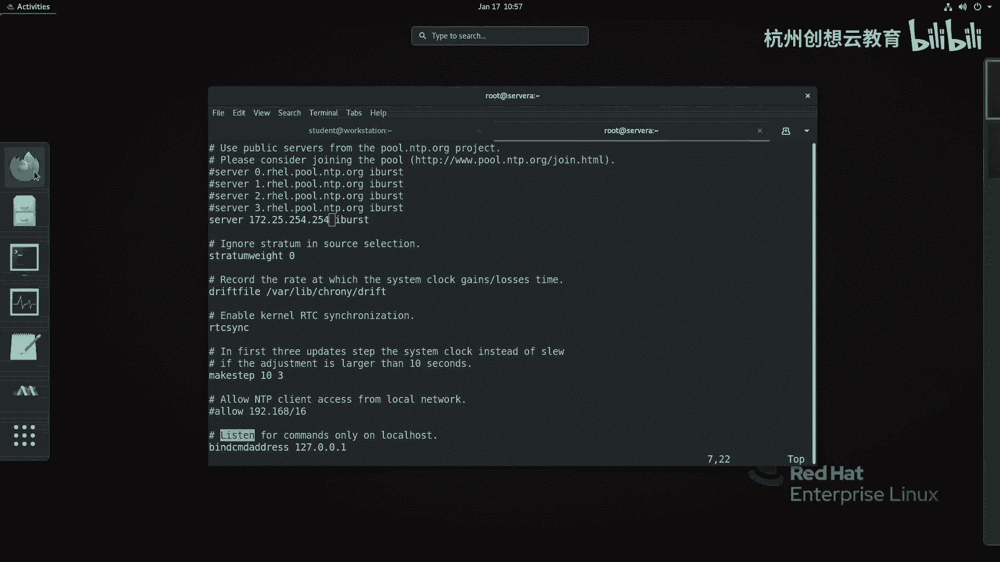

# 红帽认证系列工程师RHCE RH124-Chapter11-分析和存储日志 - P5：11-5-分析和存储日志-维护准确的时间 - 杭州创想云教育 - BV11g411r7JP

哎，调结啊维护准确的时间。那么当我们的服务器这个运营的时候呀，那么比如说我们刚才提到的日志服务器。啊，甚至现在很多的服务啊都是依赖于这个时间比较敏感的。比如说啊SSL的这个加密，对吧？呃。

还有这个比如说走Cbo的认证等等啊，那么对时间都是比较敏感的啊，特别是我们这种。有多个操作系统之间啊，并且呢有需要同时去分析日志的情况。如果时间不一致，那么就会非常的麻烦。

O那么为了保证呢时间的一致性啊，那么我们都会使用NTP协议啊，来这个通过和互联网上面的什么呀啊这个NTP服务端呀进行通信啊。当然了，我们也可以在自己的啊局网里面啊去搭建自己的NTP服务器啊，都是可以的。

然后呢来保证时间的一致性。啊，那么在我们的reo8上啊，哎这个已经强制使用一个叫做cro的一个。NTP服务器呢来负责啊NTP，而不是像以前一样走的是NTPD啊。

那么首先呢我们可以通过这里的啊time dateC条命令啊查看啊，修改当前的时间时区甚至NTP的一个同步的设置。好，那现在呢我们来看一下我们当前的呃这个服务器上面的这个时间的一个情况。

time啊dCTR。那么。嗯，缺省的这个选项啊是stateatters，可以不加。那么就能看到我们当地的时间啊和UTC的时钟啊，以及RTC的时间啊，还有我们的时区啊，以及我们的时间呀，现在有没有同步啊。

NTP是否是可用的那假如说呀我现在想呃这个改个时区，啊，我可以先去看看我可以用哪些时区，对吧？比如说呢我可以走一个。啊，list time zones，然后呢去筛选一下。

比如说我想啊这个想把这个时间呀改成芝加哥啊，搜个CS啊，哎，那么这里面一个啊america啊口啊，那么我把这个时区呢给它复制下来。那么time date的CTL啊，set啊，time zone啊。

把这个时区呀写上来即可。然后呢，我们再次的看下时间，哎，我们的时间就变了，对不对？哎就可生变化了啊，当地的时间啊是晚上的。这个将近9点啊将近9点okK时区呢就改了啊就改了。那同样呢。

我要是把想给它改回来呢，就把这个地方呀换成什么呀？亚洲、上海即可就行啊就行。那么我们的时间呀就又改回来了啊，就改回来了。OK那么如果呀我现在想保证我的NTP呀，我说哎我这个时间可能目前呀误差比较大啊。

和这个呃服务器上的误差比较大。我想给它手动改下时间。那么要想手动修改我们的日期和时间呀。那么我们要先把NTP的服务器呢，它这个地方的选项呀改为啊这个关闭掉就可以了。那怎么关呢？啊。

time date cTLs NTP啊，no哎改完之后，哎，我们就可以使用什么呀？命令啊去改M的时间了。比如s time，比如改成2021年的啊12月30号或20号都行，啊就可以改了。

那同样你要是想让自动同步时间，就把NTP啊改为什么呀？yes啊，NTPy那么就可以。啊，就可以。那现在这个时间你看立马就啊同步过来了。但是因为刚才我手用敲了一下嘛。

那么RTC时钟啊就不太准确了啊就不太准确了。OK呃，那么那么现在呀我干嘛呢？我要把这个呃要想想这时间更精准，我想把我的NTP呀把它改一改，那怎么改呢？那么我们要想改我们的NTP呀，需要改这个地方。

那么在我们的系统里面啊，要改的时候呢，需要改这个cro的这个配置文件啊，需要改它啊。那么这个配置文件里面的内容啊，如何去改呢？它的语法结构啊和以前的这个呃NTPD呢基本上是一样的啊。

所以改起来也比较方便。啊，我们现在打开一个呃这个NTP的后端的一个配置文件。啊，那么打开打开之后呢，映入眼帘的呢，就是能看到这里面有很多个server啊很多个server。那这些呢就是NNTP的地址啊。

就是的啊，那么其中啊默认的话呢，它走了红帽官方的啊官方的。那么然后呢注意啊，这里面有一些啊选项，我们不用管它。比如说这里面有个什么呀啊，有一个来负责啊，负责这个。当我们没有网络连接的时候。

来负责计算RRTC使用偏移呃漂移漂移量啊去来计算。这个我们不用管它啊，还有就是这里面还有一个呢就是有一个质量的一个保证。啊，我看这里面有没有写啊，哎在这里啊，它注释掉的啊。

那么这个地方呢是来保证我们这个NTB时电源的一个质量啊，我们这个不用管它啊，可以把它改小一点，对吧？改小一点。那么我们关心的主要是哪里呢？只要是这里的server。那么现在呢已经有一个是连接的是172。

25。254。254了啊，是我教室里面的1个NTB服务器。那现在呢我想把它连到谁呢？连到我们的公共的1个NTB服务器。那这里呢我就用一个谁呢？用一个。

啊，我去啊搜一个地址好了，比如说我去搜这个阿里云的，好吧，阿里云的NGP。那么阿里云的NTP的地址啊，我记得应该是谁呢？我们来打开看一看。啊，那么地址非常多，对吧？那么呃专有网络，还有一个经典网络内网。

那么我们找一个公广的啊NTP阿里云点儿com即可，对吧？也有地址池是吧？很多个12356789啊，非常多。那么整体上来说呢是一个这样结构。

啊，那么我们就可以啊去这样去写了啊，写个什么呀servver啊NTPE点阿里云点com。IBURST好，那么我这里面再复制几个啊。啊，YY啊多复制一个，把这里的123呀都替换掉一下。哎。

然后呢这样的话呢我们就有写啊五6个NTB的服务端了。那么接着呢后面的这个ib呢可以来负责呀，保证我们哪个实验是最准确的啊，现在呢保存并退出。啊，我重新启动一下我的这个NTP的客户端的这个服务。然后呢。

我去检查一下有没有生效啊，走一个命令。啊，sources啊sources。哎，这时候呢发现啊，那么我们这里啊就有这个内容，那么这里都代表什么意思呢？那我们来看下PPT啊，那么P档告诉我们。

那么这里的啊尖角符就是我们的NTB的圆啊。那如果呢看到一个S啊，就这个信号前成个S，就说明正在被当做NTB的服务器，并且在同步啊同步O那么我们的这个上面啊啊我们来看一下啊。

我们的服务器上面现在是什么样子。那么没有，对吧？其中这个大符，就说明这两个呃相对来说更好好那么那么现在我想手动的去同步一下，发现这个时间啊可能啊还没有同步过来，对不对？啊，还没有同步过来啊。

你看这个时间啊还没同步过来啊，那现在怎么办呢？哎，我可以这样做啊，走个命令啊，就是手动呢先把这个呃NGP啊给它关掉啊。手动的去同步一下。那么关掉之后呢，我们使用crol。啊。

那么这个命令跟上一个Q来手动的啊去增加1个NTP。比如说我用这里的啊120的这个。啊，然后呢后面跟上我们的刚才的那个参数。回车。那么我们看下它同步啊同步。呃。

因为我们的因为我们的这个啊re耀8上面啊不再提供NTPd这个包了。所以说我们同步要用这个命令方式来同步啊，同步。那么中间的误差对，是误差的时间OK好，然后呢我再去把我的NGP啊，这个同步的功能啊打开。

然后呢再去检去检查一下我们的这个状态信息。啊，这态信息OK就同步了啊就同步了。okK这是给大家做一个这样的演示啊演示。

