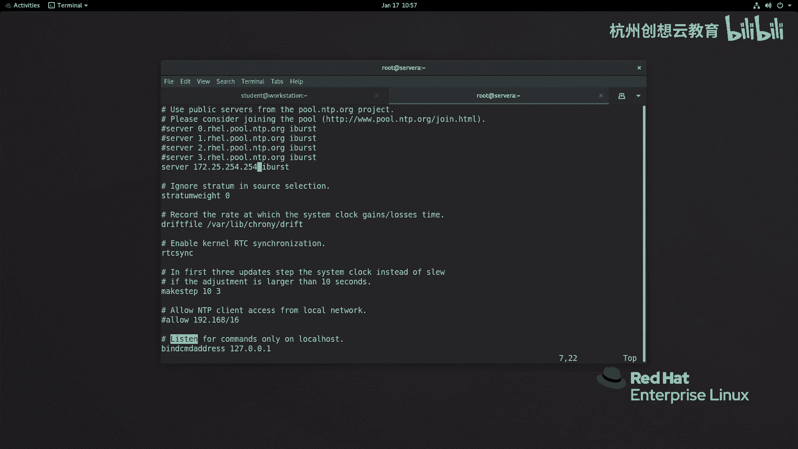
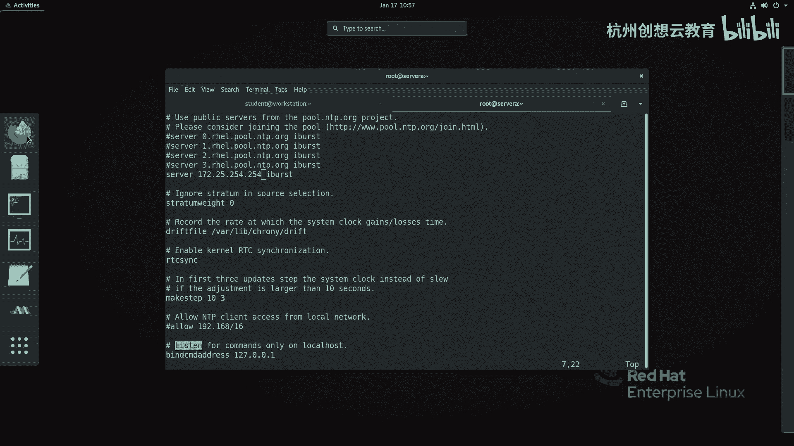
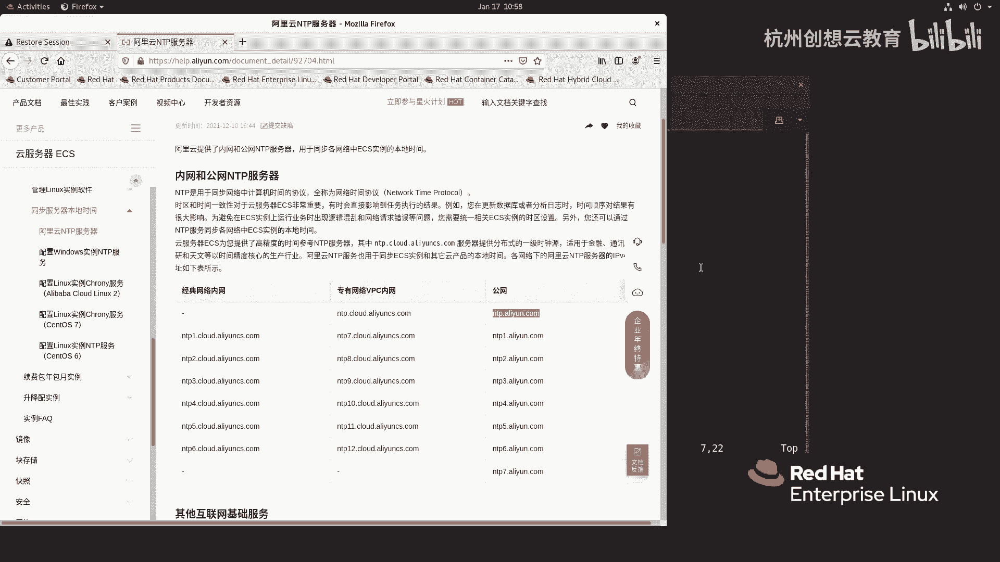
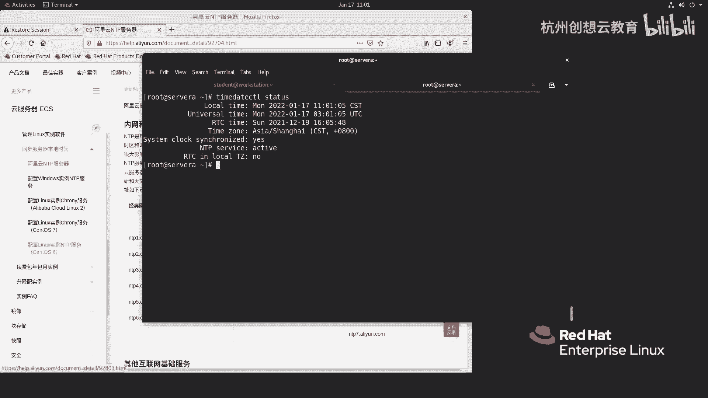

# 红帽认证系列工程师RHCE RH124-Chapter11：分析和存储日志 - P5：11-5-分析和存储日志-维护准确的时间 ⏰

在本节课中，我们将要学习如何在Linux系统中维护准确的时间。这对于日志分析、服务认证（如SSL、Kerberos）以及多服务器环境下的协同工作至关重要。我们将介绍如何查看和修改系统时间、时区，以及如何配置NTP（网络时间协议）客户端来与时间服务器同步，确保系统时钟的精确性。

## 查看和修改时间与时区

上一节我们介绍了日志分析的重要性，本节中我们来看看如何确保日志时间戳的准确性。首先，我们可以使用 `timedatectl` 命令来查看和修改当前系统的时间、时区以及NTP同步设置。

运行以下命令查看当前时间状态：
```bash
timedatectl status
```
该命令会显示本地时间、UTC时间、硬件时钟（RTC）时间、当前时区以及NTP服务是否启用。

如果你想更改系统的时区，可以按以下步骤操作。

以下是更改时区的步骤：
1.  首先，列出所有可用的时区并进行筛选。例如，查找包含“Shanghai”的时区：
    ```bash
    timedatectl list-timezones | grep Shanghai
    ```
2.  将时区设置为“Asia/Shanghai”：
    ```bash
    sudo timedatectl set-timezone Asia/Shanghai
    ```
3.  再次运行 `timedatectl status` 确认时区已更改。

## 手动设置时间与启用NTP同步

有时你可能需要手动调整系统时间。但在手动设置之前，需要先禁用NTP自动同步功能。

以下是手动设置时间的步骤：
1.  禁用NTP同步：
    ```bash
    sudo timedatectl set-ntp no
    ```
2.  使用 `timedatectl` 手动设置日期和时间。例如，设置为2021年12月20日 10:30:00：
    ```bash
    sudo timedatectl set-time "2021-12-20 10:30:00"
    ```
3.  设置完成后，重新启用NTP同步以恢复自动对时：
    ```bash
    sudo timedatectl set-ntp yes
    ```
启用后，系统会立即尝试与配置的NTP服务器同步时间。

## 配置NTP客户端（Chrony）

在RHEL 8及更高版本中，默认使用Chrony作为NTP客户端和服务守护进程，取代了旧的ntpd。要自定义NTP服务器，需要编辑Chrony的配置文件。





Chrony的主配置文件位于 `/etc/chrony.conf`。我们可以使用文本编辑器（如vim）来修改它。

以下是配置NTP服务器的步骤：
1.  打开配置文件：
    ```bash
    sudo vim /etc/chrony.conf
    ```
2.  在配置文件中，你会看到以 `server` 开头的行，它们定义了NTP服务器地址。例如，默认可能包含红帽的服务器。你可以将它们替换或添加为更近或更可靠的公共NTP服务器。例如，添加阿里云的NTP服务器：
    ```
    server ntp.aliyun.com iburst
    server ntp1.aliyun.com iburst
    server ntp2.aliyun.com iburst
    ```
    `iburst` 选项可以在初始同步时加快速度。
3.  保存并退出编辑器。
4.  重启Chrony服务以使配置生效：
    ```bash
    sudo systemctl restart chronyd
    ```



## 验证NTP同步状态

配置完成后，需要验证NTP同步是否正常工作。

使用以下命令可以查看Chrony的同步源和状态：
```bash
chronyc sources -v
```
在输出中，`^*` 符号表示当前正在使用的优选时间源。`S` 列中的星号 `*` 表示该源正在被同步。

如果发现时间没有立即同步，可以手动触发一次同步。

以下是手动触发NTP同步的步骤：
1.  临时关闭NTP同步：
    ```bash
    sudo timedatectl set-ntp no
    ```
2.  使用 `chronyc` 手动进行时间调整（`-a` 选项表示即使未启用网络时间服务也尝试调整）：
    ```bash
    sudo chronyc -a makestep
    ```
3.  重新启用NTP同步：
    ```bash
    sudo timedatectl set-ntp yes
    ```
4.  再次运行 `chronyc sources -v` 检查同步状态。



本节课中我们一起学习了如何在RHEL 8系统上维护准确的时间。我们掌握了使用 `timedatectl` 命令管理时间、日期和时区，了解了手动设置时间的步骤，并重点学习了如何通过配置Chrony服务来连接NTP服务器实现自动时间同步。确保系统时间准确是保障日志有效性、服务安全性和系统间协调工作的基础。