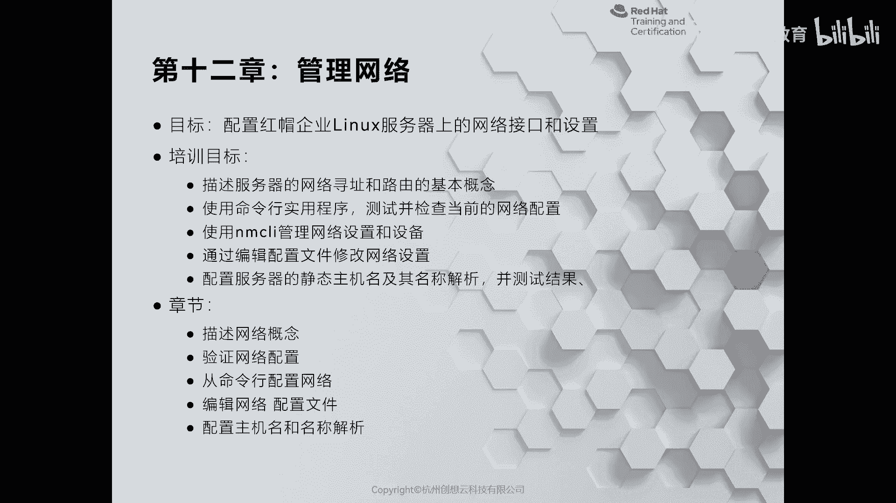
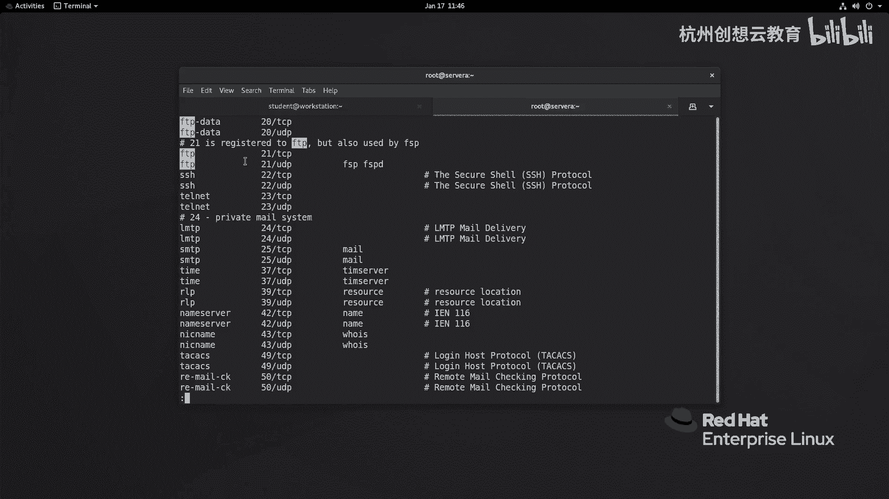
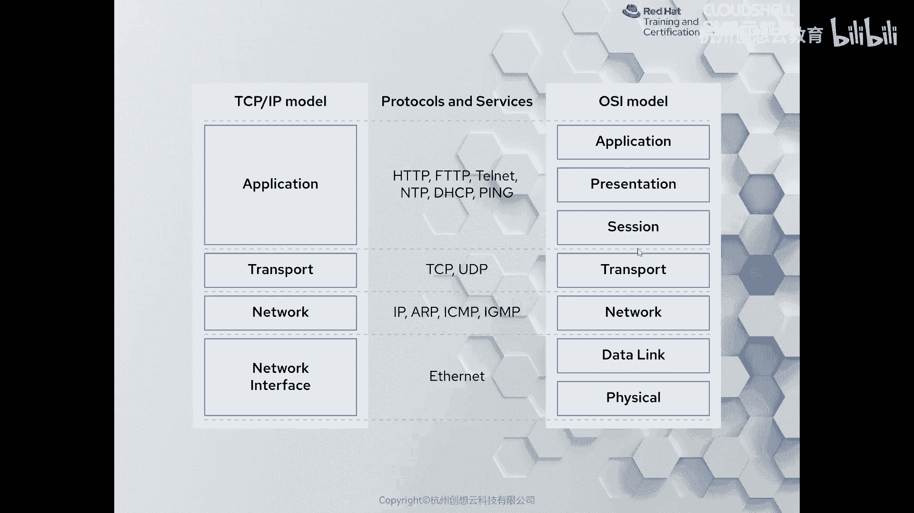
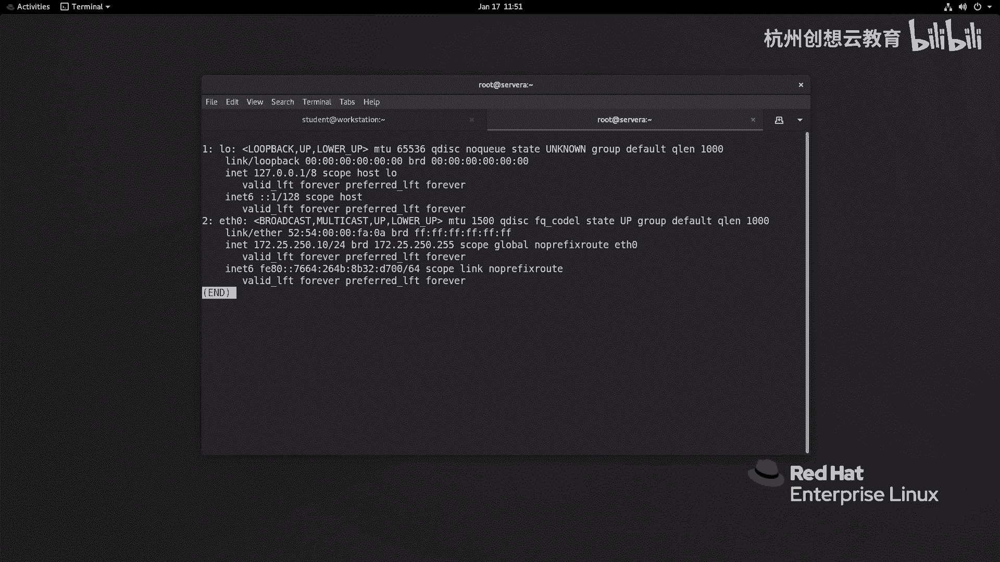
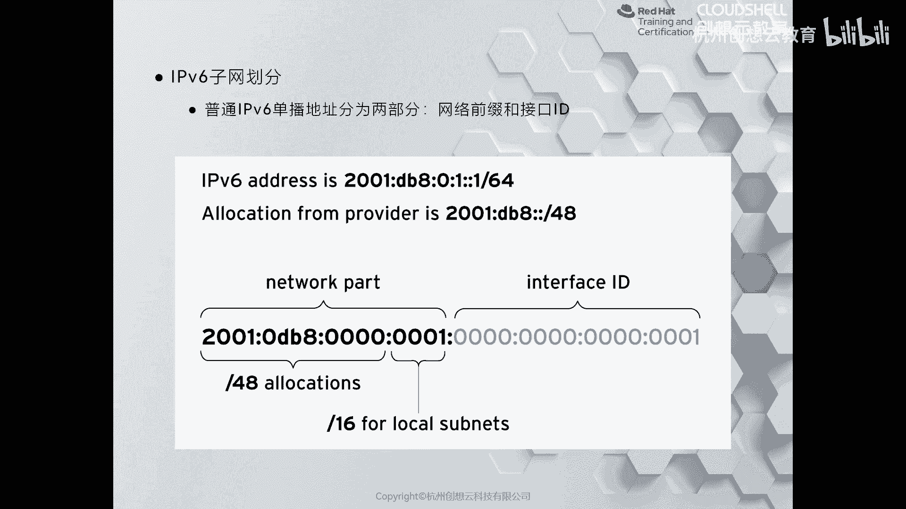
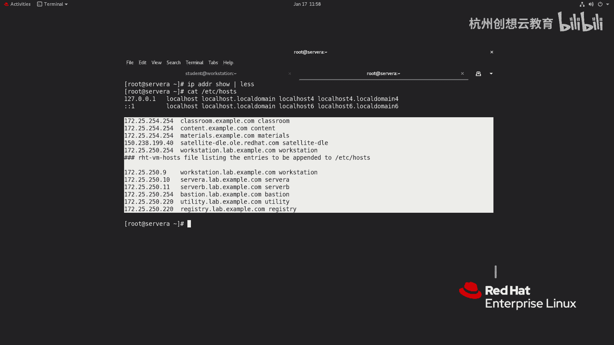
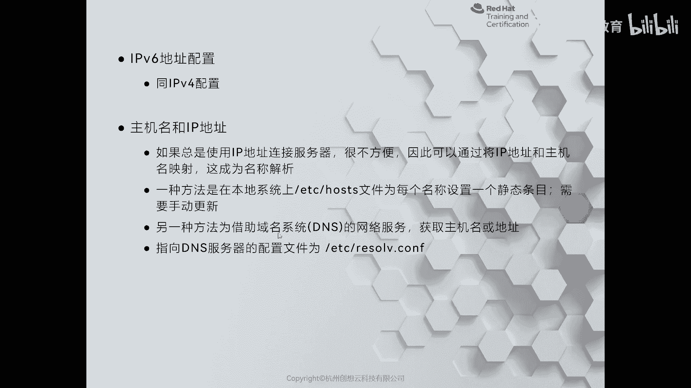
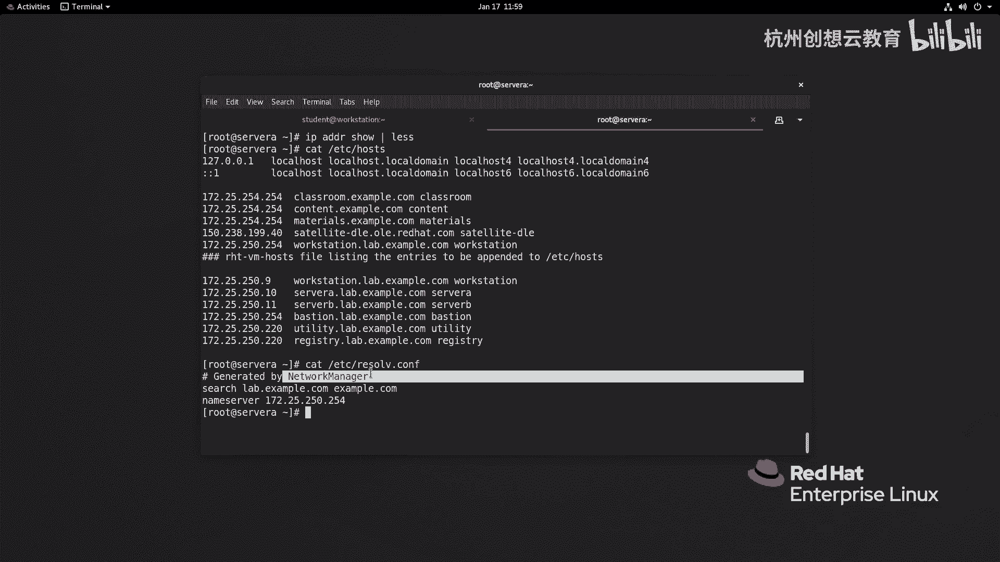

# 红帽认证系列工程师RHCE RH124-Chapter12-管理网络 - P1：12-1-管理网络-描述网络概念 - 杭州创想云教育 - BV1ZV4y1p7Mr

啊，第十二章啊管理网络啊呃那么对于啊linux而言呀，那么大部分的应用场景呢是部署在服务器上啊，然后呢提供服务。因此换个角度啊，那么我们可以把linux呀也称之为是网络操作系统啊，因此呢网络呢是打通。

啊，服务端和客户端的一个啊通道啊，网络的配置呢就显得非常的重要。那么在这章呢，我们将会了解啊一些网络的基本概念啊，如何呢在我们的linux上面呀，使用啊工具来查看我们的网络配置信息啊。

然后呢在会给大家介绍呢？如何使用啊，一个呢新的网络服务叫做network manager来管理我们的网络信息啊，最后一部分呢是如何呢修改我们的主机名等等。好，那么首先呢我们来看一下这个第一节啊。

那么第一节的话呢是一些概念性的内容啊。那么我们知道当我们说这个模型的时候呢，首先会想到1个OSI的7层模型。但是我们在应用的时候呀，更多的使用的是TCPIP的啊这种四层模型，对吧？那么在这四层模型里面。

我们也是最为啊常见最熟知的。其中对于我们这个管理员而言，那么啊接受最多的呢就是应用层啊里面涉及到了大量的应用，比如说SH啊，HTP啊HPS啊，文件存储NF啊，tF等等。ok然后呢接着呢再往下呢是传输层。

那么传输层的话呢，则是啊用于这个数据的传输啊，那么通信。那么我们在查看的时候呀，可以通过ETCserv呢这个文件呢去查看已经注册端口啊。那么现在呢我们打开个终端啊，那么可以通过alas来看一下。啊啊。

比如说那我去找1个FTP啊FTP那么我们就能找到它对应的端口啊，对应端口OK好，那么除此之外呢，我们接触到的还有什么呀？还有这个啊互联网层，对吧？也称为网络层啊，网络层，那么主要负责呢是一个地址啊。

IPV4或者IPV6这种地址啊，那么这往下呢是我们的链路层啊，只是我们传入数据的这些介质对吧？介质OK当然了我们也可以通过这张图片呢来加深理解啊，印象啊，左边呢是。

我们TCP这个四层模型，那么右边呢是1个OSNSI的这个基能模型的，它们之间的一个对应关系啊对应关系。

啊，那么接着呢我们来这个说一下啊，这个我们的real啊这个7之后呀，我们的网卡的一些变化啊。那么在real6之前呀，我们的系统呢是通过init来负责引导的啊，那么在早期的时候呢。

我们的网卡命名啊都是叫做ider0啊，挨er一啊，这样的名称命名的。但这个名称的变是会发生变化的啊。为什么呢？因为它这个名称的顺序啊完全是依靠系统啊发现这个设备并激活之后来命名的。并不是说你的网卡呀。

在你的服务器的主板上面啊，按照怎么顺序去排列，那么就正好一一对应的，不是这样的，所以说呢就可能会出现一些什么情况呢？就是说。随着我的设备的变更，或者说中间的这个有些网卡呢，可能是哎我经过这个插拔什么的。

那么这个设备名呢就发生变化了，对吧？或者说我们的这个虚拟机啊跑的是reo6这种哎我我在本地制作完镜像之后，把它上传到我的虚拟化平台。因为啊这个模拟的这个网卡的这个驱动啊发生变化。

也可能会导致网卡的名称发生变化。啊，出现一些啊比如说之前配好的网络呀发生了失效等等。所以说呢从re耀7之后呢，那么因为是由stD来进行管理的。因此呀我们的网卡的命名啊也发生了一些变化啊也发生了些变化。

那么怎么变的呢？它会根据我们这个啊系统里面的固件信息啊，还有PCI的总线这个拓普啊来来进行命名。那如果识别的我们的网卡呀是以太网卡，那么就是EN开头的。如果是啊笔记本这种啊笔记本。

那么可能有这种无线网卡，那么就是WL啊，如果有些商务本啊，有这种什么3G啊，4G啊，5G模块的，那么就是WW这这种啊，那么我们见到最多呀，还是EN开头的。因为服务器上面，毕竟。都走的是以太网接口啊啊。

然后呢这是我们的网卡的开头。那么再接着呢根据网卡呀，在我们的主板上的连接方式和所处的位置进行命名。比如说如果呢是板载的那就是on board，那就是O开头啊O开头。那因此如果是第一个网卡。

那是ENO1啊这样命名。那么如果是走PCI的话呢，则是S就是ENS啊，ES1ENS2这种命名方案。那么还有一种呢就是它处于在我们的卡槽N上面，但是又属于总线M的PCI设备。

那么就是PM啊SN这种命名方案。如果我们的网卡呀还具备一些其他的功能，那么我们的网卡会加一个F啊，代表着功能啊，functionction这样的一个命名规则。OK这是给大家介绍的这个网卡命名啊。

所以说大家不用去啊去着急去去识别啊。那么我们的虚拟机里面的话呢，没有走这种方案啊，我把它关闭掉了啊，我们走了一种哎这个。啊，老的方式啊，因为我在这个为了名称的统一性啊，我给它改了。那么我怎么改呢？

如果你感觉哎我的这个服务器啊，我也不想呃这个用这种新的方法，对吧？那么是可以这样改的啊，注意啊，这个改起来是有风险的。那么ATC下的一个defa啊，然后里面一个gb在这个文件当中啊。

我们找到啊grab command line啊，然后linux这一行，在这一行的里面呀增加一句话即可叫做night点if names等于0。啊，就可以了啊，就可以了。

然后呢再通过啊grab two啊make confi杠O来重新生成一下我们的什么呀，生成我们的grab的啊文件即可。再生成就就可以啊，就走这个命就可以了。那如果你在装系统的时候呀，你在装系统的时候。

如果是全新的安装系统，你可以在安装选择安装系统的里面啊，增加一句话呢，就是在那个item的后面增加一个net点if什么呀，names等于0也行啊，那这个地方如果你不知道怎么添加啊。

我们后面讲到安装系统的时候呀，给大家再介绍。OK那么弄完之后，你的网卡命名啊就恢复成啊传统的这种最早期的这种命名方案啊，叫什么挨er一挨er2的这种啊。

你看我这个呢就是eer0啊挨0O这是一个网卡的一个啊一个变化，我们知道就行了。好，然后呢接着我们来聊一聊什么是IPV4。

啊，IPV4。那么IPV4的话呢，目前为止呀还是占主流啊占主流OK呃，因为在最早期的时候呢，也是有IP就就是在普及的时候呀，就是走的是IPV4。那么它的长度呢是一共是32位。啊，32位。

然后呢中间呢用句点隔开啊，分成四段，那每一段呢都用这个十进制的8位字节来表示啊来表示。然后呢，这个IPV4地址呢又分为网络部分和主机部分，那么同一个子网，就是同一个网络部分的主机啊，是可以直接通信的。

不需要做任何的路由啊，你看这个地图呢就是一个比如说172。17。5。3，那把它转变成二进制，那么就是10010101100，那么8位对吧？8位啊，8个字8位，然后呢这个分成四段啊，然后掩码啊。

那么是25。25。0。0啊，那么255呢就是全是10呢就是全是0。那么通过掩码位呢就能知道我们的这个网络位的长度，你像我们这个地址呢就是16位。啊，左边的两段啊，16位啊。

那么下面这个呢就是一个啊这个什么呀？32位的啊32位的OK那么如果啊如果我们的啊IP地址，两台主机之间的IP地址呢不在同一网段，那么要想让它通信，就必须要干嘛呀？中间呢放一个路由器啊。

路由器呢负责呢把我们的这个数据报围啊进行一个交互，让他知道啊去的路和来回的路。啊，来回的录，无论是IPV4还是IPV6都需要做这样的操作啊，做这样的操作。OK那么一般情况下呢。

我们在配置网络信息的时候呀，会选择手动配置或者是通过DSCP呢来获得地址。那么如果呢是通过DSCP来获取的。我们可以在DSCP服务器上啊来设定啊客户端啊，你拿取地址之后的租约啊。

还有这个路由啊这样的信息啊这样信息啊，那么也可以呢直接干嘛呀做静态的一个配置啊，呃，我们一般来说呢是先去给他拿1个DSCP啊。如果你想要高高这个高保证啊。就说防止你这你的DSCP那个出现故障。

导致网络没没有办法通信的话呢，你可以干嘛呀可以这个通过DSRCP呢获取地址，然后呢再配个静态的。啊，两个保证啊。啊，那么IPV6的话呢是目前啊这几年啊新出来的比较火的一个概念。也不能这几年吧。

其实我觉得我记得是在08年的时候啊，正式的开始推广，对吧？08年啊这已经很多年过去了。那么在推广的时候呢，当时我记得是这样来借描述IPV6的啊，说IPV4的地址啊已经面临枯竭了，对吧？

那么要想让大家的设备啊还能通信，特别是现在当前的这个互联网环境，对吧？物联网啊等等。发展迅速是吧？云计算那么需要有大量的地址进行通信，那么就催生了IPV6的这个快速的去普及啊。那么IPV6的话呢。

它的长度比较多啊，是用128位啊，那么这样的话呢就非常的多了，多到什么程度呢？那么新闻上是这样说的对吧？可以把这个沙漠里的美粒沙子呢都分配一个地址。那虽然夸张了。

但是呢能够侧面的说明IPV6地址是非常多的啊，那么就意味着我们将来的每个人的这个终端设备呀都可以分配一个啊IP地址啊IP地址。那么IPV6到底长什么样子呢？我们来看一下。那么IB地址的话呢。

它分成两个部分啊，和那个IBV4呢有点像啊。那么左边呢48位啊，48位啊，sorry啊，64位，那么长度呢是称之为是网络位啊，那么右边的64位呢。

我们称之为是一个机构ID你像我们这个地址呢就是谁呀2001啊，0DB8啊，然后呢0啊01啊，冒号冒号1啊，那么网络位呢是64位啊，64位。那么左边的这个网络位呢就是。

国际上面啊给每个国家和地区呢分发的啊网络位的地址。那么我们像我们国家拿到这个啊网络位之后呢，然后呢再分发给运营商，那么运营商呢在分发的时候呢，只给我们什么呀？前面48位啊，前面48位。

48位里面找出来16啊，把这个16里面找出来一对，然后分配给我们的啊公司企业，对吧？然后呢，企业拿到之后呢，那么可以给根据我们的markac地址呀，服务器的mark地址，然后把它转变成进入ID呢行分配。

这样的话呢是最简单的一种方法。啊，最简单一种方法。当我们分配1个IPV6地址之后，那么IPV4是不是可以通信呢？注意啊，是这样的，那么IPV4是没有办法和我们的IPV6呢直接通信的，但是它配的时候呢。

它的方法呀是和IPV4是一样的。因为那我怎么办呢？哎我可以啊在服务器上做一个双站的协议。就说我在一个网卡上啊既配1个IPV4，同时呢也配1个IPV6啊，这样的话呢。

IPV4呢和IPV4通信IPV6呢和IPV6通信就可以了。像我们国家呢现在正在普及IPV6通信。所以很多的网站呀。

你在访问的时候呢，都能看得到上面提示支持IPV6的通信啊，IPV的通信OK呃，然后呢我们接着呢再来介绍一个文件呀啊，叫做什么呢？叫做主机名和IP地址的一个一个概念。

就是说呃我们我们只记录IP地址是不方便的对吧？那么地址那么多，怎么办呢？所以说呢最早期的时候呀，是在本地的houses文件当中来增加一个静态的条目来负责解析。那么它的内容大概呢长这个样子，我们来看一下。

啊，ca AC啊ca啊ATC下的houses啊。那么在这个文件当中啊，是一个静态的啊，左边呢是我们的IP地址，后面呢是我们的主机名啊，或者主机名的短名称。这样的话呢我们在啊这个通信的时候呀。

就没有必要记录我们的地址了，只需要记录主机名就可以了。但是呢这样一个弊端啊，就说如果我们的主机数量比较少。哎，我用一个静态的是合适的，我不需要搭建一个服务器专门负责解析。但是随着互联网的发展呀。那么。

快速的发展啊，那么发现这种静态的方式呀，没有办法啊面对应对这样的挑战啊，那么因此呢就催生了一种专门负责解析啊，主机和IP地址IP地址之间的这样服务。

那么这种服务呢我们称之为是DS叫域名解析服务啊进行解析服务。那么最出名的啊DS服务器的软件啊，在linkux上面叫band啊，它是由伯克利大学啊，来开发的一个啊互联网的一个名称解析服务啊。

叫bd啊BINDOK那么。

那么通过这个DS呢，我们在DS服务器上去啊写好这个记录。然后呢，在本地啊我们的客户端上的啊ETCre点cf当中呢，只需要去指定啊我们的DS即可。那你像我们教室里面啊，我们来看一下我们的DS啊。啊。

ETC下面的reol啊，那么我们教室里的DS呢是172。25。250。254。那所以说我们局网里面接接主机啊，既可以走本地的，也可以走我们的DS进行解析啊，DS解析O。

但是要注意的就是你像这个文件啊啊不要直接去改，因为它没有办法永久性生效。我们要想改的话呀，需要通过网络啊管理这个服务呢进行去永久的生效。

