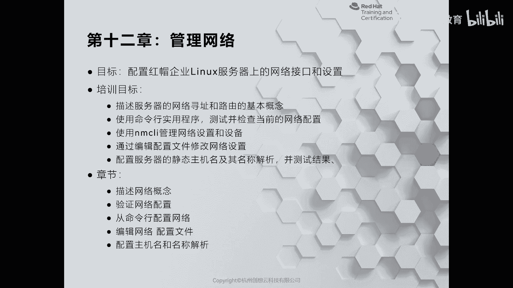
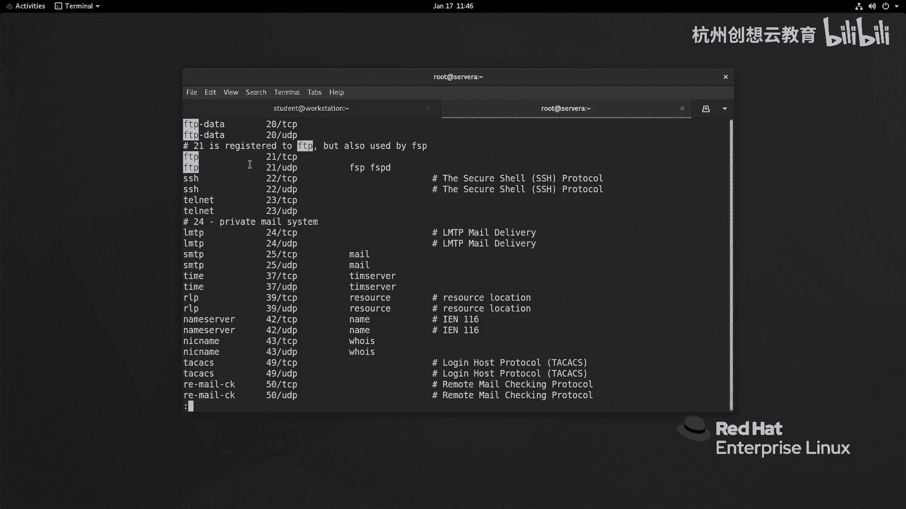
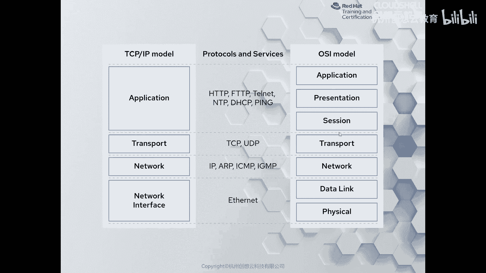
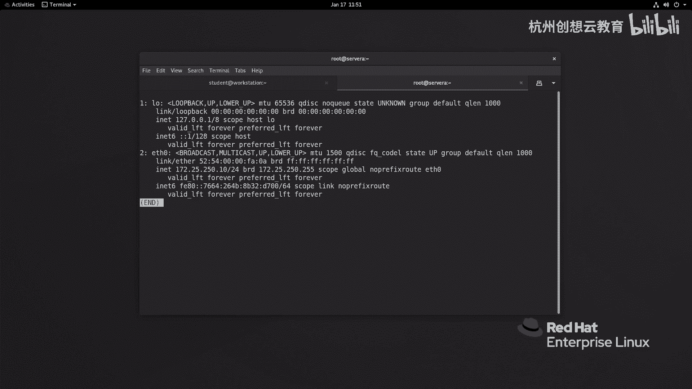
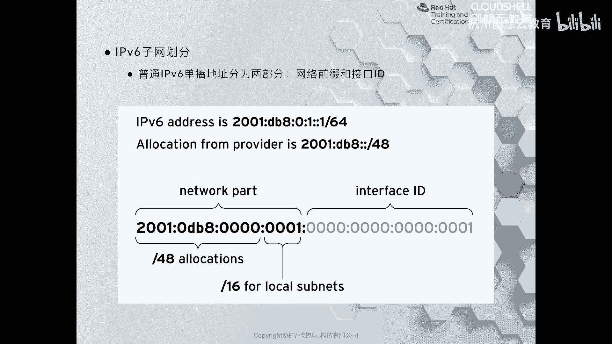
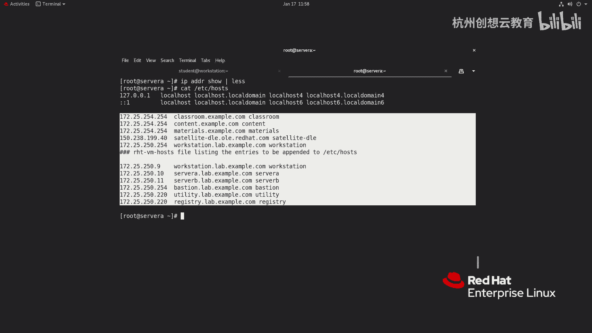
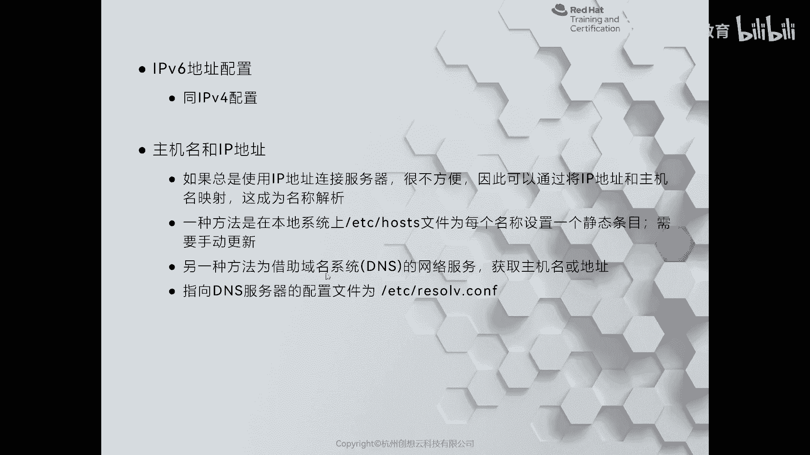
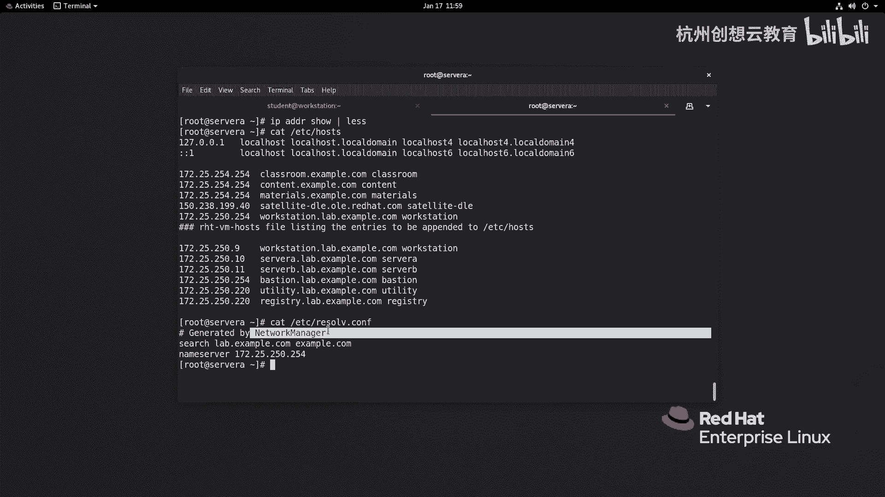

# 红帽认证系列工程师RHCE RH124-Chapter12：管理网络 - P1：12-1-管理网络-描述网络概念



在本节课中，我们将要学习Linux网络管理的基础概念。作为网络操作系统，Linux的网络配置至关重要。我们将从网络模型、网卡命名规则、IP地址（IPv4与IPv6）以及主机名解析等核心概念入手，为后续的实际配置操作打下基础。

## 网络模型概述

上一节我们介绍了网络对于Linux服务器的重要性，本节中我们来看看描述网络通信的两种主要模型。

在讨论网络模型时，首先会想到OSI七层模型。但在实际应用中，更常用的是TCP/IP四层模型。该模型自顶向下分为应用层、传输层、网络层（互联网层）和链路层。





*   **应用层**：包含大量应用程序协议，例如SSH、HTTP/HTTPS、NFS、FTP等。
*   **传输层**：负责端到端的数据传输和通信。已注册的端口信息可通过 `/etc/services` 文件查看。例如，查找FTP端口：
    ```bash
    grep ftp /etc/services
    ```
*   **网络层**：主要负责IP地址（IPv4或IPv6）的寻址和路由。
*   **链路层**：涉及数据传输的物理介质，如网线、光纤等。

下图展示了TCP/IP四层模型与OSI七层模型的对应关系，有助于加深理解。


## 网卡命名规则的变化

了解了网络模型后，我们来看看Linux系统中一个具体的变化：网卡命名规则。

在RHEL 7之前的版本中，系统由init引导，网卡名称通常为 `eth0`、`eth1` 等。这种命名顺序取决于系统发现并激活设备的顺序，而非物理插槽顺序，可能导致设备名因硬件变更或虚拟机迁移而意外改变，造成网络配置失效。

从RHEL 7开始，系统由systemd管理，网卡命名规则也基于固件信息、PCI总线拓扑等变得更加可预测。

以下是新的命名规则：
*   **前缀**：
    *   `en` 表示以太网卡。
    *   `wl` 表示无线网卡（WLAN）。
    *   `ww` 表示广域网卡（如3G/4G/5G模块）。
*   **命名依据**：
    *   `o` 表示板载设备（onboard），如 `eno1`。
    *   `s` 表示PCI热插拔槽位设备，如 `ens1`。
    *   `p<总线>s<槽位>` 表示特定PCI总线和槽位的设备，如 `enp3s0`。
    *   `f<功能>` 表示设备具备特定功能。

如果希望恢复传统的 `ethX` 命名方式，可以修改GRUB配置。以下是操作步骤：

1.  编辑 `/etc/default/grub` 文件，在 `GRUB_CMDLINE_LINUX` 行中添加参数 `net.ifnames=0`。
2.  使用以下命令重新生成GRUB配置文件：
    ```bash
    grub2-mkconfig -o /boot/grub2/grub.cfg
    ```
3.  重启系统后生效。



> **注意**：修改GRUB配置存在风险，需谨慎操作。在系统安装时，也可在引导参数中添加 `net.ifnames=0` 来实现相同效果。

## IPv4与IPv6地址

网络通信离不开地址，本节我们来认识两种主要的IP地址：IPv4和IPv6。

### IPv4地址

IPv4是目前主流的网络层协议地址。其特点如下：
*   长度为32位，通常用点分十进制表示，分为四段，例如 `172.17.5.3`。
*   地址由**网络部分**和**主机部分**组成。子网掩码用于划分这两部分。例如，IP `172.17.5.3` 与掩码 `255.255.0.0`（或 `/16`）表示前16位是网络位。
*   同一网络部分的主机可直接通信。不同网段的主机通信需要路由器进行路由。
*   配置方式分为手动静态配置和通过DHCP动态获取。DHCP还可以分配租约、网关、DNS等信息。为提高可靠性，可同时配置DHCP和静态地址。

### IPv6地址

随着物联网和云计算发展，IPv4地址面临枯竭，IPv6得以快速普及。

*   长度为128位，地址空间极其庞大。
*   地址通常分为两部分：前64位为**网络前缀**，后64位为**接口标识符**。例如 `2001:0db8:0:0::1`。
*   网络前缀由国际组织分配给国家和地区，再逐级分配给运营商和企业。
*   IPv6与IPv4**不直接兼容**。为实现通信，可在设备上配置**双栈协议**，即同时配置IPv4和IPv6地址，让设备根据对端地址选择协议通信。



## 主机名与名称解析

记住IP地址不便，因此产生了主机名和名称解析服务。


最初，系统通过本地的 `/etc/hosts` 文件进行静态解析。该文件格式如下：
```
IP地址    主机名 [主机别名]
```
例如：
```
172.25.250.10    server01.example.com server01
```
这种方式适用于主机数量少的场景。

随着网络规模扩大，静态解析无法满足需求，于是出现了**域名系统（DNS）**。DNS是一种分布式数据库服务，专门负责主机名与IP地址的映射解析。Linux上著名的DNS服务器软件是 **BIND**。

客户端只需在 `/etc/resolv.conf` 文件中指定DNS服务器地址即可使用该服务。例如：
```
nameserver 172.25.250.254
```
> **注意**：直接修改 `/etc/resolv.conf` 可能无法永久生效。在RHEL 7及以后版本中，应通过NetworkManager服务进行持久化配置。







## 总结


本节课中我们一起学习了Linux网络管理的基础概念。我们回顾了TCP/IP网络模型，了解了RHEL 7之后可预测的网卡命名规则。我们详细探讨了IPv4和IPv6地址的结构与特点，并介绍了从本地hosts文件到分布式DNS系统的主机名解析机制。掌握这些核心概念是后续进行实际网络配置和管理的重要前提。