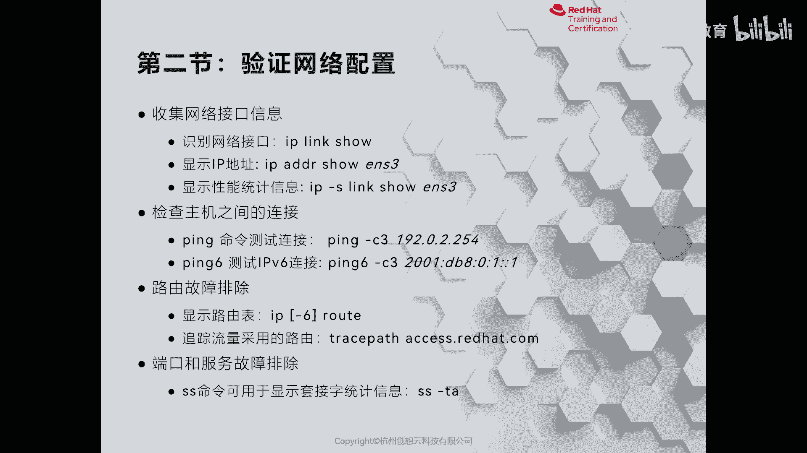
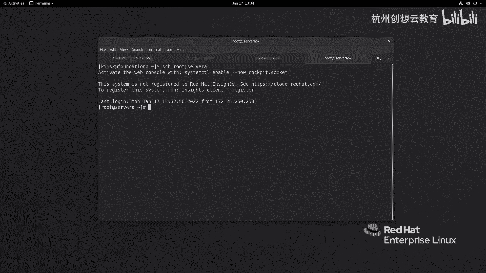
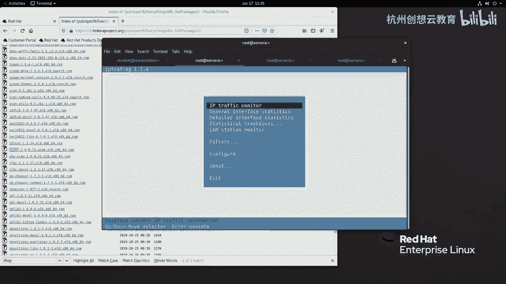
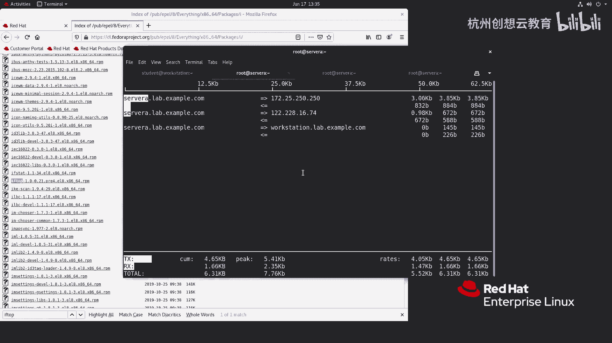

# 红帽认证系列工程师RHCE RH124-Chapter12-管理网络 - P2：12-2-管理网络-验证网络配置 - 杭州创想云教育 - BV1ZV4y1p7Mr

好，我们来看一下第二节啊，网络配置。那么这一小节呢主要是来给大家介绍呀如何啊使用相对应的命令来查看网络信息啊。那么我们一旦说查看网络信息啊，我们很多人首先想到的是if confi这个命令。啊。

而我们PPT上大家发现啊都是什么IP的命令。okK为什么没有讲那个if confi呢？那么是因为啊那么IP命令啊是我们linux面自带的一个用于啊验证网络配置的一个指令。

而我们之前所了解的if confi呢，则是啊这个通过安装软件包来实现的。啊，又意味着我们默认情况下呀，可能是没有if confi的啊，而这个包是从哪来的呢？那么它的包呢名字呢叫ne toolss啊。

ne tools这个包名称啊，是通过安装它来提供的OK呃，如果我们走最小化呀，那可能这个包是没有安装的啊，有可能是没有安装的。所以我们在这里呢就直接讲的是IP啊，但是if confi呢。

如果我们习惯性了，那你就去安装这个软件包啊，那么依旧能够提供if confi的这样一个指令。那么我们重点呢这里呢就讲的是IP了。那如果呢现在呢我想去查看我的啊这个网络接口啊，我可以使用IP什么呀？

 link show啊link show。OK那么这里呢就能看到我的硬件的配置啊，网卡的名称啊，还有它的mark地址啊mark地址。好，那么如果呢我想去查看某一个啊这个网卡的呃这个IP地址呀。

那么就是IPAADDR秀后面跟上我们的网卡的设备名称。好，那么我们来试一下啊，那么在我们的系统里面啊，那么网卡呢叫ea0。所以说呢我的指令应该是IP啊ADDR秀啊 eitherer0。

那么这样呢就可以打印出来我们这个网络的信息了。那么在输出内容当中，我们可以看得到啊，那么我们的网卡呀，它的MTU呢是1500对吧？默认值啊，那么玛克例值。那么除此之外呢，还有它的IPV4地址对吧？

172。25。250。10啊，那么网络前缀呢是24位，然后它的广播地址啊，那么在这个信息里面啊。啊，信息里面还包含了一个啊叫做IPV6的地址啊，IPV6地址OK。啊。

那如果啊我们想啊类似于这种啊if confi的指令一样，那么打印出来我们的网络的什么呀这种唉这个。这个性能统一信息啊，那么我们就可以呢走一个这样的命令。啊。

叫做IP杠Slink show后面跟上我们的网卡名称啊，那么我们来走一个啊啊IP啊杠S啊杠S，然后呢跟上我们的linkO show啊受谁呢？挨点0，那么就能看到我们的这个啊数据报文的一个情况啊。

波文的情况。好，那么接着呢我们啊再看一个指令，我们非常熟悉的啊叫做pin啊。P的话呢可以帮助我们来测试啊那个啊不同的主机之间啊，网络是否畅通。那么在linux上面啊，那么命令呢，它在测试的时候啊。

默认情况下是无限制的测试啊，而在windows里面的话呢，p的话呢是默认只有4次啊，所以说呢我们在这里呢可以通过P里面的一个选项啊杠C啊来代表啊测试的次数啊，后面跟上你要测试的IP地址即可啊。

那我现在呢去测试一下。比如说我想测试一下和servb的通信，那就 c，比如我要测试两次。那么是servb或者是跟上servb的IP地址啊都是可以的。啊，那么测试之后呀。

我们关心的是一呢是看这里它的TDL啊，还有time，这是第一个关心的地方。第二个关心的地方呢就是最下面的这个啊，我们说发报文的情况啊，以及什么RTT啊，这里的值啊，因为通过这些值呢。

也可以可以评估一下网络的质量啊，是可以评估出来的那如果呢是我们的我们走的是一个IPV6地址呀。那么我们可以还可以干嘛呀，还可以使用品6啊，来拼测试我们的IPV6地址啊，都是可以的。

那么我们这里没有配置IPV6，所以说呢就。啊，不演示啊不演示了。OK。啊，那如果要想发现我们的主机啊和主机之间在同一网段是通的啊，但是呢在另外一个网站的主机啊却不够通。那么我们可以看路由表是否正确。

那么如果只看IPV4的路由表，那么就是IPro如果要查看IPV6的路由表，那么就是IP跟上一个选项啊，这个大6啊就可以了啊。我们现在看一下我们自己的路由表IP rootot。啊。

ro那么我们的默认路由呢指向的是172。25。250。254啊，那么指向设备呢是I点0okmetric是100，那么172。25。250的网段呢，哎都是通过我们的艾0这个网卡进行这个通信的啊通信的啊啊。

那么接着呢我们哎如果呀想测试一下我们的这个服务器啊，到这个远端的服务器之间的网络啊，这个流量到底是怎么走的。哎，我们可以通过什么transpass这个指令呢去执行。那么这个以前的时候呢。

我们用的是这个啊trans root啊retrans啊，那么现在呢都是换名称了，以新的指令。啊。啊，那么我这里呢就去啊走access。那点 ride hat点com来测试一下啊啊。

那么看看我们的这个路由啊，到底是从如何呢走出去的。啊，呃有些站点可能没有回应啊没有回应。啊，这个和我们没关系啊，因为有些节点啊策略啊不允许去跟踪啊，所以说呢是no play啊。啊，是这个。

然后呢我就把它ctrol C掉了啊，ctl C掉了啊，那么接着呢啊接着啊其实这个地方是因为我们的环境原因啊，这个路由出去的时候呀啊做一些设置啊。啊，那么接着呢我们啊再看一个内容啊。

就是啊我们的系统当中啊，有些服务呢跑起来了，但是端口有没有打开呢，哎不知道哎，我们可以通过SS命令呢去查看我们的端口和服务啊，这个一个是否正常啊是否正常。那么比如说呢我们走一个这样的命令。啊，这个SS。

啊，杠TA啊，那么这个T呢代表的是查看我们的TCP啊套节字。那么A呢则代表的是我们这个所有啊这个已经建立的啊绘画的一个套节字。那么在这个内容里面啊，首先啊比如说这里的啊0。0。0冒号SH。

那是本地的对吧？本地的。那么说明我们本地的所有IPVC呀。哎，都在这个啊使用这个SH协议这个端口啊，那么这个协议啊协议。那如果你只想看数啊这个数端口数，而不是名称。你可以用一个N啊。

它就会把这个名字呀换成端口号了啊，端口号了啊，那么你像这个还有一些其他内容啊，还有一些其他内容。OK比是我们再加一个选项，加上一个P啊进程的啊，那么L呢是真听啊真听啊，那么如果是U代表是UTP套节字啊。

我这边再解释一下啊，T呢代表的是TCP的套节字，那么N呢代表的是啊显示我们的这个端口的编号而不显示名称，那么A则代表的是所有的套节字啊，那么P呢代表的是我们这个使用了套节字的一个进程啊。

那么L则代表的是真听当中的套节字，而U呢则代表的是UTP套节字啊，你看非常多哎非常多O。啊，因为我们的这个上面没有跑什么服务啊，所以说呢没有什么绘画内容。啊，没有什么会画内容啊。

那么现在呢我这个也可以后期啊我们可以通过。转到符结合正大表达，结合rap命令来去筛选啊，看看某些端口呀是否是打开的，并且真听状态啊。好，这是常用的几一些网络的指令。那么除此之外呢，其实还有很多啊。

比如说啊类似于where shark的TCP大，对不对啊，等等，都非常多啊，我们都可以去使用啊，都可以使用。比如说我记得有一个包呀啊可以来查看动态的来显示我们网络流量的情况啊，这个包叫做什么。

我记不清了，我们来搜一下吧。啊，来搜一下啊这个。哎，不是这样的名字啊。哎，应该是叫做。哎， search持一下，我们找关键词啊，关键词。呃，比如说我们能看到的有啊，比如说我们找一个工作萨啊。

萨这个我们会做一些高级的一个功能啊。萨萨的话。我们来看一看这个包是从哪来的啊。那么我们的教材里面没有讲这个指令。OK啊，也是啊C time这个好像我们记得是昨天啊已经装过了。

那么我现在呢再去安装一下看看。啊，装过了。那么我们可以的话呢，通过一个这样的方法，就是什么呢？叫做s啊杠N啊DV啊，比如说我要显示两次，那么通过这个命令呢。

也能够看到我们的网络的流量的目前的一个使用情况，对吧？比如说我现在这个。啊，干嘛呀？通过root呀啊去这个访问一下sA。啊，然后呢这边呢去pin一下我们的access。啊，让它拼着。然后呢。

这边呢我们再去看一看。对吧你看这里面的数据呢就发生了变化，这是一种方法。那么还可以干嘛呀？我们还可以装一些，比如工具啊，比如说有一个呢叫做IP啊，这个t NG啊。啊，就这个包。

那么也可以呢帮助我们来实时的来显示这个啊网络的一个情况啊，网络情况okK好，我们来装一下。啊，我这里呢就不做复杂的介绍了，我就简单去执行啊。那么有1个IP流量的一个监控，对吧？哎，我呢去回车选择挨0啊。

那么这时候呢我们的动态呢就显示出来了，我这边呀可以一直拼是吧？一直，然后呢再去连接到root at什么呀？s A啊，那么比如说去啊这个。

啊，去干嘛呢？去访问一些其他站点。比如说我们去下载个数据是吧？比如说我们去啊去eal上面，我们去下个包，好吧。我们这里看有没有一个包叫iftop的啊，我们的仓库里面是没有的。我们这里呢去找一找。

I开头的。但是呢我们并不知道它有没有依赖啊，我们先去找到看有没有。哎，这里面有个包，我给它下一下来。啊，下下来啊，这边呢去执行Wge。好，那么下来的时候呢，我们这边啊流量呢也就哎有没有发现的绘画哎。

就出现了啊出现了。好，这是一种工具啊，一种工具啊，那么我这边呢就给它退出了啊，退出了。

那么还有呢就是刚才我们下了这个iftop这个包。我看有没有依赖啊。啊，还好没有。那么我们也可以使用top命令呢来查看我们这个流量的一个实施情况啊。

实际情况OK这是呢给大家简单介绍的几个啊查看网络信息的命令。

