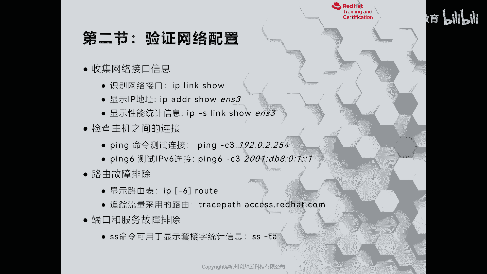
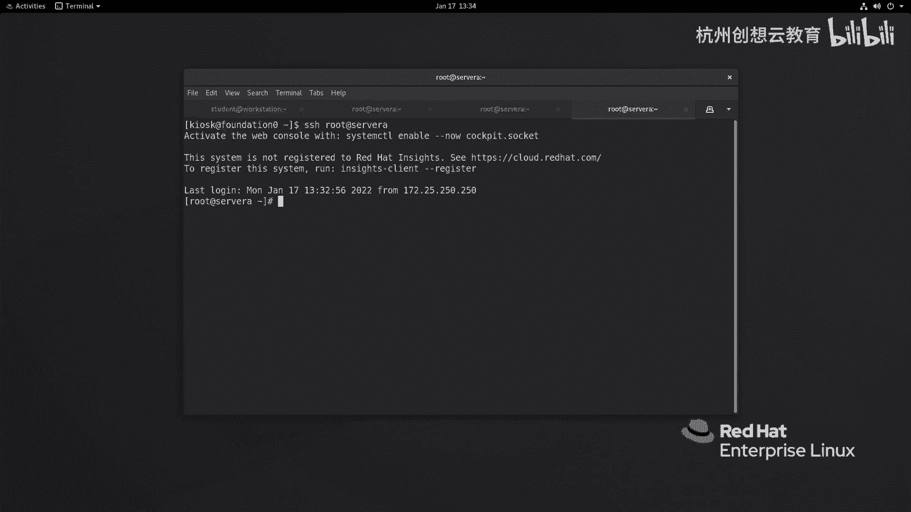
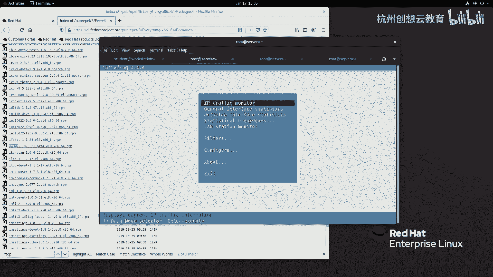
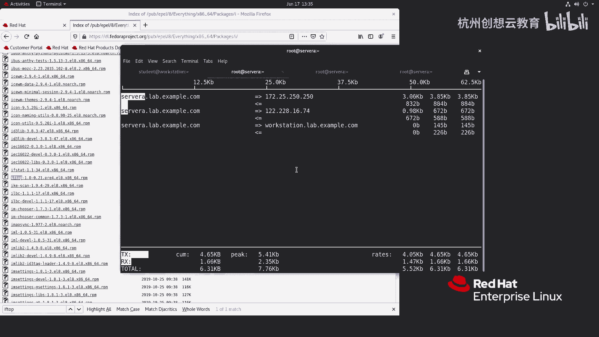

# 红帽认证系列工程师RHCE RH124-Chapter12：12-2：管理网络-验证网络配置



在本节中，我们将学习如何使用一系列命令来验证和查看Linux系统的网络配置信息。掌握这些工具对于网络故障排查和日常管理至关重要。

上一节我们介绍了网络配置的基础概念，本节中我们来看看如何具体查看这些配置信息。

## 查看网络接口与地址

要查看系统中的网络接口硬件信息，可以使用 `ip link show` 命令。

以下是该命令的输出示例：
```
1: lo: <LOOPBACK,UP,LOWER_UP> mtu 65536 qdisc noqueue state UNKNOWN mode DEFAULT group default qlen 1000
    link/loopback 00:00:00:00:00:00 brd 00:00:00:00:00:00
2: eth0: <BROADCAST,MULTICAST,UP,LOWER_UP> mtu 1500 qdisc pfifo_fast state UP mode DEFAULT group default qlen 1000
    link/ether 52:54:00:00:00:0a brd ff:ff:ff:ff:ff:ff
```

如果想查看特定网络接口（如 `eth0`）的IP地址信息，应使用 `ip addr show` 命令。

以下是查看 `eth0` 接口的命令：
```bash
ip addr show eth0
```
该命令会输出接口的MTU、MAC地址、IPv4地址（如 `172.25.250.10/24`）及广播地址等信息。

## 查看网络统计信息

要查看网络接口的数据包统计等性能信息，可以使用 `ip -s link show` 命令。

以下是查看 `eth0` 接口统计信息的命令：
```bash
ip -s link show eth0
```

## 测试网络连通性

`ping` 命令用于测试主机之间的网络连通性。Linux下的 `ping` 命令默认会持续发送数据包，可以使用 `-c` 选项指定发送次数。

以下是向服务器 `serverb` 发送两次 `ping` 测试的命令：
```bash
ping -c 2 serverb
```
命令输出中的 `time` 值可以用于评估网络质量。对于IPv6地址，应使用 `ping6` 命令。

## 查看与跟踪路由

查看系统的IPv4路由表，使用 `ip route` 命令。查看IPv6路由表则使用 `ip -6 route` 命令。

以下是查看路由表的命令：
```bash
ip route
```
输出会显示默认网关（如 `172.25.250.254`）及各网段对应的出口设备。

若要追踪数据包到达目标主机所经过的路径，应使用 `traceroute` 命令。

以下是追踪到 `access.redhat.com` 路由路径的命令：
```bash
traceroute access.redhat.com
```

## 查看网络连接与端口

`ss` 命令用于查看系统的套接字连接信息，功能类似传统的 `netstat`。

以下是 `ss` 命令的一些常用选项组合：
*   `-t`: 显示TCP套接字。
*   `-u`: 显示UDP套接字。
*   `-a`: 显示所有套接字（包括监听和非监听）。
*   `-l`: 仅显示监听中的套接字。
*   `-n`: 以数字形式显示端口号，而非服务名称。
*   `-p`: 显示使用套接字的进程信息。

例如，查看所有TCP连接及其对应进程的命令是：
```bash
ss -t -a -p
```

## 监控网络流量



除了基础命令，还有一些工具可以实时监控网络流量。

`nload` 命令可以动态显示网络接口的流量情况。安装后，运行 `nload` 并选择接口（如 `eth0`）即可查看。



`iftop` 命令则类似 top 命令，可以实时显示网络带宽的使用情况，需要单独安装。



本节课中我们一起学习了多个用于验证网络配置的命令，包括查看接口信息 (`ip link/addr`)、测试连通性 (`ping`)、检查路由 (`ip route`, `traceroute`)、查看连接 (`ss`) 以及监控流量 (`nload`, `iftop`)。熟练掌握这些工具是进行Linux系统网络管理和故障诊断的基础。