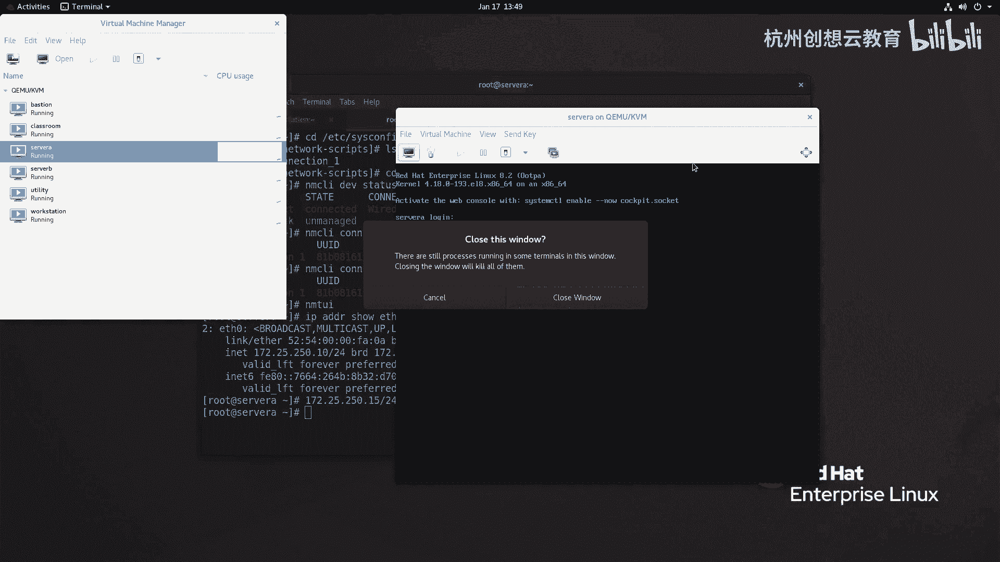

# 红帽认证系列工程师RHCE RH124-Chapter12-管理网络 - P3：12-3-管理网络-从命令行配置网络(01) - 杭州创想云教育 - BV1ZV4y1p7Mr

呃第三节啊从命令行的来配置网络啊，嗯在红帽切完这个六的时候呀，网络的管理服务呢发生了一个变化，在real 5的时候呢，我们的网络呀是有network啊来负责管理的，那么我们在之前讲这个系统启动的时候呢。

介绍过啊，那么在笔记本上啊，去安装一个有这个音译啊，这种system file这种呃这种引导的系统啊，在配置网络的时候呢很很麻烦啊，那我这里说的网络是无线网络啊，很麻烦。

那么后来呢这个那么在real 6的时候呢，就增加了这个up start的这种情况是，那么与此同时呢，我们的网络管理工具呢也发生了变化啊，那么为了便于我们在笔记本上啊，去配置无线网络啊，配置无线网络。

因此呢红帽呀，那么使用了一个叫做network major，的一个网络服务，ok就是我们ppt上看到的这样一个名称啊，看到一个这样的名称，那么然后呢这个工具呢出发点是好的，但是经过测试呢。

就是说这个服务呀，并没有给我们带来什么便利，反而呢嗯因为不稳定啊，我们在装完系统之后呀，第一件事呢，就是把这个network major给它给禁用掉，ok这是六的时候啊。

唉然后呢就进入到了real 7了，那么real 7的时候呢，那么这个network major已经变得成熟了，那么系统里面保留了network和network major，这两个啊，他们两个相辅相成啊。

结合呢去管理我们的网络呃，在我们的课程范围之内呢，是推荐使用电光mage的，但是呢在公有云上啊，我们在使用这个红帽系列的linux，发行版的时候，那么我们会把这个network major呢同样进入掉。

而是使用那个network mad那个那个那个前身啊，network哎，那么到二八之后呢，那么这个network major呀，哎这只剩下他一个了啊，就不再有network了。

所以呢我们现在在管理的时候呢，用的就是network major啊，这个地方我们要知道啊，呃那么对于network manager来说呢，功能是强大的啊，它不仅仅可以来管理传统的这个啊，以太网卡的配置。

还可以负责配置什么无线的连接啊，这个啊网卡的绑定啊，网络合作啊，桥接啊等等啊，都是可以进行配置的啊，呃那么在配置的时候呢，它的网卡配置文件呢依旧保留在啊etc啊，six config啊。

net a surprise这个目录里面看，现在最新的fda，已经不再把网卡的配置文件，放在这个路径里面了啊，换位置了啊，换位置了，所以说我们可以推测啊，就是将来红帽700 十唉。

会不会也去更改网络配置文件所在位置呢，对不对，ok那么在这个目录下面呢，我们的网卡呀命名还是if fg啊，就是i f g横杠后面跟上一个名称，那么在以前的时候呢，这个名字呀就是网卡的名名称。

而现在呢不是了，现在呢他一般走的是它的连接零啊，连接零，所以说名字什么不重要，重要的是里面的内容对吧，开头那一定是ifg开头的，那么大概呢就是这个样子，唉那么if f c f g后面跟上一个连接名。

以前的时候呢是网卡的设备名啊，现在是连接名嗯。

然后呢就是在我们的network major里面，把这个设备名和连接名呢，是区分的非常的细致的，首先呢设备呢指的是网络接口，唉那么是硬件啊硬件，而这个连接呢只是一个什么呀，只是一个逻辑的名称啊。

是我们的管理员啊，这个起的名字，或者是我们的这个network和major，生成的那个名字啊，那么并且呢在对于一个网卡设备而言，在同一时间内只能有一个连接，是处于活动状态的啊。

但是呢一个设备呢可以有多个连接，那么这句话是什么意思呢，那就是说我一个网卡呀，可以创建多个连接名，但是呢只能每次呢用一个啊，你用了a的连接啊，就不能用b的，用了b的就不能用a的，为什么呢。

因为每个连接都关联到一个设备，我不可能让一个设备啊，这个同时干两件事情啊，不可以啊，不可以，ok那么每一个连接啊都有自己的名称啊，或者是i d啊。

i d是唯一的，那么像我们教室里面刚才看到的这个啊，where connection一啊，就是我们的连接名啊，连接名，ok。

啊那么我们在修改网络的时候呢，可以用两个工具啊，一个呢叫nm t y，那么这个工具呢可以给我们提供一个，非常非常简单的交互式的界面，它可以帮助我们做一些简单的网络配置值，是非常方便的。

还有一个呢叫做nm cli，这个是我们推荐的一个方法，可以实现一些高级的网络配置，如果我们对网络要求呢比较单一啊，仅仅是改一个一代网卡的ip地址，那么n m t i呢就可以了，如果稍微那么复杂一点点。

那么我们推荐走nm ciri啊，一定要注意啊，这两个之间的区别，那么首先呢我们可以通过啊，nm c i命令啊，跟上一个dv来查看我们的网卡的设备状态。

好我们来进行一个nm c y啊，dv什么呀，sters，哎我们看到啊，我们有两个设备，一个呢是a。零，一个呢是l o啊，还回的，其中i s20 呢是以太网卡。

状态呢是已连接连接名叫vr的connection一啊，这是连接名，那么我们也可以呢，使用这个n m c i c o n show命令。

来看我们的连接的信息。

啊n m c r i c o n啊，秀啊，那么可以通过tab来补齐啊，这是我们的连接啊，连接如果呢我们的网卡呀有很多个连接名，有很多个，我只想看激活的啊，连接的那我可以加上一个q啊。

q那么左边的第一列呢是连接名，中间的ui d呢是它的唯一的编识号啊，网卡的类型和对应的设备啊。

好那么接着呢我们来使用啊，最简单的啊，一个nmti的图形文本，来修改一下我们的网络信息。

那么现在的话呢，我们先去看一看我们当前的网络配置，好sorry啊，i p a d d r show啊，艾特零，这是我们的ip地址啊，是172025。250。10，哎，我准备我准备要干什么事情呢。

我准备呀把我的地址呢改成啊，幺七二点二五点啊，250点啊，这个15啊我要改成他，那那么然后呢网关呀，路由啊，保持现有的默认啊，那怎么改呢，那么我们在修改地址的时候呢。

那么我们不推荐走本地啊，不推荐走远程啊，一定要走本地，看好现在呢打开一个新机的管理器。

找到sa啊，把他的consol呢打开。

然后呢在这个界面呢，我去干嘛呢，我去这个呃输入啊。

输入我们的这个账户，用户名的密码和这个信息啊，登录一下，root密码呢是red，不对吗啊，r e e h a t，好像我们把密码呢做了改变。

那么我现在呢就把密码改一下好吧。

好改完之后呢，我们再来登录一下，啊等成功，然后呢我们去改nm t u i，那么在弹出的这个窗口里面呀，那么都代表什么意思呢，那么第一行啊，第一行啊，那么代表的是编辑一个连接啊，第二个呢是激活激活好。

我们选择第一个回车，那么我们现在呢连接就这一个啊，叫做where的connection 1，然后呢我们使用方向键的右键啊，去选择编辑，当然了，你也可以选择添加啊，要不我们添加一个好了好吧。

我们添加一个新的连接啊，那么添加的时候呢要选择类型呢走什么呀，ethernet，其他的我们不建议走nm t y啊，走either net回车，那么接着呢它会生成一个默认的连接名。

叫profile name，如果你感觉听着不舒服，你可以改一改，比如写个office，啊办公的网络对吧，然后呢设备啊叫either 0好thering，然后呢在either net的地方呀。

我们可以把这个show打开，那这里可以选择克隆mac地址，或者是设置mt u啊，然后我就我就走中默认了就隐藏起来了，然后再往下呢是我们i p v4 的一个配置，好，我选中啊，把它改为谁呀。

manual啊，然后呢方向键往右选择秀，展开我们的mau的配置，在地址栏里输入我们的地址，172。25。250。15，斜杠24，注意啊，那么我们这里呢不再写字网页码了。

而是使用了叫做网络前缀的概念来代替，然后呢接输入网关，网关其实没有必要说了，为什么呀，因为我们刚才的壁纸已经有网关了，并且他们都属于同一网段，没有必要d呀，什么的都都都都可以忽略掉啊，忽略掉。

ok那么d s我加一个吧，172。25。254。254好吧，那么接着呢，我把这个ipv 6呢给它关闭掉啊，给禁用掉好，然后接着下面的选择这里的ok啊，这时候呢我们多一个这个office好。

然后呢选择back啊，退出好，那么这时候呢，我们来看一看我们的这个信息哈，i p a d d r秀，那么地址还是原来的，然后呢我们来到网卡的配置的地方呢，会发现这里多了一个谁呀。

if cf g杠office，然后呢我们打开这个a f c f g office，那么这是刚才配置之后，自动生成的网卡配置文件啊，然后呢我们要想让刚才的声效，那么必须走一个命令叫做什么呀。

啊这个n m c r y c o n啊，up office，这时候呢我们再来看一看我们的地址啊，就变成了172。25。25，0。15了就生效了，然后我们接着呢走个n m c i啊，c o n秀谁呀。

这个active好吧，这车啊，我先我先不加active，你会发现现在的office呢是绿色的，因为它是活动的，而之前的where，where的connection一恢复了原本的颜色啊。

后面没有指向设备啊，这里没有设备啊，为什么呢，这个因为一个一个网卡呀，可以有多个连接，但是呢每次呢只能激活一个连接那个连接，那就能看到指运行活动状状态当中的啊，这样一个啊信息啊。

好那么接着呢我们还可以啊，还可以，你说我我不想走刚才的这个啊，nm sti啊，cn up这个命令，我完全想在这个n m t i上去实现，那就选择第二个啊，激活一个连接啊，选中，然后呢在这个里面啊。

如果带有个新号，就意味着你的网卡连接的是激活的，比如说我现在把office给他directivity，那么他就选择谁呀，第二个因为我们第二个的话，我印象是点燃cp啊，因为也有可能是他必须要保证。

一个是连接烟啊，所以自动就切换过去了，好那么退出啊，退出好，我们再来看一下地址啊，那么地址呢就恢复为原样了啊，这是通过nm toi的方法呢，来配置我们的网络信息啊，呃刚才的过程啊。

我也放在ppt上了，上面是有截图，我们来再来看一下，这是我们在配地址的时候的一个过程，一定要记得编写profile name，要唯一啊设备，那么这里的mac地址呀是它自动生成的，你不用管它。

只要把设备名写正确就可以了，然后呢i p v4 的配置啊，地址啊，斜杠啊，子网掩码的这个前缀啊，然后这个网关啊，d s如果有搜索欲，在写中你的域等等即可啊。

