# 红帽认证系列工程师RHCE RH124：Chapter12：管理网络 - P3：从命令行配置网络 (01) 🖥️

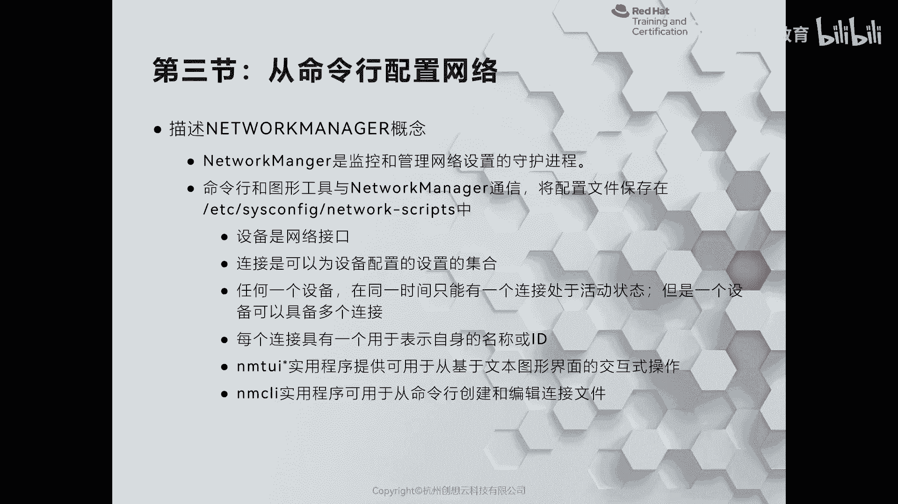

在本节课中，我们将学习如何在红帽企业版Linux（RHEL）系统中使用命令行工具来配置网络。我们将重点了解网络管理服务的演变，以及如何使用 `nmcli` 和 `nmtui` 这两个关键工具来管理网络连接。

## 网络管理服务的演变

上一节我们介绍了网络管理的基础概念，本节中我们来看看红帽Linux系统中网络管理服务的发展历程。

在RHEL 5时代，网络由 `network` 服务负责管理。到了RHEL 6，系统引入了 `NetworkManager` 服务，旨在简化笔记本等移动设备的无线网络配置。然而，初期的 `NetworkManager` 并不稳定，许多管理员在安装系统后会选择禁用它。

进入RHEL 7后，`NetworkManager` 变得成熟稳定。系统同时保留了 `network` 和 `NetworkManager` 服务，两者相辅相成。在课程范围内，我们推荐使用 `NetworkManager`。

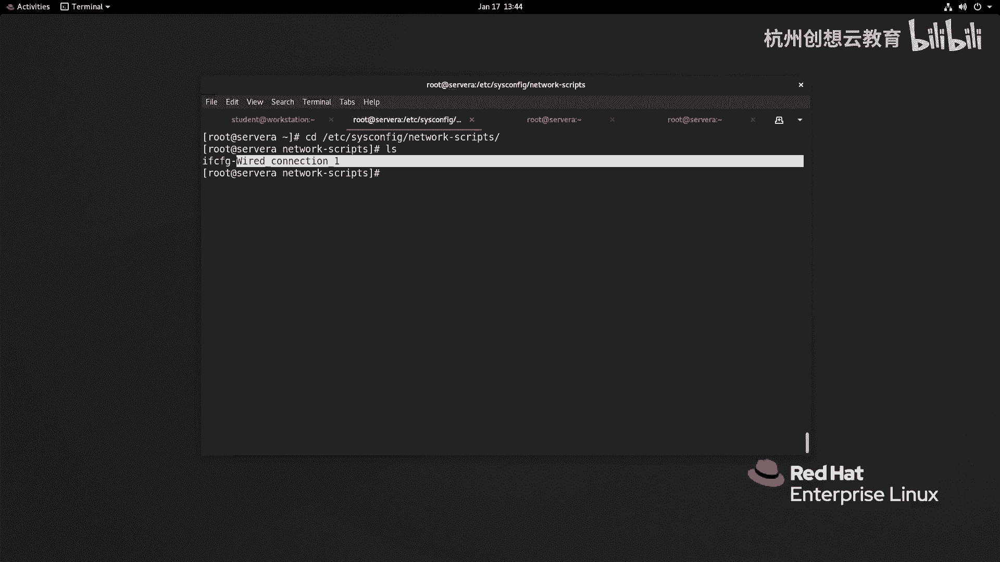

到了RHEL 8及以后版本，`NetworkManager` 成为唯一的网络管理服务，`network` 服务不再被使用。因此，我们现在管理网络主要使用 `NetworkManager`。

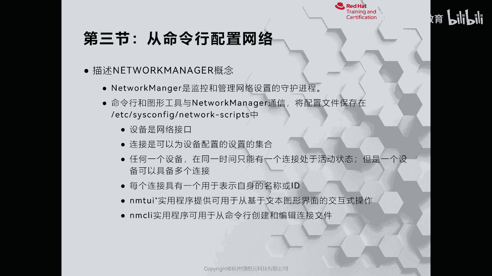

`NetworkManager` 功能强大，不仅可以管理传统的有线以太网卡，还能配置无线连接、网卡绑定、网络合作、桥接等高级功能。

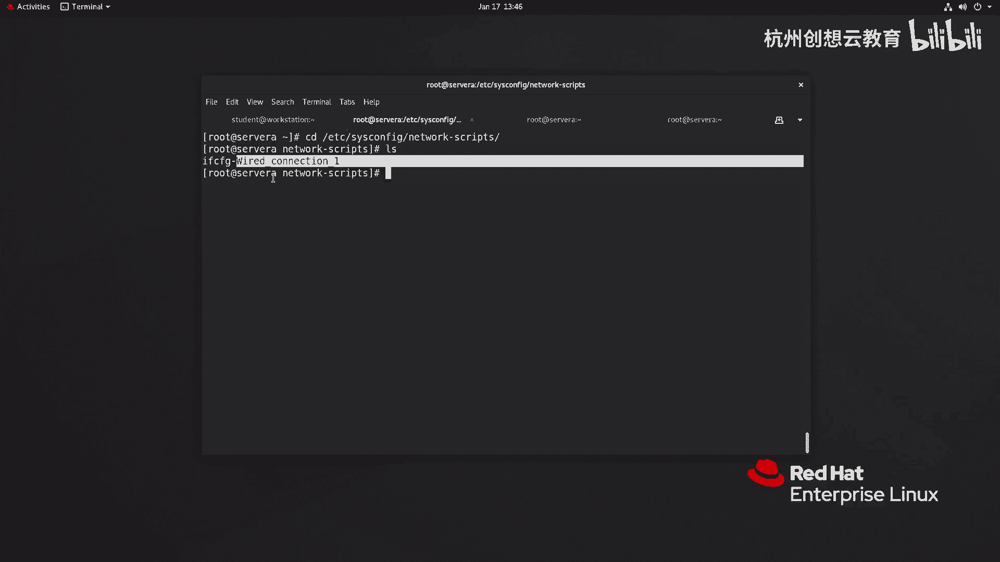

## 配置文件与核心概念

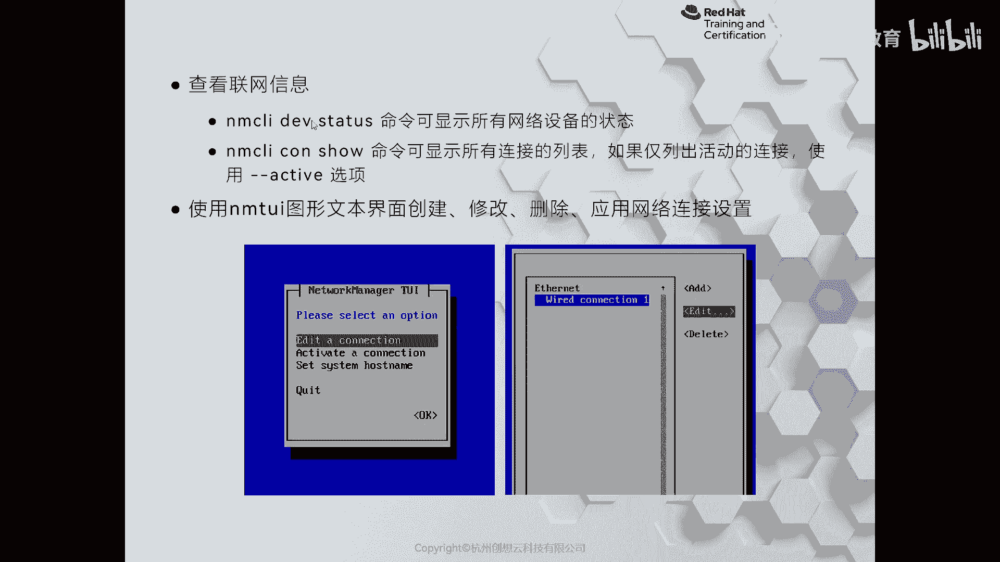

`NetworkManager` 的网卡配置文件仍然保存在 `/etc/sysconfig/network-scripts/` 目录下，文件名以 `ifcfg-` 开头。需要注意的是，在最新的Fedora系统中，这个路径已经改变，未来RHEL版本也可能调整。

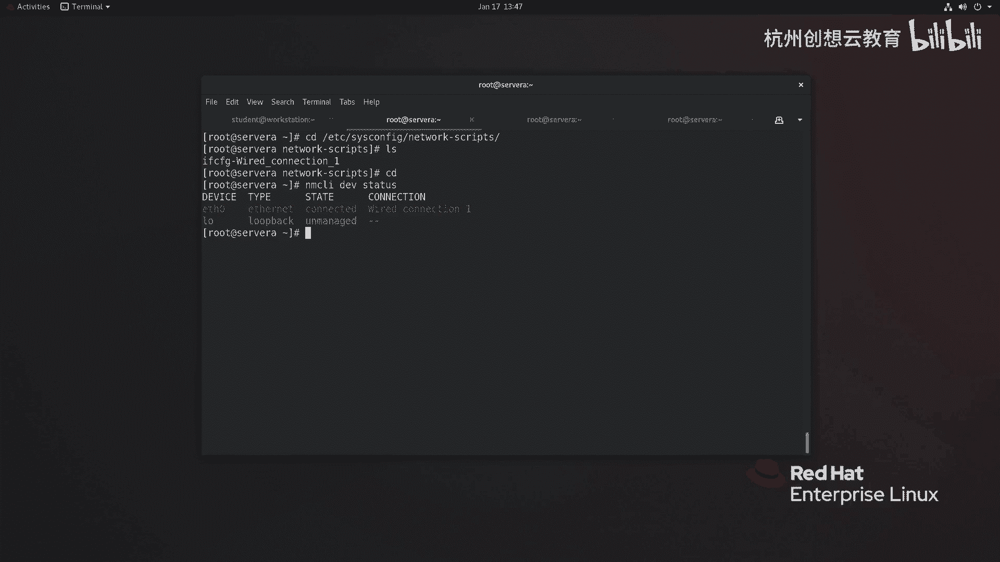

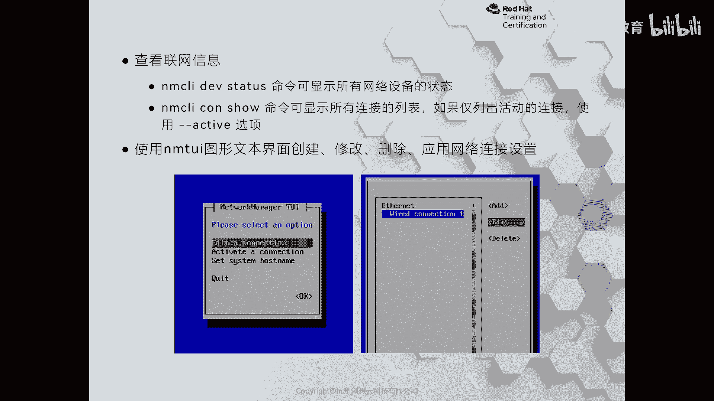

在 `NetworkManager` 中，**设备**和**连接**是两个被细致区分的核心概念：
*   **设备** 指的是物理或虚拟的网络接口硬件，例如 `eth0`。
*   **连接** 是一个逻辑配置档案，是管理员或系统为设备创建的配置方案，拥有唯一的名称或ID。

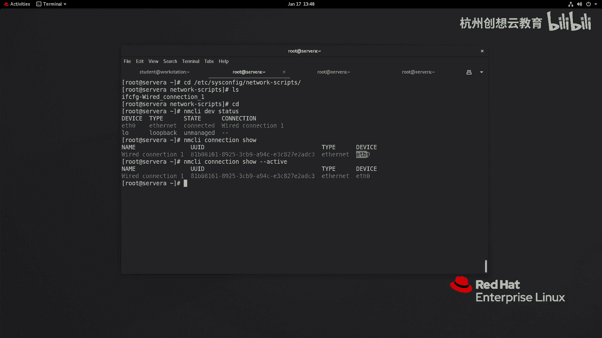

一个重要原则是：**一个网络设备可以创建多个连接配置，但在同一时间只能有一个连接处于激活状态。**


我们可以通过以下命令查看设备状态：
```bash
nmcli device status
```

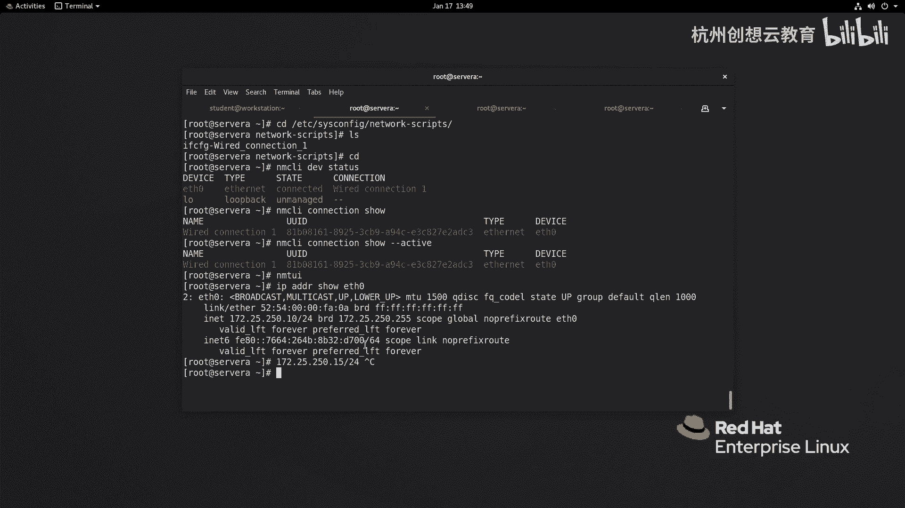

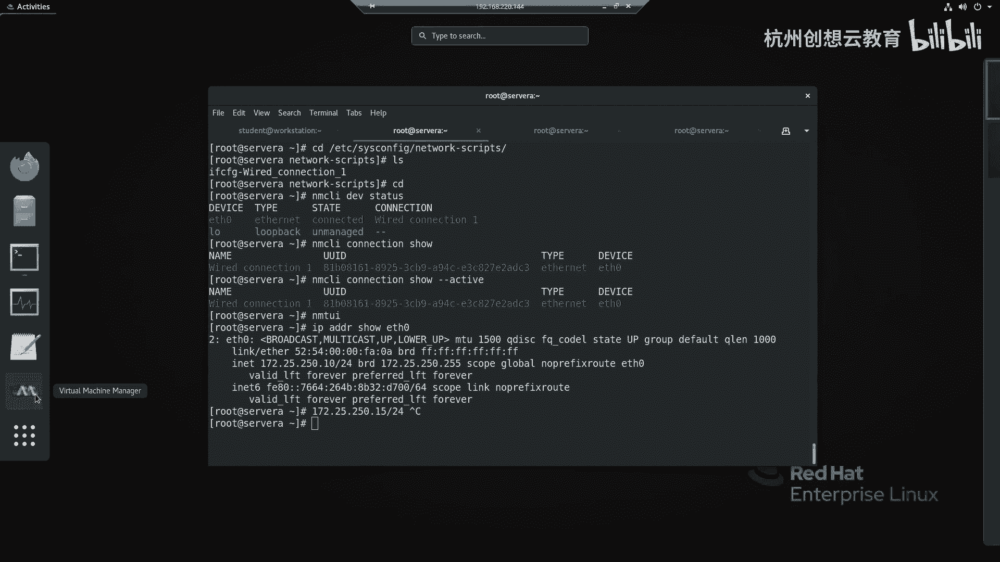

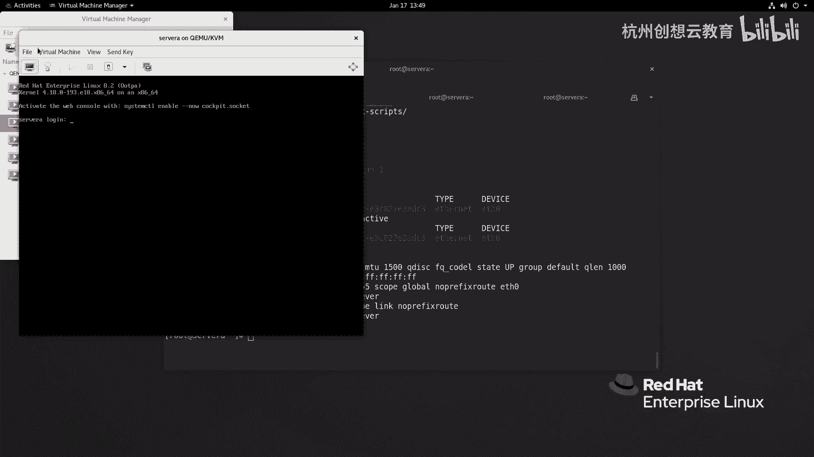

通过以下命令查看连接信息：
```bash
nmcli connection show
```

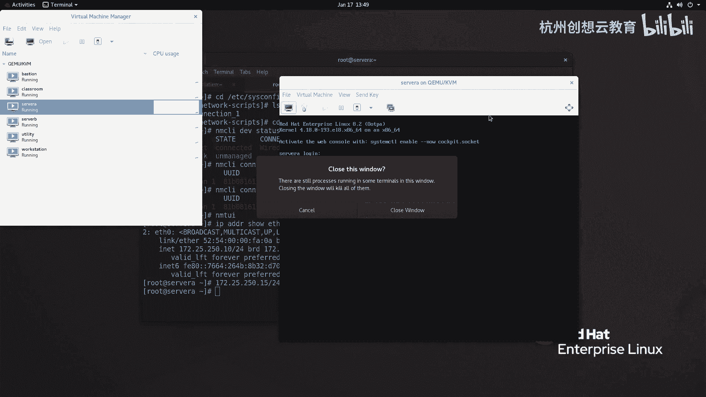

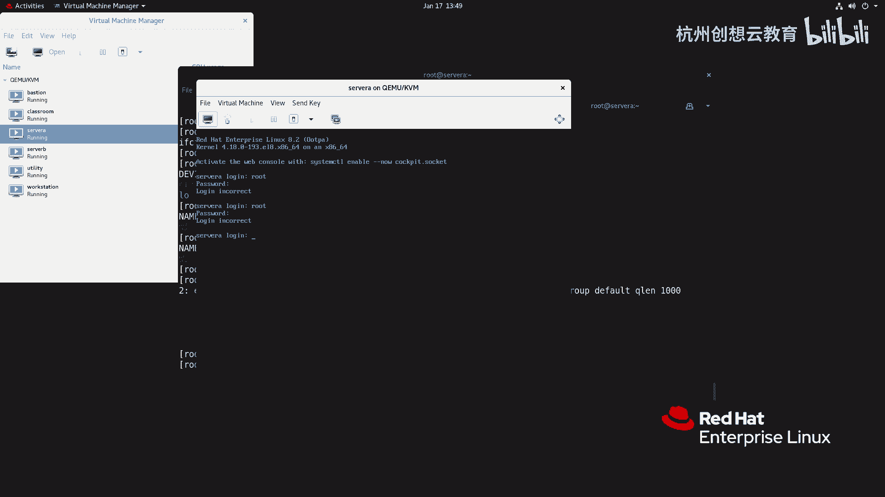

如果只想查看激活的连接，可以加上 `--active` 参数：
```bash
nmcli connection show --active
```

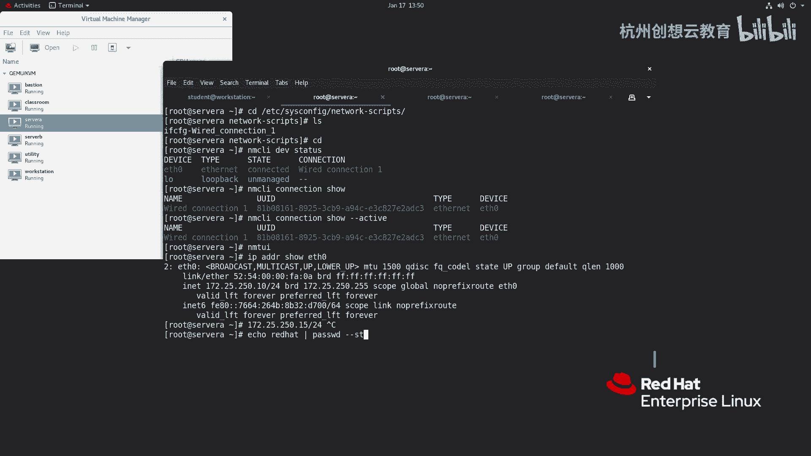

## 使用 `nmtui` 工具配置网络

对于简单的网络配置，例如修改一个有线网卡的IP地址，我们可以使用 `nmtui` 工具。它提供了一个简单的文本用户界面。

以下是使用 `nmtui` 添加一个新网络连接并配置静态IP的步骤概要：

1.  在终端输入 `nmtui` 命令并回车。
2.  在主菜单中选择 **“Edit a connection”**。
3.  选择 **“Add”**，然后选择连接类型为 **“Ethernet”**。
4.  配置连接信息：
    *   **Profile name**: 输入一个唯一的连接名称，例如 `office`。
    *   **Device**: 选择对应的网络设备，例如 `eth0`。
5.  在 **IPv4 CONFIGURATION** 部分，将方法改为 **“Manual”**。
6.  展开配置，填写地址信息，例如：
    *   **Addresses**: `172.25.250.15/24`
    *   **Gateway**: `172.25.250.254`
    *   **DNS servers**: `172.25.254.254`
7.  将 **IPv6 CONFIGURATION** 设置为 **“Ignore”**。
8.  选择 **“OK”** 保存，然后退回主菜单。
9.  要使新配置生效，需要激活这个连接。可以在主菜单选择 **“Activate a connection”**，然后选择新建的 `office` 连接。或者，使用 `nmcli` 命令激活：
    ```bash
    nmcli connection up office
    ```

配置完成后，系统会在 `/etc/sysconfig/network-scripts/` 目录下自动生成对应的配置文件，例如 `ifcfg-office`。

## 使用 `nmcli` 命令配置网络

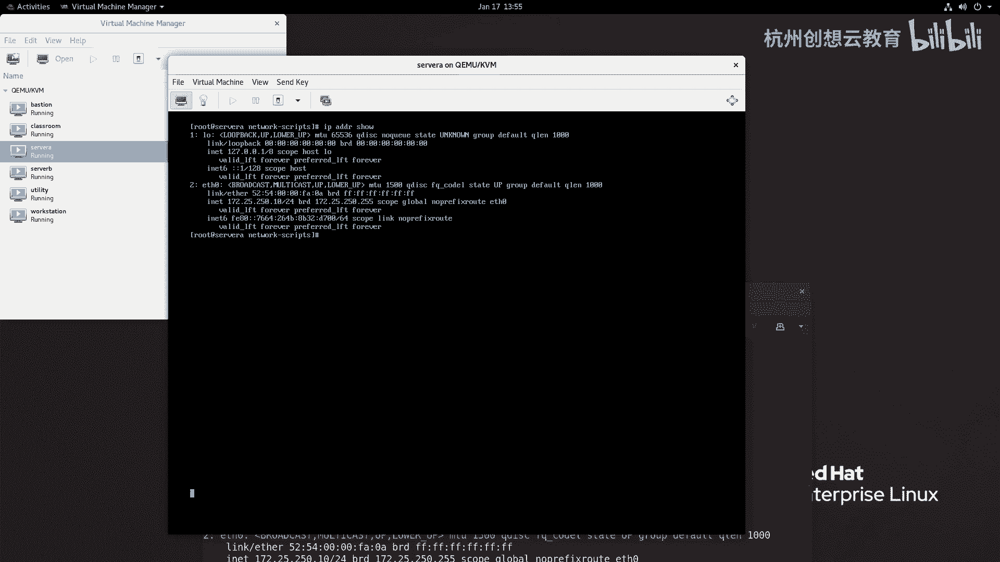

对于更复杂或需要脚本化的网络配置，我们推荐使用 `nmcli` 命令行工具，它功能更加强大和灵活。

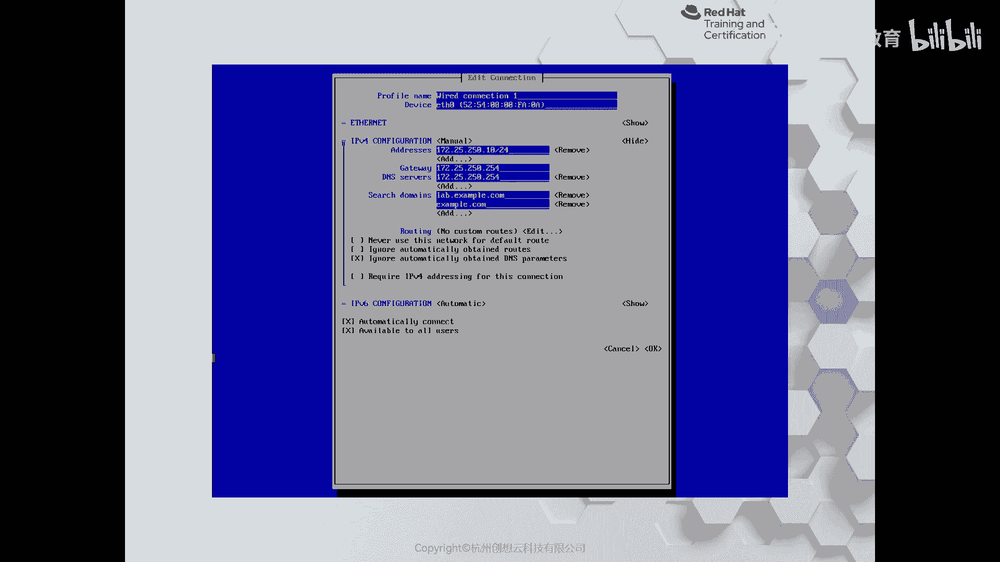

本节课中我们一起学习了红帽Linux网络管理服务的演变历程，理解了“设备”与“连接”的核心概念，并掌握了使用 `nmtui` 文本界面工具进行基础网络配置的方法。记住，对于简单的IP修改，`nmtui` 非常便捷；而对于自动化或复杂配置，`nmcli` 是更强大的选择。