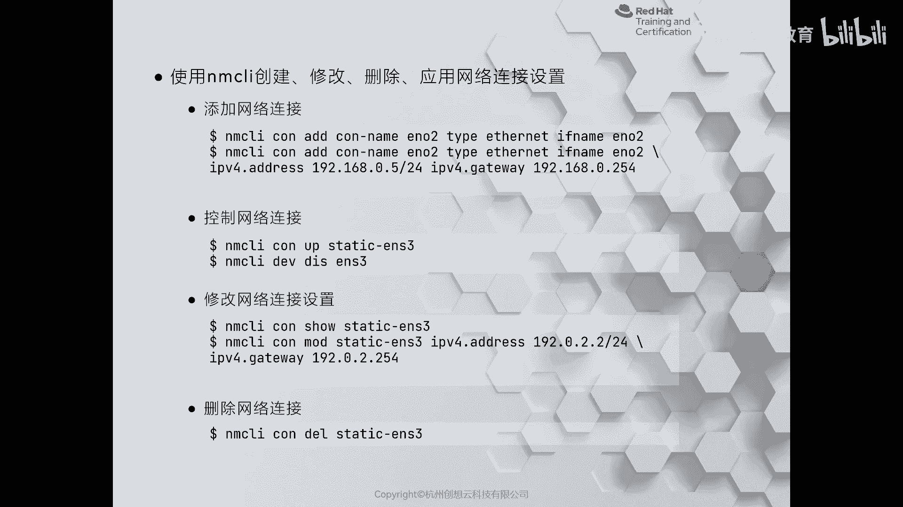
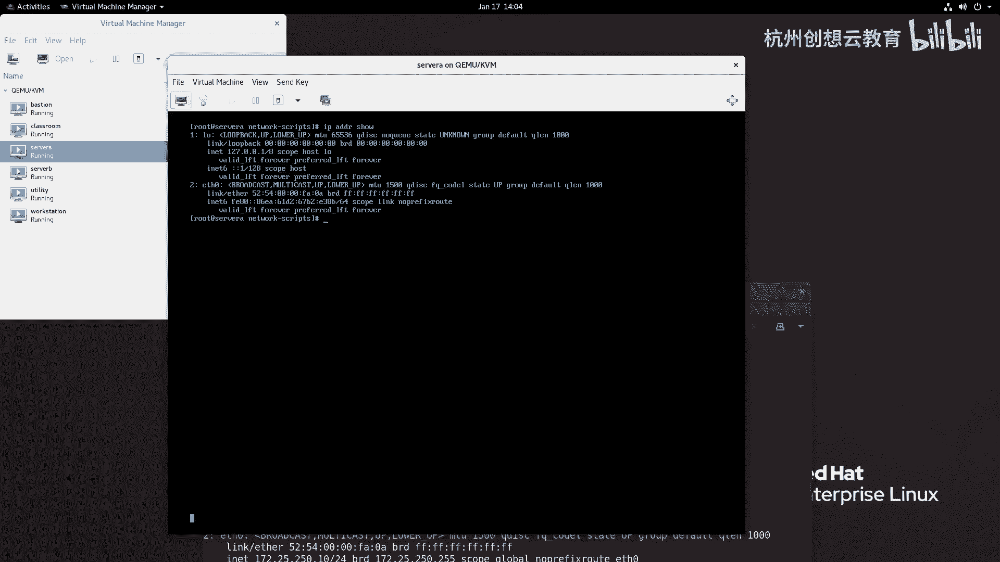
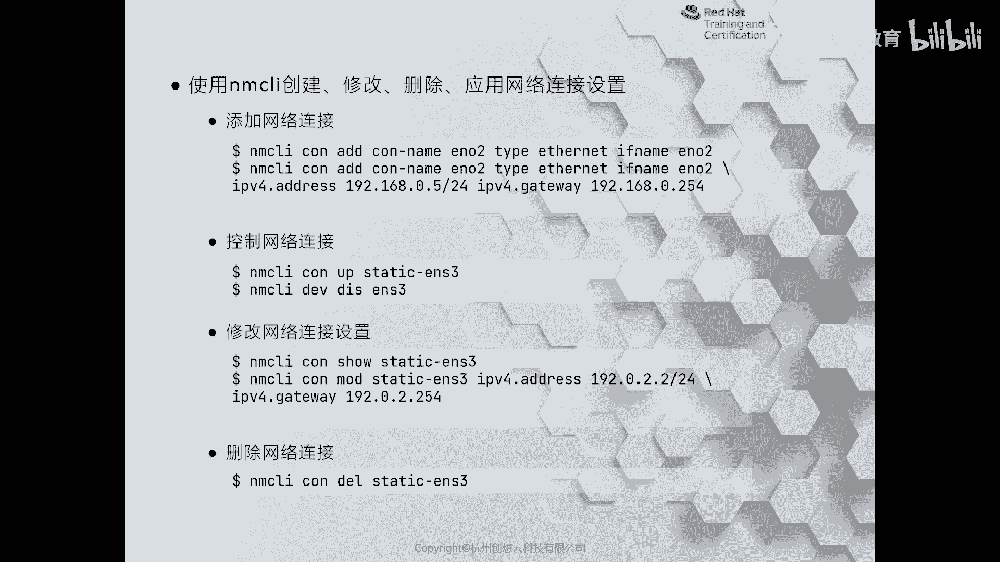
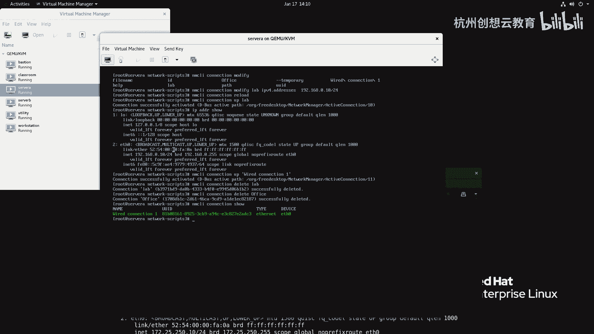
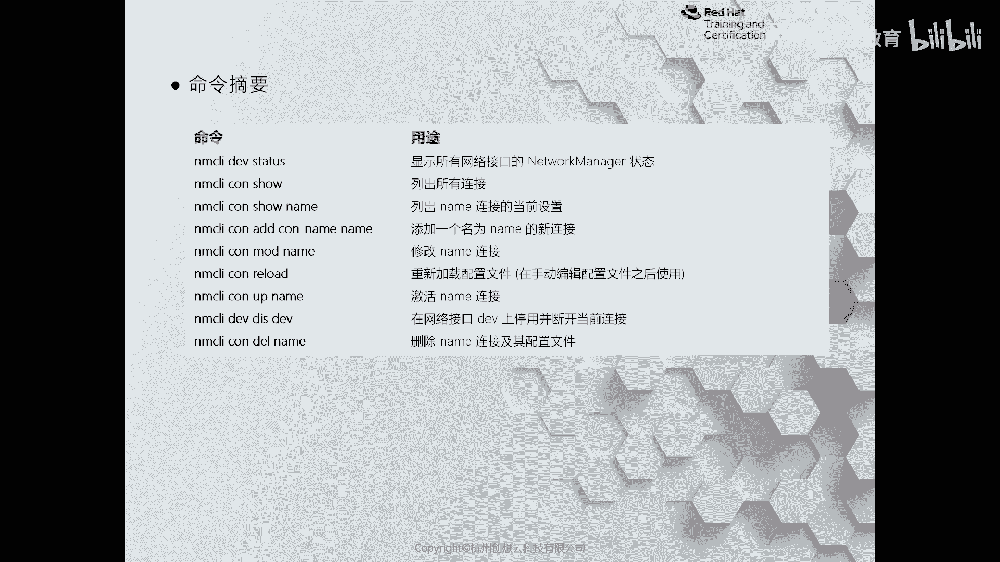

# 红帽认证系列工程师RHCE RH124-Chapter12-管理网络 - P4：12-3-管理网络-从命令行配置网络(02) - 杭州创想云教育 - BV1ZV4y1p7Mr

那么在大部分场景情况下呀，我们其实还是推荐大家呢使用NMCLI来管理我们的网络的。为什么呢？因为在re耀7的时候呢，我们曾经做过一个这样的测试啊，那么通过NMTLI呢去创建一个网卡绑定。啊。

那么装完之后呢，这个网卡呀，那么表面上是生成了，但是呢却呃很鸡肋，无法使用啊呃并且会出现一些很神奇的一些现象。那么而通过NMCLI呢却不会出现这种情况啊，不会出现啊。所以说呢我们刚才在讲那个。

NMTY的时候呢也强调了，那么只建议大家呢通过NMTY呢做一个最基本的网络配置。那么稍微一点点的复杂性啊，都要交给我们的NMCRI来完成啊，那么NMCLI怎么去实现呢？那么对于NMCLY这个命令而言。

它的语法是非常长的。所以所以说呀我们在使用的时候呢，哎虽然可以使用命令的短名称，对吧？但是命令太长了，一定要推荐大家呀安装bach completion这样一个自动补齐的包。否则的话。

这个命令用起来会很痛苦。那么我们现在的sA上呢已经装好了这个自动补全的功能。那么我们现在呢就通过NM啊，这个CI来给大家演示如何呢去增加修改和删除连接。那么首先呢如何增加呢？那么在增加的时候呀。

我们的命令叫做NMCRI啊CN就是connection连接啊，连接I增加一个连接啊，连接的名称，后面根据情况去写一个名字，然后类型啊是isnet。然后呢。if name是我们的设备名啊设备名。好。

我们来进行一个。啊，这个那么同样呢，我这次在执行的时候呀，我就在这个。呃，终端上啊，在这个字符终端上来来演示啊。啊，然后呢我去敲这个命令啊，敲这个命令啊呃通过NMCRI啊connection啊。

去增加一个连接。啊，一个连接这个连接叫什么呢？我们起名叫lab好了啊，叫lab，然后呢类型啊tab那么非常多啊，我们选择isernet啊isernet，然后呢if name type。

那么它就会把我们的物理网卡的名称啊列出来，选择is0。这时候啊这时候我们的目录里啊就会多一个FCFG杠lab的配置文件。但是呢我们来看看里面有什么内容，好吧。那么在这个里面呀，目前呢都是空的啊空的。

它走了1个DIRCP啊，DRRCP就是说你增加一个连接之后，没有做其他多余的啊配置的时候呀，它默认走的是我们的啊DHCP啊DRRCP然后我们可以把它激活起来NMCI注意啊，现在呢我们在这个。

network scripts里面呢增加了一个配置。对于我们的n network manager而言呀，他是不知道的。要想让他知道呢，我们要走一个命令叫做NMCY啊，connectionreload啊。

让他去重新加载一次，加载之后呀，他就知道了。然后我们干嘛呀，看一看啊一个lab我们激活起来NMCIconnection啊，这个up激活我们的lab。我们来试一下啊，呃有可能不会成功。为什么呢？

因为我们的DICP服务器啊可能呃没有啊，就不会给他分配一个地址。如果没有分配地址，他就拿不到IP拿不到IP呢就可能会报错啊，我们稍等片刻。哎，这么长时间还没有反应过来呀，极有可能就是没有IP了啊。啊。

有可能啊我们终止掉好了。然后呢，我们在NM啊，我直接用IPADDR秀去看一下好了。你看地址掉了，它没有拿到，因为没有DICP服务器给它分发地址，对吧？好，那么接着呢我干嘛呢？

现在我属于是没有地址的状态呀。我要把刚才的这个lab给它分配一个静态的IP地址。

啊，静态IP地址。那么怎么分发一个静态IP地址呢？叫做NMCIconnectionIcon name跟上连接名类型啊，这个isithernetif name接口啊，这是不一样的。

那么不一样的地方在于我们可以使用IPAADDR addressdress来指定地址啊网关啊，还有DS等等啊，语法呢就是IP with点啊address点DS点get away啊好，我们来试一下。

现在呢我给它做个修改NMCUI啊，哎，我先把刚才那个它删掉好了啊，delete啊，叫做什么呀lab。好，然后呢我再重新生成啊NMCLI啊connection I的一个啊这个连接名。啊，连接名叫什么呢？

叫做还叫lab啊，此lab非彼lab对吧？啊，然后呢，if name呢这个等于一个谁呀？我们的iser0类型叫做iser net。然后呢，IPV4点啊address啊，172。25。250。

10斜杠24网关IPV4。点儿get位啊，172。25。250。254DSIPV4点啊，我比PT上写的还要多啊，那么地址是172，写两个吧，用一号引起来好吧，172。25。254。254。啊。

然后呢我再写一个啊，写个8。8。8。8。啊，好，引号引起来。那么并且呢我顺便声明一下，我这个连接呀是静态的，那是IPV4点儿。啊，men啊方式为手动啊manure。哎，我又增加了一个新的连接。然后呢。

我们再去打开看一看我们的这个内容。是不是和刚才不一样，对吧？首先呢就是呃boot pro呢是net，然后呢我们的地址啊，网络前缀啊网关啊，2个DS啊，这是我们改的，并且呢设备呢是艾0连接名呢叫lab啊。

默认的话呢是允许开机激活的，然后呀我重新再干嘛呀？connectionreload一下，然后去激活我们的新的这个连接。啊，然后观察一下地址。是不是就变成了原来的地址了？哎。

这就是一个添加一个静态的地址的一个方法。当然了，我们也可以啊这个通过NMCLIDEV啊disconect啊，那么去断开一个连接啊，那演示也是没问题的。因为我们在本地嘛，所以说命令很多网络的都可以去执行。

那么选择是设备啊，设备选择设备里面的连断开，跟上我们的连网卡名。哎，这时候呀我们再来看一看。啊，没有地址了，对不对？没有地址了啊，没有地址了啊，那么现在呀我给它重新的给它连上去。

那么就把刚才的diss换成connection啊，conneect就可以了。这时我们再来检查一下。哎，就又激活了哎，激活了OK那现在呢假如说呀我对我的网络呢网络信息呀不满意。啊，不满意。

我想呢把它改改地址，那我可以使用modify啊，modify来修改啊，modify那我就把刚才的lab呀给它改成172。2就改成这个吧。1921680。10好了，好吧，0。10其它不变啊，我们改一个。

NMCI啊connectionmod啊，修改修改谁呀，修改一个连接名啊。啊，我们来看我一下，你看这里面非常多啊，连接名叫做off叫lab。啊，lab然后呢lab这个修改时间，我要修改它地址。

那就是IPV4点address。是192。168。0。10。啊，我只改他的IP地址，其他呢我不改。啊。改完之后，同样别忘记要reload一下，再去激活。然后呢，我们再来看一看我们的地址信息。

就变成了192168了。啊，这是一个啊一个修改网络信息的方法，不仅仅可以改地址，还可以改连接名，还可以改这连接的设备啊，都是可以实现去更改的。那么最后一个命令的话呢是什么呢？是删除啊某个连接。好。

那现在呢我把呀我们默认的连接呢给它激活。啊，激活我们默认的那个好吧，要啊where的connection一这种空格的一定要加引号啊，然后呢再把刚才的lab呀给删掉。啊，再把刚才的这个office也删掉。

这样啊我们的网络呀就恢复了最原始的状态。啊，就恢复原始状态了。OK好，那我们做一个总结。

啊，那么这些命令啊都是我们平常用的频率比较高的啊，用来管理啊nettwork manager的指令。这个指令啊都是缩写啊NMCRIDV啊satters来查看我们网络接口的状态信息。啊。

NMCLI啊connection秀来查看我们所有的连接信息。如果想具体的看某一个网卡的详细信息啊，那么把ho后面啊跟上我们的连接名就可以了啊，增加连接。

用ide啊NMCI connectionctionide连接名啊，然后修改啊modify重新加载配文件，使用reload。啊，激活用up断开设备啊，第disconnection。啊，删除有de样。

