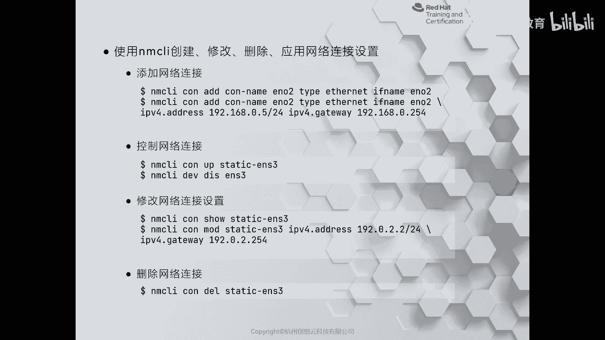
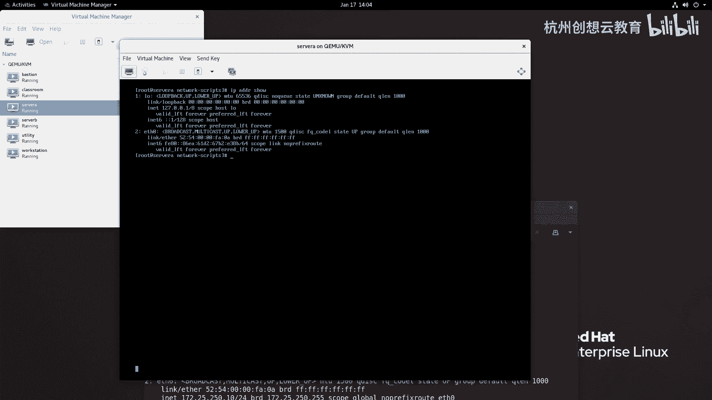
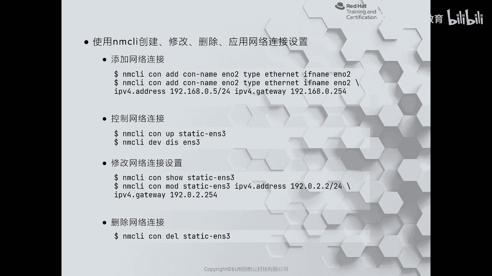
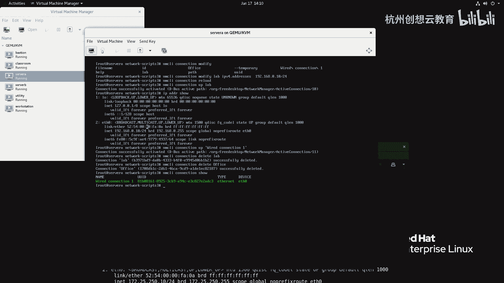

# 红帽认证系列工程师RHCE RH124-Chapter12：管理网络 - P4：12-3-从命令行配置网络(02)



在本节课中，我们将要学习如何使用 `nmcli` 命令行工具来管理网络连接。`nmcli` 是 NetworkManager 的命令行接口，功能强大且稳定，是配置复杂网络场景的推荐工具。

上一节我们介绍了使用图形化工具 `nmtui` 进行基本网络配置。本节中我们来看看如何使用更强大、更可靠的 `nmcli` 命令来增加、修改和删除网络连接。

## 为什么推荐使用 `nmcli`？

在 RHEL 7 的测试中，使用 `nmtui` 创建网卡绑定等复杂配置时，可能会出现配置生成但无法使用的“鸡肋”情况。而 `nmcli` 则能稳定地处理这些复杂任务。因此，对于任何超出最基本配置的网络管理，都建议使用 `nmcli`。

## 使用 `nmcli` 前的准备

`nmcli` 命令的语法较长。虽然可以使用命令的短名称，但强烈建议安装 `bash-completion` 包以实现命令自动补全，否则使用起来会非常不便。本教程演示环境已安装此功能。

## 管理网络连接

以下是使用 `nmcli` 管理网络连接的核心操作。

### 查看网络状态与连接信息

首先，我们可以查看网络接口的状态和现有的连接配置。

*   **查看网络接口状态**：`nmcli device status`
*   **查看所有连接信息**：`nmcli connection show`
*   **查看特定连接的详细信息**：`nmcli connection show [连接名]`

### 增加一个网络连接

接下来，我们学习如何增加一个新的网络连接。命令的基本格式如下：



`nmcli connection add con-name [连接名] type ethernet ifname [设备名]`

例如，创建一个名为 `lab`、基于 `ens0` 网卡的连接：
```bash
nmcli connection add con-name lab type ethernet ifname ens0
```
执行此命令后，系统会在 `/etc/sysconfig/network-scripts/` 目录下生成一个名为 `ifcfg-lab` 的配置文件。此时，该连接默认使用 DHCP 获取 IP 地址。



**注意**：新增配置文件后，NetworkManager 服务并不会自动加载它。需要执行以下命令重新加载配置：
```bash
nmcli connection reload
```
然后，可以激活这个新连接：
```bash
nmcli connection up lab
```
如果网络中没有 DHCP 服务器，此连接将无法获取 IP 地址。

### 增加一个静态IP地址的连接

更常见的场景是配置一个使用静态 IP 地址的连接。我们可以在创建连接时直接指定 IP、网关和 DNS。

以下是创建静态 IP 连接的示例命令：
```bash
nmcli connection add con-name lab type ethernet ifname ens0 ipv4.addresses 172.25.250.10/24 ipv4.gateway 172.25.250.254 ipv4.dns “172.25.254.254 8.8.8.8” ipv4.method manual
```
*   `ipv4.addresses`: 指定 IP 地址和子网前缀。
*   `ipv4.gateway`: 指定默认网关。
*   `ipv4.dns`: 指定 DNS 服务器，多个地址用空格分隔，建议用引号包裹。
*   `ipv4.method manual`: 将 IP 获取方式设置为“手动”（静态）。

创建后，同样需要重新加载配置并激活连接：
```bash
nmcli connection reload
nmcli connection up lab
```

### 断开与重新连接设备

我们可以临时断开或重新连接某个网络设备。

*   **断开设备**：`nmcli device disconnect [设备名]`
*   **重新连接设备**：`nmcli device connect [设备名]`

### 修改现有连接配置

如果需要对已有连接的配置进行修改，可以使用 `modify` 命令。

例如，将名为 `lab` 的连接的 IP 地址修改为 `192.168.0.10`：
```bash
nmcli connection modify lab ipv4.addresses 192.168.0.10/24
```
修改后，必须重新加载配置并（重新）激活连接以使更改生效：
```bash
nmcli connection reload
nmcli connection up lab
```
使用 `modify` 命令不仅可以修改 IP 地址，还可以修改连接名、绑定的设备等所有属性。

### 删除一个网络连接

最后，当我们不再需要某个连接时，可以将其删除。



删除名为 `lab` 的连接：
```bash
nmcli connection delete lab
```
删除后，对应的配置文件也会被移除。

## 课程总结

本节课中我们一起学习了使用 `nmcli` 命令行工具管理网络连接的全过程。我们介绍了查看网络状态、增加连接（包括DHCP和静态IP）、修改连接配置、断开/连接设备以及删除连接等核心操作。`nmcli` 是功能全面且稳定的网络管理工具，掌握它对于在 Linux 系统上进行高效网络配置至关重要。


以下是本课涉及的核心命令总结：
*   `nmcli device status`：查看网络接口状态。
*   `nmcli connection show`：查看所有连接。
*   `nmcli connection add`：增加一个新连接。
*   `nmcli connection modify`：修改现有连接配置。
*   `nmcli connection reload`：重新加载连接配置文件。
*   `nmcli connection up/down`：激活/停用一个连接。
*   `nmcli device disconnect/connect`：断开/重新连接设备。
*   `nmcli connection delete`：删除一个连接。