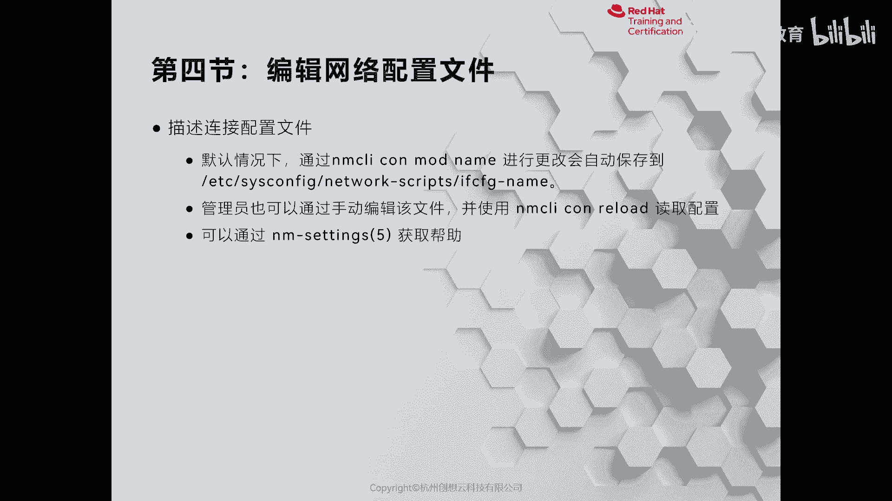
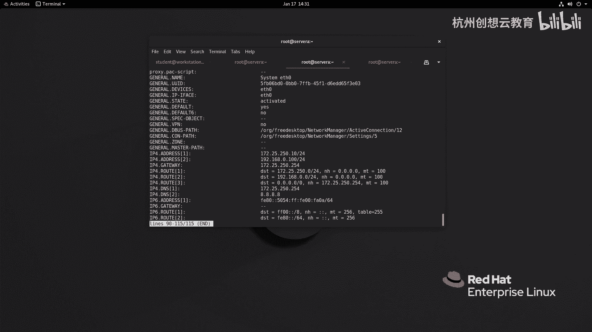
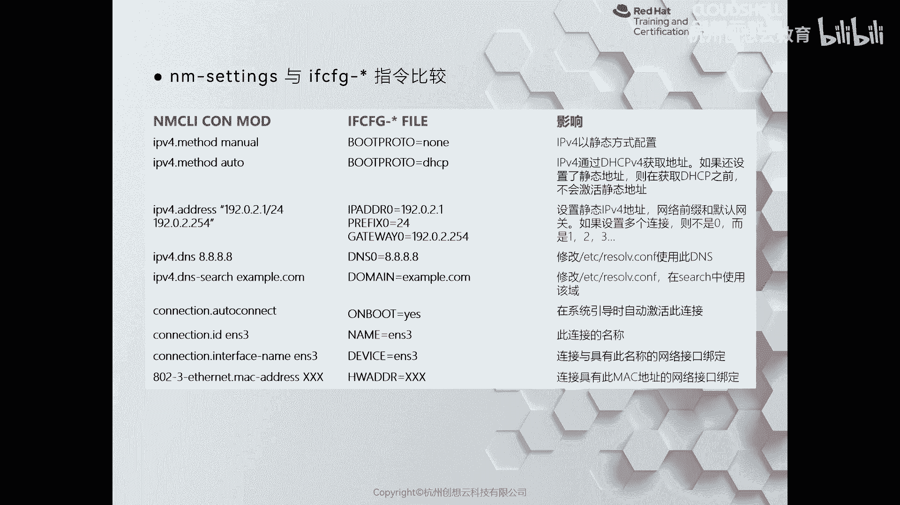

# 红帽认证系列工程师RHCE RH124-Chapter12-管理网络 - P5：12-4-管理网络-编辑网络配置文件 - 杭州创想云教育 - BV1ZV4y1p7Mr

嗯除了刚才通过nm ti，还有这个嗯nm c o i啊来管理网络配置文件的方式之外呢，我们也可以使用传统的方法进行管理，那就是利用边界啊，然后呢在哎e t c啊。

six config network rap里面呢去手动创建网络的配置文件，然后呢通过nm c l i c o n reload呢去读取也是可以的，好。

那么我们现在呢去啊去写一个啊这样的一个啊配置文件啊，那么我们去还用以sa为例好了，啊来到network scripts里面，那么我们去写一个好吧，写一个啊这个vm啊，其实我们也可以干嘛呀。

也可以借助现有的文件呢去改一个也是没问题的，啊叫谁呀，叫anther 0啊，然后呢我们去编辑这个文件，那么首先呢这个tap tab的话呢代表的是我们的网卡类型啊，那么是否有代理对吧，我们关闭掉。

那么浏览啊，no啊，这些都是我们这个在以前的时候呀没有用到的，那么board proto呢代表的是获取ip地址的方式啊，那么nt代表的是啊手动获取啊，回到静态对吧，也可以把这个nt换成static啊。

ok是否使用末路由啊，ip v4 的其他信息，这些我们都删掉，那么name呢是我们的连接名，好我们的改一改啊，改成一个叫做system either in好了，啊s0 u i d呢可要可不要了。

就是我们通过手动的这种方式啊，可要可不要，那么device呢是我们的网卡的设备名，那么on boat呢则代表的是我们这个开机呢是否启动啊，啊然后这个是否什么呀，分d4 呀，这些我们都不要哎。

i p a d d r则代表的是我们的地址啊，prefix呢是我们嗯默认地址的网络前缀啊，和默认地址的网关啊，下面是玉啊什么什么的，那假如说我现在呢想增加一点知识，增加一点内容。

比如说我把这个i p d d r e0 加一个东西，加个零，那么和他配套的呀都要加一个零，那就代表了第一个ip地址，那我可可可以干嘛呀，增加第二个地址叫什么呀，这个i p a d d r一等一个192。

168点点100啊，然后选这啊，网络前缀啊是一啊，等于一个24，那么这个不配网关了啊，就是一个网关，那么dx呢我们再配个dns好吧，d s2 等于个8。8。8。8，这是我们通过手动的方式来改的一个文件。

然后呢要想让它生效呀，唉我们就需要保存并退出，通过nm c l i去reload一下我们的这个配置啊，手动的一定要reload一下，这时候呢我们的网络管理服务啊就能够识别到刚才的啊这个配置。

你看他也给我们生成了一个叫ui d是不是啊，然后呢我们可以激活，那么激活的时候呢，你可以选择激活连接名，也可以选择激活uu i d都是可以的啊，我现在激活一个啊，这个我们的cm 1 cm回车。

那么激活之后之所以没有中断呀，就是因为我们在配地址的时候呢，保留了原来的那个地址好，我们来看一下我们的a。零啊，你看留两个地址对吧，两个地址，然后呢我还可以详细的信息啊，去看啊。

去试一下我们的这样cn 20，那这个量就非常丰富了，你看它的连接名u i d啊，类型啊，接口的名称是否是自动连接啊，优先级啊，这个时间戳对吧，哎等等等等啊，你看网络信息都是有的啊，都是有的啊。

这是我们的一个呃通过啊命令通过编辑器的方式啊来改的啊，如果你觉得早期的那个n m t y或者是n m c n都不太适用啊，你习惯没有养成，那么还可以使用传统的方式来进行修改。

那么我们可以把我们的配置文件呀拿出来做一个对比。

看一看自动生成的和什么呀，和这个手动编写的到底有哪些不一样啊，当我们通过命令行的时候呢，比如说写一个谁呀，i p v4 啊，masamanual，那么就代表的是boat proto呢。

是n静态获取方式来获取我们的地址，然后呢这个i p v4 mel auto呢就相当于走了谁呀，走了一个啊，d r c p啊，那么在命令行里面走了一个ip address什么什么什么的。

那就相当于增加一个这样的信息啊，增加一个ip地址往前缀和对应的网关啊，d4 啊，这个是搜索域啊，这个是否自动连接啊，以及我们的连接名称啊，接口名称，甚至还可以绑定mac地址啊，mac mac地址啊。

这种方式啊。

