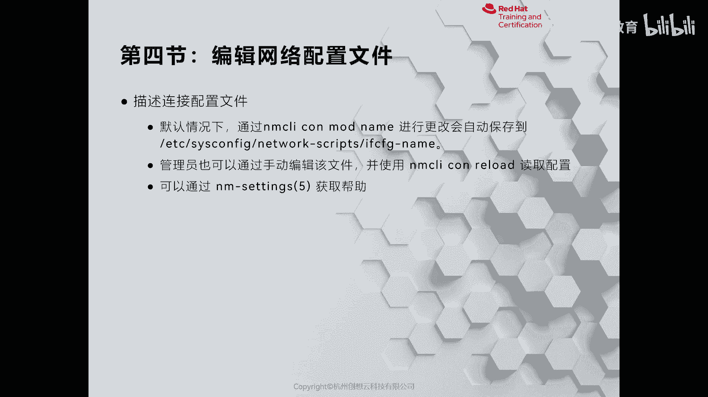
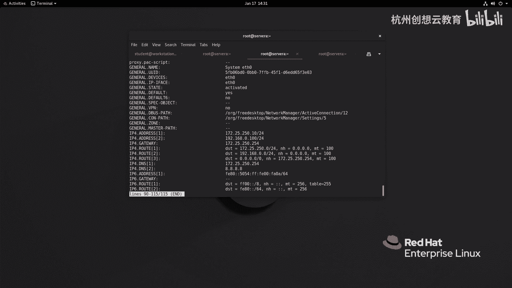
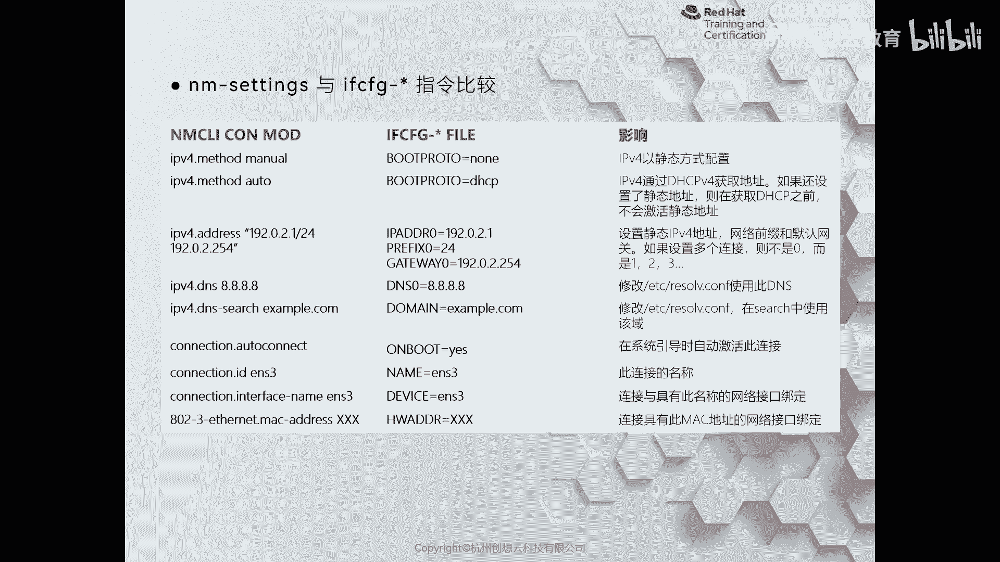

# 红帽认证系列工程师RHCE RH124-Chapter12：管理网络 - P5：12-4-管理网络-编辑网络配置文件



## 📖 概述
在本节课程中，我们将学习如何通过手动编辑网络配置文件来管理网络连接。这是一种传统但非常有效的方法，尤其适合习惯直接操作配置文件的管理员。

除了之前介绍的 `nmcli` 和 `nmtui` 工具，我们也可以使用传统方法管理网络。这种方法的核心是手动在 `/etc/sysconfig/network-scripts/` 目录下创建或编辑网络配置文件，然后通过 `nmcli con reload` 命令让网络管理器读取新配置。

## ✍️ 手动编辑配置文件
上一节我们介绍了使用图形化与命令行工具管理网络。本节中，我们来看看如何直接编辑配置文件。

我们以 `ifcfg-ens33` 文件为例，创建一个新的配置文件。可以复制现有文件进行修改，也可以从头创建。这里我们创建一个名为 `ifcfg-ens33` 的文件进行编辑。

以下是配置文件中关键参数的含义：
*   **`TYPE`**：代表网卡类型，例如以太网。
*   **`BOOTPROTO`**：代表获取IP地址的方式。`none` 或 `static` 表示静态获取，`dhcp` 表示动态获取。
*   **`NAME`**：连接的名称。
*   **`DEVICE`**：网卡的设备名。
*   **`ONBOOT`**：系统启动时是否激活此连接。
*   **`IPADDR`**：静态IP地址。
*   **`PREFIX`**：子网前缀长度（等同于子网掩码）。
*   **`GATEWAY`**：默认网关地址。
*   **`DNS1`**：DNS服务器地址。

## 🔧 配置文件示例与扩展
以下是一个基础配置文件的示例，我们在此基础上进行扩展。

```bash
TYPE=Ethernet
BOOTPROTO=none
NAME=system-eth0
DEVICE=ens33
ONBOOT=yes
IPADDR0=192.168.1.100
PREFIX0=24
GATEWAY0=192.168.1.1
```

如果想为同一块网卡配置多个IP地址，可以按以下格式添加：

```bash
IPADDR0=192.168.1.100
PREFIX0=24
GATEWAY0=192.168.1.1
IPADDR1=192.168.1.200
PREFIX1=24
```

同时，我们还可以配置DNS服务器：

```bash
DNS1=8.8.8.8
```

## 🚀 激活新配置
配置文件编辑完成后，需要执行特定命令使其生效。

保存并退出编辑器后，必须让网络管理器重新加载所有配置文件。使用以下命令：

```bash
nmcli con reload
```

随后，可以激活新创建的网络连接。可以通过连接名或UUID来激活：

```bash
nmcli con up “system-eth0”
```



激活后，可以使用 `ip addr show ens33` 命令查看网卡是否成功获取了配置的多个IP地址。使用 `nmcli con show “system-eth0”` 可以查看该连接的详细信息，包括UUID、类型、设备名、IP地址、网关、DNS等所有配置。

## 🔍 配置方式对比
最后，我们来对比一下不同配置方式生成的配置文件差异，这有助于理解其背后的原理。

通过命令行工具（如 `nmcli`）配置时，命令会被转换为配置文件中的参数。例如：
*   命令 `ipv4.method manual` 对应 `BOOTPROTO=none`。
*   命令 `ipv4.method auto` 对应 `BOOTPROTO=dhcp`。
*   命令 `ipv4.addresses 192.168.1.100/24` 会在配置文件中生成 `IPADDR0` 和 `PREFIX0` 行。

无论是通过图形工具、命令行还是手动编辑，最终都会生成或修改 `/etc/sysconfig/network-scripts/` 目录下的配置文件。选择哪种方式取决于个人习惯和具体场景。



## 📝 总结
本节课中我们一起学习了管理网络配置文件的第三种方法：手动编辑。我们了解了网络配置文件的核心参数，学习了如何配置静态IP、多个IP地址以及DNS，并掌握了通过 `nmcli con reload` 和 `nmcli con up` 使配置生效的流程。同时，我们将手动配置与工具生成的配置进行了对比，理解了不同管理方式的内在联系。掌握这种方法能让你更深入地理解Linux网络配置机制。