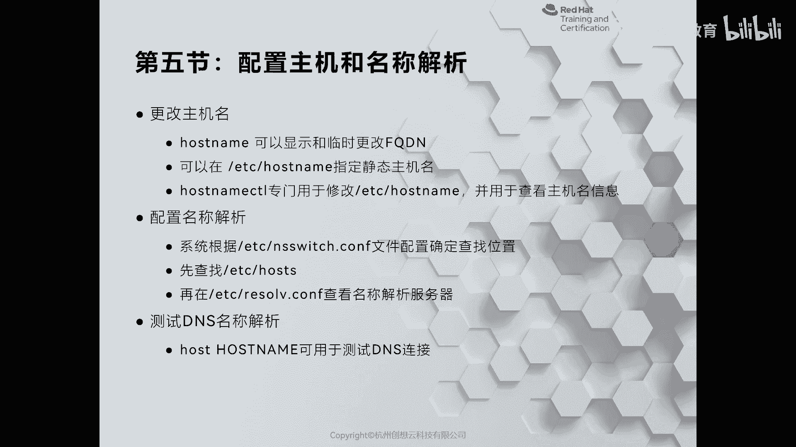
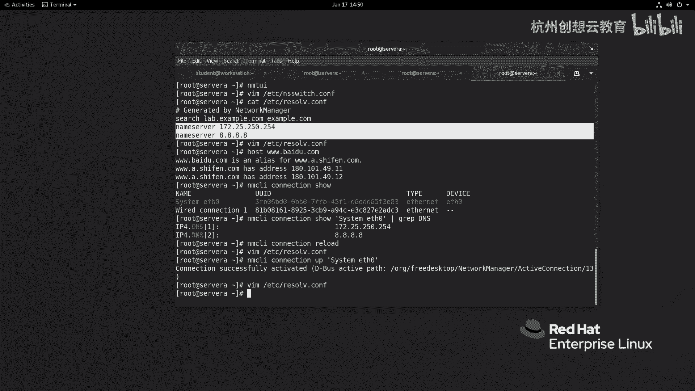

# 红帽认证系列工程师RHCE RH124-Chapter12-管理网络 - P6：12-5-管理网络-配置主机和名称解析 - 杭州创想云教育 - BV1ZV4y1p7Mr

好，第五节啊配置主机和名称解析。呃，那么在我们平常用linux的时候呀，经常会使用啊house name来查看我们的主机名，或者是用它的临时的来更改主机名的信息。那么同样在我们的re8上呢也是可以的啊。

可以的。那么我们一般呀在从real7之后呀，只是用house name来查看我们的主机名信息，其他是不查看的。那么除此之外呢，还可以跟上其他选项，比如说大写字母I哎来查看我们的地址，对吧？地址。

Okay。那么那么我们的re8上面啊，永久性的主机名在哪里呢？存放的位置呢？在ETC有一个ho name这样的文件，在这个文件名当中啊这个文件名，这个主机名啊是永久性的。

所以说呢你依旧可以按照传统的方法，就是通过house name来改一个临时生效的。然后呢再把主机名啊放在ETChouse name里面。但是我们从real7开始呢，有一个更好用的工具。

可以帮助我们呀修改主机名和查看主机里面信息，叫谁呢？叫做house name CTTL。好，我们来感受一下这个命令啊。那么我现在呢想去看一看我的主机的信息，那就ho name啊，CTL status。

那么我们的主机名啊静态的主机名就是永久性的啊，叫so a点lab点examp点com啊。然后呢这个啊下面呢还包含的有其他的啊信息。比如说我们的 machine ID对吧？啊。

这个bo ID以及还能看到我们的是用的是KVM的虚化平台，系统的版本呢是reo8。2等等。那如果呢我要想改主机名，怎么改呢？就是host name。啊，CTL。啊，set house name。

然后呢在这个命令里面呀有三个选项，其中啊默认的选项呢是tistic啊，就是可以不写的一个。那么代表的是修改一个永久性的主机名，还可以针对于什么呀？一个瞬时的临时的主机名啊，只对本次有效。

相当于所谓house name，还有一个呢叫pretty。pretty的话呢主要面向的是这种个人PC啊，因为个人PC的主机名啊，它不是完全限定域名，因此没有包含什么域啊，那么可以用pretty啊。

那么我们可以走ttic啊，比如说我想要改成叫做sstem点lab点儿ex点com。那么我们来看一下。是不是就变化了，对不对？啊，那么为了后面能够解析呀，我把主机名再改回来，但是在改的时候呢。

我就不加这个sistic了，因为它是默认的啊，默认的好是s a啊，这是改主机名啊。好，那么改完之后呢，那么这是一种方法，还有一种方法就是通过NMTOI来管理。

那么NMTI里面呀有一个叫做set system name这样的一个功能。那么这个功能同样是用来修改永久性主机名的，我们可以点开啊，根据需要把它主机名呢改成我们要设置的。改完之后呢。

你只需要选择okK即可啊，两种方法都是可以的啊，看我们个人的啊喜好啊就行。啊，那么接着呢我们再来说啊如何呢？我们的系统啊是如何的做一个名称解析的。那么刚才我们提到了我们的在解析的时候呢。

一个呢是ETC的house包含的是本地主机的解析内容。那么还有一个呢是ETC的resol点来负责解析的。那么这两个到底是先从哪个优先级高呢，对吧？那么我们大部分人应该都能猜得到啊，首先是本地的。

接着才是啊这个resol里面的，为什么会这样啊，是因为我们系统当中啊有一个文件叫做NS啊sitch啊，那么这样一个文件里面定义了啊，我们在查找一些记录的时候呀，首先从哪里查找的。好。

我们来看一下这个文件里面的内容。啊，VMETC下的NS switch。那么在这个里面啊定义了啊非常多的内容。我们来看一下，你看password啊用户的什么呀？这个账户信息啊。首先呢从SS里面去找注意啊。

这个SS呢代表的是SSSD啊，是系统安全守护进程的一个服务啊。一般在做这个网络啊，用户认证的时候呢，会用到它。那么如果没有ok去找fis，而fis指的就是ETC的pass w地址文件，最后呢再去找D啊。

这个是re8里面新增加的一个啊，以前是没有的组呢也是一样的，还有网络组啊，自动挂载哎服务啊服务。那么接着呢再往下。啊，再往下，你看这里啊我们可以干嘛呢？可以去定义什么呀？你看DS看到没有？

DS啊有效的值。我们看看下面有没有。其他的内容啊，那么来看这里啊，看用户的密码呢则是呃通过shadow。那么首先去找我们的本地的密码啊，然后呢再找啊这个SS里面的主机呢先找我们的谁呀？

fas files就是我们ETC下的housesDS就是我们的ETC下的resol点com啊，如果都没有ok那么就是my house name啊，my house name。

这是呃主机名的一个在查找的时候的一个优先级的顺序O。那么我们这里呢以result点为例啊，那么这个文件呢是通过啊修改网卡配置文件来生效的。你说那我临时改改可不可以，当然是可以的。

比如说我把这个DS啊改成别的，比如说改成啊114点114点114。114。改完之后呢，它是可以使用的，是可以用的啊，是临时性的是可以用的。比如说host啊，3W点百度点com。啊，是可以解析的啊。

但是如果我们一旦啊一旦干嘛呢？一旦我们把这个啊激活当中的。啊，激活当中的我们的这个连接呀，把里面的DS拿出来，我们来做个对比，去grab我们的DS。那么DS呢是172。25。啊，250。254啊，好8。

8。8。8。如果我们把我们的网卡配置呀重新去加载一次，我们再来看看这个文件有没有发生变化。哎，没有，对吧？因为你只是加载了，并没有生效。但是我如果up一下呢，激活一次呢。激活之后，我们再来看这个文件。

会发现被覆盖掉了。哎，所以说我们的DS的配置呀，都是从哪里呀？从我们的网络配置文件去读取的去读取的。所以说我们一定要记得它优先级啊，我们不要要想我们不要直接改这个文件而达到永久性摄像的目的。

我们要去改我们的网卡配置文件才可以啊啊，这是给大家介绍的啊，如何去更改主机名啊，和我们的DS相关信息的一个这个优先级啊。

