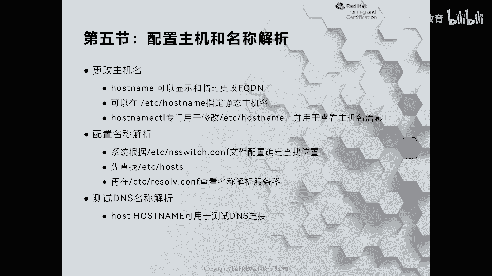
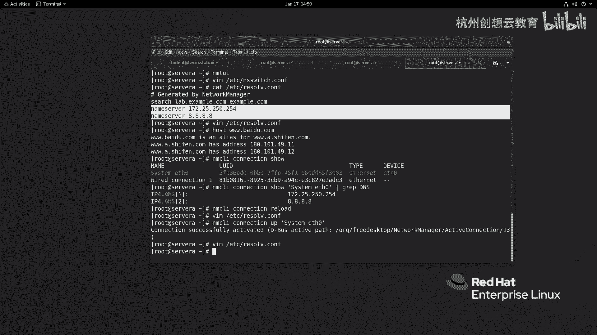

# 红帽认证系列工程师RHCE RH124：Chapter12：管理网络 - P6：12-5-配置主机和名称解析 🔧



在本节课中，我们将要学习如何在RHEL 8系统中配置主机名以及理解名称解析的优先级顺序。我们将介绍查看和修改主机名的多种方法，并详细说明系统如何查找主机名对应的IP地址。

## 查看与修改主机名

上一节我们介绍了网络连接的基本管理，本节中我们来看看如何管理系统的主机名。在Linux系统中，我们经常使用 `hostname` 命令来查看或临时更改主机名信息。

*   **查看主机名**：使用 `hostname` 命令可以查看当前系统的主机名。
*   **查看IP地址**：使用 `hostname -I` 命令可以查看系统的IP地址。

在RHEL 8及更高版本中，永久性的主机名存储在 `/etc/hostname` 文件中。你可以通过修改此文件来永久更改主机名，但自RHEL 7起，有一个更便捷的工具 `hostnamectl`。

以下是 `hostnamectl` 命令的常见用法：

*   **查看主机信息**：执行 `hostnamectl status` 命令。此命令会显示静态（永久）主机名、机器ID、引导ID、虚拟化平台和系统版本等信息。
*   **修改主机名**：使用 `hostnamectl set-hostname <新主机名>` 命令。此命令默认修改静态主机名（`--static` 选项可省略）。其他选项包括 `--transient`（修改临时主机名，重启后失效）和 `--pretty`（为个人PC设置美观的主机名，通常不包含域名）。

除了命令行，你还可以使用图形化工具 `nmtui` 来修改主机名。在 `nmtui` 界面中选择 “Set system hostname” 选项，输入新的主机名并确认即可。

## 名称解析的优先级

了解如何配置主机名后，我们来看看系统如何进行名称解析，即如何将主机名转换为IP地址。这主要涉及两个文件：`/etc/hosts`（本地主机文件）和 `/etc/resolv.conf`（DNS解析器配置文件）。

那么，系统在解析名称时，会优先使用哪个文件呢？答案是先查询 `/etc/hosts`，再查询 `/etc/resolv.conf` 中配置的DNS服务器。这个优先级顺序是由 `/etc/nsswitch.conf` 文件定义的。

我们查看一下这个文件的内容，重点关注 `hosts` 行的配置：
```bash
cat /etc/nsswitch.conf | grep hosts
```
输出通常类似于：
```
hosts: files dns myhostname
```
这行配置的含义是：系统进行主机名解析时，首先查询 `files`（即 `/etc/hosts` 文件），如果未找到，则查询 `dns`（即 `/etc/resolv.conf` 中配置的DNS服务器），最后再尝试 `myhostname`（系统自己的主机名）。

**重要提示**：`/etc/resolv.conf` 文件通常由网络管理服务（如NetworkManager）动态生成。直接手动修改此文件通常是临时性的，当网络连接重新激活时，修改可能会被覆盖。

如果你想永久更改DNS服务器，正确的方法是修改对应网络连接的配置文件（例如，通过 `nmtui` 或编辑 `/etc/sysconfig/network-scripts/` 目录下的网卡配置文件），而不是直接修改 `/etc/resolv.conf`。

## 总结



本节课中我们一起学习了在RHEL 8中管理主机名和名称解析的核心知识。我们掌握了使用 `hostname` 和更强大的 `hostnamectl` 命令来查看和设置主机名，也理解了系统进行名称解析时 `/etc/hosts` 和 `/etc/resolv.conf` 的优先级顺序，以及如何通过 `/etc/nsswitch.conf` 文件来定义这一顺序。记住，要永久修改DNS设置，应通过配置网络连接本身来实现，而非直接编辑 `/etc/resolv.conf` 文件。