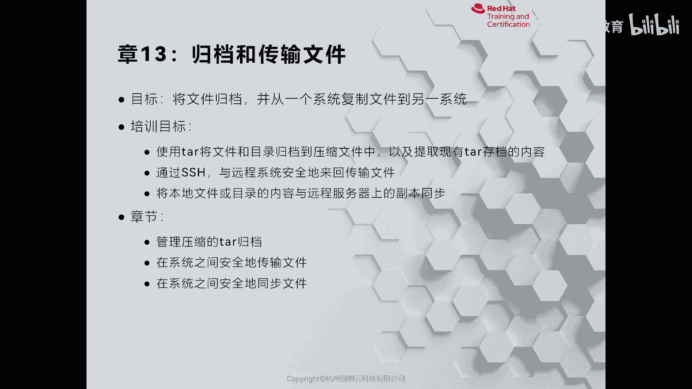
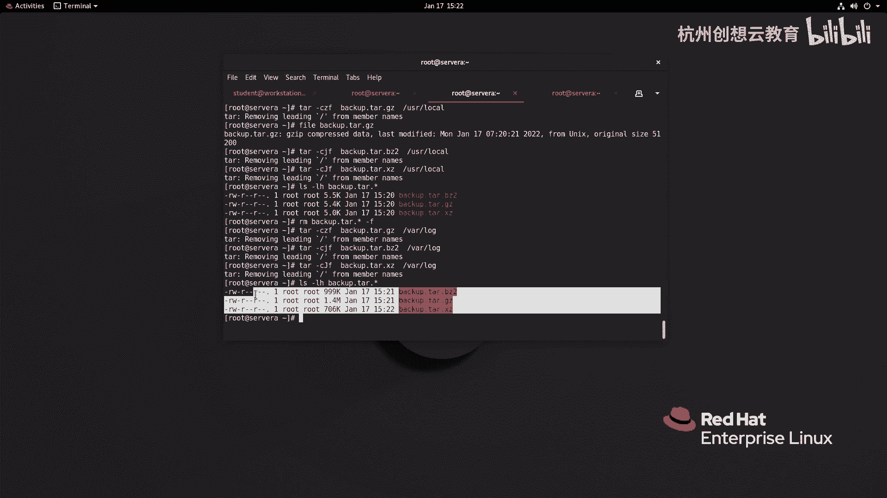

# 红帽认证系列工程师RHCE RH124-Chapter13-归档和传输文件 - P1：13-1-归档和传输文件-管理压缩的tar存档 - 杭州创想云教育 - BV1hP41157T3

啊，第十三章啊归档和传输文件。那么在这章呢，我们将会学习如何将啊系统当中的文件和目录啊，把它归档，或者说压缩啊，以及把现有的归档进行解压的一个过程。还有利用网络啊将本地的文件呢发送给远端的服务器。

或者同步到服务器上面啊。好，我们来先看第一小节啊，那么如何呢使用ta来进行管理归档啊，那么在我们的link上面呀，常见的归档工具呢，就是塔这个指令啊，那么我们可以通过ta啊。

把这个文件和目录呢把它放在一起啊，翻变成一个归档文件。那么在创建这个归档的时候呢，它会保留啊文件的各个属性。OK好，那么我们来演示一下如何呢使用它来归档。那么ta的命令啊非常的简单，我们来help一下。

在这个帮助页面有一个样例，那么样例里面的ta杠CF啊，代表的是创建一个归档，叫什么呢？叫arch achieve点ta。那么后面这个for和 bar呢，那么我们可以理解为是文件。

其实也可以理解为是一个目录文件啊，都可以理解。啊，去创建归档。那么这里的C啊C代表的是创建的意思。F得代表的是归档文件名，注意啊，F一定要和归档文件名是对应的啊，你说我们在创建的时候呀。

要走FC是错的啊，要走CF啊，那么接着杠TVF里面的T代表的是list里面的T啊，就展开啊，不不sorry啊，是列举啊，列举列举的时候呢，后别跟上一个归档啊，如果想看详细信息啊加个V啊，VO然后呢。

tXF呢那么这个X呢就是我们的展开啊，展开OK好，我们来试一下。我现在呀去创建一个归档啊，叫做哎叫什么叫local啊点它。那么目对象呢就是user目录里面的local。啊，回车啊。

那么因为我们在归档的时候呢，那路径啊走的是绝对路径，是从根根那根开始的。而根的话呢是包含了非常多的内容。因此我们这里啊这个自动啊它呢就把这个根给它移除掉了啊。好，我们来看一看，你发现多一个谁呀。

local点它啊。好，那现在呢我们通过fill呢去判断一下这个文件是否是一个啊归档包。哎，是一个po six的归档包啊。那么现在呢我去看一看这个包里面都放了哪些内容。可以通过TF来查看。啊。

确实全部是目录。那么但是这个只是一个内容啊，我想看更加详细，哎，加个V。啊，会把这个文件或目录的什么呀，权限呀，所有者所入组呀啊大小啊，时间戳呀什么都给我们打印出来了啊。这是这个如果想展开呢。

就是tX啊，XF跟上你的这个归档包啊，那么默认呢就是归档在当前目录啊，那个解压到当前目录，展开到当前目录啊。那如果你想把这个目录呢展开到指定的位置，可以使用一个选项呢，叫大写字母的C啊。

后面跟上你的路径就可以了。啊，那么我们的t里面啊就会有一个USR啊，USROK好，那么接着我们归档之后呀，那么是为了传输方便啊，但是有的时候归档之归档以后呀，发现这个包呀还是比较大啊。

不利于传输或者做备份。那么我们可以利用linux里面的啊三个经常使用的压缩工具，叫Gz b zip two和XZ。那么这三个工具呢有一个注意事项啊，这三个工具呢它只支持压缩文件啊。

是我们真正意义向的文件啊，不支持压缩目录。OK这一定要注意啊，我们先用这个命令啊来感受一下如何去使用。啊，这三个命令来实现一个压缩。啊，比如说呢我现在呢就以这里的谁呀啊，以我们的这里的。这个为例好吧。

那么我想把它压缩一下，G zip后面跟上文件名回车，那么L那么就多了一个这样的一个压缩，你看叫GZ为后缀啊。那如果我想把它去压缩一个目录，我们来试一试行不行啊，当前目录一下user看到没？忽略掉了。

因为它是个目录不支持啊，这时候呢我把这个压缩包呀解压GUNZIP后面跟上我们的压缩的文件。那么就解压开了。啊，解压开了。同样那么我们也可以使用谁呀？BC two。来实现同样的效果。哎，就变成了谁呀。

变成了后缀是BC two的后缀。那么同样解压走的是BUNVIP。那么还可以使用一个压缩率最高的叫XZ来压缩我们的文件。啊，后缀呢是XZ啊，所以我们可以这样去记啊，就是。这个GZ后缀呢是GZ啊。

这个BZ two呢是BZ2啊，XZ呢则是XZ。那么这三种文件的后缀呀，其实目的上呢并不是说。我们的系统啊不识别啊，必须加后缀才可以，而是为了方便我们的管理员啊。这样的话，你后期在解压的时候呢。

可以通过后缀来判断出来它是通过什么压缩的来展开。但是呀我们呃一般呢是这样来用的啊。你如果你这个三个工具它不支持啊压缩目录。但我呢又想把目录压缩，那怎么办？那这种情况呀，我们一般会这样做。

就是通过踏命令啊，先把一个啊目录呢给它压缩了。比如说我这边写个test啊，写个back up吧，back up点看后面要跟上我们的要去啊归档的目录。啊，然后呢再给它压缩，那么压缩的时候呢。

在C后面选择一个啊这个压缩工具。那么压缩工具里面啊，它是这样来配合的。在我们的它里面呀有这样一个选项。如果我们的选项呢是谁呢？是Z。啊，是Z，那么就代表的是Gzip或者是什么呀？GUN zip啊。

如果是的J就代表是be zip two。如果是大是字母J呢，代表的是XZ。因此我们如果想使用的是啊zip来压缩啊Gzip。那么就使用的是Z选项。那么在写的时候呢。

就人为的在后面加上一个它的后缀叫GZ即可。那么我们就有得到一个啊先归档又压缩的一个保文一个数据包。啊，一个数据包啊就出现了。那么其他的例子呢也是一样的效果。比如说我现在呀。使用大写字母J啊小小字母J。

那么就是BC2对吧？BC2。啊，然后呢大是字母J呢。则是谁呀？则是XZ。啊，然后呢我们对这三个文件呀做一个比比较，好吧，比较加一个星号。那么我们来换看一看它们的大小啊，那么其中啊Gz啊Gz啊。

这个在这个地方反而比Bz two小了啊啊这个其实我们的GZ的压缩率是没有Bz2高的啊呃，可能是文件小，那么没有感觉出来啊，那么我们就换一个大一点的文件，好吧。比如说。啊，比如说我们去看一个谁呢？

我们看一下我们的这个日志，好吧，日志的大小，我们再来一次啊，我现在呀把所有的back up呀，这个文件呢全部删掉啊，加上一个F啊，删掉之后呢，我现在呀通过这个命令啊去。这个压缩我们的蛙下面的log。啊。

这个量应该会很大啊，然后呢，还有谁呢？还有这个。BZ2我们的BZ of two。还有第3个。环键越大呢，效果越明显。然后呢，我们再做个对比。来看一下，你看哎。那么GZ普的话呢是1。4兆。啊。

然后BC put two呢变成了999K，然后呢，SZ呢是7004706K，对吧？要明显的能看出来啊，它的大小是压缩率是不一样的，哎是不一样的。OK那么解压的话呢，就把这个C呀换成X就可以了啊。

X就可以了然后呢，我们可以把这个归档好压缩好的文件呀啊放在备份数据库里面做备份啊，也可以把它传输给其他的服务器里面。啊，就可以了。那么有没有人啊有疑问，就是说我们为什么不使用啊，不使用一个工具呢？

叫谁呢？叫做啊zip。

对吧在windows里面，我们可能会看到这个zip包，或者在互联网上去下载这个压缩包的时候呢，可以看到zip。因为zip无论是mic克还是windows还是我们的linux都是通用的呀。

为什么不用zip呢？啊，注意啊，zip的话呢，因为它没有像他一样的这些特点啊，当我们如果把我们的这个压缩包啊，通过zip的方式呢压缩，然后呢放在了这个window上面啊。然后呢通过这个拷贝啊。

比如说用U盘呀，移动硬盘的方式拷贝给我们的这个拷贝再拷贝回来里面的权限呀可能会发生变化啊，所以说我们是不走zip的啊用他是最为稳妥的一种方案啊。好，这是给大家介绍了如何使用他呢来管理啊，我们的压缩包啊。

可以去备份可以还原数据都是非常有用的。