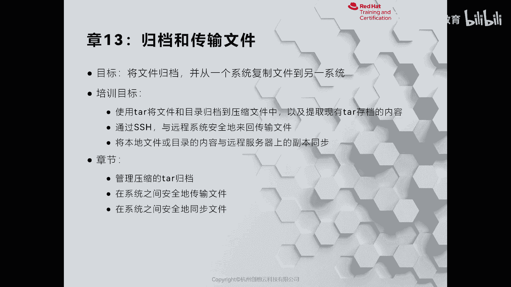
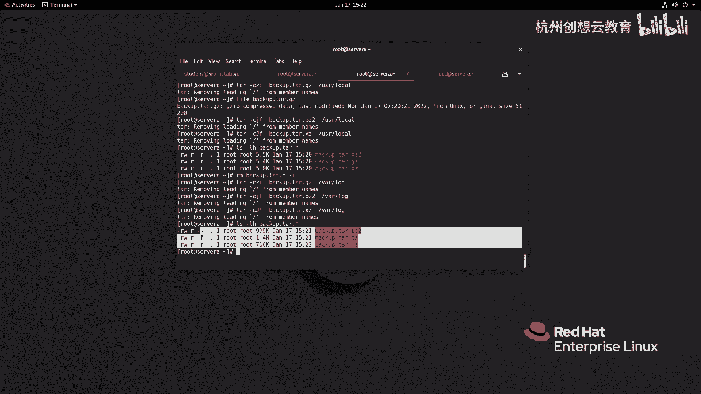

# Linux系统管理：13：归档和传输文件



## 📦 概述
在本节课中，我们将要学习如何在Linux系统中对文件和目录进行归档与压缩，以及如何解压现有的归档文件。此外，我们还会了解如何通过网络将本地文件传输或同步到远程服务器。掌握这些技能对于系统备份、数据迁移和日常管理至关重要。

---

## 🗂️ 13-1：管理压缩的tar存档

上一节我们介绍了本章的学习目标，本节中我们来看看如何使用 `tar` 命令来管理归档文件。

在Linux系统上，常见的归档工具是 `tar` 指令。我们可以通过 `tar` 将文件和目录打包在一起，形成一个归档文件。在创建归档时，它会保留文件的原始属性，如权限、所有者和时间戳。

`tar` 命令的基本用法如下所示。其中，`-c` 代表创建，`-f` 用于指定归档文件名，`-t` 用于列出归档内容，`-x` 用于解压归档，`-v` 用于显示详细信息。

```bash
# 创建归档
tar -cf archive.tar file1 file2

# 列出归档内容
tar -tf archive.tar

# 解压归档
tar -xf archive.tar
```

现在，让我们通过一个例子来实践。我们将 `/usr/local` 目录归档为一个名为 `local.tar` 的文件。

```bash
tar -cf local.tar /usr/local
```

执行后，系统会生成 `local.tar` 文件。使用 `file` 命令可以确认它是一个POSIX tar归档包。

```bash
file local.tar
```

要查看这个归档包中包含哪些内容，可以使用 `-t` 选项。

```bash
tar -tf local.tar
```

如果想查看更详细的信息，例如文件权限、大小和时间戳，可以加上 `-v` 选项。

```bash
tar -tvf local.tar
```

归档文件通常是为了方便传输或备份，但有时归档后的文件仍然较大。这时，我们可以使用压缩工具来进一步减小文件体积。Linux中常用的压缩工具有 `gzip`、`bzip2` 和 `xz`。

需要注意的是，这三个压缩工具**只支持压缩单个文件，不支持直接压缩目录**。以下是如何使用它们压缩文件的示例。

```bash
# 使用 gzip 压缩
gzip filename
# 解压 .gz 文件
gunzip filename.gz

# 使用 bzip2 压缩
bzip2 filename
# 解压 .bz2 文件
bunzip2 filename.bz2

# 使用 xz 压缩
xz filename
# 解压 .xz 文件
unxz filename.xz
```

既然这些工具不能压缩目录，而我们又需要压缩目录，该怎么办呢？常见的做法是结合 `tar` 命令。先使用 `tar` 将目录归档，然后在归档的同时调用压缩工具进行压缩。

`tar` 命令提供了与压缩工具联用的选项：
*   `-z`: 使用 `gzip` 进行压缩/解压，对应 `.tar.gz` 或 `.tgz` 后缀。
*   `-j`: 使用 `bzip2` 进行压缩/解压，对应 `.tar.bz2` 后缀。
*   `-J`: 使用 `xz` 进行压缩/解压，对应 `.tar.xz` 后缀。

以下是创建压缩归档包的示例命令：

```bash
# 创建并用 gzip 压缩
tar -czf backup.tar.gz /path/to/directory

# 创建并用 bzip2 压缩
tar -cjf backup.tar.bz2 /path/to/directory

# 创建并用 xz 压缩
tar -cJf backup.tar.xz /path/to/directory
```

为了比较不同压缩工具的压缩率，我们可以对同一个较大的文件（如系统日志）进行压缩测试。

```bash
# 压缩 /var/log 目录并比较大小
tar -czf log_backup.tar.gz /var/log
tar -cjf log_backup.tar.bz2 /var/log
tar -cJf log_backup.tar.xz /var/log

# 列出文件大小进行比较
ls -lh log_backup.*
```

通常，`xz` 的压缩率最高，但压缩速度可能较慢；`gzip` 速度较快，压缩率适中；`bzip2` 介于两者之间。解压压缩归档包时，只需将创建命令中的 `-c` 换成 `-x` 即可。



```bash
# 解压 .tar.gz 文件
tar -xzf backup.tar.gz

# 解压到指定目录
tar -xzf backup.tar.gz -C /target/directory
```

你可能会问，为什么不用跨平台更通用的 `zip` 格式？虽然 `zip` 在Windows、macOS和Linux上都能使用，但它在处理Linux文件系统权限、所有者等元数据时不如 `tar` 可靠。当压缩包在Windows和Linux之间来回拷贝时，`zip` 格式可能导致这些属性丢失或改变。因此，在Linux系统管理和备份中，使用 `tar` 配合压缩工具是更稳妥的方案。

---

## 📝 总结
本节课中我们一起学习了如何使用 `tar` 命令来创建、查看和解压归档文件。我们还了解了如何结合 `gzip`、`bzip2` 和 `xz` 工具对归档文件进行压缩和解压，以节省存储空间并方便传输。掌握这些命令是进行有效系统备份和数据管理的基础。