# 红帽认证系列工程师RHCE RH124-Chapter13-归档和传输文件 - P2：13-2-归档和传输文件-在系统之间安全地传输文件 - 杭州创想云教育 - BV1hP41157T3

啊，第二节在系统之间啊安全的传入文件。呃，当我们在本地这个归档好文件之后啊，或者说呢在本地啊有一些文件，我需要把这些文件呀把它复制到啊远端的服务器上面。那么我们可以借助open SA协议啊，通过网络啊。

把这些文件呢传输过去。那么首先我们就可以使用到一个啊非常古老的工具啊，就是叫做谁呀，叫做secre copypy啊，简称SCP这样一个命令来拷贝。那么SCP呢其实就相当于我们之前学习的CP命令啊。

只不过呢又加了一个谁呀啊SSH啊外壳啊，所在用的时候呢一些命令语法呀，都是啊相同的啊，那么远程的位置呢则是用户名艾主机名冒号跟上它的路径啊，跟上路径。比如说我现在呢把我的serB啊，当做什么呀？

当做我们的备份服器。

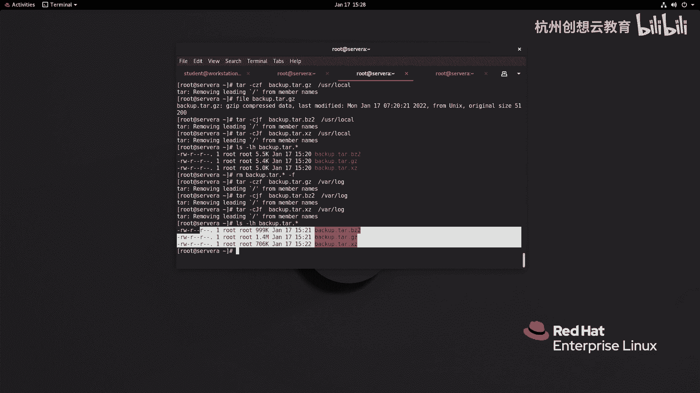

い。O备份服器啊，我这边呢去登录到sB。在搜入B上啊，我去给它创建一个什么呢？啊，这个因为是之前的策略的原因啊，我去给它换成一个student试试如何OK好，然后呢我去再切换到。Root。啊。

先root我在servb上啊创建一个目录，叫back。啊啊备份啊，我一会儿呢就把这个文件呀都放在这个目录下面啊，那么我回到思A啊，思A那么思A上面啊，现在呢有这个非常多的文件呀啊，我想把它传输给啊思B。

我可以使用SCP。

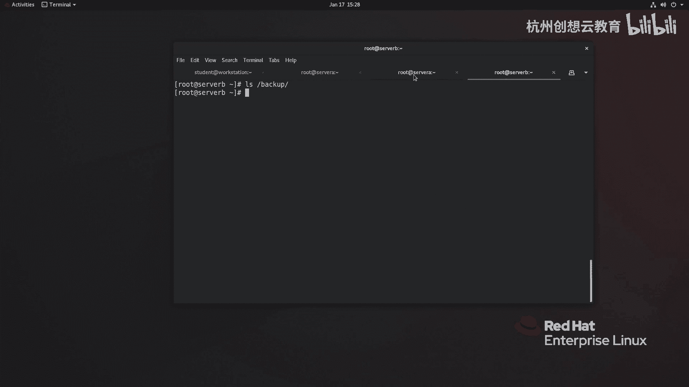

好ICP后面呢跟上文件名，比如说跟上我的这个谁呀这个and这个文件啊啊，local这个文件，然后呢复制给root at谁呀？servver B冒号啊跟目录下面的back up啊回车。

那么因为我们之前在serv B上呢做了一个呃SH的一个策略，所以说是没有办法去通过root来拷贝的那怎么办呢？那么我们就使用啊这个这个d op用户。啊，然后呢看能不能拷贝过去。

但是呢这个目录呢对于dveops用户而言呢，是没有权限的对吧？那么我们这边呀就把这个目录呀，哎这个把它所有者改成dops。

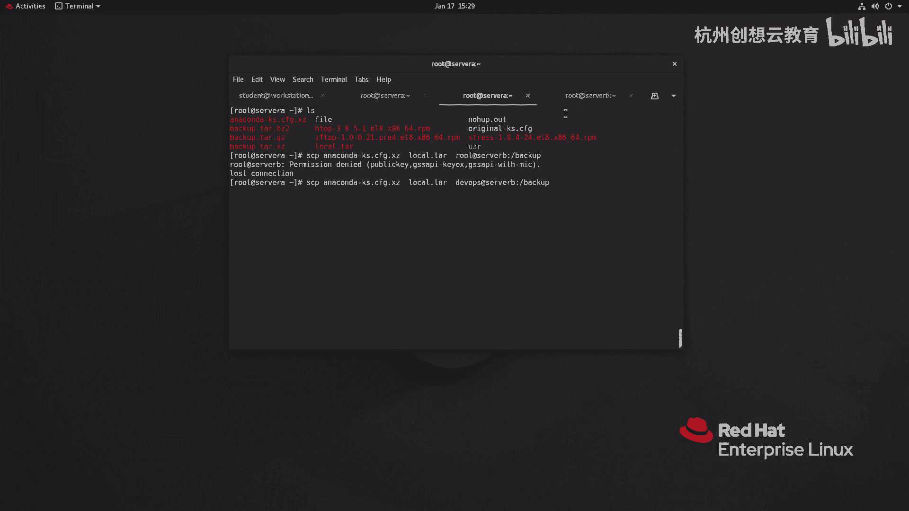

啊，然后呢我们再来去传输。

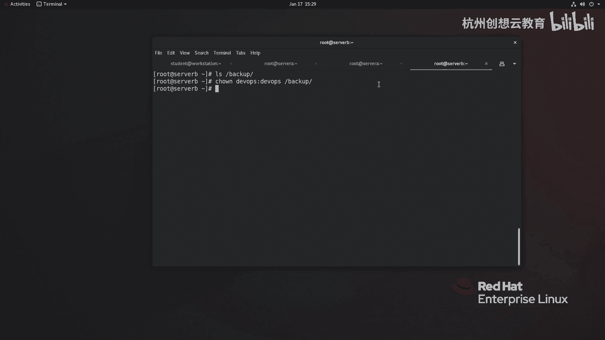

啊，依有拒绝。那么我记得当时我们用了一个文件啊。哎，还不在这里，对吧？应该是在哪里呀？在home student加目录里面是吧？里面有一个谁呀，有一个呃这个。哎，我们给它放哪儿了？是DVO用户吗？

检查检查我们的好在这里。好，我们就用它啊，哎把这个刚才命令啊再重新指引一次，我加一个选项杠I对吧？SH里面的杠I来指定我们的啊私钥。我记得用的是谁呀？

用的是lab keywith pass这个死要回车啊，就把这个文件呀传输过去了。然后呢，我们再来到s B啊，来到跟目录下的DV。

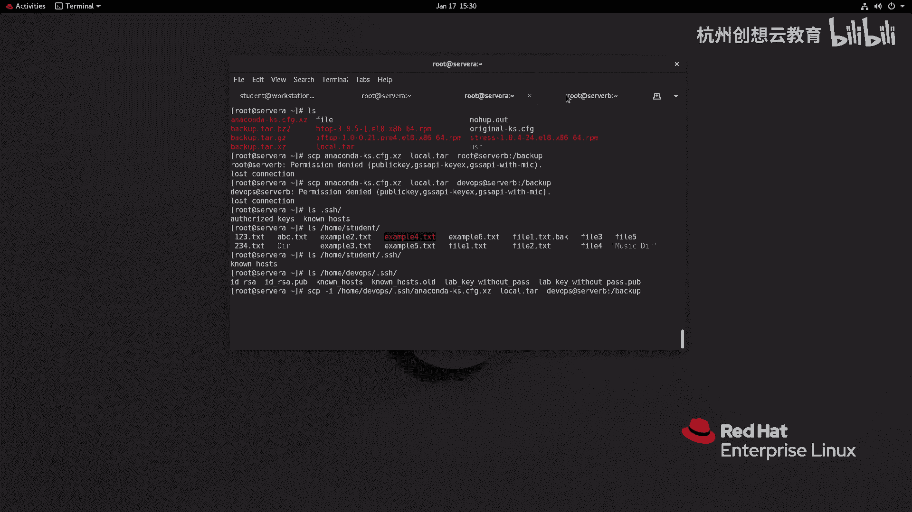

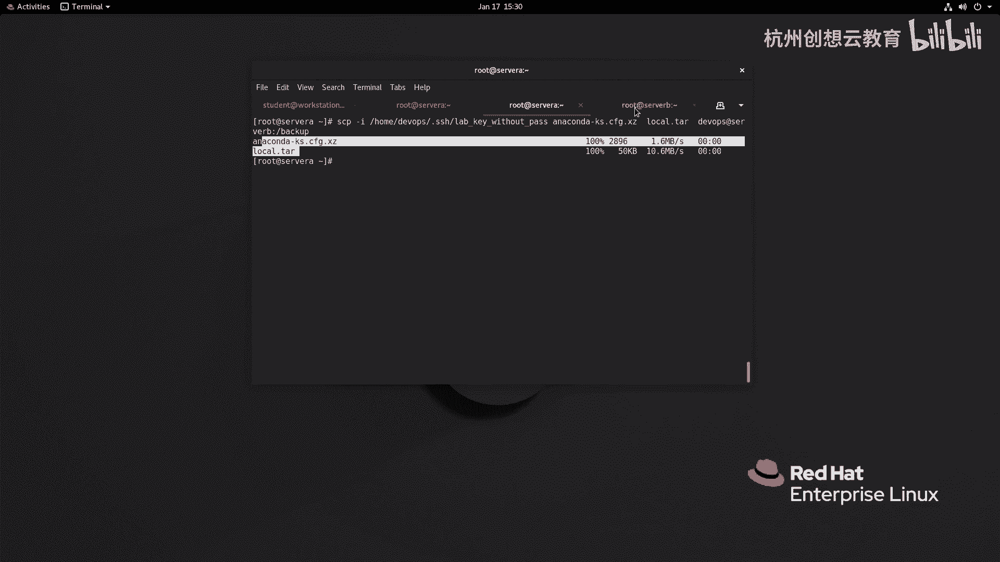

啊，这个sorry啊back up里面。哎，又多了两个文件啊，这传输。但如果我们。

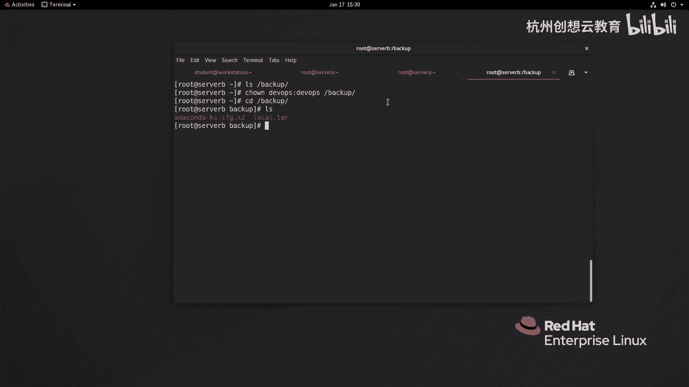

要想传输一个谁呀？目录啊目录，那么我们可以加一个选项杠R啊。啊，杠R比如说这里面有个USR这个目录，我我传输啊，特别说一个非常规的文件，那我就加一个选项啊R啊，代表递归。啊。

回车哎就把这些目录里面的文件呀啊把它发送给了谁呀，发送到了我们的这个啊s bit back up里面啊，就多了一个user的目录啊，是不是很简单啊很简单啊，那么这个方法呢是一个非交互式的啊。

非交互式的哎，我们还可以干嘛呢？还可以使用啊这个呃还可以使用这个一个工具呢，叫做谁呀？SFTP那么FSTP的话呢，它其实是我们SH服务端的一个子金子系统啊，那么它的用法和FTP的用法是差不多的啊。

但是呢它只能使用系统自带的用户呢进行传输啊，哎那么我们可以使用这种RS啊CD啊等等命令呢进行交互。

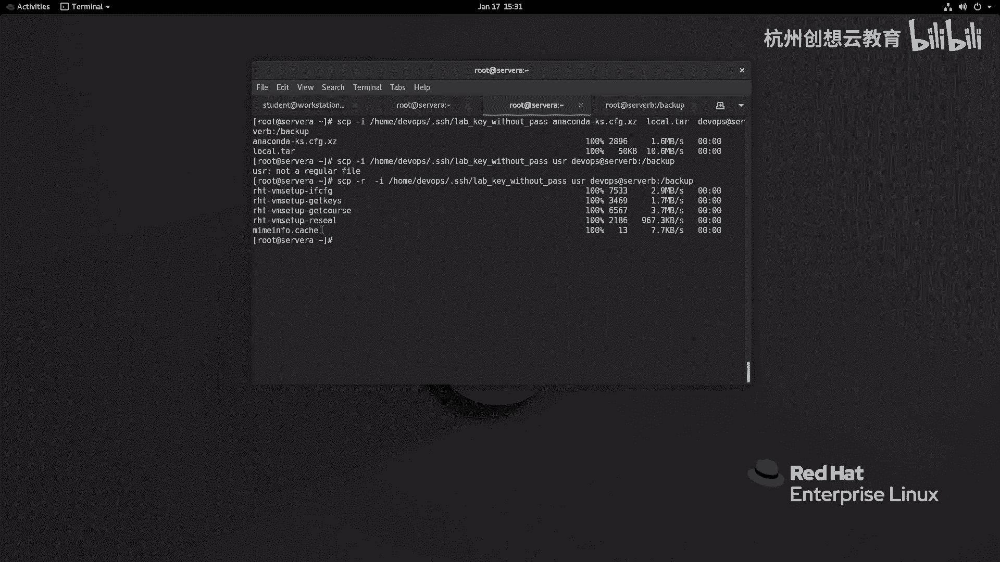

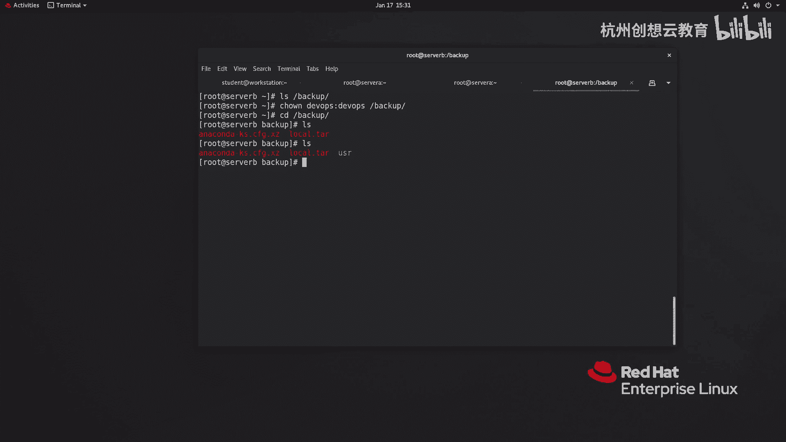

啊，好，我们接着使用这个交互的方式呢来进行啊查看一下。啊，那么我来到sver a啊，sve a呢这里面有非常多的这个文件呀啊，我要去同步了。那么这次我干嘛呢？我。我这次呀我先我去拷贝一份这个。

这个这个啊撕钥过来好吧，因为刚才我们在拷贝的时候非常不方便。我把它的lab这个C钥啊给它拷贝到当前用户加目录的点SS里面。并且给它重名名称，别的重名叫做ID下划线RSA。为什么要重名这个名字呢？

因为重名之后呢，他就走默认了，对吧？我就不用去指定了SFTP。root at server B我不加路径也是没问题的。回车。嗯，sorry，又root啊，我换成。

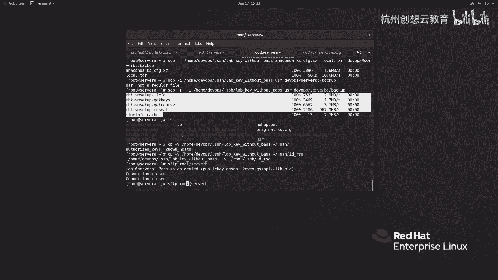

Thereops。哎，我们就登录上去了。登录上去之后呀，我用IOS看到的是啊服务端，就是远程服务器sb加目录里面的内容。啊，看到没？加目录里面内容啊，那么dop。

那么我呢通过CD来切换到根目录下的backup。按I这是指远程服务端的那如果想看本端的怎么办啊？我可以加个L啊LL哎，就能看得到了。上传一个哎put。比如说我要上传这个H talk的I片包。上传。

那么我们的服务端呀啊back up里面就会多一个这样的IPM包。

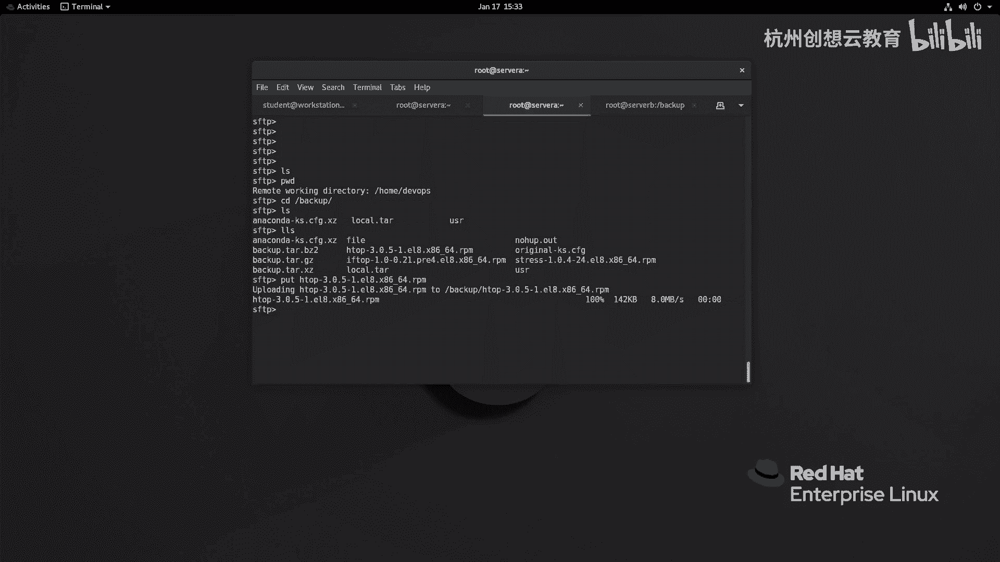

啊，安全包okK那假如说呢我在服务端呀同时复制一个文件叫做ATTCFt到当前目录下面。然后呢在客户端我们通过L是能够读取到的。

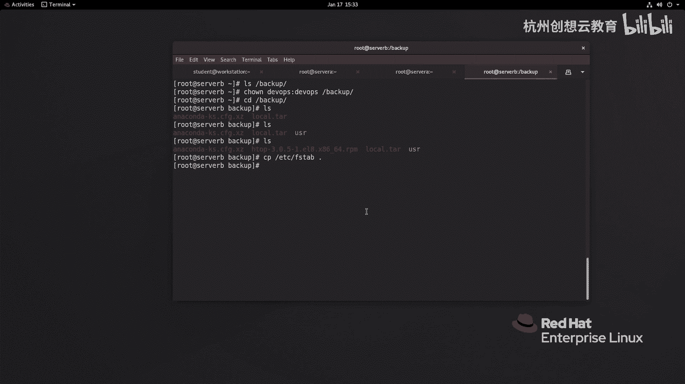

啊，然后呢下载到本地get FS tab。啊，get F tab那么退出。MS4你看多本地呢就多了个FS type这种交互式的哎交互式的一个指令啊，那那么我们在传输一些啊小文件的时候呢。

还是非常有作用的。

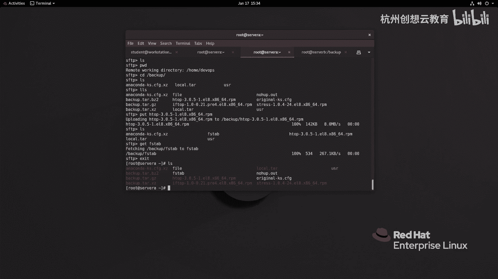