# 红帽认证系列工程师RHCE RH124-Chapter13-归档和传输文件：13-2：在系统之间安全地传输文件 🔐

在本节课中，我们将要学习如何通过网络，在本地系统与远程服务器之间安全地传输文件。我们将重点介绍两种基于SSH协议的工具：`scp`和`sftp`，它们能确保数据传输过程的安全性。

上一节我们介绍了如何在本地归档文件，本节中我们来看看如何将这些文件安全地发送到另一台服务器。

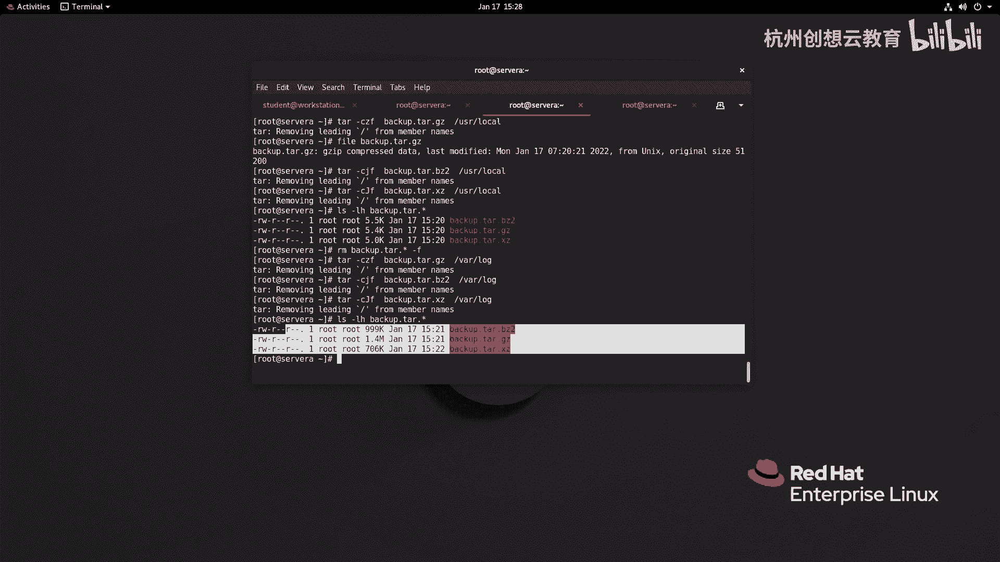

## 使用 `scp` 命令传输文件

`scp`（secure copy）命令类似于我们之前学过的 `cp` 命令，但它通过SSH协议在网络上运行，提供了加密传输。其基本语法是 `scp [选项] 源文件 目标位置`。远程目标位置的格式为 `用户名@主机名:路径`。

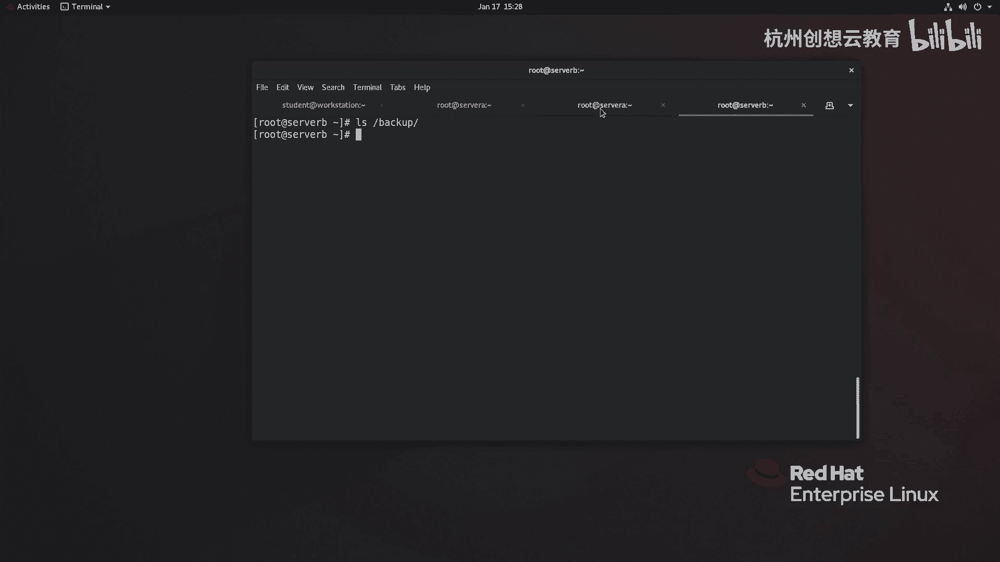

例如，假设我们有一台备份服务器 `serverB`。首先，我们需要在备份服务器上创建一个用于接收文件的目录。

```bash
# 在 serverB 上以 root 用户创建备份目录
mkdir /backup
```

现在，我们从本地服务器 `serverA` 向 `serverB` 传输文件。以下是传输单个文件的命令示例：

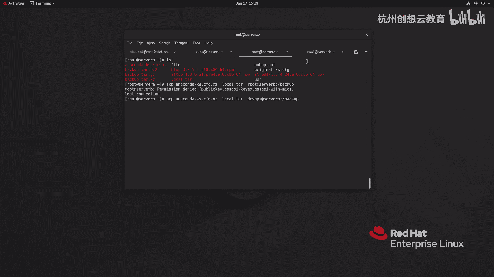

```bash
scp /path/to/local/file.txt devops@serverB:/backup/
```

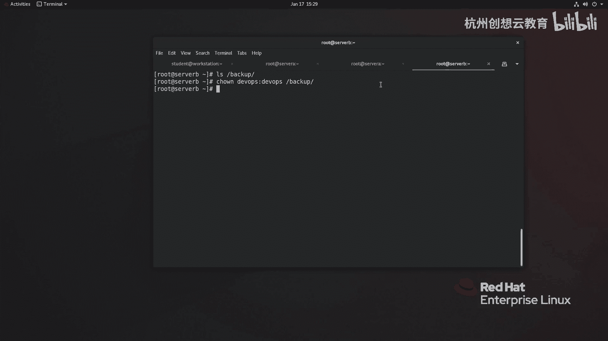

如果传输因SSH密钥或权限问题失败，可以使用 `-i` 选项指定私钥文件：

```bash
scp -i ~/.ssh/lab_key_with_pass /path/to/local/file.txt devops@serverB:/backup/
```

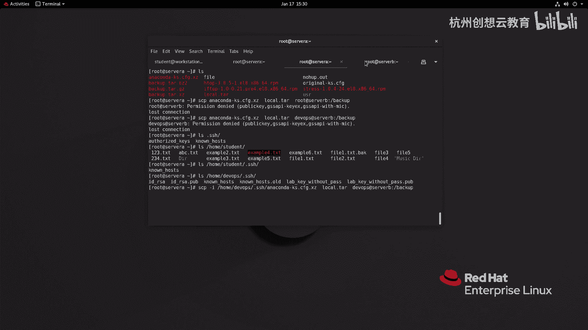

若要传输整个目录及其内容，需要添加 `-r` 选项进行递归复制：

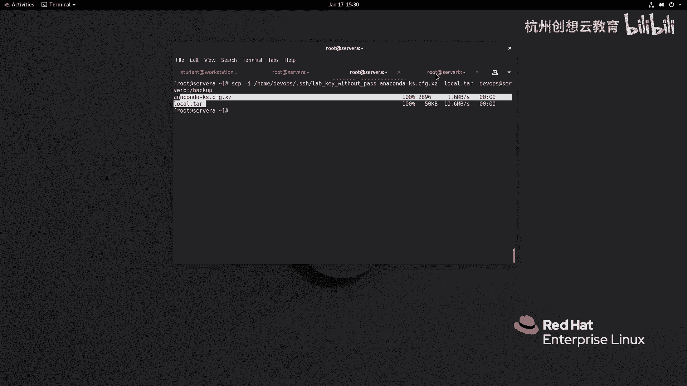

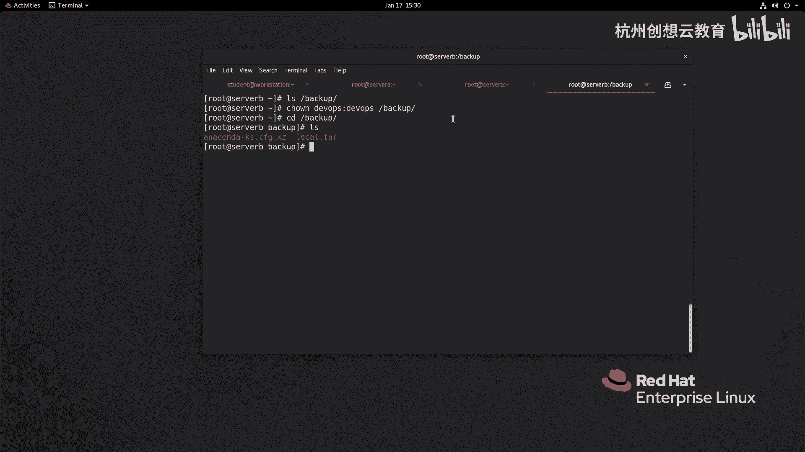

```bash
scp -r /path/to/local/directory/ devops@serverB:/backup/
```

`scp` 是一种非交互式的传输方式，适合在脚本或命令行中快速执行文件复制任务。

## 使用 `sftp` 命令交互式传输文件

`sftp` 是SSH服务的一个子系统，提供了类似FTP的交互式文件传输界面，但所有通信都经过加密。它使用系统用户进行身份验证。

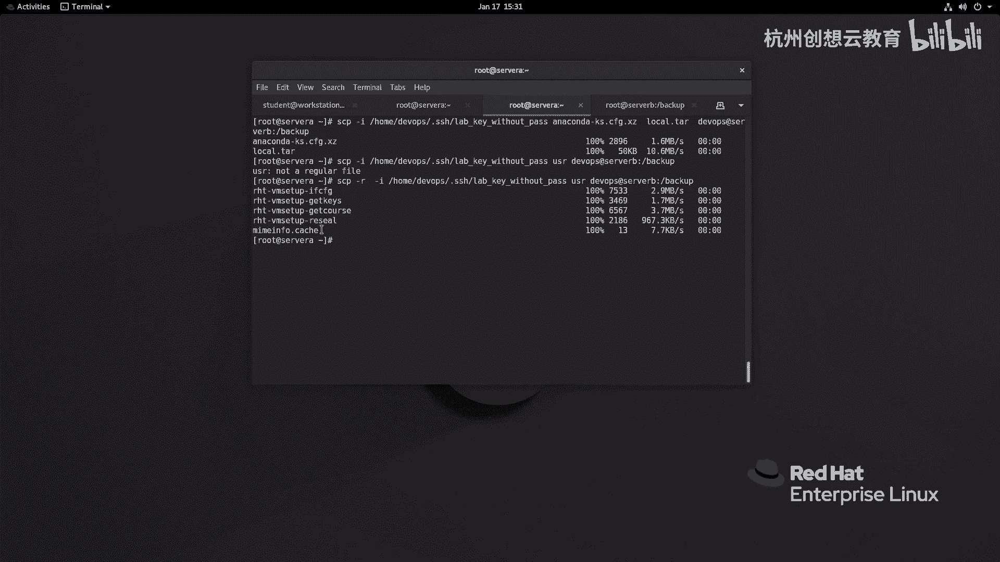

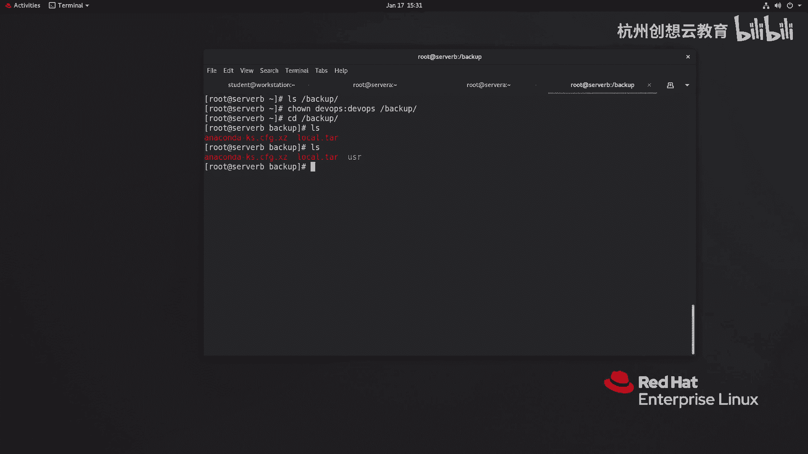

我们可以使用以下命令启动一个 `sftp` 会话连接到远程服务器：

```bash
sftp devops@serverB
```

成功连接后，你将进入 `sftp>` 提示符。在这个环境中，你可以执行多种命令来管理文件。

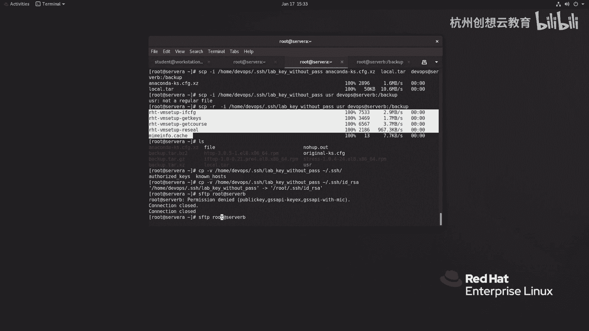

以下是 `sftp` 会话中常用的命令列表：

*   **`ls`**：列出远程服务器当前目录下的文件。
*   **`lls`**：列出本地客户端当前目录下的文件。
*   **`cd`**：更改远程服务器上的工作目录。
*   **`lcd`**：更改本地客户端上的工作目录。
*   **`put 本地文件`**：将本地文件上传到远程服务器。
*   **`get 远程文件`**：将远程文件下载到本地。
*   **`exit` 或 `bye`**：退出 `sftp` 会话。

例如，在 `sftp` 会话中，你可以执行以下操作：

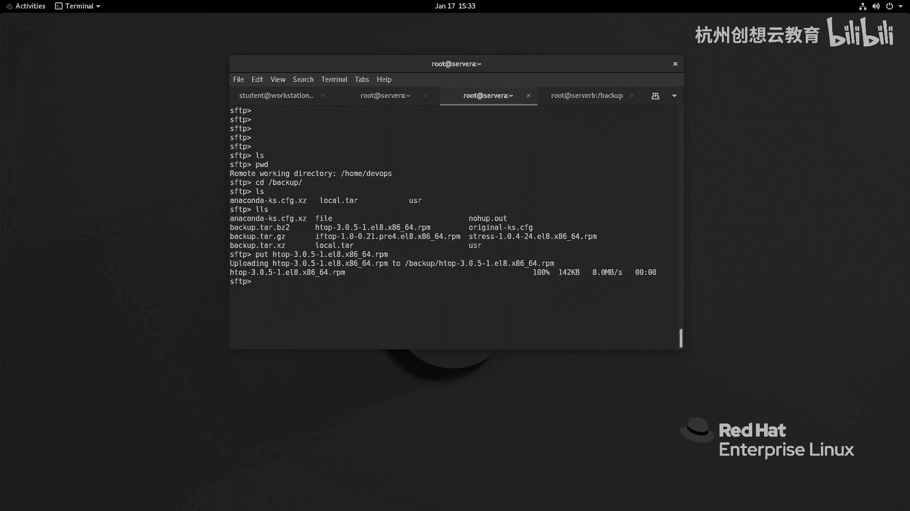

1.  切换到远程服务器的 `/backup` 目录：`cd /backup`
2.  列出本地文件以确认要上传的内容：`lls`
3.  上传一个本地RPM包：`put httpd.rpm`
4.  从远程服务器下载一个文件到本地：`get /etc/fstab`
5.  完成操作后退出：`exit`

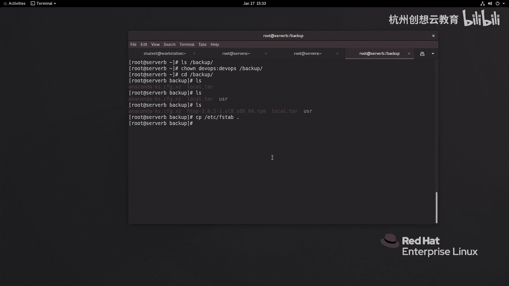

这种交互式方式在需要浏览双方文件系统并选择性地传输少量文件时非常方便。

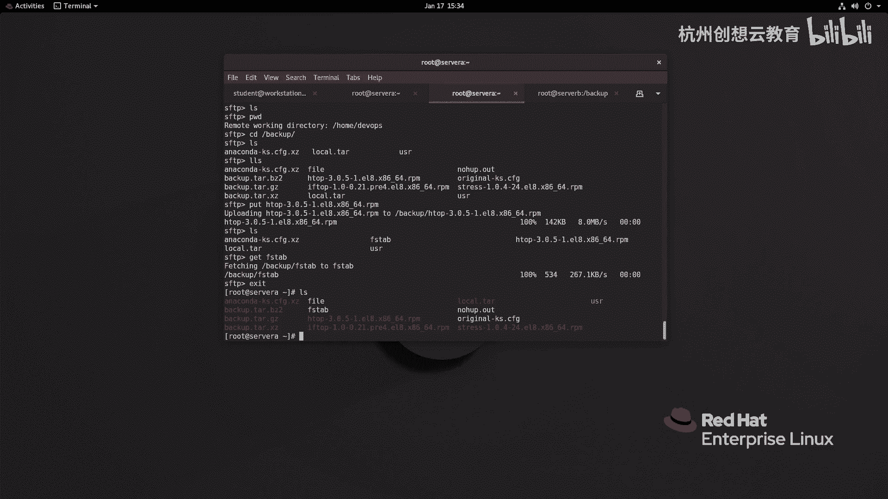

本节课中我们一起学习了两种在Linux系统间安全传输文件的方法。`scp` 命令适合快速、非交互式的文件复制，而 `sftp` 则提供了交互式的会话，便于浏览和选择文件。两者都基于SSH协议，确保了数据传输过程的安全。