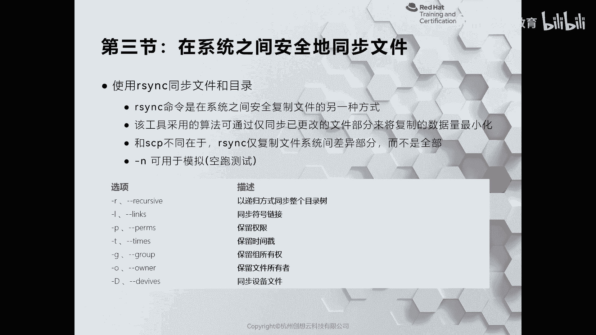
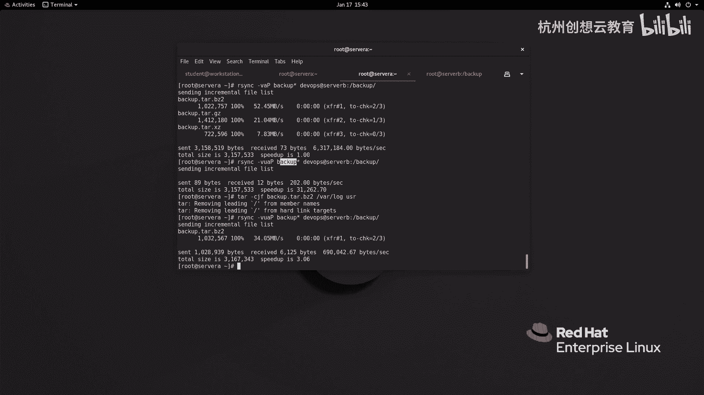
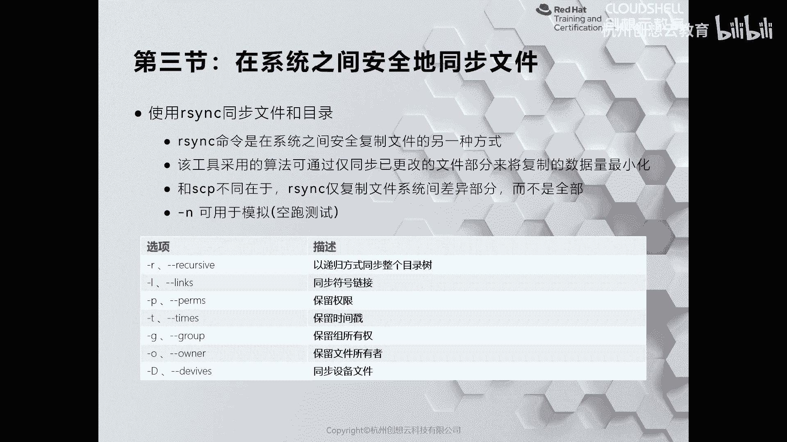
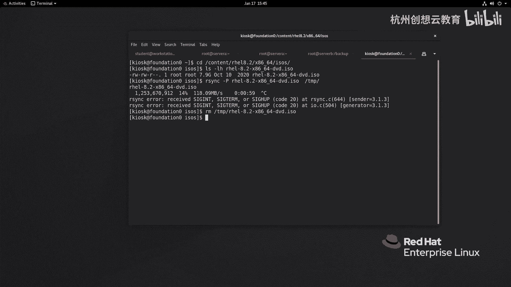

# 红帽认证系列工程师RHCE RH124-Chapter13-归档和传输文件 - P3：13-3-归档和传输文件-在系统之间安全地同步文件 - 杭州创想云教育 - BV1hP41157T3

啊，那么刚才呢SFTP啊或者是SCP呢都是一种啊将本地的文件啊同这个传输到啊远端服务器的一种方法。但是呢它们有一个弊端，就在于如果啊远程服务器上具备有和本地相同的文件啊，它会给它覆盖掉，再次的传输。

那么这样的话呢就会浪费我们的网络带宽啊，因为两边呢是一样的，完全没有必要呢再重复一次。因此呀我们可以使用一个新的命令叫rthink啊，来进行同步啊，那么think的话呢，它是默认是没有安装的。

那么我们可以去安装这个包，叫think的包呢去实现一个这样功能。OK那么我们可以在更新的时候呢，使用杠U的选项呢来做一个增量的啊同步啊增量同步。那么如果你不确定是否是有作用，那么可以加一个N。

代表是模拟啊模拟。好，那么我们来试一下效果。

啊，实像效果。那么现在呢我呢再回到serv a啊serv A。那么s A上面的话呢有很多个文件啊，那么我现在呢先去走一个arethink啊，干嘛呢？去同步一下我们的文件back up的。啊。

这么多back up的文件啊，BACK啊BACK这样文件啊，那么我去同步所有到啊这个DVOPS艾servver B冒号back up里面。停车。😊，啊，这是一个演示啊，那么加个V，好吧，加个V。

慢慢空跑啊，没有感到哎，这样的话呢就。显看效果了。那如果你在测试的时候呢，还想看到它进度条，那么还可以加一个大写字母P。哎，能够看得出来。那么因为我们这个是一个空跑测试呀，可能。没有加P。

好像感觉不出来是吧？没事，我们一会儿呢再来个猛一点的啊，来个猛一点的那我现在呢先去啊同步一次，我就不用N了啊，直接去同步。那么同步的时候呀，我不仅加个A啊，V还加个A，那么A呢代表的是归档。啊。

归档就意味着呢A我可以实现啊将这个如果有目录，我就把目录也同步过去啊。如果有有这个软链接，我把软链接呢也同步过去。如果有权限呀啊文件的所有权呀，所有者呀啊等等，我都会同步过去啊，可以用个A来代替。哎。

传输成功了。那我这次呢加个U啊，加个UU呢代表是更新啊，upat的意思。然后呢，我们再来同步一次，看看有没有效果。啊，那么传输的数据呢为空啊，没有内容，为什么呢？因为他发现呀远端和本地呢是一样的啊。

就没有发生的同步。那如果我们呃再次呢去创建一个归档，比如说CGF啊back up。啊，back up。点谁呀？这个他。点BZ2。然后呢，我刚才啊创建的是Y下面的谁呀？log，然后呢。

我再增加一个本地的user，我知道。那么我们的back up呢是发生了变化了。我再次呢去同步一次看效果。你会发现呀他只做了谁呀？back up的一个同步。因为我刚才这里呢走了back up的什么呀。

通位符啊，那么因此呢应该理论上来说呢会同步所有，但是呢它只同步了谁呀？发生了更新的这一个啊，非常好用啊。如果呢你不想用DV模式啊，你觉得它附带的功能太多了，也可以根据这个表格选择你要啊进行同步的内容啊。

A就相当于这里面的每一个选项。

啊，相当于每个选项OK那么除了刚才的这个方法之外呢，我们的think呢还有一个非常好使用的一个功能。就是说我们在复制大文件的时候呀，那么可能等待时间比较久啊，不知道进度。哎。

我可以使用sA呢来传送大文件啊，那么因为讯机里面的测量空间呢是有限的。因此呢我在这个foldd上来给大家演示一下。

啊，我来到这个蛙下面的啊，sorry来到countent里面有个real啊，这个8。2啊，那么在这个路径里面呀，我去找到我的iso，我来看一看我的real8的镜像有多大，大小呢是7。9个GB啊，8个G。

然后呢，我要把这个文件呀，把它拷贝一份到tap里面，我可以使用think。然后呢加一个选项大P。然后呢跟上我的原文件，然后呢跟上目的地回车。哎，那么我们就可以啊看到我们的进度，哎，是不是非常的方便啊。

这样的话呢我们就能估算出来我的文件还要多久拷贝结束啊，以及我们的速度。好。那么我这边呀就cttrol C掉了啊，我把那个生成的这个缓存文件给它删除删除掉。好，这是我们的Rthink指令。

