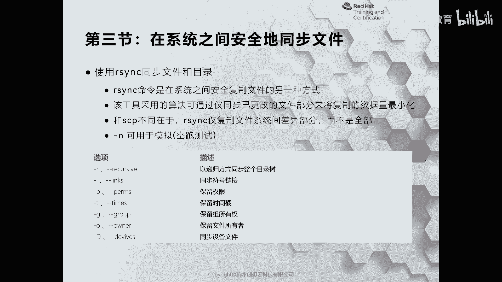
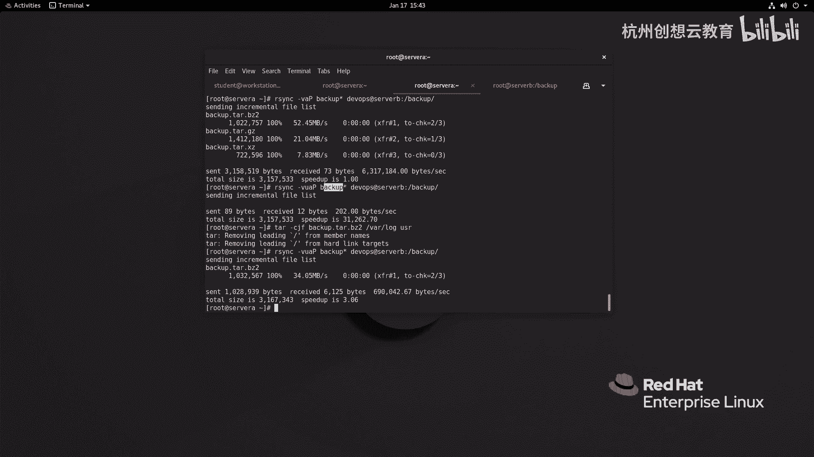
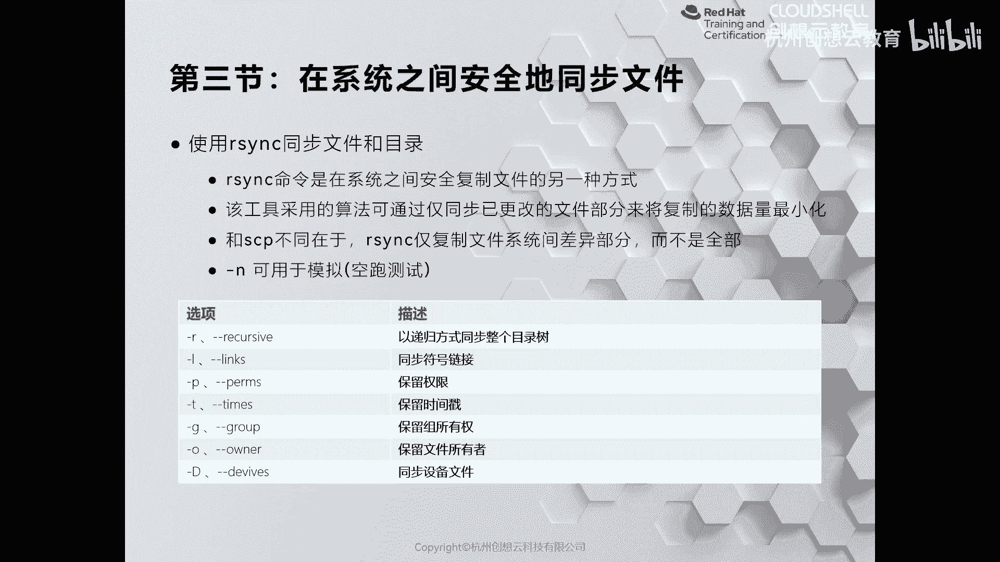
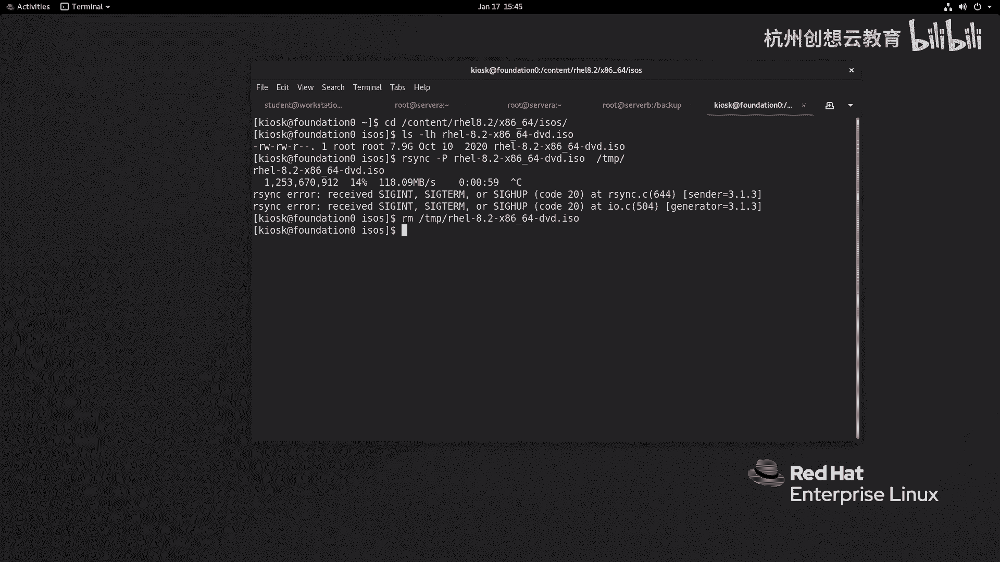

# 红帽认证系列工程师RHCE RH124-Chapter13：归档和传输文件 - P3：13-3-在系统之间安全地同步文件

在本节课中，我们将要学习如何使用 `rsync` 命令在系统之间安全、高效地同步文件。与之前介绍的 `sftp` 或 `scp` 不同，`rsync` 能够智能地仅传输发生变化的文件，从而节省网络带宽和时间。

上一节我们介绍了使用 `sftp` 和 `scp` 进行文件传输，本节中我们来看看如何实现更智能的文件同步。



## 为什么使用 Rsync？

使用 `sftp` 或 `scp` 传输文件时，如果远程服务器上已存在同名文件，它们会直接覆盖。即使本地和远程的文件内容完全相同，也会再次完整传输，这会浪费网络带宽。`rsync` 命令可以解决这个问题，它通过比较文件差异，只同步发生变化的文件部分。

`rsync` 工具默认可能未安装，可以使用以下命令安装：
```bash
yum install rsync
```

## Rsync 的基本使用

以下是 `rsync` 命令的一些常用选项和功能。

### 模拟与增量同步

初次使用或不确定同步效果时，可以添加 `-n` 选项进行模拟运行，它不会实际传输文件。
```bash
rsync -n [源路径] [目标路径]
```
要进行增量同步（仅更新变化的文件），可以使用 `-u` 选项。
```bash
rsync -u [源路径] [目标路径]
```

### 归档模式同步

为了完整同步目录结构、权限、所有权等信息，推荐使用归档模式，即 `-a` 选项。它等价于同时使用 `-r`（递归）、`-l`（拷贝符号链接）、`-p`（保留权限）、`-t`（保留修改时间）等多个选项。
```bash
rsync -a [源路径] [目标路径]
```
为了查看详细过程，可以结合 `-v`（verbose）选项。
```bash
rsync -av [源路径] [目标路径]
```



### 演示示例

假设我们需要将服务器 `servA` 上 `/backup/` 目录下的所有文件同步到服务器 `servB` 的 `/backup/` 目录下。
1.  首先进行模拟运行，确认同步列表：
    ```bash
    rsync -avn /backup/* devops@servB:/backup/
    ```
2.  确认无误后，执行实际同步：
    ```bash
    rsync -av /backup/* devops@servB:/backup/
    ```
3.  此时，如果源目录和目标目录内容一致，再次执行同步命令，`rsync` 不会传输任何数据。
4.  如果在源目录 `/backup/` 中新增或修改了一个文件（例如 `newfile.tar.bz2`），再次执行同步命令：
    ```bash
    rsync -avu /backup/* devops@servB:/backup/
    ```
    你会发现，`rsync` 只传输了发生变化的 `newfile.tar.bz2` 文件。



## 显示传输进度

在传输大文件时，我们可能希望了解传输进度和速度。这时可以使用 `--progress` 或 `-P` 选项。
```bash
rsync -avP [大文件路径] [目标路径]
```
例如，同步一个大型 ISO 镜像文件时，终端会显示传输速度、已传输百分比和剩余时间估算，让等待过程更清晰。

## 总结



本节课中我们一起学习了 `rsync` 命令的核心用法。我们了解到，与简单的文件拷贝不同，`rsync` 能够进行智能的增量同步，有效提升效率并节省带宽。关键点包括：使用 `-n` 选项进行模拟测试，使用 `-a` 选项进行归档同步以保留文件属性，以及使用 `-P` 选项来显示大文件传输的进度。掌握 `rsync` 是进行系统间文件管理和备份的重要技能。