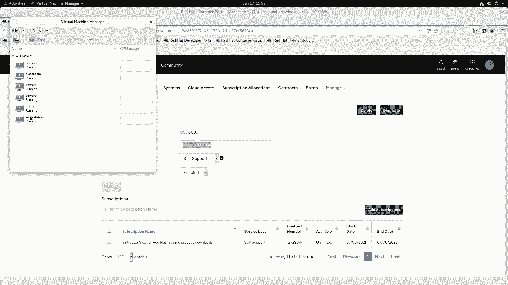
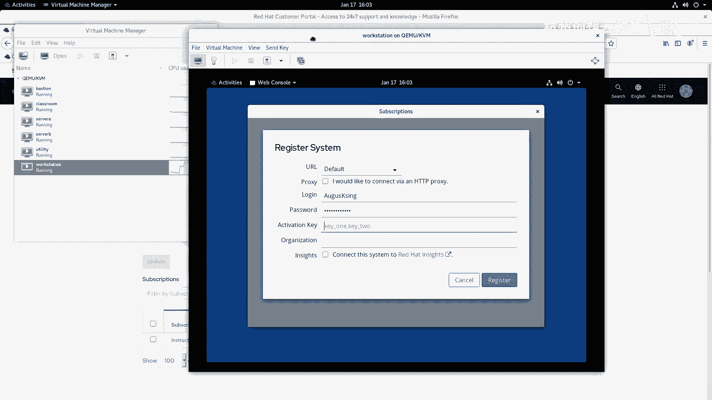

# 红帽认证系列工程师RHCE RH124-Chapter14-安装和更新软件包 - P1：14-1-安装和更新软件包-注册系统以获取红帽支持 - 杭州创想云教育 - BV1GU4y167TQ

啊，第十四章啊，安装和更新软件包。那么在这章啊，我们将会学习啊，如何将我们的系统注册注册啊注册一下，然后呢从而获得鸿帽的这个官方的软件包啊。第二部分呢就是如何呢去使用RPM啊，这种包呢来安装。

以及通过RPM来查询我们系统当中软件包的信息。第三个章节呢将会介绍的是如何使用y命令啊，来查找安装和更新软件包。啊，第四小节呢是啊掌握一些如何呢去启用和禁用啊，红帽自己的或者是第三方的亚木存储库。

OK那么最后一部分呀是我们re耀8里边新增加的一个特点啊，就是叫做模块啊来进行安装软件包啊，一共呢分成了啊这个五个小节啊五个小节。啊。好，那么我们来看第一小节啊，如何呢将我们的系统啊，那么注册。

并且呢获得知持。那么这个地方呢主要是一个演示为主啊，因为啊红帽的产品啊。啊，是需要订阅的，而我们学习啊是不需要订阅的啊，我们教室里面的训机呢都已经配置好了软件仓库。那么大家在学习的时候呢。

都可以去安装啊。那么这个呢是主要是针对如果我们的啊这个在座的啊每个同学呀啊有人公司里面用到了红帽的这个产品。那么你想去激活它，想去使用它的在线的这个技术支持啊各方面。

那么可以了解一下如何去激活这个订阅啊。那么在激活的时候呢，我们首先呢是经历了这种四步啊。第一步呢就是注册系统。啊，那么注册系统就是我们去红猫官网啊啊去把你的账号呢啊进行注册啊，注册之后呢。

你就可以去选择订阅了。那么在订阅的时候，根据你的需要啊，去选择合适的啊一个呃一个订阅的一个什么呀一个。嗯，一个level吧一个级别OK。那么现在的level的话呢是分为三个啊。

一个呢是叫做self support，叫自助支持。第二个呢叫做标准。第三个呢是高级啊。呃，这个详细的话呢，还是要要大家呢去联系啊红帽的售后这个销售人员啊，那么我们这里呢获得的信息呢不够那么的准确啊。

你像我们这个红帽讲师呀，都会分配一个叫做啊这个selfs的一个订阅啊，我们一会儿呢就会给大家来通过这个selfs的来给大家演示啊，自我支持，对吧？哎，红帽呢只给你提供软件仓库啊，基于什么问题呀什么的。

全部自己解决啊，没有技术支持，对吧？而企业的话呢，我们肯定要选择什么呀？标准的或者是高级的啊，一般来说呢都会选择高级的。为什么呀？因为高级的在技术制这一块呢更加的丰富。

并且在出现问题响应的速度方面也是最快的。当我们订阅之后呢，就可以在系统上面啊去启用我们的仓库。然后呢，最终呢可以通过审核和行跟踪。那么要想去。啊，使用我们这个系统进行这个订阅。

我们首先要去注册一个系统啊，那么注册系统的话呢，我这里呢给大家也演示一下啊，为什么要演示呢？因为呃如果你学习完这道课程之后呀，想参加红包的考试，就必须先去注册一个红帽账户。啊。

那我这里呢就在我的放地上面打开浏览器。

打开联机之后呢，我们去火帽的官方网站啊。

OK那么我们我这这里呢直接点击了一个门户啊，门户，或者你选择红帽的啊官网也是可以的啊。然后呢，在进来之后呢，那么在我们的网站的右上角呀，有一个log in啊，我们选择log in啊。

当我选择log in之后呢，我发现哎没有账户，哎，怎么办？下面有一个叫注册红帽账号。红帽账号呢也称为RHN啊，叫做re hat networkwork。所以说我们的叫法很多啊，都是同一个东西。

那么我们在注册的时候呀，那如果你的浏览器是中文的，那么也可以选择中文界面。那么有两个，一个是你的组织啊，企业团体。第二个呢是我们的个人。那么考试的啊，我们就选择个人即可啊，那然后呢选择一个登录信息。

选择你的登录名。那么登录名的话呢，我们至少要有5个字符。OK并且呢没有办法更改啊，因此在创建的时候呢，一定要小心啊，那么在创建的时候呢，我们建议大家呀使用英文的啊大小写字母下划线和数字都可以。

不要用别的。有些人呢在注册的时候用邮箱。啊，能用吗能用，但是后期啊可能会有些情况可能会遇到一些瓶颈啊，可能会不太发现这个账号呢不太适用啊，不要用邮箱啊。好，然后呢根据你的需要呢去输你的名字。举个例子。

比如说我就输我的啊这个名字好了。啊，输我的名字，然后呢，下面呢输入你的密码啊，我这里呢就呃随随便便输一个吧。好吧，啊，上面自动生成一个啊。好，那这里面提示已存在了是吧？我就后面跟个数字啊，0101啊。

这次应该。不重复了，对吧？啊，然后呢输入你的first name last name啊，first name。啊，last name。啊，你的你的这个什么呀工作啊，那么我就按照我的职位啊。

红帽认证的讲师HCI啊，邮件地址。啊，那么我的个人邮箱。啊，然后呢输入啊这个电话号码啊，我这里呢就写个虚拟的啊，1234567890啊，然后呢，下面的这些呀是你的一些联系的信息啊，选择你的所在的国家。

对吧？我们选择china。啊，然后呢输入你的地址啊，在在哪个地方，对吧？啊，比如说呃哪条路对吧？哪条路呢，那么什么什么多少编号啊，这里其实你可以写中文都是没问题的啊。

然后呢输入你的这个啊你的邮政编码是吧？啊还有你所在的城市。啊，所在的省份。啊，然后呢，浙江啊这边。那么写完之后呢，选择创建账号，那么红帽呀就会给你发送一个邮件啊，发送到你的这个邮件地址里面啊。

收到邮件之后呢，别忘了立即呢激活你的账号啊。如果你不激活，那么这个账号呢就白搭了，浪费掉了，激活之后呢，你就可以干嘛呀？去登录到你的门户网站了好，我现在呢去登录一下。

登录成功之后呀，登录成功之后，那么我们在这个页面里面啊，如果你没有这个订阅，你选择左上角的啊订阅。

就能看到啊不同的订阅的level啊，那么因为我这个呀已经有订阅了，所以说呢呃看到的内容啊可能稍微的不太一样，对吧？我选择订阅啊。啊你看我这个是没有的啊没有的。OK那么在overview里面呢。

能看到你当前的订阅的产品的一个情况啊，你看我这个当前里面有24个，对吧？哎，最近没有过期的啊，然后最近自动啊活得这个更新的，有一个一个啊系统呢是支持在啊一个物理机上，一个虚拟机什么巴拉巴拉这些啊。

那么你的相关的系统啊，哪些有没有这个安全方面的漏洞啊，265268个。8个呢有264个啊，那是1004个。那这个是我一个训机里面的啊一个讲课演示用的一个啊都没有做更新。因此它我一直让他保留这样一个漏洞。

那么对于我们讲师而言呀，会拿到一个叫做啊讲师的1个SQU啊，哎是没有限制的啊，就虽然这里面有一个自动更新的时间，看到没有啊，一时间到了自动就就延长了比如说呢我又不是讲师，对吧？

我又不是我们公司呢又没有用红猫的产品，我又想用订阅，那怎么办？你可以选择申请为开发者账号。那么开发者账号的话是每个账号呢有一年的有效期，在这一年之内呢，你可以自由的使用红帽的订阅。啊。

自个使用红包订阅OK好，那么我呢这里呢你会发现啊，既是一个beta的，也是讲师的，也是一个开发人员的都有。那么当你有一个订阅之后呢，你就可以干嘛呀？这个选择呀，在这里面去选择内容了啊，比如说。

我看一看我有激活的密钥，对吧？我把我的密钥呢拿出来啊，这个密钥呢对于我们讲师而言呢，是自动创自己创建的啊，我自己创建了一个啊，创建了1个OK。你看我的level呢是self support啊。

self support，这是我的呃一个名称啊，这是组织的ID啊，这个是不担心大家呢看到的，因为什么呢？因为。这个是由我自己控制的对吧？我可以随时的登上来看一看啊，哪些服务器呢是用用我的这个ID了。

那么接着呢我去干嘛呢？打开我的word station。

啊，来演示一下，在word station上啊演示一下如何呢去激活我们的订阅。

啊，然后呢我这边啊去。

打开我的控制台啊，去登录一下。啊，那么去找到一个软件啊一个软件。那么这个软件啊打开之后呢，和我的这个PPT上这个截图呢是一样的啊，你会看到一个叫做subscripts的一个一个窗口。

我们可以选择这里的注册啊，然后呢，根据提示呢进行注册即可啊。你像这个截图呢就是红猫的ible引擎和红猫企业版的linux产品没有没有订阅啊，没有订阅。然后呢，你可以把它激活啊啊，就是这个。

好，我们来去试一下啊试一下。哎，这个窗口还没有打开啊，我们稍等片刻啊。好，然后呢我你看我这个系统上面啊登录之后就会等其实我系统没有注没有注册，那我可以直接点这里。

啊，它就会弹出一个窗口啊，那么去去去那个做啊，但是它默认只显示了我的主页名信息啊，哎发现反而不好用。所以说呢我们如果是图形化界面啊，那么就选择啊大ashcode找到菜单里面去找一个叫做re hat啊。

subscript measure啊订阅的管理。

点开啊点开之后呀，在这个界面我们就可以选择去注册了。首先注册的时候一定要选择管理员，我呢输入密码。

啊，找student。好，然后啊选择注册啊，选择注册。那么地址我们就走默认了，然后代理没有代理啊，登录名啊，我这里呢输入自己的账户的名称。哎呀，这个这个。图新化界面呀。有的时候不太好用啊不太好用。啊。

输入我的账户名啊。然后输入我的密码。然后呢再输入我的激活的K啊，那么我的K呢写的是叫做HSING啊，2021啊，这个1114啊。

OK组织啊是1099啊，86啊39啊，那么如果呢你还想顺便呢用一下它的ins size啊，我们后面会讲到in size啊，那么也可以直接勾选，我们暂时呢先不勾选，好吧，我选择注册。

那么这个过程啊就需要看我们的网络质量了。好，然后呢我们的订阅呀就提示一个什么呀？哎取消订阅，说明可能成功了。因为我这个呃订阅的问题，那么我就给它窗口关闭掉，我再打开看一看啊，看一看。

好，输入我的管理员密码。

哎，你看它这里可能是网络或者某些原因啊，这个状态是禁用的。呃，也有可能啊是虚拟机的原因啊，虚拟机的原因，所以说呢就不让我去使用啊，这个啊讲师这个还是限制比较多的啊。啊。

然后呢我这边呀就通过命令行的方式看一看行不行。

怎么去使用呢？我去来到ETC下面的ym点report地里面，那这里有一个叫re呃 red hat report的文件，我看一看。那其实已经可以了，你看那么在这个里面呀多出了大量的什么呀。

大量的这个仓库的地址非常多哎，非常非常多啊，各种各样产品，你看什么CNV是吧？啊，这个附加的呀，OCP对吧？还有其他内容，那我那我订阅之后，其实我就可以理论上来说呢是能用了啊。

但是因为我这个账号的某些原因啊，可能看起来不是特别的舒服。你说那我万一我这个服务器没有装图话界面，那这个方法就不太适用啊，那怎么搞啊，那么这种的话呢，我们可以啊，给这个啊re耀8上啊。

那re耀8上呢，我们可以去这样做啊，那么在re耀8上呢有个功能呢叫co，我们可以把它给起来一下。啊，start起来啊star起来我们的cookee pit。第soocket。啊，把这个给起来起来之后呀。

我们去浏览器上面啊访问啊我们的serv A。

点儿lib点儿ex点com端口号呢是9090。那么在访问的时候呢，我们去把这个证书的问题呢给它啊允许掉，然后输入账户。

啊，输账号。然后呢，在这个页面啊，我们的左侧有一个什么呀，有一个订阅啊，有个订阅，然后呢选择这里点开。因为发现和刚才的页面是一样的，然后你选择注册啊，因为刚才我说了，我这个账号有些问题。

所以说呢明明注册过了啊，另外一个页面打开呢还是没有注册，是不是啊，我们。过程还是和刚才是一样的。你说那我这个不是re耀8是吧？啊，也没有装图发界面，那这两个方法都不实用，那怎么搞？

那么我们就可以啊使用什么呢？使用命令行终端来实现啊，那么在命令行的话呢，我们就可以使用这个命令叫做subscription。

啊，measure，然后呢选择注册，然后呢选择你的用户。然后呢输入你的密码。啊，密码是多少输进去啊，回车啊就可以了。然后根据其他内容啊，不同的订阅呢可能不同的内容。然后呢，订阅成功之后呀。

你可以去看一看，对吧？我们哪些仓库呢是可用的。啊，哎，你看我这个还是刚才原因啊，说看不到，他认为是没有没有注册啊。哎，这是给大家演示了我们的这个订阅啊，因为我这个环境受限，所以说啊也成了也没成，对吧？

啊，如果感兴趣的话呢，咱们可以申请一个开发的账号啊，感受一下啊，非常的方便。

