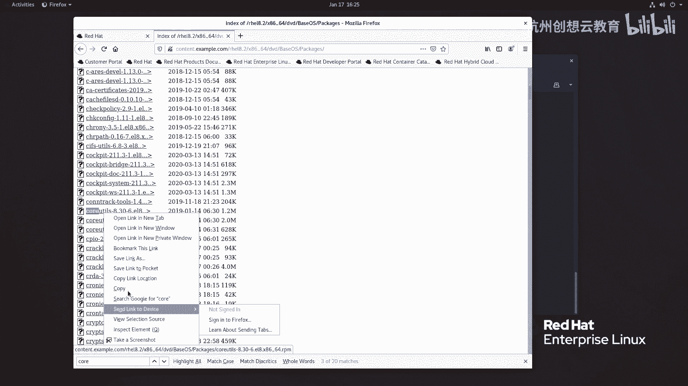

# 红帽认证系列工程师RHCE RH124-Chapter14-安装和更新软件包 - P2：14-2-安装和更新软件包-解释和调查RPM软件包 - 杭州创想云教育 - BV1GU4y167TQ

哎，第二节的话呢是通过RPM啊，这个软件包管理器啊来查看我们的软件包的啊安装情况啊，以及如何呢使用RRPM来安装软件包的啊一个啊一个一个命令啊。那么首先呢我们在这个整个的红帽呃阵营里边呀。

我们安装的包呢都是RRPM包啊，都是RRPM包OK那么除此之外呢，在我们身边呀也有啊德变阵营的。那么它的包呢是叫做DB啊DB这种包。啊，那么包不一样，那么安装的管理工具呢也是不一样的啊。

比如说得ban的话呢用的是DKPG啊，而我们的这个啊红帽里面呢用的是RPM啊RPM。那么对于我们RPM而言呀，这个包本质上啊是一种归档包哎，本质上是个归档包。

但是呢它的归档里面啊包含了一些啊软件的一些信息啊，其他信息也也是包括在内的啊，那么我们这张图呢就是一个标准的RPM包。啊，我们来看一下阿平包的组成部分啊。那么在一个阿平包里面呢，一共分了4个部分。

第一个部分呢，比如这里的co tells则代表的是我们的啊软件名称啊，第二个部分呢8。30啊，是我们的版本。注意啊，这个版本呢一般指的是软件的上游版本。O而后面的这个release发行版本。

我们可以理解为是下游版本，谁的下游呢？红帽啊，嗯那么给它经过改进之后发售出来的啊，就是我们的上游的下游。OK那么为什么呀红猫要这样做呢？我们以内核为例啊，你像内核每次发布呢，它都会做一些重大的调整。

它会丢弃掉大量的啊API和APBI啊，然后呢再增加新的API和API。那么如果我们企业里面呀跟着啊上游的内核更新而去更新内核，那么就有可能导致系统出现问题。比如说我们辛辛苦苦开发的应用程序。

没有办法去运行了。啊，那这是非常这个致命性的啊，那么我们就需要重新花费大量的人力精力呢去重新去开发，对吧？那么而红帽呢就不一样了。红帽呢将你当你去订阅它的产品之后啊。

红帽呢去把这个产品啊啊从上游拿到之后啊，经过大量的测试啊，然后呢发现哎我当前的这个产品里面啊还需要啊保留一些旧的功能，哎，我就把这个旧的功能啊拿下来。那并且呢对新的功能呢进行测试啊。

稳定之后呢哎再发行啊再发行。那么发行之后呢，就是这里的release了。因此红帽呢它承诺就是说在一个大版本的框架下，你用我的片包啊，肯定不会出现问题啊，稳定啊，稳定叫要企业级对吧？稳定。

那么再往后呢是arch。那么arch的话呢，是我们的包的一个架构呀，你像这个呢就是一个叉86架构，64位的操系统，那么除此之外呢，我们可能还会见到什么A264，对吧？ar架构的64位。

还有no arch啊，部分架构的这种包啊都会见到。啊，那么在我们教室里呢，可以通过访问啊访问我们的这个一个站点，叫做content点ex点com来获得我们啊这个教学环境里面的啊软件仓库。

那么我们的系统呢是re8。2，因此我们选择re8。2啊，根据这里的路径呢去选择找到DVD啊。DVD里面我们看到这里有两个目录啊，一个呢叫app stream，一个叫base OS。好，我们选择其中一个。

啊，那么在这里呢就有大量的这种包，对吧？我们甚至有可能啊就能找到刚才的什么呀crow u。就这个包。啊，这个包OK那么这些全部是我们的RP包啊RP包OK那么RPR包的话呢。

对于对于我们的阿PR包本身而言啊，我们当时说了，那么RP包里面包含了什么内容呢？啊，它是一个它其实上啊本质上是一个归档包啊，那么一个RP包里面包含的内容呢？不仅仅有这个呃。

他的这个。程序本身啊还包括了这个一些原数据信息啊，比如说这个内幕啊这个版本啊等等啊，还有一些软件包的摘要啊，帮助描信息啊。还有一些呢就是我们在安装或更新或者卸载PM包的时候，它要执行那些脚本。啊。

这是1个RPM包里面包含的内容啊，那么我们后期呀是可以通过啊RPM相关的命令来查询啊，我们的这个系统当中RPM包的信息的。那么最常的方法呢就是RPM杠Q来查询。啊，杠Q来查询啊。

那么我们这里呢举点例子啊，那么这些例子啊是用的还是频率比较高的啊比较高的。那么首先呢我通过RPM杠Q呢去找一个包，好吧，那么去就把这个啊咱们教学环境里面的这个呢拿下来一个啊，我去把它登录了下来。

然后呢，RPM杠Q啊去查询这个col u。啊，哎sorry。看一下啊，这里嗯。Q啊。youts杠8点谁呀？嗯。sorry啊，这个Q的话是直接查询我们安装过的包吧。我想查询一下我这个刚下来的包要加个P啊。

哎，P什么呢？P我们的这个c啊 u。啊，这个包信息哎，没有没有其他多余的内容输出来，为什么呢？因为我们系统里面有它的公钥啊哎什么意思呢？我们来做个对比就明白了。那么我这边呀去搜一搜啊，这里的包。

你看我之前呀在啊eel里面呢下载了一个Htop对吧？我就RPM杠QPH top。那么它就会提示我什么呀啊，它需要一个公钥来做验证啊，叫2F86D6A1啊，那么什么是公钥呢？

在呃我们的阿平包呀开发的时候呢。开发人员啊同样会有一个私钥，然后呢通过这个私钥呢去给这个软件签名，然后呢进行发行。那么发行之后呢，他会把这个公钥呀放在互联网上面，用户呢可以使用这个公钥进行签名验证。

看看这个包样有没有被篡改。而现在呢验证第一个包通过了，说明我们系统里面呀具备了啊检查该软件包的一个什么呀公钥。但是呢我在去检查这个Htop的时候呢，它却提示呢没有通过前面检查啊，那么我们可以干嘛呀？

把这个公钥呀安装一下，那如何去安装一个公钥啊，那么我这里呢再去搜eal啊，那么一般你从哪里下载。那么这个网站里面啊，就有对应的什么呀啊，公钥信息。那么在这里有一个RPMGBTK啊。

这个eal8一个这样的文件，我把这个文件呢链接呢拿下来啊，直接呢通过RPM杠杠import导入公钥跟上公钥文件的地址。

然后呢，我再次检查Htop哎就可以通过了。啊，这是公钥啊，一定要去有公钥。如果没有公钥的话，那你这个软件安装的时候呢，就没有这个保障了啊，没有保障了。那么除此之外呢，我们的还有一些其他的命令。

那其他命令我们来看一下我们的PPT。

啊，刚才呢举的就是这里的QP啊，我们这个基录上没有。那么除此之外呢，我们还可以通过QI啊来查询我们包详信息。I嘛information对吧？QA则查询系统当中所有安装的包啊。

然后呢QL呢是列出安装的软件包文件分散在系统里面哪些位置。Q啊C来看安装软件的配置文件啊啊，这个QD来查看它的帮助文档啊好，我们来感受一下。

啊，现在呢我通过RPM杠QA可以啊来列出所有已安装的RPM包啊，非常多。但是呢我想看一看某一个包有没有安装。比如说GCC有没有安装，那我可以通过管道服来进行过滤，叫GCC。

那么筛选出来的GDC啊只有一个酷而没有GC的软件包，因此没有安装啊。那么接着呢我又想看一看我的SH。SH里面呀，你看客户端也装了，服务端也装了。我现在呀我要看服务端装完之后。

它生成的文件分散在性的哪些位置了。在看之前呀，我先去看看这个软件包的 information。啊，这是包里面信息，你看名字、版本发行啊，版本架构啊，安装日期啊，属于哪个软件包组啊，大小许可协议啊。

签名对吧？公钥的这个ID对吧？啊，这个原来的阿片包吧，巴拉巴拉啊，都有。然后呢，我想去看一看这个包的详细的这个什么呀，装在系统当中哪些位置了，我可以使用QL啊，它会把我们的。包的位置呢全部啊列出来。啊。

列出来这是QL。那如果我想看一个包的什么呀，它的文档在哪里，那就QD啊去查询啊，那么除了慢之外呢，有些还有doock啊，还有doock啊。这个。OK好。

那么接着啊接着你像我们刚才呢下载了一个H talk。那么htop的话呢，我们已经经过了这个签名检查了。那么在安装的时候，它有包含了哪些脚本呢？哎，我们可以通过RPM杠QP。刚刚啊这个script。

跟上我们的这个包，哎，就能看看有没有执行脚本，发现哎没有对吧？没有的话呢，有可能用的是什么呀？触发机制的这种脚本叫ts。啊，也没有，那么我们就换一个好吧，换一个，比如说这里的stress。也没有啊。

脚本里面的花框str有没有？也没有都空的空的。那么我们再找一个好吧，找一个包，比如说找一个。

嗯，我记得科闹啊一般是有的，我们找个科闹，好吧。那科呢我把这个坑呢给它下载下来。

然后呢去检查一下。啊，也没有啊啊，今天找的这两个包知道，怎么都没有脚本呢？啊，都没有没有的话，我们再找一找别的啊，找一找别的。

阿玛奇呢？阿87应该在apple stream里面。

OK我们把它拿下来。有没有发现这个包和以前见到的包不太一样，对吧？我们后面给大家再解释。OK那么这个包里面就包含了一些脚本，比如说安装之后啊，要执行的动作啊，卸载之后要执行的动作啊。

执行的动作OK那么看看有没有触发的脚本。啊，也是有的啊也是有的。那么触发的里面包含的什么呀？走了一个什么呀？C5的指令，对吧？C5的指令啊，那这个咱们了解一下就可以了啊，不用详细的去啊深入啊。

那如果我们要想把这个RPM包呀给它干嘛呀，给它展开啊，我们想看看里面的内容，那么我们可以使用RPM two啊，这个CPIP命令以及CPL呢来提取软件包的内容。那么怎么去提取呢？

啊，我们这里呃就拿这个科闹为例，我们把它展开好吧。RPM啊，这个to啊CPIO后面跟上我们的科 now然后管道符啊CPIO啊，然后呢杠ID啊杠ID哎，我就直接CPI好了回车。啊。

CPO里面我加一个什么呀，我加个直接加1个ID好吧。啊，我没有展开啊，只是看里面内容。然后我们还有个CPIO里面有一个帮助。我们来看一下。我们给他展开好吧。O和V啊O和V。IDV啊IDV好。啊。

我现在看一下这个，我先把这个USR删一下啊，我害怕它影响我们的判断，再来走一次。好，没有，那么用谁呢？有一个命令我去再去埋一下啊，好长时间没有执行了，我们去埋一下RPM to CPUPU。

这里面有个例子啊叫什么呀？叫DIUM啊，用这个。哎，去哪里了？啊，我还记错了吗？看一下。哎，可能是内核的原因啊，我们重新给他找一个文件，好吧。RRPM two这个CPIO，然后呢跟上。跟上谁呢？

跟上一个叫做Htop好了啊，我们把它展开啊CPIO啊CPIO那么给它展开啊，还是刚才的选项，然后呢ID。IDM啊V。啊，果然是命令的原因啊，呃软件包的原因啊，展开了。展开之后呢。

我们本地啊就多了一个谁呀，多了个USR啊，我们加1个杠R来看一下。你看这个是包里面包含的内容啊，非常多。哎呦，是不是加错了，不然怎么这么多回车啊，那么你看。啊，展开之后呢。

它和安装之后的路径都是一样的啊，分散在不同的位置哎呀，不同的位置啊，那么这是这小节的内容。

