# 红帽认证系列工程师RHCE RH124-Chapter14-安装和更新软件包：14-2：安装和更新软件包-解释和调查RPM软件包 🔍

在本节课中，我们将要学习RPM软件包管理器的核心概念，包括RPM包的组成结构、如何查询已安装的软件包信息，以及如何检查未安装的RPM包文件。通过本节内容，你将能够理解红帽系统软件包的基础知识并掌握基本的调查命令。

## RPM软件包概述

在红帽阵营的操作系统中，安装的软件包格式是RPM包。与之相对，在Debian阵营中，软件包格式是DEB包。不同的包格式使用不同的管理工具，例如Debian使用`dpkg`，而红帽使用`rpm`。

RPM包本质上是一种归档文件，但它不仅包含软件本身，还包含了软件的元数据、摘要、帮助文档以及在安装、更新或卸载时需要执行的脚本。

## RPM包的组成部分

一个标准的RPM包名称通常包含四个主要部分，其格式如下：

**`name-version-release.architecture.rpm`**

以下是每个部分的解释：

*   **name**：代表软件的名称。
*   **version**：代表软件的上游版本号。
*   **release**：代表发行版本号，可以理解为下游版本（例如红帽在测试和改进后发布的版本）。红帽承诺在其产品的大版本框架内，使用其发布的软件包能保证稳定性和兼容性。
*   **architecture**：代表软件包的架构，例如 `x86_64` 表示64位x86架构，`aarch64` 表示ARM 64位架构，`noarch` 表示与架构无关。

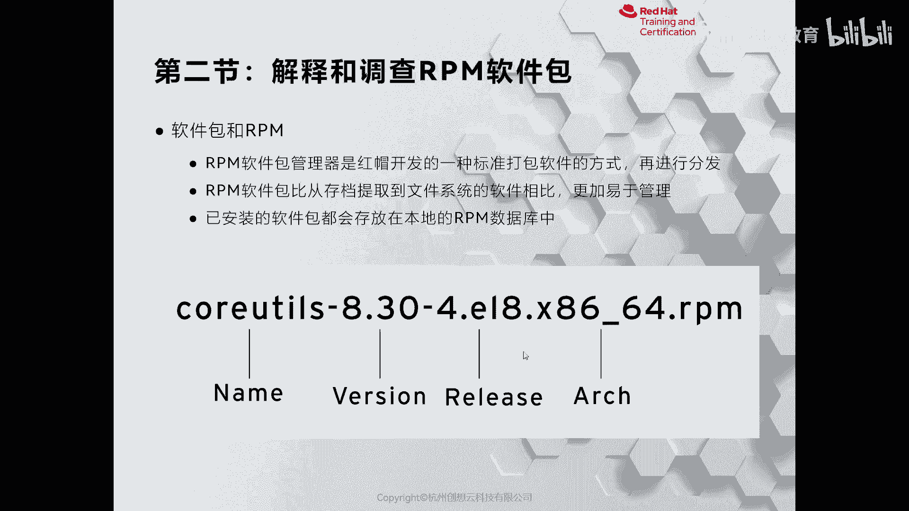

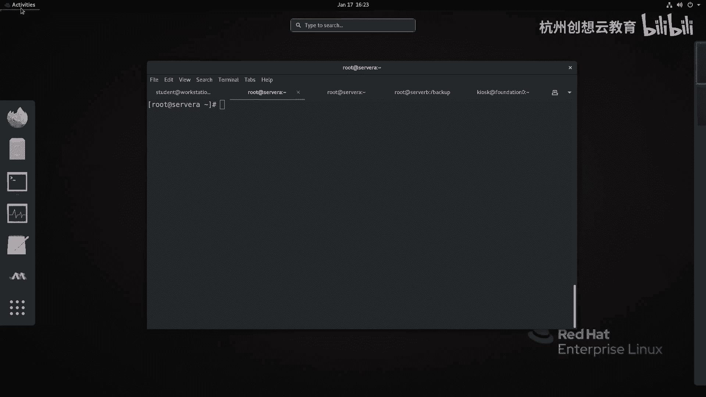

## 查询RPM软件包

`rpm` 命令配合 `-q` 选项用于查询软件包信息。以下是几个常用查询命令的介绍。

### 查询已安装的包

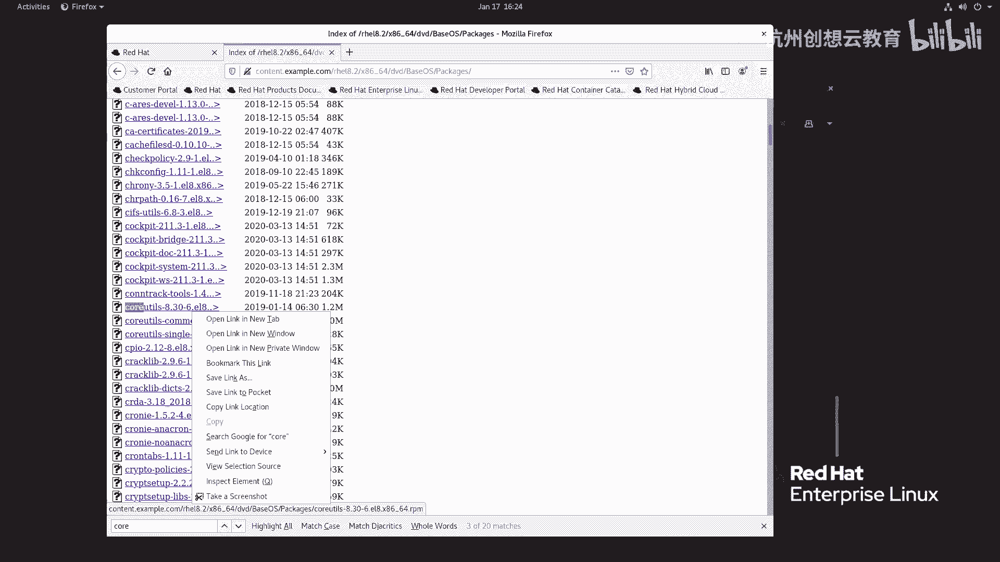

要查询系统是否安装了某个软件包，可以使用 `rpm -q` 命令。

```
rpm -q package_name
```

例如，查询 `gcc` 是否安装：
```
rpm -q gcc
```

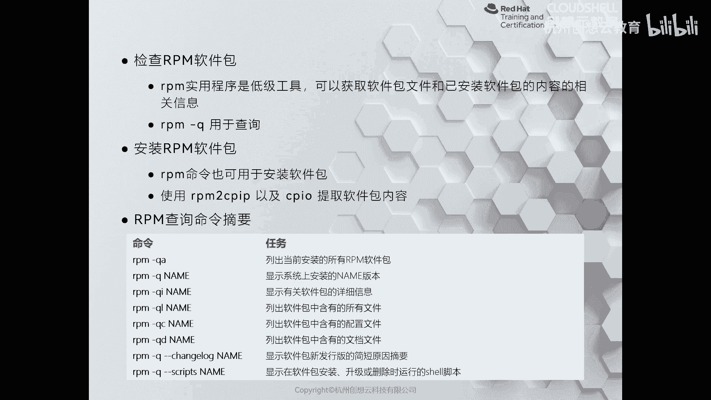

### 查询所有已安装的包

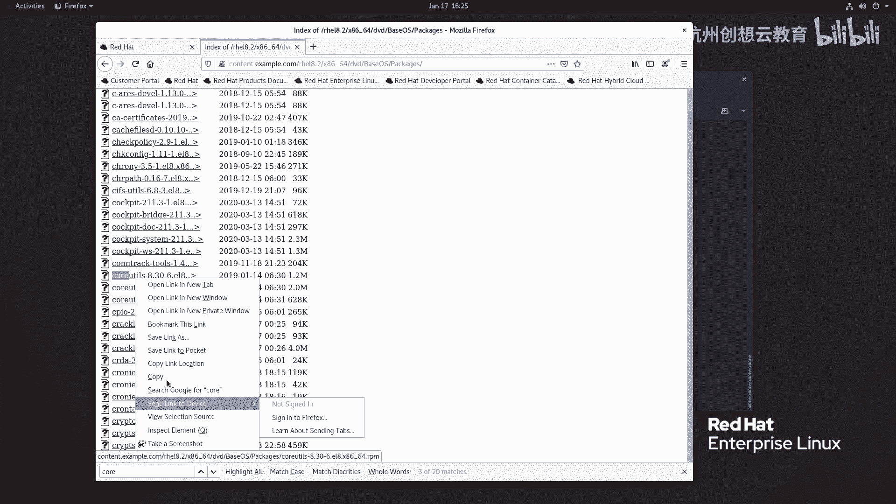

要列出系统中所有已安装的RPM包，可以使用 `-a` 选项。

```
rpm -qa
```

### 查询包的详细信息

使用 `-i` 选项可以查看指定软件包的详细信息，包括名称、版本、发行号、安装日期、大小、许可证和签名等。

```
rpm -qi package_name
```

### 查询包安装的文件列表

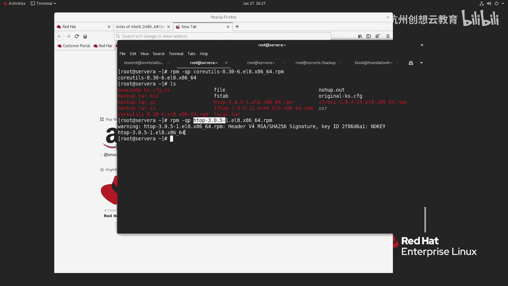

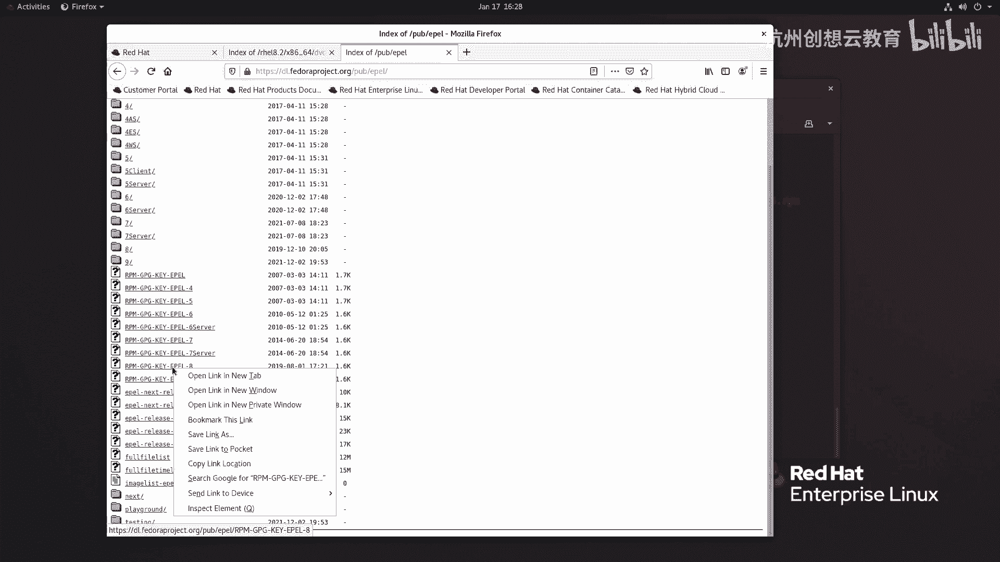

如果你想知道一个已安装的软件包将文件释放到了系统的哪些位置，可以使用 `-l` 选项。

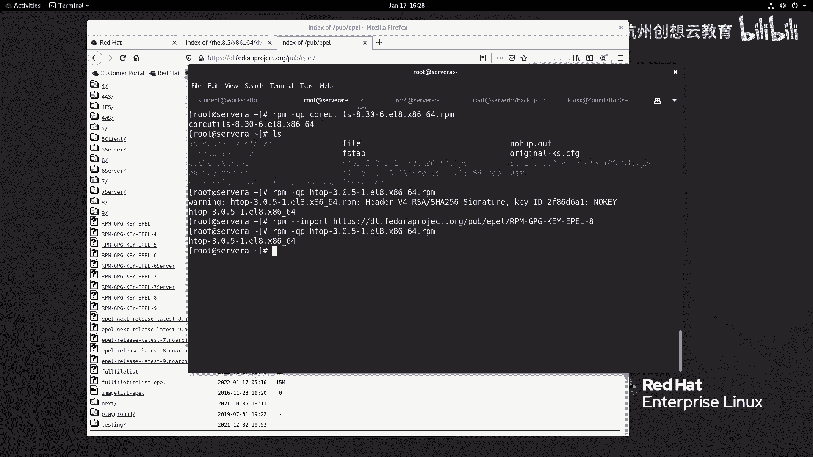

```
rpm -ql package_name
```

### 查询包的配置文件或文档

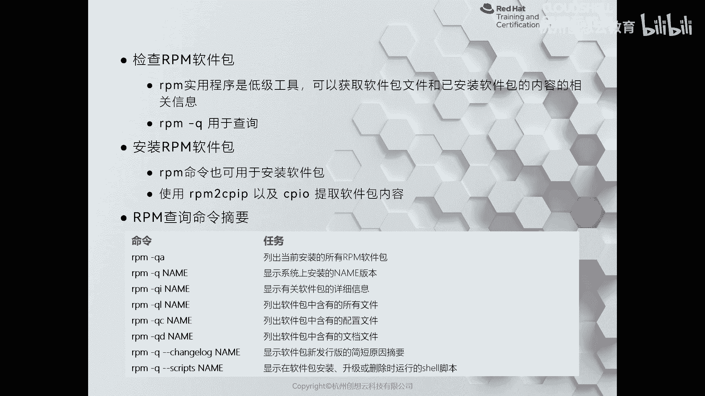

*   使用 `-c` 选项列出软件包的配置文件。
*   使用 `-d` 选项列出软件包的文档文件。

```
rpm -qc package_name
rpm -qd package_name
```

## 检查未安装的RPM包文件

上一节我们介绍了如何查询已安装的软件包，本节中我们来看看如何检查一个尚未安装的RPM文件本身。

### 查询RPM文件信息

要对一个本地的 `.rpm` 文件进行查询，需要在查询选项前加上 `-p`。

例如，查询 `htop-3.0.0.rpm` 文件的信息：
```
rpm -qpi htop-3.0.0.rpm
```

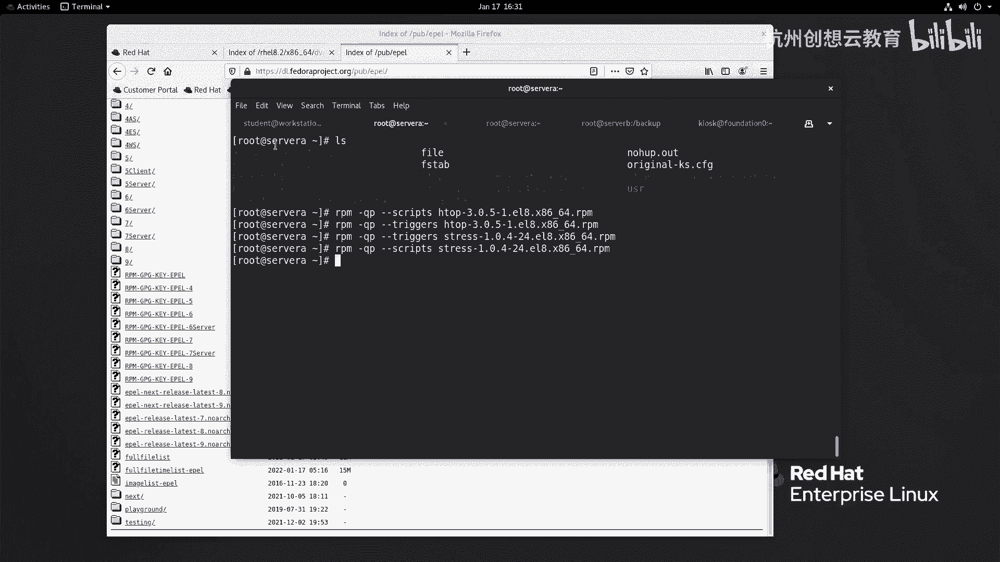

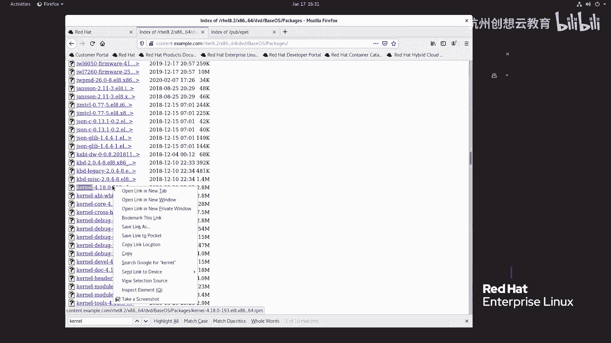

### 软件包签名验证

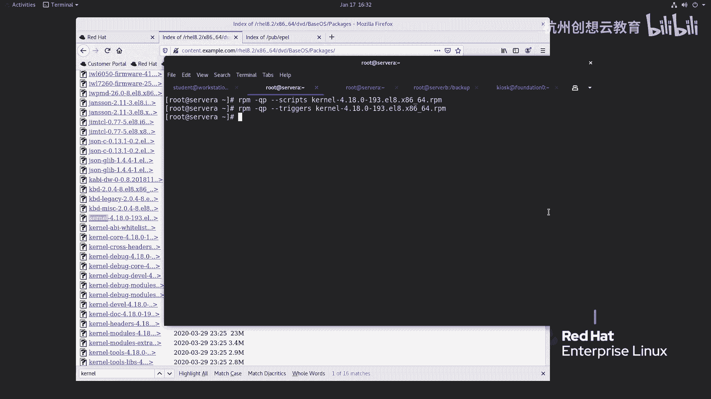

在检查或安装RPM包时，系统会使用GPG公钥来验证软件包的签名，以确保其完整性和来源可信。如果系统没有对应的公钥，验证会失败。

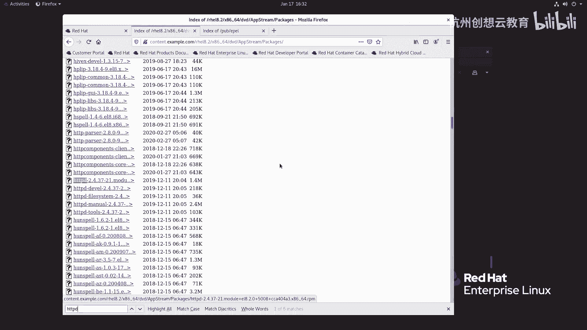

你可以使用 `rpm --import` 命令来导入公钥文件：
```
rpm --import /path/to/key-file
```

### 查询RPM包中的脚本

RPM包可能包含在安装、卸载等不同阶段执行的脚本。使用 `--scripts` 选项可以查看这些脚本内容。

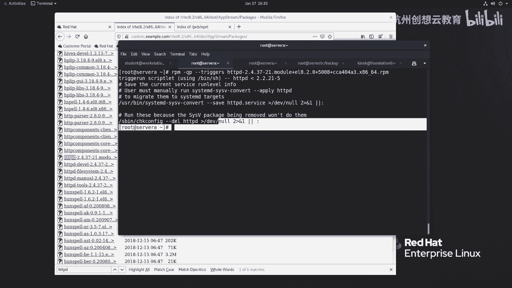

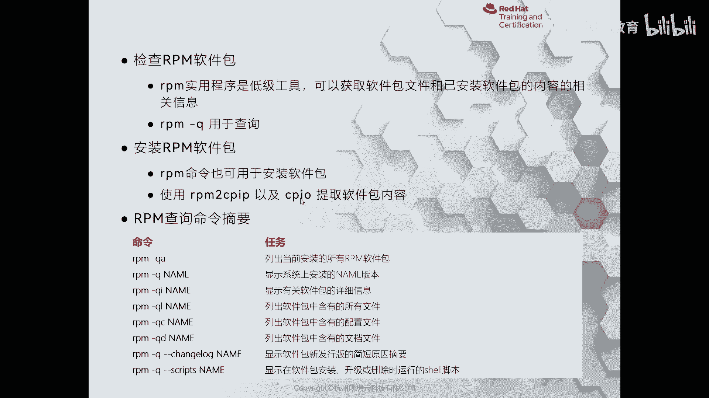

```
rpm -qp --scripts package_file.rpm
```

## 提取RPM包内容

有时，你可能需要查看或提取RPM包中的文件而不安装它。这可以通过结合 `rpm2cpio` 和 `cpio` 命令来实现。

以下是提取RPM包内容到当前目录的命令：
```
rpm2cpio package_file.rpm | cpio -idv
```

执行后，RPM包中的文件会按照其原本的目录结构被提取出来。

## 总结

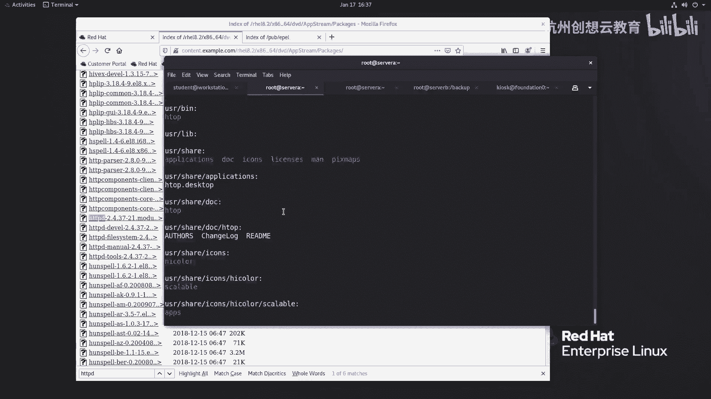

本节课中我们一起学习了RPM软件包的基础知识。我们了解了RPM包的命名格式和组成部分，掌握了使用 `rpm -q` 系列命令查询已安装软件包信息的方法，也学会了如何检查本地RPM文件的内容、验证其签名以及提取其中的文件。这些技能是后续进行软件包安装、更新和管理操作的重要基础。