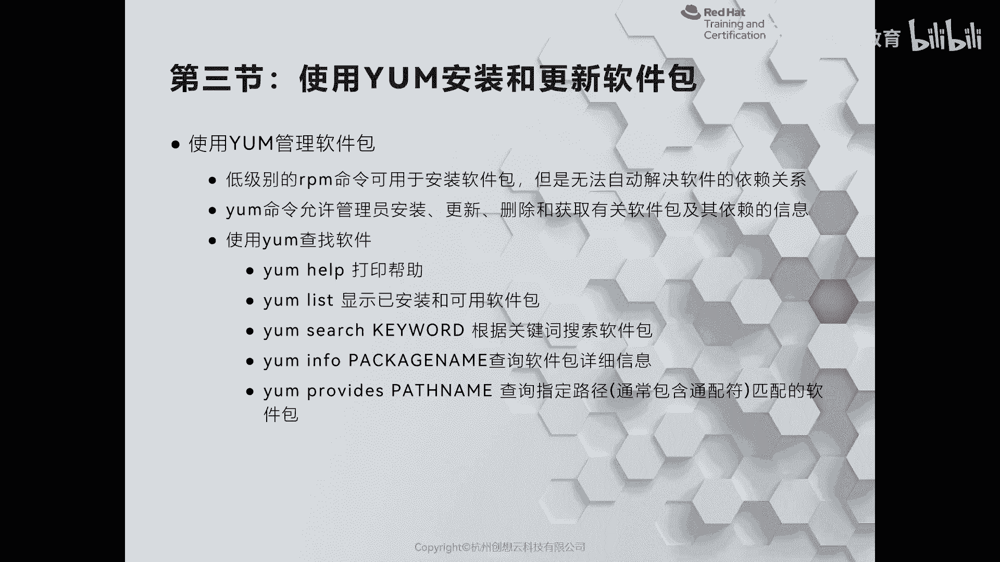
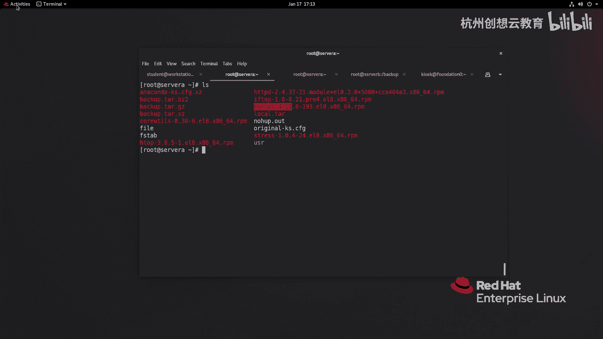
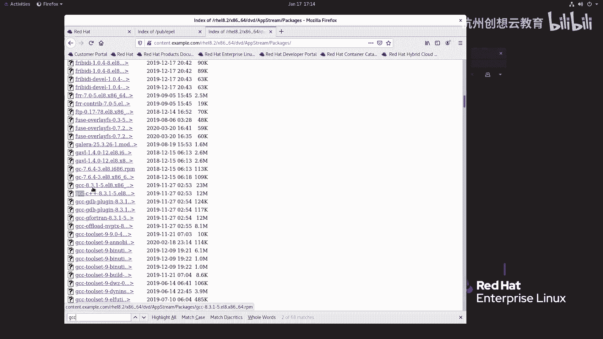
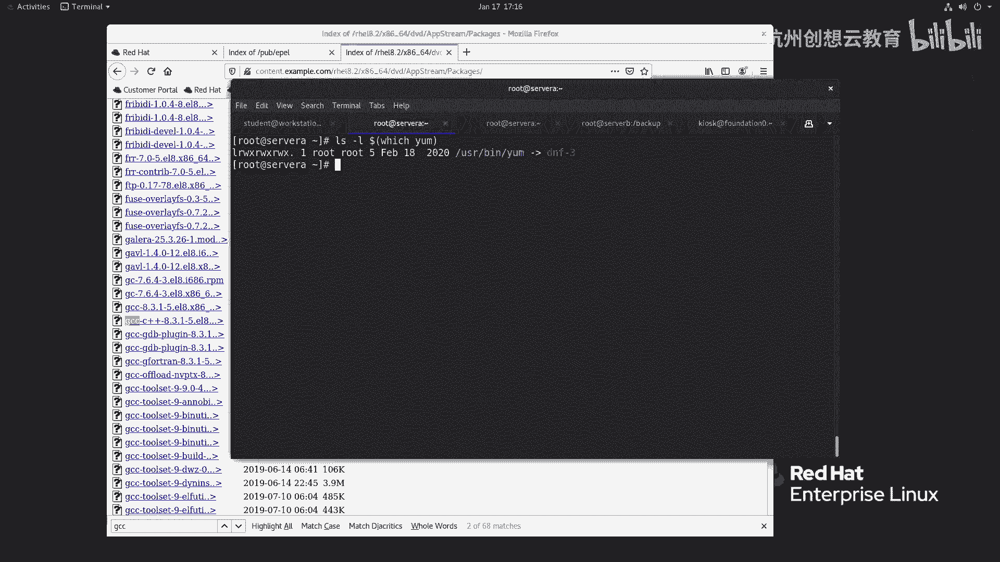
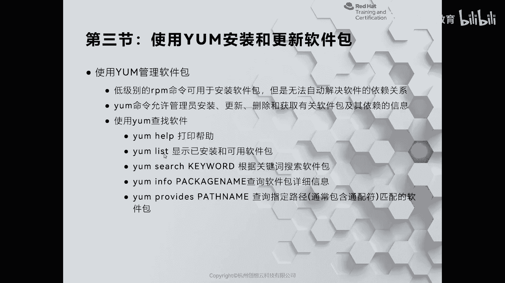
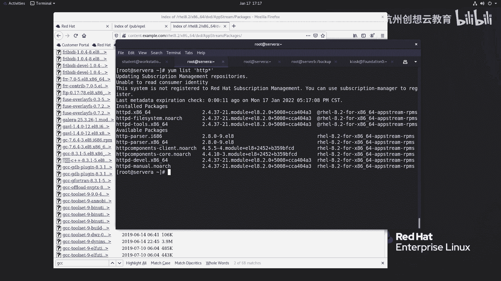
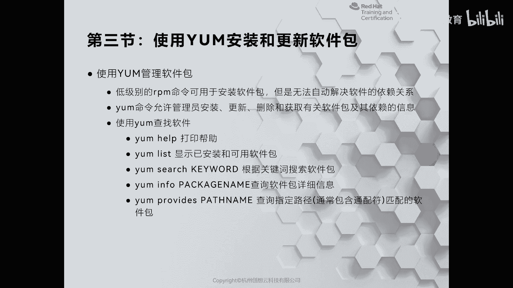
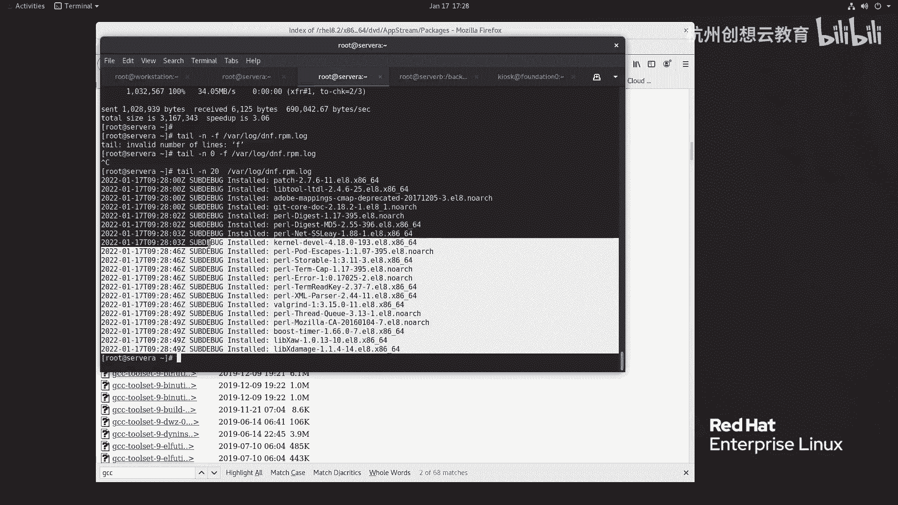

# 红帽认证系列工程师RHCE RH124-Chapter14-安装和更新软件包 - P3：14-3-安装和更新软件包-使用YUM安装和更新软件包 - 杭州创想云教育 - BV1GU4y167TQ

哎，第三节啊使用yM来安装和更新软件包啊。那么刚才呢我们在第二节呢给大家演示了如何通过RPM呢来查询软件包。那么其实RPM啊也是可以安装的啊，也是安装的。好，我们来先看一下效果啊。呃。

现在呢我们的目录里面呀，这个有很多个目很多个软件包啊。那么其中这些包除了IHTTBD还有这个科之外，我们都安装过对吧？都安装过好，那现在呢我再去我们的这个。

呃，站点呀去找一个包，我们来看看效果。我去找1个GCC啊GCC。GC的话应该在app stream里面啊，我们来去找一找。O。😊，这是GCC啊，这个就是我把它倒下来。

啊，那么GTT的版本呢是。8。3点1啊，我们来转一下2BM杠什么呀？I啊VH来安装一下我们的GCC。那么在安装的时候呢，他报了一个这样的信息，他说要想安装GEC呀。

你需要安装1个CPP啊Gle C以及还有两个函数的支持。那么这种情况呢，我们称之为是一个依赖啊依赖O。嗯，为什么呢？因为对于linkux而言呀，我们发现它的软件包啊都是非常小的。

它不像windows里面的包啊，非常大，你看都非常小。你看这个只有100多K。啊，这个很大，就24兆对吧？哎，是非常大的。那么为什么会这样子呢？是因为这个。在linkux里面啊开发一个应用程序呢。

会遵循一个这样的原则。就是说呃它在系统在安装的时候呢，它会有一些库。那么这些库的话呢，就是说对于开发人员而言呢，他在开发的时候啊，他会尽量呢啊这个不去把这个包里面呀需要的依赖呢全部给它封装在一起。

而是把这个依赖呀全部寄托在你的系统里面啊，有没有安装这个东西？那这样的话呢就可以保证啊大家呢去共同共享的使用这个库。那么你在开发一个包的时候呢，这个包就会变得很小。但是呢缺点就在于啊。

那么有可能啊你的系统上面正好没有这样的一个库的依赖。然后呢，你装这个包呢，正好需要这样一个依赖就会出现问题。那怎么解决呢？那么在德变的这种系统上啊。

我们可以通过APT或者是APTge命令来自动安装软件的时候呀，把这个依赖给解决了。而在我们的红帽企业版linkux上面啊，我们可以通过y命令来进行啊解决这个依赖。

但是呢在我们的re耀8上那个y呢又有点特殊。我们利用之前的L命令啊去查一查我们的这个啊查找我们的这个ym代表代表什么意思。我们会发现我们的y呀指向的是DF。啊，的确啊在我们的re耀8上面呢，亚么已经。

消失了啊，真正替换的呢是DF这个指令。O所以呢我们还可以保留旧的习惯啊，通过y么来查询，其实本质上啊还是谁呀？是DF啊DF。那如何去用我们yM来进行软件的安装和管理呢？啊。

我们可以通过yM list来查看啊，我们已安装的包，还有可用的包。它其实就把我们的仓库里面所有的包呀，还有系里面这个。

已经装过的包呢都给以门裂出来啊。好，我们来试一下。好，那现在呢我去执行一个命令啊，叫做y list。啊，他会把包啊都列出来啊，非常多。那如果我只想看一看啊。

和HTTPD有关的那我就可以加上一个HGDP新号啊，之些呢搜索到的全是HTP的。那么其中insted呢代表的是安装过了的包。而下面的可用的包呢，就意味着还没有安装啊。

还没有安装okK那如果我们想搜索的话呢，那么可以使用啊yng search进行搜索啊，yng search跟上关键词就可以掌握的包。比如说我想找一找谁呢？找一找这个en。

47。啊，Nin回车，那么就能够去找到Nin的包。那么查找的结果里面呀，左侧呢是软件包的名称。OK然后呢，右边呢什么呀？右边是我们的这个关于包的一个解释。啊，一个解释OK啊。

这是通过ym search啊ym search。当然了，我们也可以干嘛呀？去查询一下所有的包含有，比如说web服务器的一个字段的。那么可以走一个叫做啊ym search哦那奥里面包含了谁呀？web啊。

啊，server会车啊，所有包含有web server字段的软件包呀，都能够查询得到。okK这是ym search的用法。当我们查询到一个包之后呢，我们要想获得该软件包的详细信息。

可以通过ym in来获得。好，我们来走一个啊y么 in four，比如en。哎，就能够获得这个包的一个详细的内容啊，详细的内容。OK你看这个包有没有发现和RPM杠QI是一样的对吧？

只不过杠QI呢是查询的是以安装的而我们的啊这个命令呢是查看没有安装过的，那么啊，然后这个呃版本啊，发现版本架构大小啊等等啊，都是能够看得到的看到的啊，那如果我们查询之后啊，确定的就是这个包了啊。

就这个包了。那么我想把它给安装啊，那么可以通过谁呀啊，ym install的方式来安装。那么我们安装哪个包呢，我们装这个GCC吧。因为刚才本地的方法安装是有依赖的。那么我就通过y啊去搜我们的GCC。啊。

非常多啊，然后呢我去安装这个GTC。那么在安装的时候呢，它首先会根据库里面的信息呢解析出来我们的机器的包来源于哪里啊，来源于我们的这个仓库啊，然后呢，它需要依赖关系啊，一共是8个包，问我们要不要安装啊。

我们可以输个Y呢开始安装。啊，安装之后呢，它会进行一个校验。啊，好，校验校验之后呢，就给我们做一个汇总啊，是哪个包都安装了。那么安装成功啊，一定要看到有一这样的提示才说明你的包安装成功了。

并且还要看这个已安装里面有没有包含你刚才啊敲级命令的时候呢，包含的软件包。如果啊如果你发现少了一个。那么就有可能啊你的软件包的名称啊，写错了啊，而导致没有安装。啊，没有安装O。好。

那么接着我们再来介绍个名字叫什么呀？叫ymupate。ym update呢是用来更新的啊更新的。那么很多人呀在更新软件包的时候呢，就直接ymupdate呢去更新了啊。

我们的servA来update一下实试效果。OK那么我们的4A里面是没有做更新的。但是我们刚才呀不是把这个word station做了订阅吗？哎，这个上面呀确实有更新的update一下。好。

我们来看一看啊，这个订阅过的系统。好，那么我们看到这个信息里面一共有36个包要安装和812个包呢要更新。那但是太多了啊，我们完全没有必要这样做。有的时候啊sorry。我要摁N的啊。

然后你要ctl C了啊，那么我们可以怎么做呢？比如说我们有了高微漏洞，我们可以通过啊秀度。好，直接切换到root了。好，我可以y么updateupdate的话呢，我们可以help一下。

在update里面有一个这样的一个选项。啊，叫做什么seecreity啊，我只想看安全相关的。我看看有没有更新。比如说什么零润漏漏洞啊这种啊，哎发现和刚才是差不多是吧？我摁一下N，然后呢。

我再加上一些策略啊，我再还往下。呃，我加个什么策略呢？比如说。啊，那么我想看一看啊，看一看我们的这个安全级别里面属于是啊critical的。我想去更新一下啊。啊，crical。好，我们来看看有哪些。哎。

那么我们发现呀在这个critical里面呢只有7个包，哎，我完全可以只更新这个漏洞，属于是高危的，哎，我去更新。哎，是可以的啊是可以的啊，就说我选择性的去去更新。

而不是说一股脑把所有的更新包呢都去装上去啊。当我安装之后呀，我们还可以把它给卸载掉。比如说我们sA上面刚才装的GTC，我可以去卸载remove一下我们的这个什么GCC。好。

那么把刚才装的包呀都给它卸载掉了。O。😊，啊，这是一个升级啊，一个卸载啊一个卸载。呃，如果我们对比如说刚才的升级呢，因为它太慢了啊，我们稍微等它一下，让他把这个软件b呢装完。好，马上就安装结束了。

你看都在升级啊升级。如果我们发现升级之后呢，某些软件呢可能用起来不稳定啊，我们还可以给它降级。那如何降级呢？我们组的命令呢叫做ym historyistory。

那么history的话呢可以帮助我们啊查看我们的历史记录。比如说刚才我做了一个第八个步骤是吧，升级，哎，我可以干嘛呀？给它回退一下啊，回退第八个步骤，y么 historyistory。撤销第几个呀。

and do第8个。这个要比降级要好用啊，使用history指令。这样呢又把系统恢复到我们升级之前的一个状态了。Yeah。啊，让它执行着啊，我们来继续看PPT。啊。

那么刚才这些命令啊都是针对于单独的软件包来制定的。但是呢我们系统当中啊软件包也有组的概念啊，什么是组呢？呃，我们用过windows的同学呀，应该非常的有印象。那么我们身边常用的办公软件呢。

一个呢是微软的office，一个呢是金山的WPS对吧？那么这两种包呢，你比如说office为例最为明显啊。我们安装一个offit之后呢，它里面会附带一些其他的包。

比如说wordexcel point port，对吧？那么就说我们装了明明是一个包，其实里面包含了很多个包。那像这种哎就是一个什么呀？软件包组。同样在我们的linux里面呢，也有一个这样的概念啊。

也有这样的概念。比如说我们现在呢可以通过y group list呢来看一看我们的这个呃服务器里面啊有没有啊软件包组，我这里呢以soA为例啊，ym group list。啊。

group list你看这里面非常多，比如说啊包含有图化界面的服务啊，最小化安装啊，工作站啊，这个虚拟化主机等等等等都有。那假如说我现在想尝试安装一下这个s with CUI，我们来试一下。

看能不能装啊，不一定能装。因为我们的环境。哎，它的配置的问题啊，我把这个bro给它写下来，好，安装一下试一试好吧。啊，你看是依赖的问题啊依赖的问题。他说呃没有找到一些一些这个没有找到这个包啊。

没有这个包。呃，那么我们换一个好吧，比如说我们找一个谁呢？找一个开发者工具，我们来试一试能不能装。ygroups啊in agroup就行了啊。以前的时候是groups啊，我们把它加上去回车。

我们来看看能不能装这个包。哎，这个包是可以装的啊啊里面非常多的开发这环境，如果我们需要用这个环境啊开发程序或者用它来编译啊，那么就需要把这个软件包组呢给它安装一下。啊，200多个包啊。

要比你一个一个装的要方便太多了，对吧？啊，这是通过ym啊，同样你可以ym group什么list呀infer呀，去查看啊相关的信息啊。

常信息我们的所有的安装呀都会保存在Y下面logDFRPM点log里面啊，我们也可以去看一下日志。啊，我们来到这个直接telll吧，杠N啊，这个杠F啊，这个Y下面的logDNF。啊，点这个什么呀RPM。

sorry，我们把这个N呢加个数值啊。那么通过这个呢可以监控到我们的包啊，因为我们这个包啊基本上。呃，快结束了，所以这个日志呢就没有了啊，但是呢我们可以加上显显示几行呢，显示个20行。哎。

这是我们刚才的安装的bro信息。啊，安装包的信息是记录下来的。好，那么我们把这些命令啊给它总结一下啊，总结一下，这是history里面常的啊命令啊。

ym list来列举我们的包group list呢是软件包组search来搜索包infer查看包的信息，inst呢安装。你像安装的时候呢，我们也可以跟上一个Y啊，ym杠Yinst啊。

那这样的话呢在安装期间呢就不再询我们是否要进行安装了。

啊，y么remove和ym history啊，这是我们的ym相关的命令啊，用起来其实并不复杂啊，常用的无非就是ymint yam search啊，然后呢y么 remove这种命令啊。

