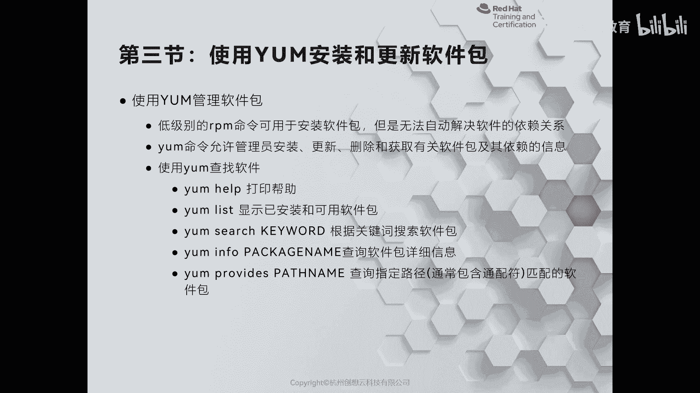
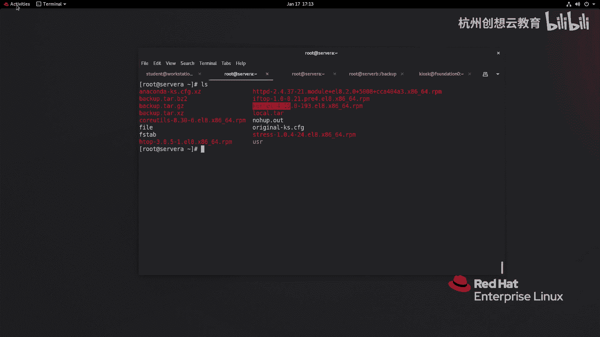
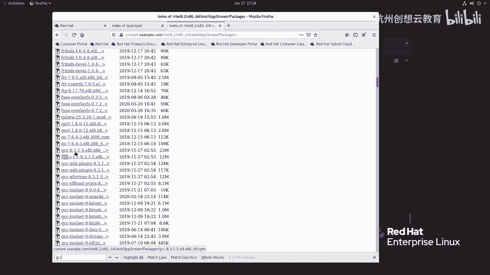
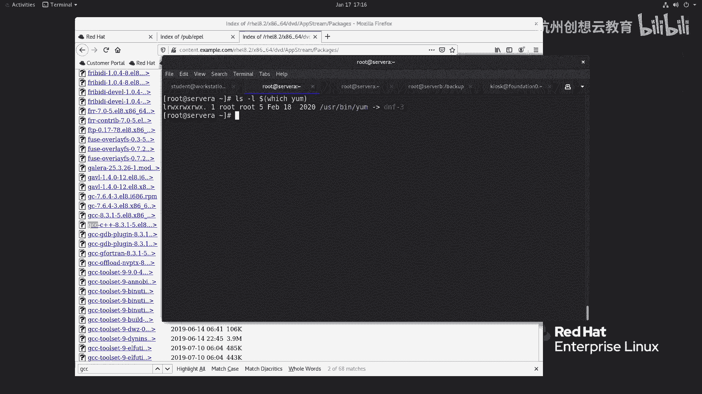
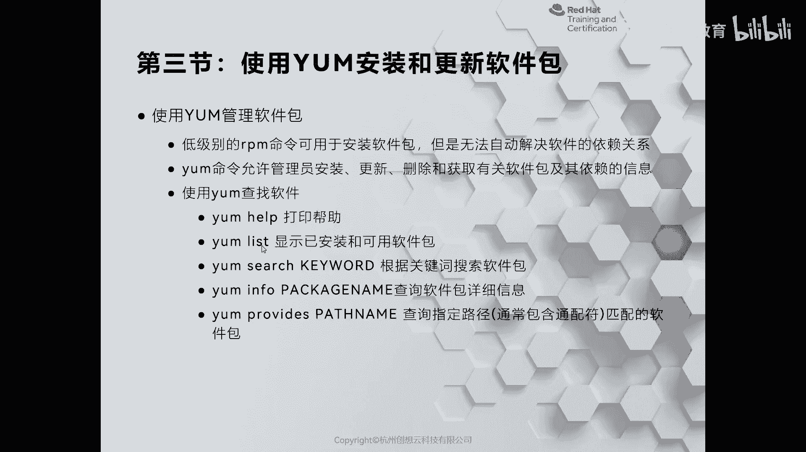
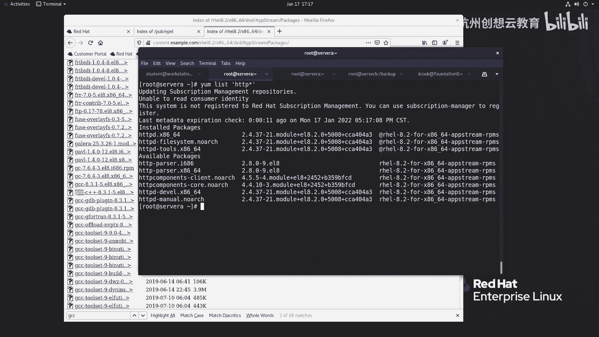
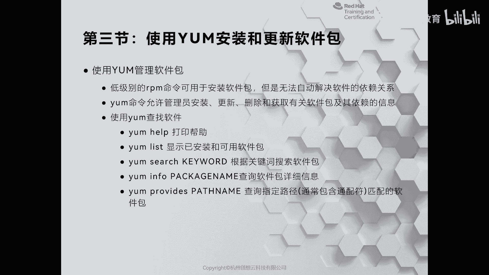
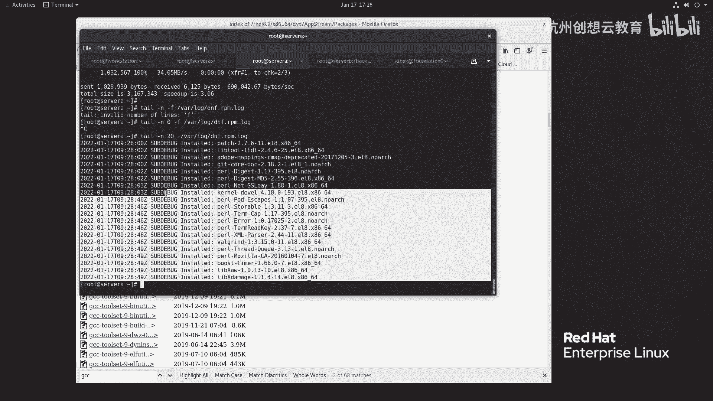
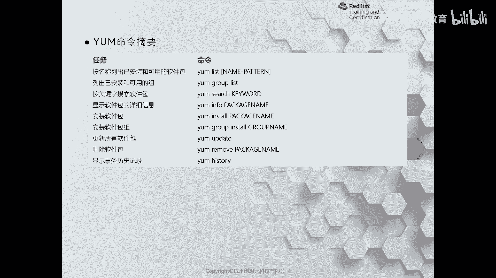

# 红帽认证系列工程师RHCE RH124-Chapter14：安装和更新软件包 - P3：14-3-使用YUM安装和更新软件包





在本节课程中，我们将学习如何使用YUM工具来安装、查询、更新和卸载软件包。YUM能够自动处理软件包之间的依赖关系，极大地简化了软件管理过程。



上一节我们介绍了如何使用RPM命令查询软件包。本节中我们来看看如何使用YUM来管理软件包。

## 依赖问题与YUM的引入

在Linux系统中，软件包通常设计得较小，因为它们会共享使用系统中已安装的公共库。这带来了一个常见问题：当你尝试使用RPM安装一个软件包时，可能会因为缺少其依赖的其他库或软件包而失败。

例如，尝试使用RPM安装`gcc`编译器：
```bash
rpm -ivh gcc-8.3.1-5.el8.x86_64.rpm
```
系统会提示需要安装`cpp`、`glibc`等多个依赖包。手动解决这些依赖非常繁琐。

在红帽企业版Linux 8（RHEL 8）中，`yum`命令实际上是指向`dnf`命令的符号链接。`dnf`是新一代的软件包管理器，它继承了`yum`的功能并进行了优化。我们仍可以使用`yum`命令来操作，其底层由`dnf`执行。

## 使用YUM查询软件包





以下是使用YUM查询软件包信息的常用命令。

### 列出软件包
使用`yum list`命令可以查看所有已安装和仓库中可用的软件包。
```bash
yum list
```
若要查找特定软件包，例如所有与`httpd`相关的包，可以执行：
```bash
yum list httpd*
```
输出中，`Installed`表示已安装的包，`Available`表示仓库中可用但未安装的包。





### 搜索软件包
如果你想根据关键词搜索软件包，可以使用`yum search`命令。
```bash
yum search nginx
```
此命令会列出所有名称或描述中包含“nginx”的软件包。左侧是包名，右侧是简要描述。

你还可以搜索描述中包含特定字段的包，例如搜索所有描述中包含“web server”的包：
```bash
yum search all “web server”
```

### 查看软件包详细信息
在决定安装某个软件包前，可以使用`yum info`命令查看其详细信息，这类似于`rpm -qi`，但用于查询未安装的包。
```bash
yum info nginx
```
该命令会显示软件包的版本、架构、大小、描述及依赖关系等详细信息。

## 使用YUM安装、更新与卸载软件包

查询到所需的软件包后，就可以进行安装和管理了。

### 安装软件包
使用`yum install`命令安装软件包，YUM会自动解析并安装所有必需的依赖。
```bash
yum install gcc
```
执行命令后，YUM会列出需要安装的软件包列表及其依赖关系，并询问是否继续。输入`y`确认后，YUM会开始下载并安装所有必需的包。安装成功后，终端会显示“Complete!”提示。

### 更新软件包
使用`yum update`命令可以更新系统中的所有软件包到最新版本。
```bash
yum update
```
然而，一次性更新所有包可能数量庞大且耗时。更常见的做法是选择性更新，例如只更新与安全漏洞相关的包。
```bash
yum update --security
```
或者，只更新被标记为“高危”（critical）的安全补丁：
```bash
yum update --security --sec-severity=critical
```

### 卸载软件包
若要移除已安装的软件包，可以使用`yum remove`命令。
```bash
yum remove gcc
```
此命令会卸载指定的软件包及其未被其他程序使用的依赖。

### 撤销操作与降级
如果更新后系统出现问题，可以使用`yum history`命令查看操作历史，并撤销某次操作。
```bash
yum history
```
查看历史记录后，找到你想撤销的操作ID（例如ID为8），然后执行：
```bash
yum history undo 8
```
这会将系统回退到执行该操作之前的状态，比手动降级单个软件包更为方便可靠。

## 管理软件包组

在Linux中，多个相关的软件包可以被打包成一个“软件包组”进行统一管理，类似于Windows中安装Office套件会同时安装Word、Excel等多个组件。

### 列出软件包组
使用以下命令查看系统中可用的软件包组：
```bash
yum group list
```
输出会显示诸如“带GUI的服务器”、“最小安装”、“工作站”、“虚拟化主机”等组别。

### 安装软件包组
安装一个软件包组会同时安装该组内包含的所有软件包。例如，安装“开发工具”组，这对于编译程序或开发环境非常有用：
```bash
yum group install “开发工具”
```
YUM会列出该组包含的所有软件包并进行安装，这比逐个安装要高效得多。

### 查看软件包组信息
在安装前，可以查看软件包组的详细信息：
```bash
yum group info “开发工具”
```

## 日志与自动确认

所有的YUM操作都会被记录在日志文件中，便于排查问题。日志文件位于：
```
/var/log/dnf.rpm.log
```
你可以使用`tail`命令查看最近的日志：
```bash
tail -20 /var/log/dnf.rpm.log
```

此外，在安装或更新时，如果希望跳过确认提示直接执行，可以加上`-y`参数：
```bash
yum install -y package_name
```

## 命令总结

本节课中我们一起学习了YUM工具的核心用法。以下是本节涉及的主要命令总结：



*   **`yum list`**：列出所有已安装和可用的软件包。
*   **`yum search`**：根据关键词搜索软件包。
*   **`yum info`**：查看指定软件包的详细信息。
*   **`yum install`**：安装软件包并自动解决依赖。
*   **`yum update`**：更新软件包（可搭配`--security`等参数）。
*   **`yum remove`**：卸载指定的软件包。
*   **`yum history`**：查看操作历史，并可执行`undo`进行回退。
*   **`yum group list`**：列出可用的软件包组。
*   **`yum group install`**：安装整个软件包组。



通过掌握这些命令，你可以高效、便捷地管理RHEL系统上的软件，无需再为复杂的依赖关系而困扰。