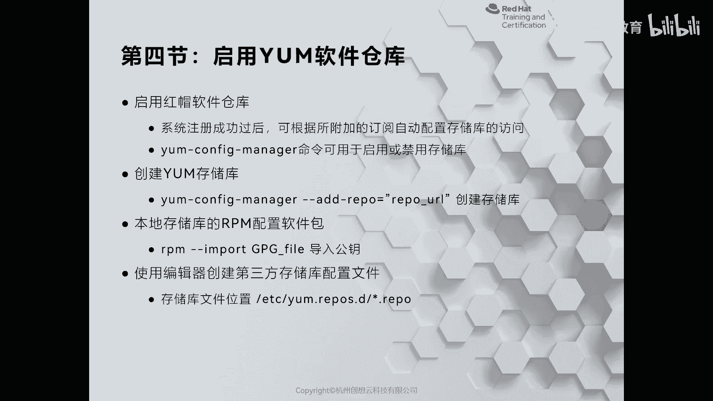
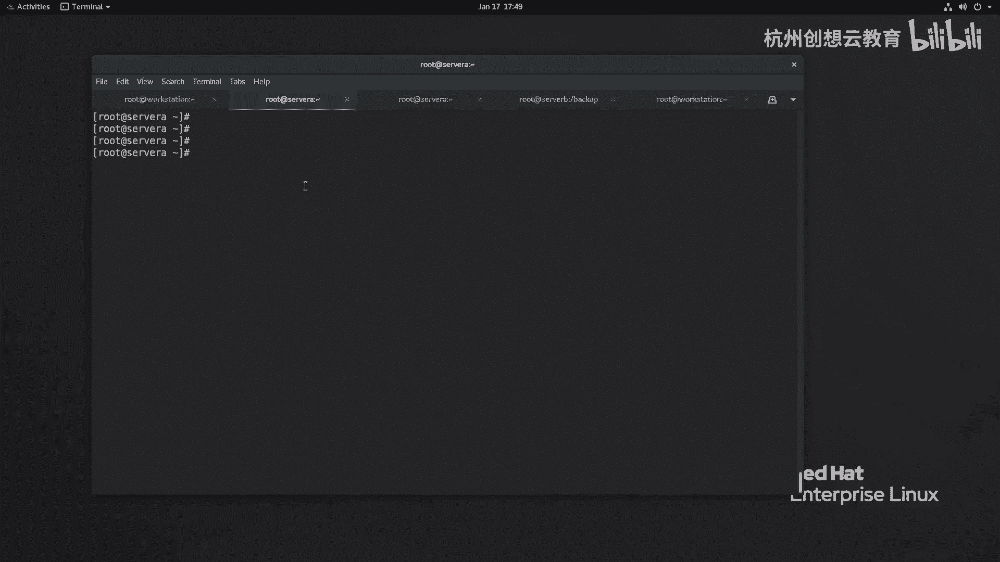
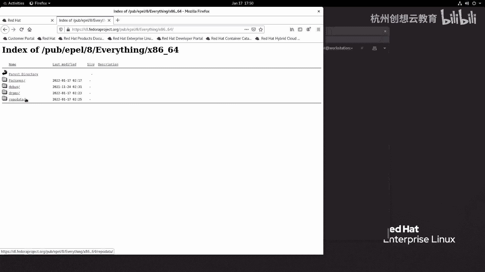
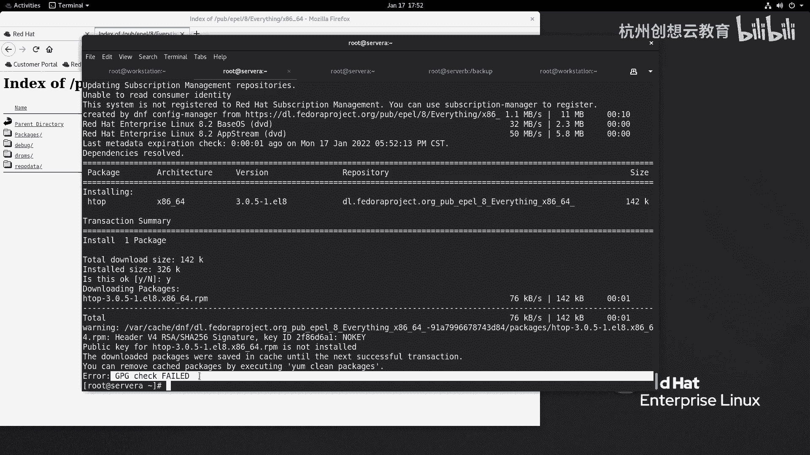
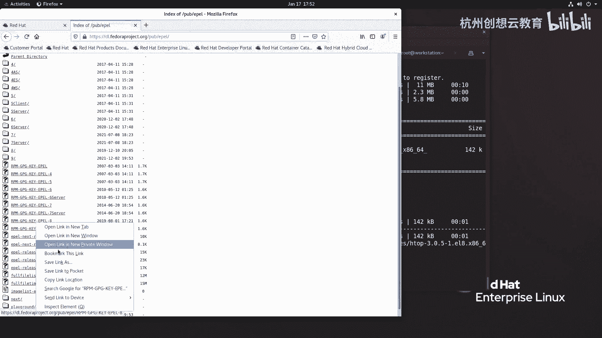
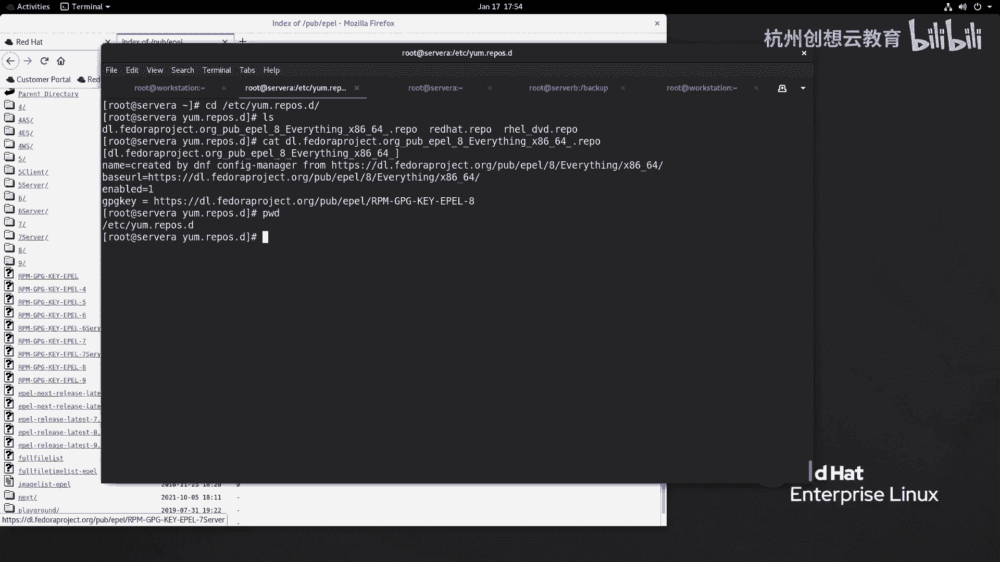
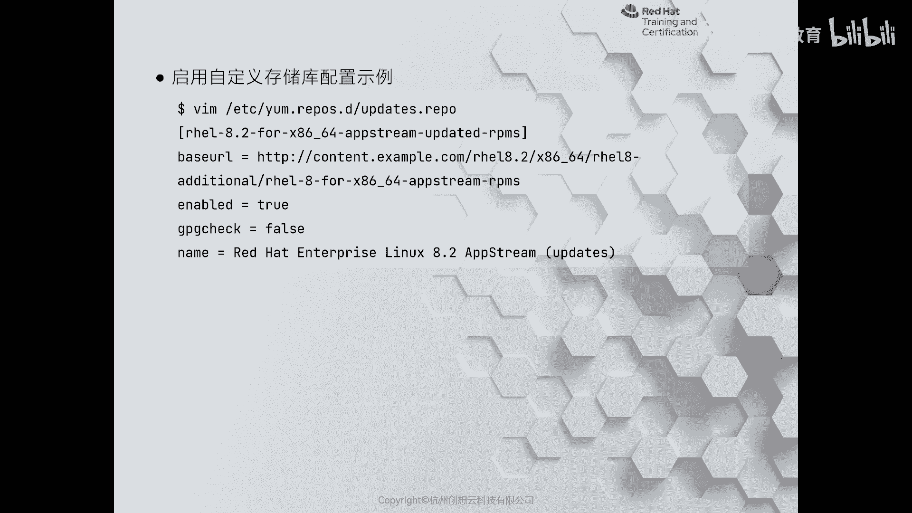
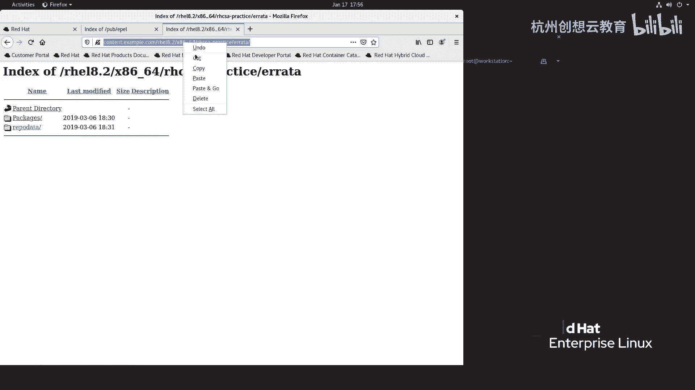
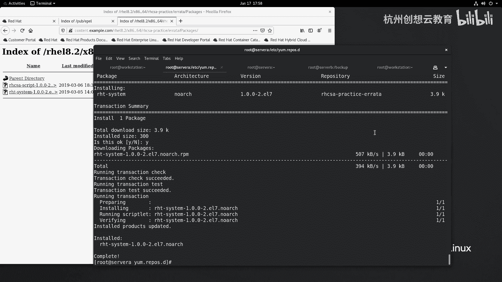
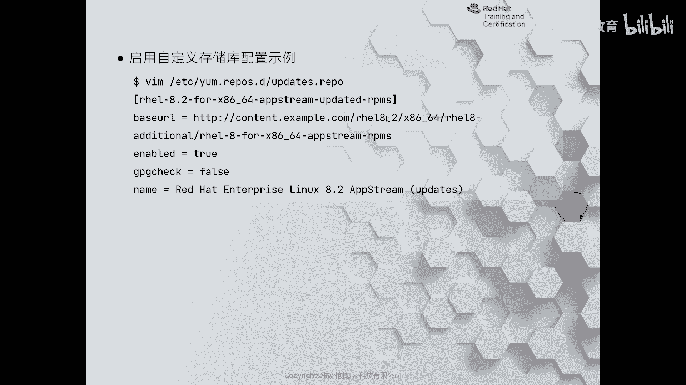

# 红帽认证系列工程师RHCE RH124-Chapter14-安装和更新软件包 - P4：14-4-安装和更新软件包-启用YUM软件仓库 - 杭州创想云教育 - BV1GU4y167TQ

好，我们来看一下第四节啊，启用y的软件仓库啊，当我们给系统注册成功之后呀，那么可以通过啊一个命令来附加我们的存储的访问。那么这个命令的话呢叫什么呢？我们以word word station为例啊。

那么word station上呢我已经订阅注册好了。那么走的命令叫做subscriptscription啊，这个auto啊att。那么增加之后呢，它就会把我们的仓库呢给它启动起来啊，附加上来ok。

那么附加之后呢，它会把你当前账户可以用的仓库呢都给你干嘛呀？都给你这个呃列出来。那么这时候呢我们可以通过啊y姆 config manager呢来启用或禁用存储库。因为这个存储库太多了。

不代表我们每一个仓库呢都会用。如果有些仓库你不用又开着。那么当你去安装软件包的时候呀，它都会去那里面去查找，会速度非常的慢。那么我们就可以去禁用一些。不使用的存储库啊。

那么我现在呢在word day上呢来举个例子啊，比如说呢我们通过这个可以通过EM啊config measure来干嘛呀，走一个d。啊啊，report来禁用仓库，借用哪些呢？我要禁用所有的仓库。

啊进入所有仓库，然后呢再启用我需要用到的仓库，我可以使用EM杠什么呀？呃啊config啊config呃，有一个命令啊，可以走一个叫做sub什么呃 measure啊list去看一看我们可用的仓库有哪些。

啊，很仓库啊，哎有产品啊有两个。那么接着呢我去走一个命令，叫做y么什么呢？我也不y么了，我直接搜一个叫做。我先去看一看我们的这个呃EM点repo里面的这些文件啊啊，我们看这里面仓库啊，那么仓库的话呢。

都是以这个什么。太多了啊，我加个less。啊，都是以什么real开头的啊，像reo8什么的，以这样的名字开头的。那么我这里呢就去匹配这样的关键字符串，我看看又能匹配到哪些，好吧。啊，gra up啊。

然后呢这个用尖角符中火弧跟上啊跟上这个刚才粘贴的字符串，然后呢去匹配ETC下面的yM点reportre官方的这样一个啊一个地址。啊，他说无效的。那么我把这个加个反斜杠。啊，那非常多对吧？但是呢虽然多呀。

但是不是说所有都能用。比如说什么NFV呀，什么SAP啊，这些我们也用不到，对吧？也用不到，用不到的话，那么我就。我就干嘛呀，去把这个可以使用的拿出来。比如说呃比如说这里的呃app stream啊。

app stream，但不用这个啊，我们要用的是。我们用的是上面的，那么就锁一个啊，一个是附加的啊，这个地址我们有没有要用，好吧。哎，我呢就怎么用呢？我去这样搞啊，我去打开一个新的终端。

连到我的word station做一个命令叫做ym杠confi啊，杠杠什么呀？enable啊，report后面跟上我们的要启用的仓库啊，然后呢再找一找别的啊，比如说我现在还要找谁呢？还要找有一个。

ice app stream要找一找，但是我要找一个原版的。哎，这里面有个倍色S，先把它拿下来。还有一个app stream。啊，有点卡顿啊，所以说。我把这个debug去掉就可以了啊。

把这个debug去掉就可以了。好，回车哎，这是我们要启用的仓库啊，相当于用了排除法，对吧？排除法启用了。那么启用之后呢，我们可以y么 up啊 ya么什么呀？

这个reple list来看一下我们的仓库数量啊肯定会发生一些变化。OK你看只有我们去启动的这些啊启动的这些。好，那么这是说我们订阅的那没有订阅的呢，没有订阅的话呢。

我们也可以通过我们这个啊ym configurefi manager呢使用这个艾 report方式来增加一个仓库。那么后面跟上我们仓库的地址就可以了啊，跟上一个仓库地址就可以了。那么比如说我现在呢这个。

在我的serv维上啊，我准备增加一个eel的仓库。那么首先呢在浏览器里面找到我们啊对应的地址。

啊，找到他。Yeah。re耀8re耀8。然后呢，everything找到叉864。那么找到插入字之后，还要不要继续往后列，不需要了。因为我们已经看到了这有个目录呢，叫repo data。

那么revo data呢是存放的是我们IP broad的这个依赖的一个关系啊，它这个数据库啊，所以看到这里呢就不要再往后了。那么把这个地址呢拿下来。

啊，然后呢通过啊这个ym啊这个config啊，然后呢I的。那report，然后呢后面呀等于个我们的地址，哎，回车就可以把这个仓库呢加进来。然后呢，我们ymclean all一下，清空一下缓存。

然后呢ymre list。这reple list，那么这时候呀我们就能够拿到这样一个仓库。我们先看看有没有装Htop好吧，哎，装过了。那么这个Htop的话呢，我们是通过PM包的方式来安装的。

我们卸载一下。好，现在之后呢，我现在呢再执行呢肯定没有没有了。那么我又通过yM来安装一次试试，行不行？啊，这次安装之前呀，我再走个命令叫RPM杠QA管道符 grab去筛选筛选谁呢？

筛选叫做pub key。啊，pub key这是我们的公钥啊，安装的工钥。那么这个工钥非常多啊，我呢准备把这个呢给它卸载掉。还有这个也卸列掉。只保留一个啊百分之百是红帽的，其实这个应该也是红帽啊。

但是我记不清了。所以说呢我把这两个都给去掉，然后呢我们去装一下谁呀，装一个这个Htop啊，为什么呢？要卸列公钥呢？因为我们默认情况下呀，你通过ym confi来增加的软件仓库呀。

都是需要啊这个啊签名的啊，你要真没有写呀，没有写就是默认的，一定要用啊，我们来装一个包试一试ym。Inst。白T talk。那么第一次安装，因为我们是从互联网上面拿到的，所以说会慢一点。

他要创建个缓存啊。OK然后呢，我们同意安装符个Y。那么这时候呢，他报了个错，说什么错呀？他说我们的系统里面呀没有找到啊对应的公钥啊，公钥的ID呢是2F86D6A1那所以说就没有办法安装啊。

因为呃签名检查是这个失败了，那怎么办呀？那么这时候呀，我们可以通过两种方法。一个呢是我们之前讲到的RPM刚刚inport来导入我们的公钥。

那么就来到我们的这个仓库里面啊去导入。啊，去导入这个公钥啊，哎就这个啊导进来就可以了。还有一种方法呢就是把这个公钥地址呢拿下来啊，然后呢，在我们的这个呃仓库的配置文件里面啊增加一句话。

写上一句话叫什么呢？叫做GBGK。啊，等于把地址呢拿上来。这时候呢我们保存退出，再来装一次Htop来看效果。然后呢，统一安装。然后呢，因为没有公钥，所以呢，他就去找公钥。

而公钥呢又被我们GBGK来定义了路径，因此他开始导入公钥，你导入公钥的编码叫这个正好和我们刚才的包呀，那个公钥呢是什么呀？你看这个公要是匹配的，哎，我就同意。同意，那么工钥也加进来了啊，也安装了。

那么我们可以通过IRPMQA呢去找到钢铁的工钥。那pub key，这是刚才安装的公钥啊，这是通过互联网上，并且通过y么config measure来实现的。

那么它的生成的位置呢会自动来到E啊ETCE点 reppo里面来生成。啊，但是它的文件名啊看起来可能不是特别的舒服啊。啊，如果你有那种经简的那种强迫症，看起来会很难受的，很别扭，对吧？很别扭。

那么我们还可以干嘛呀？通过手动啊编辑的方式来编辑。那么它的位置呢也是放在ETC项repo点D里面，但是后缀啊一定要和以它一样啊，叫IPO来结尾。那怎么去写一个啊这个。仓库的配置文件呢。

那么我们来看一下PPT啊，PPT里面给我们举了一个例子。那么这个例子呢是什么呀？是一个啊叫做更新的一个仓库啊，那么这个中国弧里面包含的是我们仓库的名称。

那么baseL呢是我们仓库的地址O那么呢代表是是否对啊这个仓库呢开器啊，GPche呢默认只是一啊，我们把它改为了fse代表示不需要做数字签名检查。

而name呢则是我们的仓库的一个什么呀啊一个呃一个描信息啊，描信息。那么我们就现在呢也去写一个我们的啊自定义的仓库。

那么在写的时候呢，我们去找一个地址啊，我们去浏览器里面啊访问我们的content这个网站。在站点里面呢去找reo8。2啊，一直找找这里面有一个附加啊，附加里面有没有没有没有的话呢。

我们就找这个RHCSC的pice。在这里呢有两个啊仓库，一个呢叫errata，一个呢叫RHT。那么errata里面包含的有一个这样的地址，你看rereport data。

所以说呢路径就到errata下面，把这个地址呢拿下来。啊，我们写一个啊完完整整的一个仓库。

那么叫什么名字呢？名字呢随意起。但是呢后缀必须是IPU来结尾。写上我们的地址啊，我们写一个什么呀？叫做就写一个叫做RGCSA practiceice。啊，E erarata。然后呢，name幕。啊。

是我们的一个描信息。啊，errata。然后呢，写上我们的地址。那么这个地址一定要记得啊，是找到看到reable data，因为它代表的我们的一个软件之间依赖关系的数据库啊，那么在安装的时候呢。

它会在这里去查找。如果你把路径写错了，就找不到这个文件，有没有办法安装了？然后呢，写上谁呀？inable啊为一啊，其实这个不用写默认的啊，GPG啊check我写成零啊，然后呢写完没有了啊，保存并退出。

然后呢去刷新一下y么reple list来看一看我们的仓库。哎，就能看到我们刚刚写的这个了。那么在这里面有一个包呢和RHCSA是同名的，我们就搜一下叫做RHCSA。哎，一个脚本，那么我们来装一下。

看能不能安装上去。哎，那么已经安装过了啊，就不用再安装了。那么这里面还有一个包呢叫RHT system，对吧？我们来装一下。啊，输入Y来进行安装。好。

这是给大家举的这个如何呢去啊编写我们自定义的软件仓库的方法。两种，一个呢是自己通过编辑呢来编辑，一种呢是通过y啊confi manager来配置啊，都是可以的。

