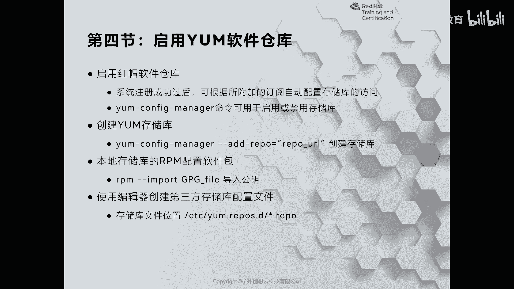
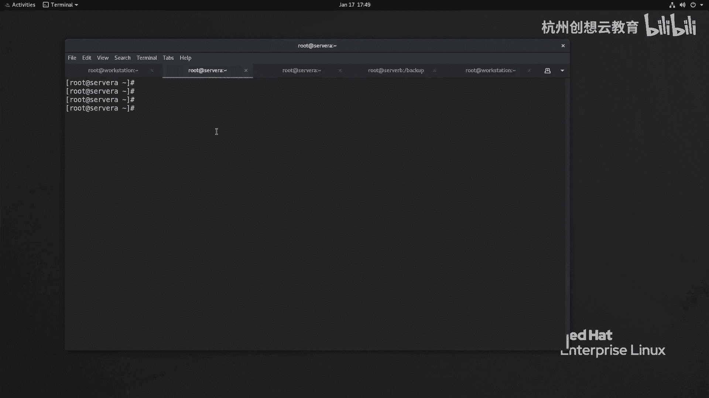
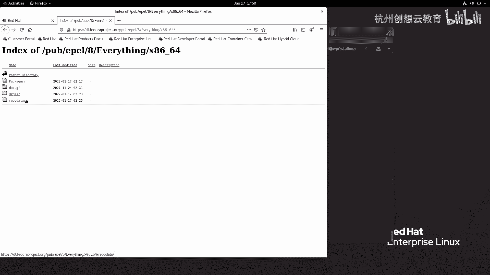
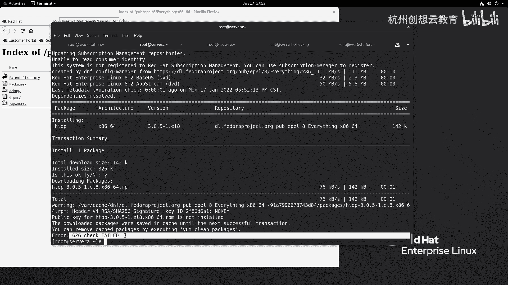
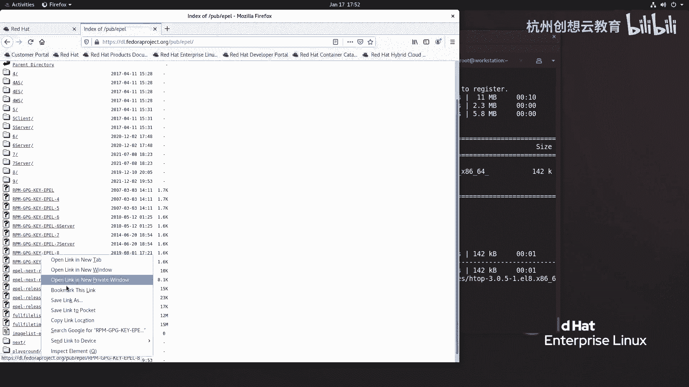
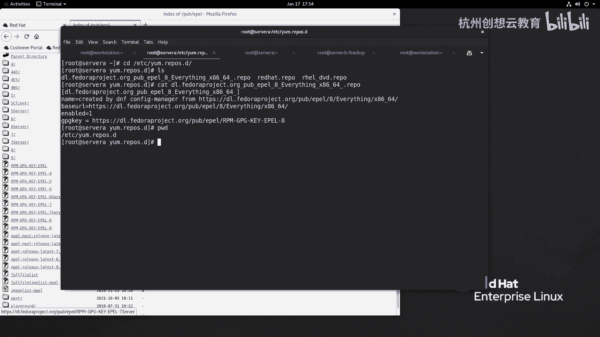
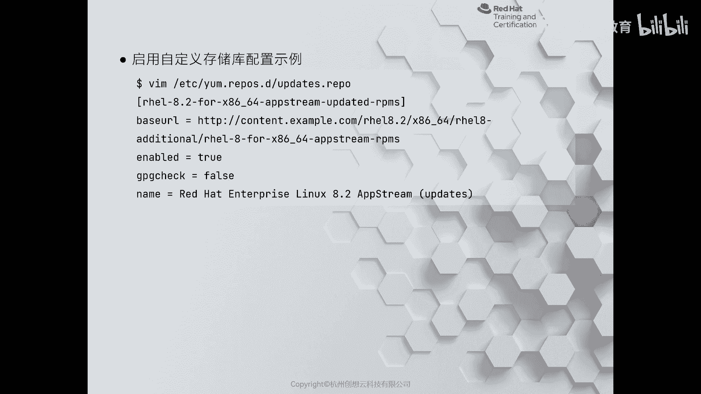
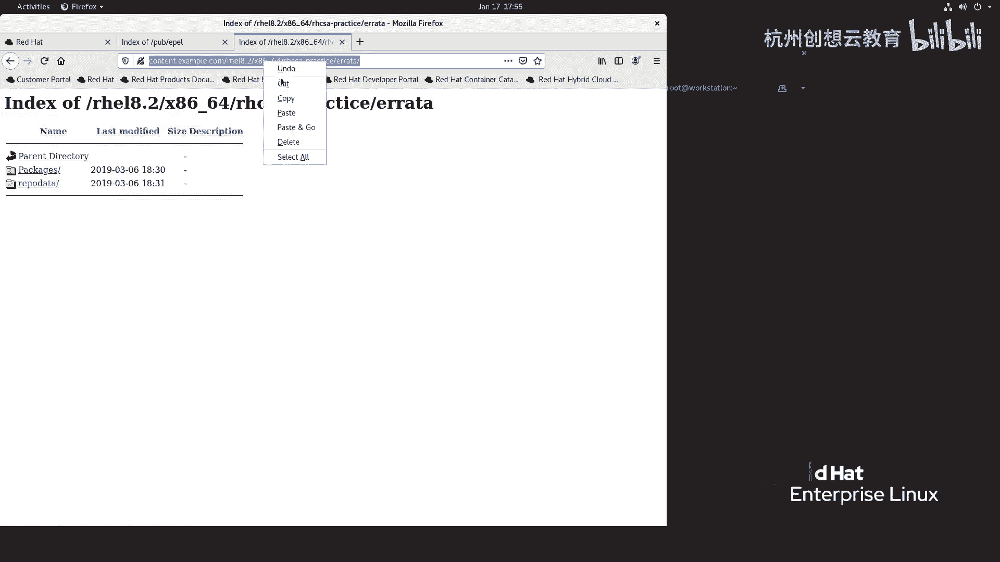
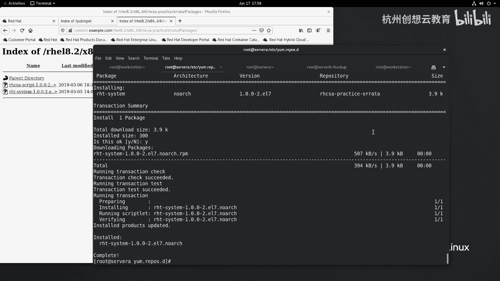
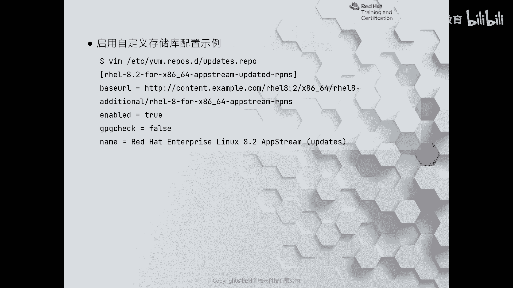

# 红帽认证系列工程师RHCE RH124-Chapter14-安装和更新软件包：14-4：启用YUM软件仓库



在本节课中，我们将学习如何在红帽企业Linux系统中启用和管理YUM软件仓库。这是安装和更新软件包的基础。

## 概述

系统成功注册后，需要附加订阅以启用软件仓库。本节将介绍如何启用、禁用仓库，以及如何手动添加自定义仓库。

## 启用订阅仓库

上一节我们介绍了系统注册，本节中我们来看看如何启用订阅的软件仓库。

系统注册成功后，可以使用 `subscription-manager` 命令附加订阅，从而启用对应的软件仓库。以 `workstation` 为例，执行以下命令：

```bash
subscription-manager attach
```

该命令会将当前账户可用的所有仓库列出并启用。

## 管理仓库的启用与禁用

附加订阅后，系统会启用所有可用仓库。但并非所有仓库都需要使用。启用过多仓库会在安装软件时降低搜索速度。因此，可以禁用不需要的仓库。

以下是管理仓库状态的常用命令：

*   **查看可用仓库列表**：`subscription-manager repos --list`
*   **查看当前启用的仓库**：`yum repolist`
*   **启用指定仓库**：`yum-config-manager --enable <仓库名>`
*   **禁用指定仓库**：`yum-config-manager --disable <仓库名>`

例如，可以先禁用所有仓库，再仅启用必需的仓库（如 `baseos` 和 `appstream`）：



```bash
yum-config-manager --disable \*
yum-config-manager --enable rhel-8-for-x86_64-baseos-rpms
yum-config-manager --enable rhel-8-for-x86_64-appstream-rpms
```

执行后，使用 `yum repolist` 查看，将只显示已启用的仓库。



## 添加未订阅的仓库

对于未包含在订阅中的第三方仓库，可以手动添加。

例如，添加EPEL仓库。首先在浏览器中找到仓库的 `repodata` 目录地址（这包含了软件包的依赖关系数据库）。然后使用以下命令添加：

```bash
yum-config-manager --add-repo=<仓库地址>
```

添加后，需要清理并重建缓存：

```bash
yum clean all
yum repolist
```

## 处理仓库的GPG密钥



从互联网添加的仓库通常需要GPG密钥签名验证。如果系统没有对应的公钥，安装软件时会报错。



解决此问题有两种方法：

1.  **手动导入公钥**：使用 `rpm --import <公钥文件地址>` 命令。
2.  **在仓库配置中指定公钥**：编辑仓库配置文件（位于 `/etc/yum.repos.d/` 目录下），添加 `gpgkey=` 项指向公钥地址。

例如，安装 `htop` 时若提示缺少公钥，可以在对应的 `.repo` 文件中添加一行：

```ini
gpgkey=http://example.com/path/to/RPM-GPG-KEY
```

保存后再次安装，`yum` 会自动导入并验证公钥。

## 手动编写仓库配置文件





除了使用命令，还可以直接编辑仓库配置文件。文件必须放在 `/etc/yum.repos.d/` 目录下，并以 `.repo` 结尾。

配置文件的基本结构如下：

```ini
[repository-id]
name=Repository Name
baseurl=repository_url
enabled=1
gpgcheck=0
```



*   `[repository-id]`：仓库的唯一标识符。
*   `name`：仓库的描述信息。
*   `baseurl`：仓库的地址，必须指向包含 `repodata` 目录的路径。
*   `enabled`：是否启用该仓库（1启用，0禁用）。
*   `gpgcheck`：是否进行GPG签名检查（1检查，0不检查）。

例如，创建一个名为 `my-custom.repo` 的文件：

```ini
[rhcsa-practice-errata]
name=RHCSA Practice Errata
baseurl=http://content.example.com/rhel8.2/errata/
enabled=1
gpgcheck=0
```

保存文件后，运行 `yum repolist` 即可看到新添加的仓库，并可以从中安装软件包。

## 总结





本节课中我们一起学习了YUM软件仓库的管理。主要内容包括：通过订阅管理器启用官方仓库、使用 `yum-config-manager` 启用或禁用仓库、手动添加第三方仓库地址、处理GPG密钥验证问题，以及手动编写仓库配置文件。掌握这些技能是使用 `yum` 工具高效管理软件包的基础。