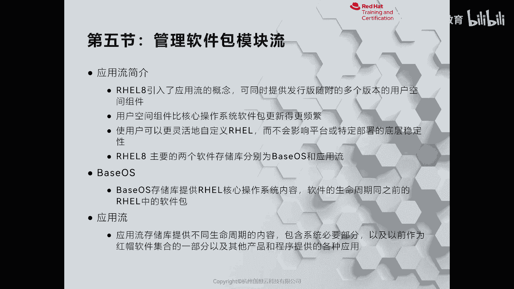

# 红帽认证系列工程师RHCE RH124-Chapter14-安装和更新软件包 - P5：14-5-安装和更新软件包-管理软件包模块流 - 杭州创想云教育 - BV1GU4y167TQ

我们来看第五节啊，管理软件包的模块流。

啊，那么首先我们要明白什么是流啊，流的话呢，我们可以想象一下水流，对吧？上游呢，比如说我在一个小溪的上游啊，放了一条小纸船。那么下游呢很快就能看到这个啊小纸船。那么流的概念呢也是一样的。

只要上游发布了新的版本。那么下游呢就可以快速的去使用啊使用。那么红帽70八呢也引入了一个流的概念，我们称之为是应用流。啊，那么应用流的话呢，给我们在一个翻译版当中啊，提供了多个版本的用户空间组件啊。

为什么要提供这样一个功能呢？我们举个例子，比如说。比如说呢我们某些客户啊，这个想装一个红帽且把inux干嘛用的呢？他想做开发做测试，那么他就需要去安装新版本的reo8啊，最新版本的re耀8。

那么装完之后呢，这个啊不同的用户，比如说哎我要开发一个旧旧一点的软件，需要用的python2。7。哎，我可以装一个paon2。7。那么另外一个软件呢开发的时候呢，用的是啊python三的版本啊，3。6。

比如说那我也需要python3。6。那如果是reo7的话呢，那么能不能实现呢，也可以，但是呢这个方法呢比较笨拙。我们需要在原有的python2。7的基础之上，通过源码呢去安装python23。6啊。

变切换起来呢不方便。但是呢从re耀8上面呢引入了一个叫做啊流的概念之后呀，我们可以在一个系统上啊同时安装多个版本。啊，根据需要去去去去指一定路径就可以了。所以说呢这是其一啊。

其二呢就是引用流的概念之后呢，面向用户空间的软件呢更新速度比较快啊，一旦上游发布，下游呢就可以快速去使用。比如说外b服务，对不对？哎，这种数据库等等啊，可以快速去使用。

那么因此呢可以使我们的用户啊更加灵活的来自定义啊我们的红帽棋盘的一个系统。那么在我们的re耀8上面呢，有两个存储库呢，一个呢叫贝aseserv，一个呢叫app stream。翻译过来呢就叫应用流。

那么这两个呢都是非常重要的。因此我们在啊装完一个系统之后。在配置软件仓库的时候呀，一定要记得把base OS和app stream都要配置起来。O都要配置起来。哎，那么在配的时候啊。

在配的时候一定要注意啊，这两个一定要配起来。呃，其中在base OS里面包含的是我们系统的核心的组件啊，比如说你装系统时候所需要的那些软件包呀，都属于是base OS里面的。那么另外一个呢是应用流。

就是app stream。那么app stream里面的包呀，那么包含了两种，一种呢是传统的upPM包啊，一种呢是叫做模块流啊模块流模块流的话呢就是完全的体现了我们应用流里面的特点啊。

可以根据需要呢去选择安装。那么我们可以打开浏览器呢去看一看我们的里面的内容啊，当然也可以直接呢通过ym呢去轴去看一看啊，比如ym list。我去找1个HTP。啊，HP。那么HTP里面我加个星号吧啊。

所有的HTP匹配的。去加个管道符。okK那么非常多啊，你看我们我们这里的。一个包，比如说我们找这个HTTP，你看这个包它的版本后面也加了一个mod啊， module就 module就加EL8。2。

0加5008什么什么的那这个就是一个留的版本，或者叫做模块的版本啊，那么和以前的版本呢是不一样的啊，不一样的，这就是一个模块啊，那么模块怎么去使用呢？我们用法很简单啊。

只需要在原来的ym group的命令的group把group换成谁呀，换成mod就就可以了。比如说我想看一看系统当中到底有哪些模块，那我就可以使用y module list来列出我们所有的啊模块包。

那么列出的内容里面呀非常丰富。左边的第一列是模块的名称，接着是留的版本啊，版本有些呢会有多个版本的存在，在版本后面呀会有很个中火弧。那么中国弧芦代表什么意思呢？其中啊D代表是默认啊。

E呢代表是已启用启动这个这个版本。那么除此之外呢，还会看到一些其他的编识啊，比如说叉号代表禁用啊，I呢代表是安装啊安装O那么第三列呢则是一个配置啊，你看这个呢就是一个通用的配置默认的那有些呢软件呀。

比如说数据库，那么可能有包含客户端的，还有服务端的啊，你可以选择去安装到底是服务端的还是客户端的啊，最右侧呢是一个描信息啊，那举个例子，比如说呢我想去安装一些专安装一个包呢，叫per。

那么就可以mo旧啊，mo就谁呀？这个list port先看一看这个这个包，那么这个包里面有两个版本，其中5。26呢是默认的那我在安装的时候，如果没有执定版本。那么它就装的是5。26。啊，装的是5。26。

亚么某就啊inst。好。来，我们来看一下这个版本，好吧，我们没有安装啊，我们不去出外。呃，在这里啊是我们的1个5。26。那如果我不想装5。26，我想装它的什么呀？啊，假如说我想去安装啊。5。24。

那么我们在执行安装的时候呢，加上一个冒号啊，跟上版本就行了。5。24。啊。但是我们的仓库有问题啊，没有这个依赖啊没有这个依赖O。啊，好，那么我这里呢用python来举个例子，好吧。

那么我们系统当中的python的话呢只有1个3。6。我现在想装1个2。7。啊，se一下PYpython。啊，没有这个没有search啊，只有list。那么python里面。加个型号。啊。

1个2736和38，我装个27。你就可以使用ym谁呀？moduleintpyython耳且。是。啊，输个Y来安装。啊，装完之后呢，我们的系统里面啊就会有两个python了。一个呢是2。7，一个是3。6。

然后呢，我们再举个例子，比如说呢我想装一个数据库。谁呢叫做postgr circle。啊，我去加信号来搜索。那么默认的话呢，装的是实版本，我去装一个实版本。嗯。少了个L。好，去安装。装完之后呀。

我们再回过头看一看我们的post gray circle的一个变化。你会发现在刚装了之后呢，有一个谁呀，有个E啊，inable啊，并且呢后面加了个I，代表是已安装。那如果我现在装1个12版本。

就代表的是什么呀？代表升级，但是呢你是不可以直接安装的啊，需要干嘛呀？先做一个resit重置我们的啊mo。哎，你看要重置啊ym module啊，resite post。Green circle。啊。

重置掉重置掉之后呢，再去安装新的版本，就相当于升级啊升级。啊，是升级啊apple greeting啊正在升级啊。呃，其实啊说了这么多啊，亚魔就的用法呢和亚么inst到用法呢是一样的。

如果你对版本没有什么要求，那么直接用亚么inst到就可以。如果你对版本有要求呢，可以通过亚么模旧来指定版本去安装啊。好，这是给大家来解释了啊演示了一下我们模块的一个使用方法啊。

这是红帽708里面的一个新特性啊，好，我们来总结一下啊，再总结一下，我们来看一下我们的PPT。

啊，注意啊，模块呢是一个整体的啊一个整体的啊协调一致的一个P包啊，我们可以啊针对模块呢来选择合适的版本的安装。那么一个一个模块呢会有多个流。那么我们理解为是版本啊，版本，并且每个模块呢只能启用一个流。

因此我们刚才在安装了post gray circle之后呢，要resit一下才可以安装别的流O。那么每个流的话呢，可能会有多个配置文件，就是profile啊。

比如说服务器的口端的开发的或者最小化的安装等等。那么命令呢就是y么 module list来列出我们的模块的流啊里面的信息。那么y么 module enable呢是启用流。

那当然也可以选择diable禁用流，对吧？那么y么 module remove呢是卸载某个流啊，那么ym moduleresite呢卸载啊重置我们某个流。

那么可以通过mod name冒号加上版本来指定流的安装啊。