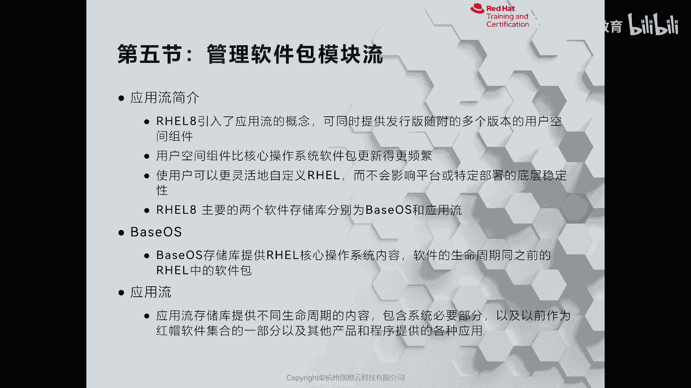
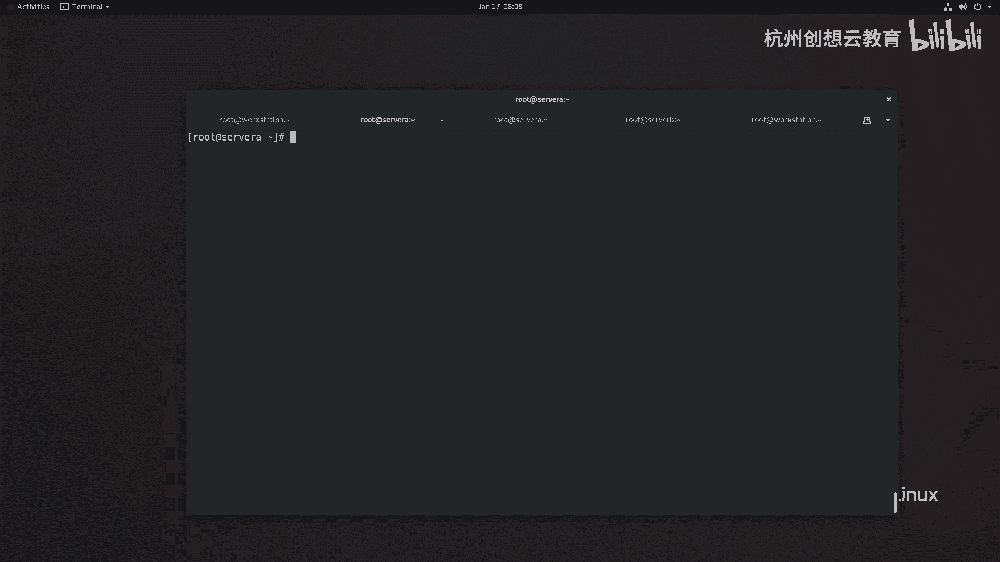

# 红帽认证系列工程师RHCE RH124-Chapter14-安装和更新软件包 - P5：14-5-安装和更新软件包-管理软件包模块流



在本节课中，我们将要学习红帽企业Linux 8（RHEL 8）中引入的一个重要新特性——**软件包模块流**。我们将了解它的概念、作用以及如何通过命令行工具进行管理。

## 📦 什么是模块流？

上一节我们介绍了使用YUM/DNF管理软件包的基础知识。本节中，我们来看看RHEL 8中新增的“模块流”概念。

模块流可以理解为特定软件（如编程语言、数据库、Web服务器）的**多个并行版本**。它类似于一条河流，上游（软件开发者）发布了新版本，下游（系统用户）就可以快速获取和使用。

RHEL 8引入此功能，主要是为了解决用户在同一系统上需要不同版本软件的需求。例如，一个开发环境可能需要同时使用Python 2.7和Python 3.6。在RHEL 7中，这通常需要复杂的源码编译和配置。而在RHEL 8中，通过模块流可以轻松实现。

## 🔧 RHEL 8的软件仓库

RHEL 8主要包含两个核心软件仓库：
*   **BaseOS**：包含操作系统核心组件，是系统运行的基础。
*   **AppStream**：包含用户空间的应用、运行时语言和数据库。**模块流**就位于AppStream仓库中。

因此，配置系统软件源时，必须同时启用BaseOS和AppStream仓库。

## 📋 查看可用模块流

以下是查看系统中所有可用模块流的方法。

使用 `yum module list` 或 `dnf module list` 命令可以列出所有模块。输出信息包含：
*   **模块名称**
*   **流（Stream）**：即版本号。
*   **状态**：`[d]` 表示默认，`[e]` 表示已启用，`[i]` 表示已安装，`[x]` 表示禁用。
*   **配置集（Profile）**：例如 `server`, `client`, `minimal`，代表不同的安装配置。
*   **简介**

**示例代码：**
```bash
yum module list
# 或
dnf module list
```

## ⚙️ 安装特定模块流

如果想安装某个模块的特定版本（流），需要使用 `yum module install` 命令。

以下是安装模块流的步骤和示例。

1.  **安装默认流**：如果不指定版本，将安装标记为 `[d]` 的默认流。
    ```bash
    yum module install perl
    ```

2.  **安装指定流**：使用 `模块名:流版本` 的格式来安装特定版本。
    ```bash
    yum module install perl:5.24
    ```

3.  **实际案例：安装Python 2.7**
    RHEL 8默认可能只安装Python 3。通过模块流可以轻松安装Python 2.7。
    ```bash
    yum module install python27
    ```
    安装后，系统中将同时存在Python 2.7和Python 3。

## 🔄 重置与切换模块流

一个模块在同一时间只能启用一个流。如果想切换到同一模块的另一个流，需要先重置当前模块。

以下是管理模块流状态的常用操作。

*   **重置模块**：移除当前已安装的流及其相关软件包，为安装新流做准备。
    ```bash
    yum module reset postgresql
    ```
*   **启用/禁用流**：启用或禁用某个流（但不一定安装）。
    ```bash
    yum module enable postgresql:12
    yum module disable postgresql:10
    ```
*   **移除模块**：卸载某个模块流及其所有相关包。
    ```bash
    yum module remove postgresql
    ```

**切换流示例**：将PostgreSQL从10版本升级到12版本。
```bash
# 1. 重置当前已安装的postgresql模块
yum module reset postgresql
# 2. 安装新的12版本流
yum module install postgresql:12
```



## 📝 总结

本节课中我们一起学习了RHEL 8的软件包模块流管理。

*   **模块流**是RHEL 8在AppStream仓库中提供的新机制，允许用户方便地安装和管理同一软件的多个版本。
*   使用 `yum module list` 查看模块。
*   使用 `yum module install <模块名>:<流版本>` 安装特定版本。
*   **一个模块一次只能启用一个流**，切换前需使用 `yum module reset` 进行重置。
*   对于没有版本要求的软件，直接使用 `yum install` 即可；若有特定版本需求，则应使用模块流相关命令。

掌握模块流的管理，能让你在RHEL 8系统上更灵活地部署和维护各种应用环境。