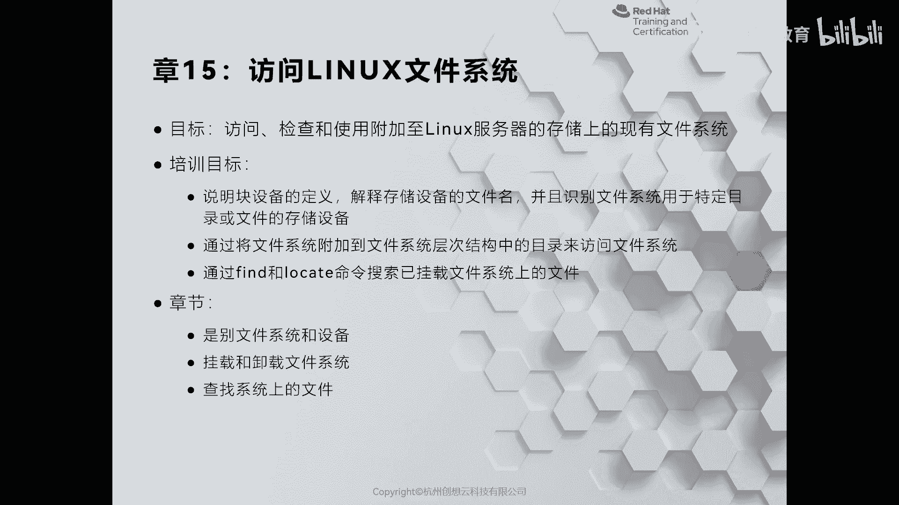
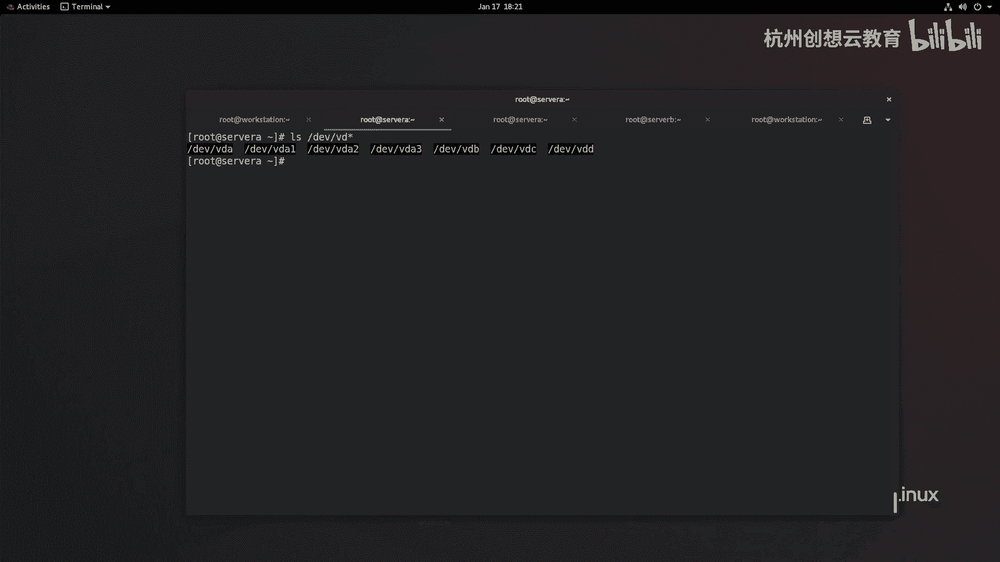
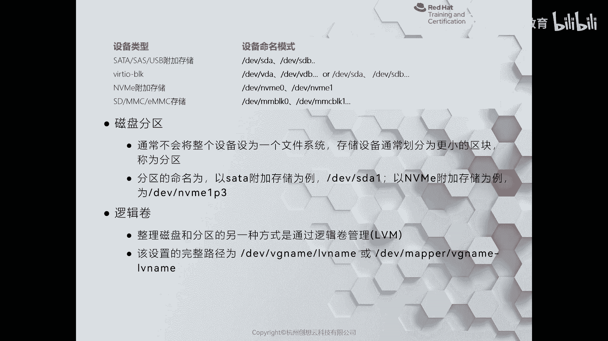
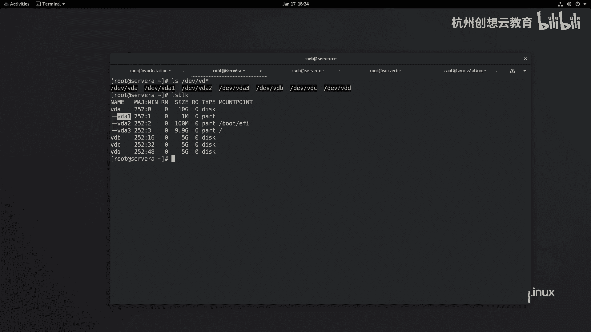
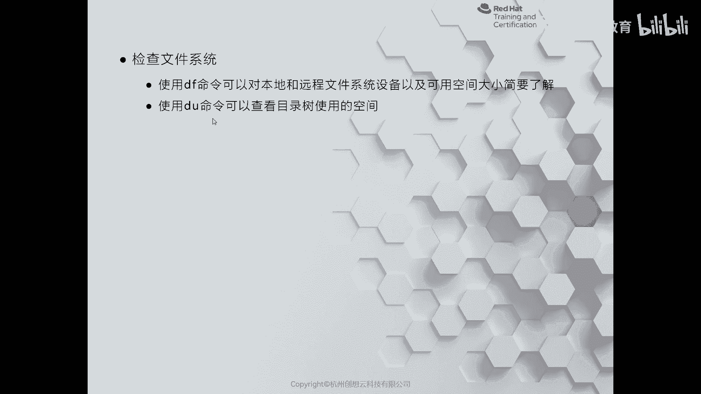
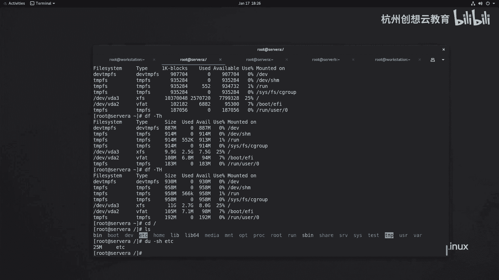

# 红帽认证系列工程师RHCE RH124-Chapter15-访问Linux文件系统 - P1：15-1-访问Linux文件系统-识别文件系统和设备 - 杭州创想云教育 - BV1P14y1x7C6

啊第15章啊访问linux的文件系统，那么这样我们会带着大家呢认识一下我们的磁盘设备，在linux上面的命名方法，以及呢如何呢把这个文件系统啊，啊这个附加到我们当前的啊文件系统层次结构当中啊。

以便于访问这个文件系统，ok第三部分的话呢是利用find呀，locate命令啊，在我们的文件系统里面去查找啊啊指定的文件，那么首先我们来看一下第一节。

第一节的话呢是给我们来介绍了一下啊文件系统的一个名称和设备啊，呃首先我们要知道的就是我们为什么要在这个这个我们的系统里面啊，去构建文件系统对吧，那么固件文件系统的目的呢主要是为了隔离啊。

隔离不同的数据啊，啊每个文件系统呢都是一个独立的啊，独立的一个空间啊，呃比如说我们windows为例对吧，我们如果笔记本有一块硬盘，哎，我可以分成三个文件系统，比如说c盘，d盘和e盘。

那么这三个文件系统就是独立的啊，里面的数据呢是啊不通的啊，是不通的，ok嗯然后呢在我们的例子上面啊，在我们linux上面注意啊是不太一样的，为什么不一样呢，你像在windows上面。

如果我去新建了一个分区，然后呢把这个分区啊创建了一个文件系统，就是我们平常所说的格式化哈，那么格式化之后呢，那么我们在温度上面呢就可以给它分配一个盘符啊，然后呢就可以啊，像这个设备里面呀。

就这个文件系统里面啊，就去读放数据了对吧，写入数据，但是在linux上面不是这样的，那么linux的话呢它认为你的快设备也是一个文件，也就意味着我们没有办法像文件当中啊再放文件啊，这个是不存在的。

因此呀我们在linux里面需要做一个这样的操作，就是说对以格式化过的文件系统，把它呀将我们现有的目录结构当中的某个目录啊，把它关联起来啊，然后呢通过啊通过这个关联啊。

然后呢就可以实现像我们的这个文件系统里面存放数据，那么这个文件系统在关联的时候呢，一定要找一个空的目录，然后呢通过对该空目录的读写操作，就相当于实现了对该文件系统的读写操作。

因此这个空目录我们把它称之为是挂载点啊，用来挂载设备的那个点啊，挂载点，ok这是给大家介绍了windows上和linux上面的一个区别啊，一个区别看，那么linux上面的所有设备都是存放在dv下面的。

你像我们的教室里啊，那么所有设备啊就是在dv下面啊，叫vd啊，vd开头的这些设备，啊这些设备什么v d a啊，v d a一啊，v d a2 等等这种啊，那么这个设备到底是有什么含义呢，我们来看一张图。

那么如果我们的设备啊是通过sa啊，sars或者usb的方式来附加到我们的啊计算机的，那么我们的linux在识别的时候呢，就是sd开头的，如果是第一块硬盘位，那么就是sda，第二硬盘位就是sdb。

以此类推，如果我们的虚拟机的磁盘呀是通过word i o block的方式来虚拟出来的，那么我们的系统在识别的时候呢，就是v d a v d b，但是后面的更新之后呀，那么也可以识别为谁呀。

s d s d比我们目前主要见到的还是v da和v db为主啊，vd和vd b为主，因为what io block是我们常见的哎，有的时候可能会用到一个word i o scussing这种的。

那么这是标新的啊，标新的话呢就是谁呀，就是我们的s d a s t b这种命名方案啊，我们指的是vt啊，l block啊，那么接着呢在现代的服务器里面啊，有一种新的啊，这个存储叫做nv m e。

那么n m m e在识别的时候呢就叫做n m m e，然后呢用数字来代表的第几块nm一次函，那么如果我们在服务器上增加了内存存储卡，这种类型的则是识别的是mm block啊。

mm block这种命名方案，ok啊，mmc啊，block这里面少了一个c啊，m m c block嗯，我们身边这些呢都是有几率见到的，比如说在view mail虚拟化上面啊。

我们可以把这个系统啊放在我们的把存储卡上面对吧，唉这个对性能要求比较高的，唉我们可以使用这个nm的磁盘，而我们教室里面呢走的是什么呀，kpm的虚拟化用的是l的block啊。

block那么所有设备的都是在dv下面的啊，都是在dv下面的，那么我们可以使用ios block来查看我们信当中的快设备。

啊快设备，那么可以看这里啊，v d a啊，v d a1 ，v d a2 ，v d a3 和vd b等等，那么其中这里的v d a123 则代表的是我们的分区啊。

分区我们lex上面呀通过数字的方式呢来标示第几个分区啊，第一个分区，而n m m e的话呢则是用p跟上数字来代表分区，ok那么除此之外，我们还有一种设备叫做逻辑卷啊。

这个我们在第三第二本书上呢会给大家介绍啊，那么如意卷呢通过软件定义存储的方式，来更加灵活地使用我们的啊磁盘设备啊，那么它的命名呢就是dv啊，卷组的名称后面的是逻辑卷的名称啊。

或者是啊dv下面mapper，然后呢卷子名称一个横线，然后呢跟上一个罗叶卷的名称啊，这些都是我们常见的名字啊，那么我们可以通过什么呀df命令来查看啊，当前系统当中有哪些文件系统挂载了。

以及这些文件系统空间的使用情况，也可以使用do命令来查看我们的目录的空间的使用情况。

好举个例子，那么我通过df命令能够看到所有的本地设备挂掉的情况，其中这里的dv tp fs和tfs都是这种叫做内存型的稳定系统啊，也称之为是伪文件系统，就意味着我们的系统啊在关机的时候。

这些里面都是没有数据的，大家都是没有数据的，ok那么我们要想查看这些设备有什么文件系统格式，那么可以加个选项，大写字母t就能够打印出来它的类型，比如说我们的vd 3走的是x fs的文件系统类型啊。

那么v d a2 呢走的是v f a t，那么在real 6上面呢，我们会看到什么e t4 这种啊，e t4 这种，那么而右边呢是它的使用空间的大小情况，如果你觉得这个大小看起来不方便。

你可以使用小h来打印出来，那么小气呢走的是二进制啊，就是二零就是1024啊啊这种方式去运算的，那么适合查看数据的空间的情况，如果你使用大h呢走的是十进制，就是1000的这种进制。

那么你可以看到的是磁盘大小的空间的情况，根据需要去选择合适的选项即可，那如果我想看我目录下面啊某些目录的使用情况，比如说我想看一看谁啊，看一看我的这个etc的情况，那么我们可以使用do啊。

do杠s size，human read able啊，人类可读的格式去看etc，那么这个目录呀占用空间的是25兆啊，25兆啊。

