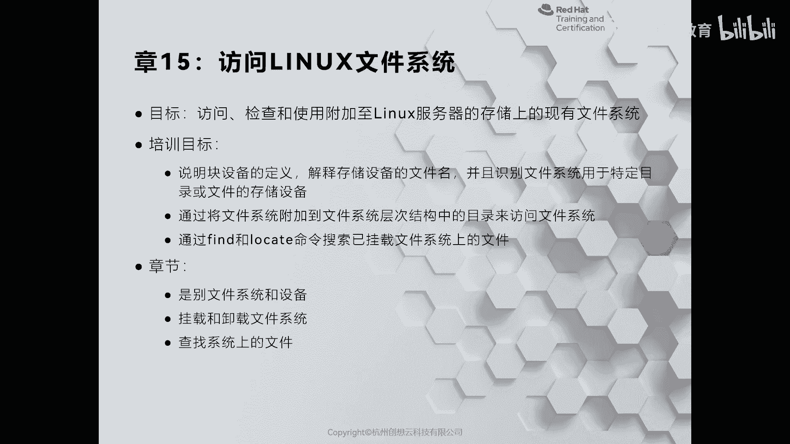
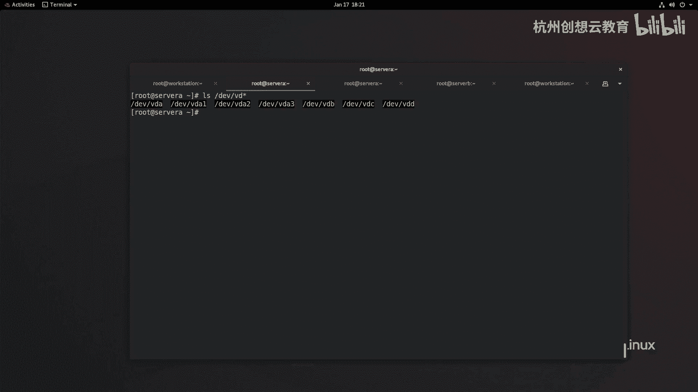
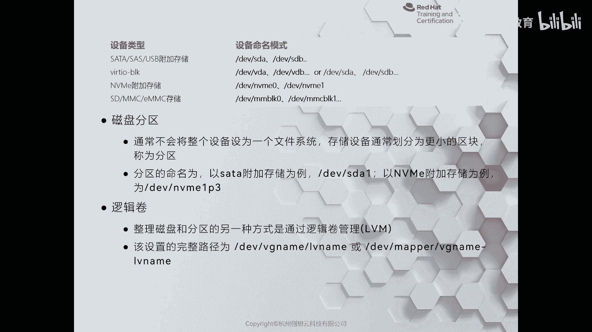
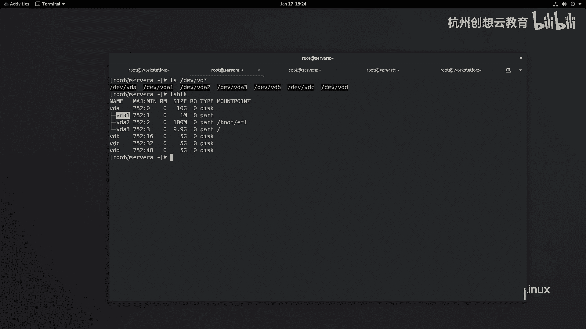
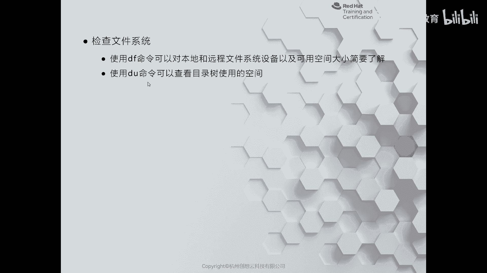
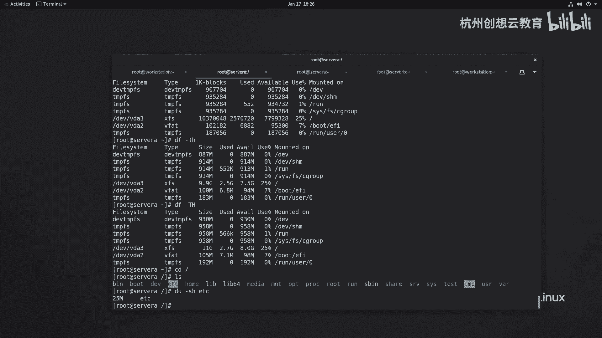

# 红帽认证系列工程师RHCE RH124-Chapter15：访问Linux文件系统 - P1：15-1-访问Linux文件系统-识别文件系统和设备



在本节课中，我们将要学习Linux系统中文件系统和设备的基本概念，包括设备命名规则、文件系统的作用以及如何查看系统中的设备和文件系统信息。

## 概述

构建文件系统的目的是为了隔离不同的数据。每个文件系统都是一个独立的存储空间。以Windows系统为例，一块硬盘可以被划分为C盘、D盘和E盘等多个独立的文件系统。

在Linux系统中，处理方式有所不同。Linux将所有设备（包括磁盘）视为文件。因此，不能像在文件中存放文件那样直接操作设备。我们需要将已格式化的文件系统关联到现有目录结构中的一个空目录上。通过读写这个空目录，就相当于读写该文件系统。这个用于关联的空目录被称为“挂载点”。

## Linux设备命名规则

Linux系统中的所有设备文件都存放在 `/dev` 目录下。

以下是常见的设备命名方案：

*   **SCSI、SATA或USB接口的磁盘**：设备名以 `sd` 开头。第一块硬盘为 `sda`，第二块为 `sdb`，以此类推。
*   **VirtIO Block虚拟磁盘**：在虚拟机中常见，设备名以 `vd` 开头。第一块虚拟硬盘为 `vda`，第二块为 `vdb`。
*   **NVMe固态硬盘**：设备名以 `nvme` 开头，后跟控制器编号和命名空间编号，例如 `nvme0n1`。
*   **eMMC存储卡**：设备名以 `mmcblk` 开头。

分区则通过在设备名后添加数字来表示。例如，`vda` 的第一个分区是 `vda1`，第二个分区是 `vda2`。对于NVMe设备，分区表示为 `nvme0n1p1`。

此外，还有一种名为“逻辑卷”的软件定义存储方式，其设备路径通常为 `/dev/mapper/<卷组名>-<逻辑卷名>` 或 `/dev/<卷组名>/<逻辑卷名>`。

## 查看块设备



可以使用 `lsblk` 命令来查看系统中的块设备及其分区信息。

```
lsblk
```

该命令会列出如 `vda`、`vda1`、`vda2`、`vdb` 等设备，其中数字后缀代表分区编号。

## 查看文件系统信息

上一节我们介绍了如何查看块设备，本节中我们来看看如何查看已挂载的文件系统及其使用情况。

可以使用 `df` 命令查看当前系统中已挂载的文件系统及其磁盘空间使用情况。

```
df
```

输出结果中会包含 `/dev` 下的设备、`tmpfs` 和 `devtmpfs` 等内存型文件系统（也称为伪文件系统，其数据在关机后会丢失）。



若想查看文件系统的类型，可以添加 `-T` 选项。



```
df -T
```

例如，输出可能显示 `/dev/vda3` 的文件系统类型为 `xfs`，而 `/dev/vda2` 的类型为 `vfat`。

为了更直观地查看空间大小，可以使用 `-h`（以1024为基数，适合查看数据）或 `-H`（以1000为基数，适合查看磁盘标称容量）选项。

```
df -h
```



## 查看目录空间使用情况

如果想查看特定目录（而非整个文件系统）占用的磁盘空间，可以使用 `du` 命令。

例如，查看 `/etc` 目录的磁盘使用情况：

```
du -sh /etc
```

其中 `-s` 表示汇总总计，`-h` 表示以人类可读的格式显示。输出可能显示 `/etc` 目录占用了25MB空间。

## 总结



本节课中我们一起学习了Linux文件系统的基础知识。我们了解了文件系统用于隔离数据的目的，以及Linux通过“挂载点”访问文件系统的独特方式。我们掌握了常见存储设备的命名规则，并学会了使用 `lsblk`、`df` 和 `du` 命令来查看块设备、文件系统信息以及目录的磁盘使用情况。这些是管理和维护Linux系统存储的基础技能。