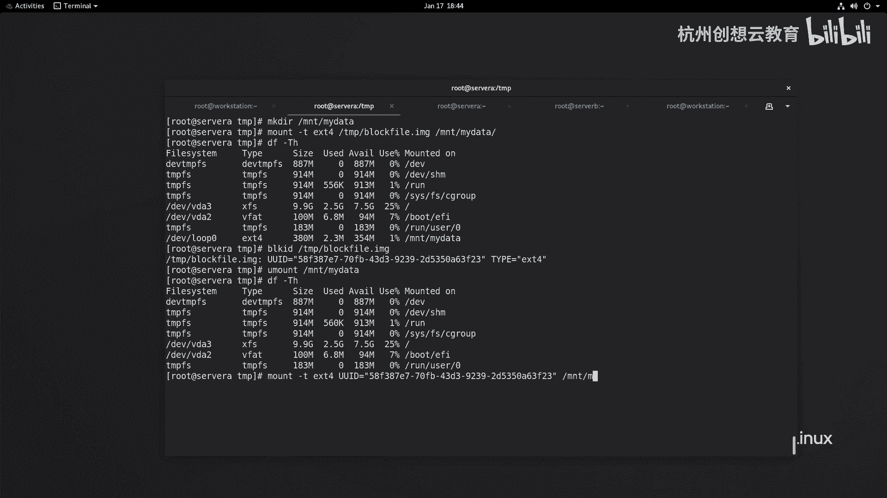

# 红帽认证系列工程师RHCE RH124-Chapter15-访问Linux文件系统 - P2：15-2-访问Linux文件系统-挂载和卸载文件系统 - 杭州创想云教育 - BV1P14y1x7C6

好我们来看一看如何将我们的文件系统来挂载到本地的空目录里面啊，呃首先呢就是我们刚才给大家已经解释过了啊，无论是本地的文件系统还是移动设备里面的文件系统，要想访问。

必须呢把这个文件系统啊和本地的目录结构做关联，那么这个过程呢我们称为是挂载，而被挂载的这个空目录呀，称之为是挂节点，那么我们要想去挂载这样一个设备，我们一般会用到一个命令。

这个mt model命令的话呢，可以帮助我们临时的将指定的文件系统挂载到某个目录上面，ok那么我们现在呢先来到我们的server a上面，思维上面的话呢，我们通过l s block命令啊。

发现这里面有一块硬盘叫vd b啊，那么这个设备目前是空闲的啊，是空闲的呃，然后呢我呢我呢去干嘛呢，我们现在的整个的文件系统空间使用情况，我们来看一看啊，我们的根目录的话呢是用了2。5g，还有七个g啊。

然后呢磁盘呢我们又没有学习管理，因此我们在这个时候怎么办啊，那么我们就呢在根目录下呢。

我在tap里面吧，我们通过dd命令来创建一个虚拟的文件好吧，虚拟的设备文件，那么叫做dd啊，if等一个啊，if等于一个dv下的谁呀，zero of等一个dv下的啊，sorry啊。

of等一个type下面的我们写一个叫做block fail，好了啊，点image啊，每个大小呢是多少呢，是四兆啊，来生成100次啊，一个400兆的文件，ok然后呢我们来看一看这个文件啊。

然后呢我把它格式化，格式化，make fs。e4 ，那么因为我们还没有涉及到这个内容啊，因此没有过多的介绍。

我们就执行就可以了啊，dd啊生成一个啊空白的快文件。

然后呢把这个快文件呀给它格式化掉啊，格式化成一个e s t4 的文件系统，然后呢现在呢我要准备把这个文件呀，把这个快文件呀就当做dv下面的磁盘啊。

给它挂载，那么怪的地方呢在哪呢，我要在mt下呢创建一个目录，这穆勒起名叫做mada啊，那么这个麦迪呢就是一个空目录啊，便于我们后期后面呢去啊去挂载啊，去使用，ok好，那么我现在呢去挂一下啊。

mt杠t e s t4 ，然后呢tap下面的block faimage啊，然后呢接着挂载点mt下的my data来就挂线成功了，那么我们可以通过df去查看一下。

他把当把刚才的设备啊当做一个啊这个loop设备来对待了，就是个红回环设备啊，那么是e t4 格式的大小呢是可用空间呀，13百80兆啊，380兆，那么刚才的这种方法，当然了，我们还可以通过谁呀。

通过这个通过这个它的设备的id啊进行挂载啊，设备的id，那么什么是设备的id呢，就是说当我们对一个快设备啊进行格式化之后，它会产生一个唯一的标识，那么这个标识呢我们称之为是ud。

那么可以通过bl k i d命令来专门查看我们的这个设备的ui d，那么我这里呢通过这个block。io呢啊来去查看，因为这个设备是我们写出来的，所以它默认情况下不识别这个路径啊，我们把这个拷贝下来好。

那么这次u i d同样我们也可以使用ui d呢来挂载啊，也是可以的好那么我把这个id复制下来，我现在呢先把刚才的挂载呢给它卸载掉啊，然后呢检查一下啊，就不再有刚才的设备了，对吧好。

我去挂载一下mt杠t e s t4 跟上设备的ui d跟上mt下的谁呀，拐点也是可以挂载的。

检查一下，那么相比较而言，使用uid的方法要比啊使用设备名称更好，为什么呢，如果我们的这里的是一个真正的磁盘设备啊，是一个磁盘设备，这个磁盘呢是可插拔的，然后呢如果我把这个设备呢拔掉。

放在另一台服务器上面，那么这个设备的编号呀就可能发生了变化，但是啊对于u i d而言，它是不会发生变化的，不会发生变化的，ok那么我们可以这样来演示一下啊。

怎么演示呢，同样我通过用mt命令呢把这个设备呢给它卸载掉，然后呢s c p啊，time下面的block faimage，把它同步到我们的server be的tap里面，啊这个还要通过一个用户呢。

叫做dv o p s，然后呢我来到sr b啊，来到tap里面，还多了一个谁呀，block fire啊，image，那么我们可以看一下他的id。

是不是一模一样，没有发生任何的变化对吧，没有发生变化，ok呃这个例子可能不是特别的恰恰当啊，因为我们没有用到我们的磁盘，用了一个虚拟的磁盘文件来演示的啊。

我们只需要把它想象成一个啊磁盘的文件系统就可以了啊，是一样的效果，ok啊这是给大家说的临时挂载，那如果我们的系统是一个啊是一个嗯图形化界面的，当我们插拔一个u盘之后，连接一个新的u u盘设备。

那么它的格式被我们的系统能够识别啊，它会自动挂载在我们的啊这个run media里面，ok我们来看一下啊，ppt，啊会自动挂载run media，然后呢当前用户名。

然后呢后面是u盘或者移动硬盘的标签啊标签，那么我们如果不想访问里面的数据了，首先呢要确保没有用户占用我们的挂节点，然后呢就可以使用emmei卸载对吧，刚才那刚才那我已经给大家演示一下卸载的方方方法啊。

you might，跟上一个挂点，那如果呀我们还是挂来之后啊，如果有进程的在访问，啊现在呢我的用户呢就在加目录，在这个挂载点的目录里面啊，那么这时候呢我要想卸载掉呀是不可能的。

啊所以说设备忙，那么我们可以通过ios o f来查看啊，我们的这个挂载点呀，到底是哪个设备，哪个用户在访问啊，会发现是用root进程啊，root那么都能看得到，然后呢通知这个用户或者进程就可以了。

然后退出之后，那么再去看就没有进程占用我们的关节点了，我们就可以通过用mt命令了卸载掉我们的设备，这是给大家演示了如何去挂载我们的啊。

