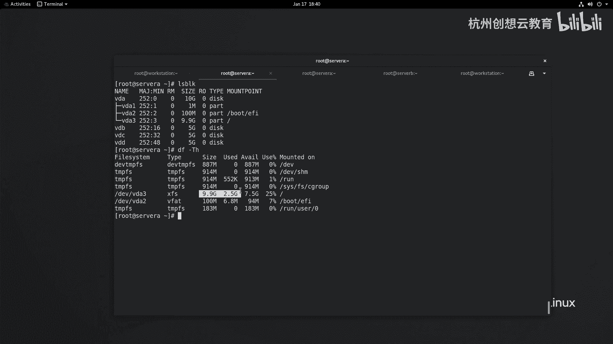
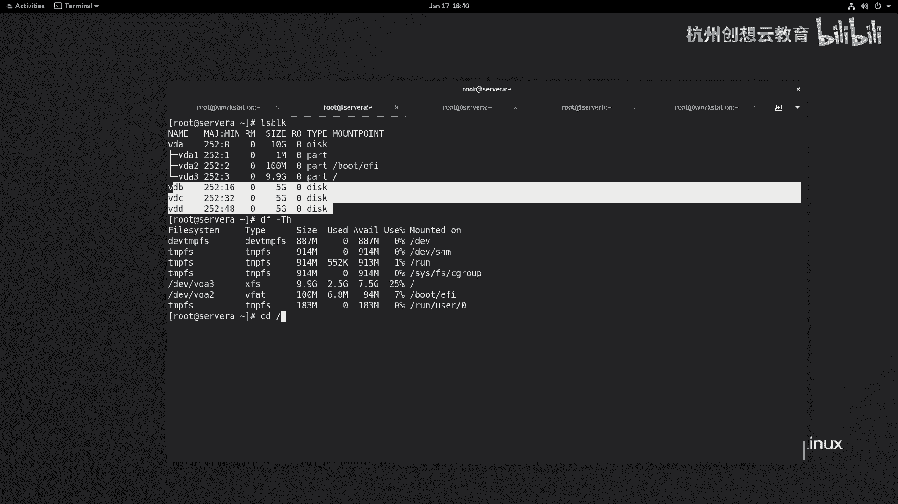
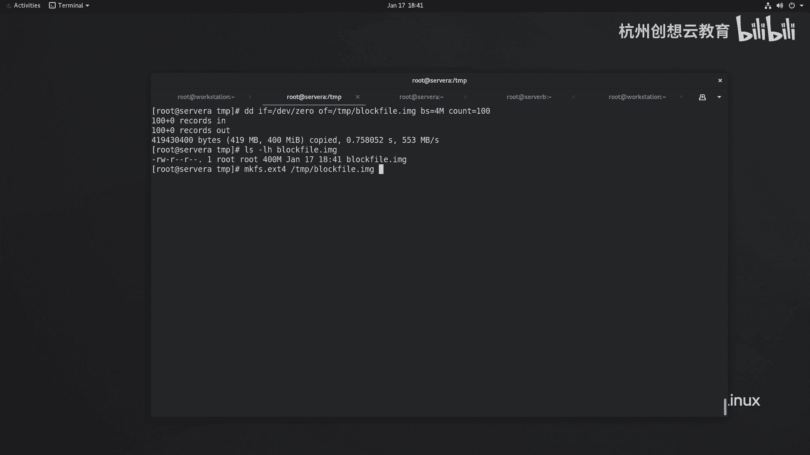
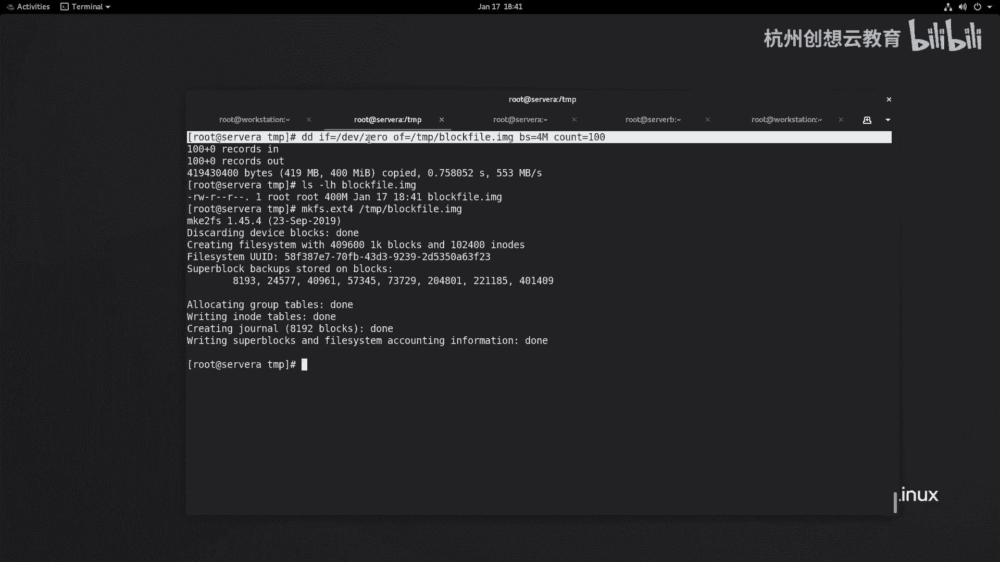
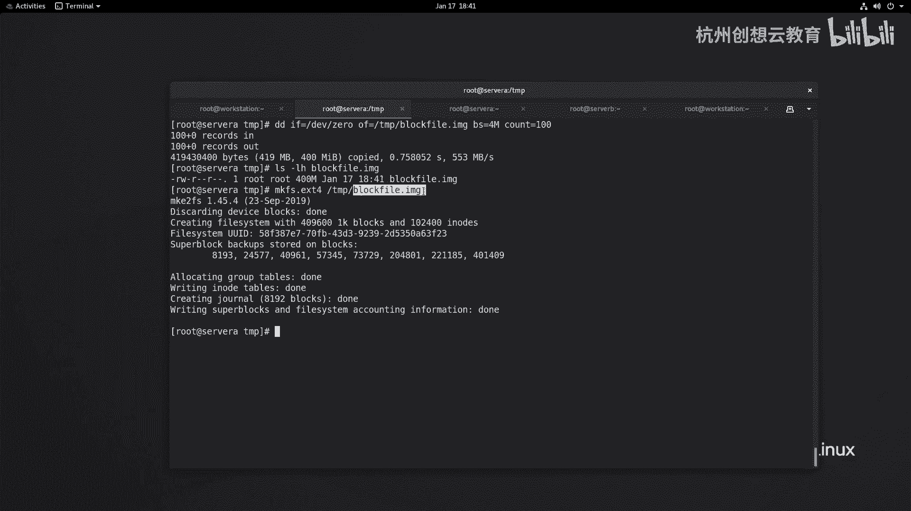
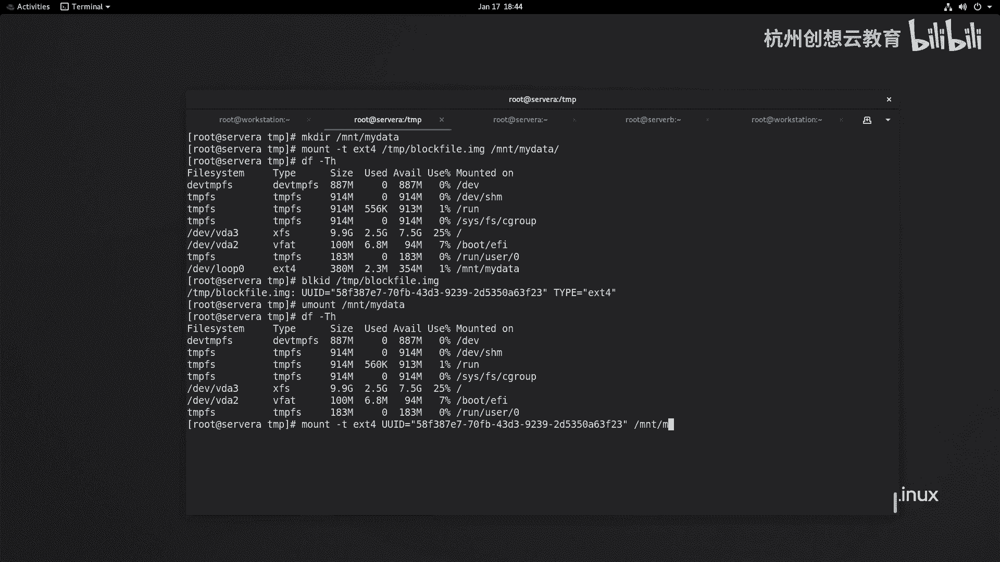
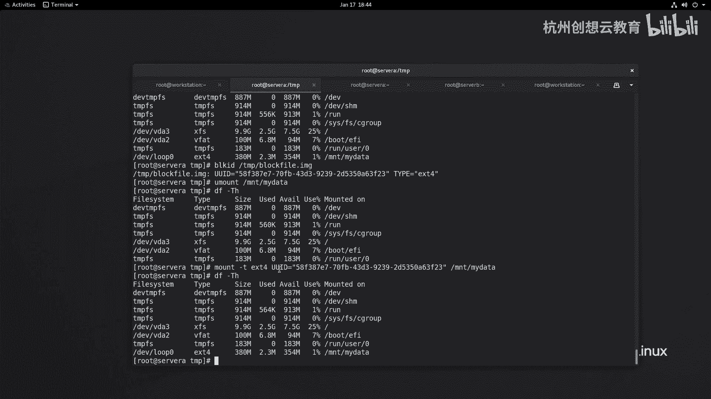
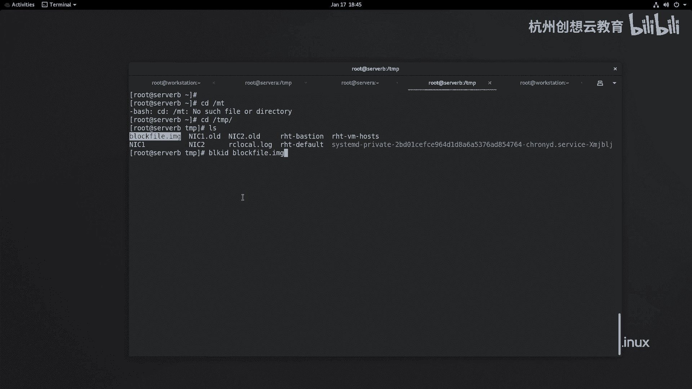
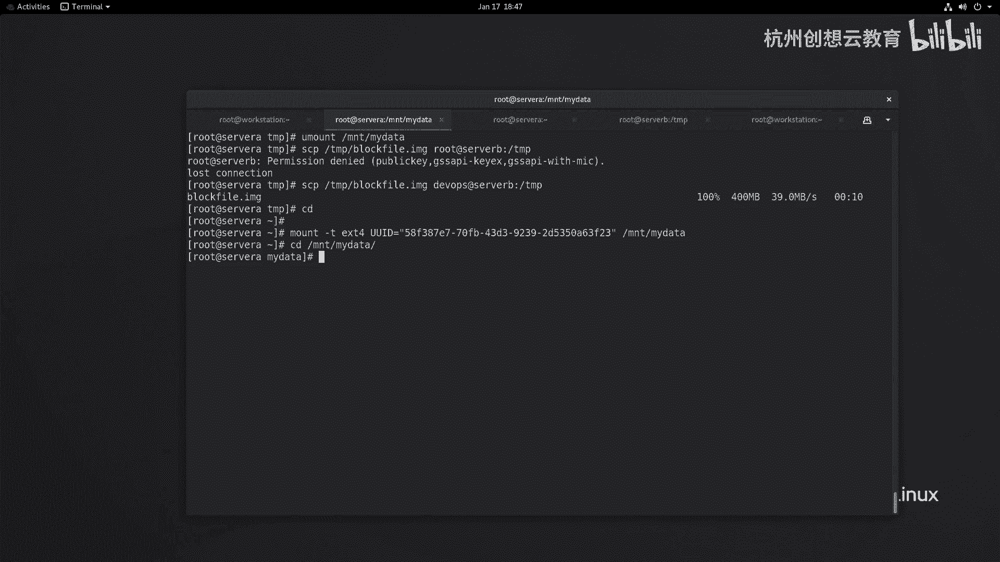
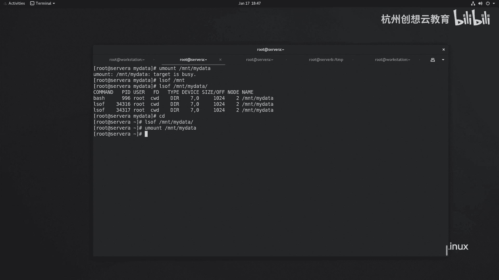

# 红帽认证系列工程师RHCE RH124-Chapter15：访问Linux文件系统 - P2：15-2-访问Linux文件系统-挂载和卸载文件系统

在本节课中，我们将要学习如何将文件系统挂载到Linux目录结构中，以及如何安全地卸载它们。这是访问和管理存储设备数据的基础操作。

## 概述：挂载与挂载点

上一节我们介绍了文件系统的基本概念。本节中我们来看看如何将文件系统与目录树关联起来。





无论是本地硬盘上的文件系统，还是移动存储设备中的文件系统，要访问其内容，都必须将该文件系统与本地的一个目录进行关联。这个过程称为**挂载**。而被挂载的那个空目录，则称为**挂载点**。

## 临时挂载文件系统

要临时挂载一个文件系统，我们一般会使用 `mount` 命令。这个命令可以将指定的文件系统挂载到某个目录上。





为了演示，我们首先在系统中准备一个虚拟的存储设备文件。

以下是创建一个虚拟块设备文件并格式化的步骤：



1.  使用 `dd` 命令创建一个400MB大小的空文件，模拟一个磁盘设备。
    ```bash
    dd if=/dev/zero of=/tmp/blockfile.image bs=4M count=100
    ```
2.  使用 `mkfs` 命令将这个文件格式化为 `ext4` 文件系统。
    ```bash
    mkfs.ext4 /tmp/blockfile.image
    ```
3.  在 `/mnt` 目录下创建一个空目录，作为挂载点。
    ```bash
    mkdir /mnt/mydata
    ```
4.  使用 `mount` 命令将格式化好的文件挂载到刚创建的目录。
    ```bash
    mount -t ext4 /tmp/blockfile.image /mnt/mydata
    ```
5.  挂载完成后，可以使用 `df` 命令查看挂载情况。
    ```bash
    df -h
    ```

## 使用UUID进行挂载

除了使用设备路径，我们还可以使用设备的**UUID**进行挂载。UUID是格式化文件系统时生成的唯一标识符，比设备名更稳定。

以下是使用UUID挂载的步骤：

1.  使用 `blkid` 命令查看设备的UUID。
    ```bash
    blkid /tmp/blockfile.image
    ```
2.  卸载当前挂载的设备。
    ```bash
    umount /mnt/mydata
    ```
3.  使用查看到的UUID重新挂载设备。
    ```bash
    mount -t ext4 UUID="你的-UUID-值" /mnt/mydata
    ```



使用UUID的方法比使用设备名称更好。例如，对于一个可插拔的磁盘设备，当它被拔下并插入另一台服务器时，设备名称（如 `/dev/sdb1`）可能会改变，但它的UUID保持不变，这能确保挂载配置的可靠性。

## 卸载文件系统



当我们不再需要访问挂载设备中的数据时，需要先卸载文件系统。

卸载文件系统使用 `umount` 命令，后跟挂载点路径。
```bash
umount /mnt/mydata
```



**重要提示**：在卸载前，必须确保没有用户或进程正在访问该挂载点。如果挂载点“正忙”，卸载操作会失败。

如果卸载时遇到“设备忙”的提示，可以按以下步骤处理：

1.  使用 `lsof` 命令查看是哪个进程在占用挂载点。
    ```bash
    lsof /mnt/mydata
    ```
2.  通知相关用户或终止相关进程。
3.  退出占用挂载点的目录或停止进程后，再次尝试卸载。

## 图形界面下的自动挂载



在具有图形化界面的Linux系统中，当插入一个系统能够识别的U盘或移动硬盘时，系统通常会将其自动挂载到 `/run/media/<当前用户名>/<设备标签>` 目录下，方便用户直接访问。

## 总结



本节课中我们一起学习了Linux文件系统挂载与卸载的核心操作。我们掌握了使用 `mount` 命令进行临时挂载的方法，了解了更稳定的UUID挂载方式，并学会了使用 `umount` 命令安全卸载设备。同时，我们也知道了处理“设备忙”错误的方法。这些是管理Linux存储空间的基础技能。