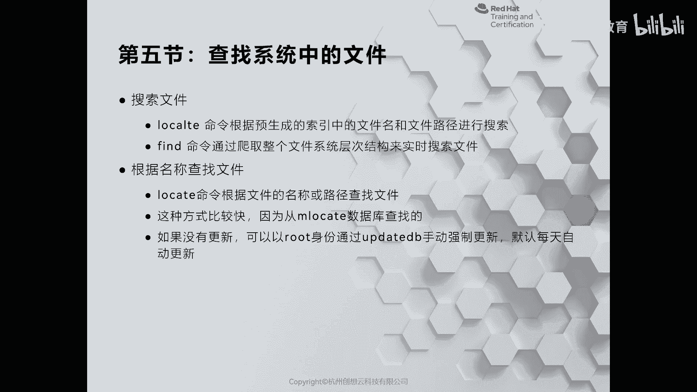
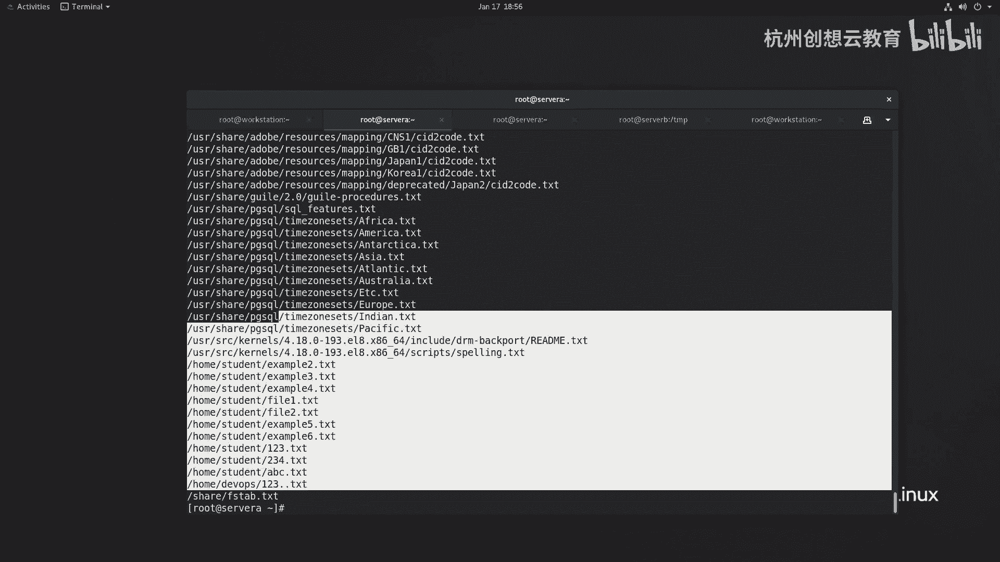
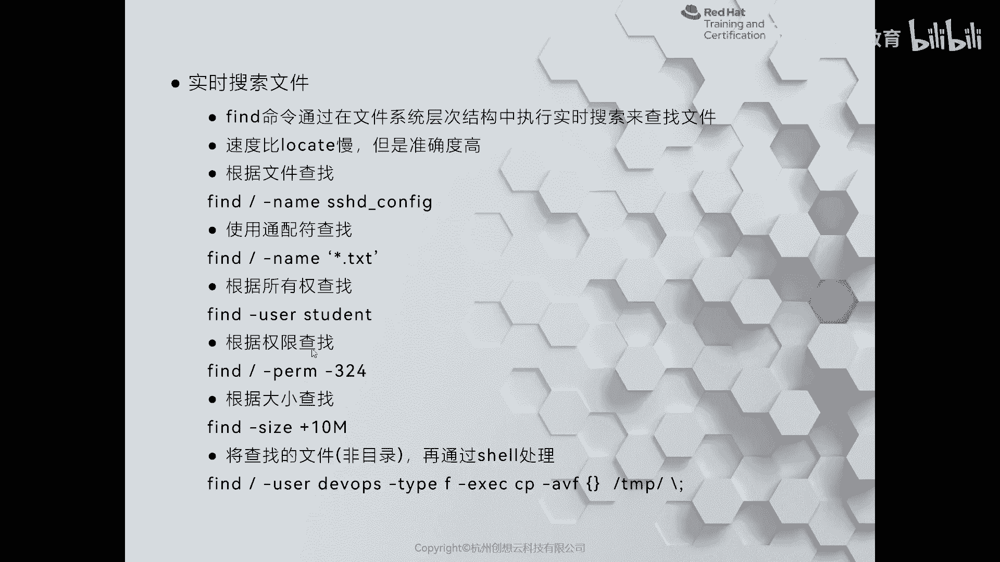
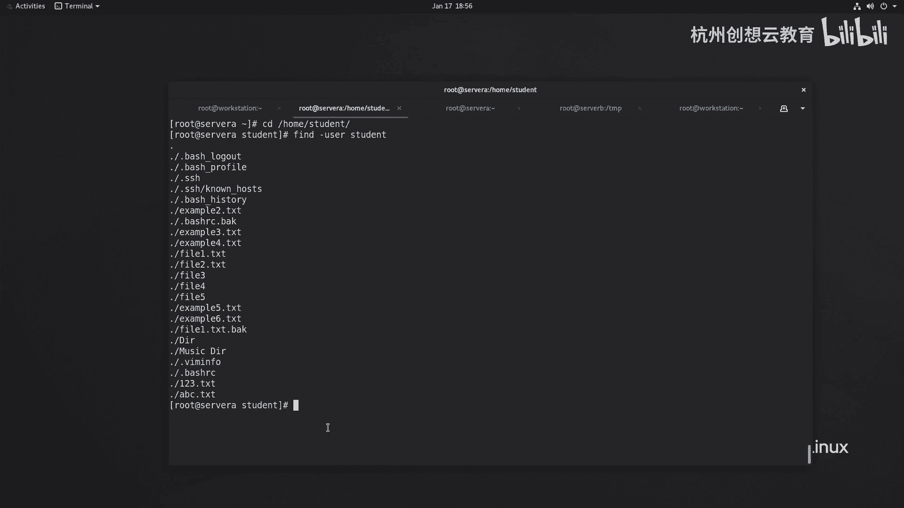
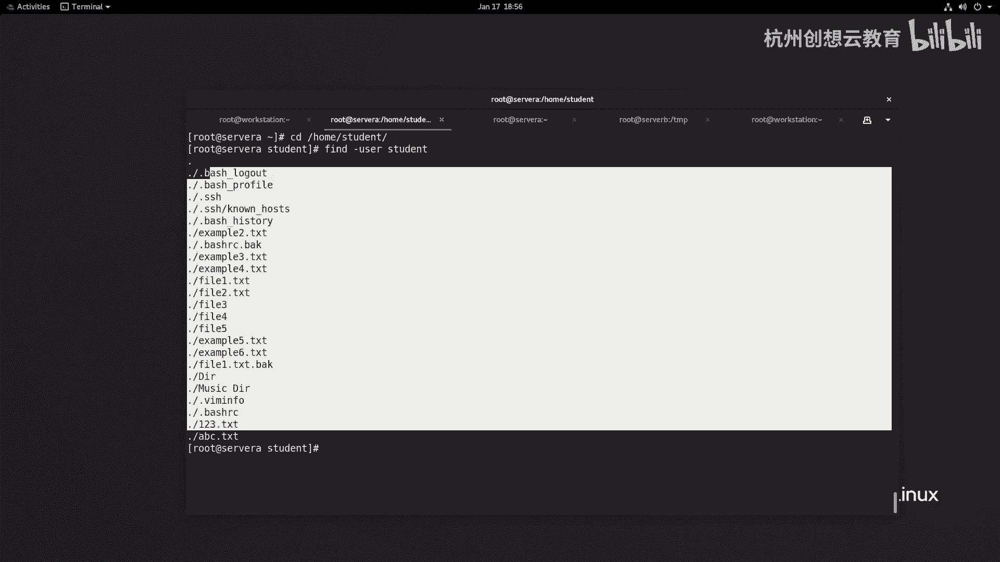
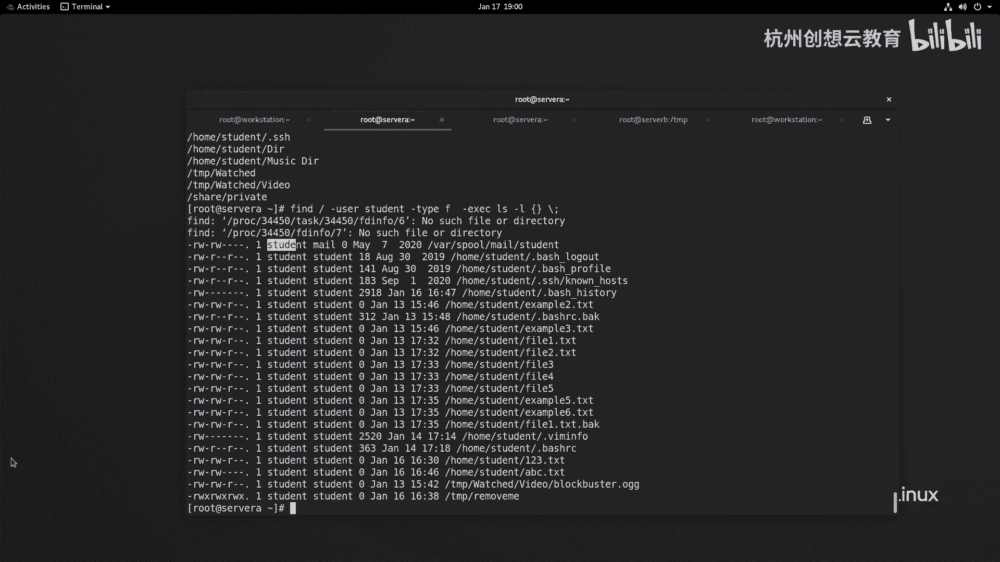

# 红帽认证系列工程师RHCE RH124-Chapter15-访问Linux文件系统 - P3：15-3-访问Linux文件系统-查找系统中的文件 - 杭州创想云教育 - BV1P14y1x7C6

好，第五节啊，查找系统当中的文件。唉，有的时候呢我们无法啊准确的记录下来啊，我们所需要的文件到底在文件系统哪些位置。那么我们可以使用locet或者find命令呢来查找。其中locet命令呢。

它会根据啊这个。事先生成的一个数据库啊，那么其实就是这里提到的一个索引啊，来查找文件名和文件路径，所以说速度呢非常的快啊。而但是呢它有个缺点，就是说呃它默认情况下呢是24小时更新一次的啊。

更新一次的okK那么第二个命令的话呢叫find。那么find命令在查找文件的时候呢，是啊从啊整个文件系统啊层的结构去一一查找的，是实时搜索的。那么速度呢相来说会慢，但是呢精准度更高。啊，清哥。

那么我们首先来说一下loccate。那么loccate呢刚才提到了，它呢是根据一个数据库来查找的。我们现在呢找一找试一试啊。比如说啊我们现在呢有很多文件，比如这里个有一个叫做no help out。

或找一找它看能不能找到look啊，跟上文件名，哎，发现找不到。为什么呀？这这就说明啊我们当前的数据库里面没有存放该文件的索引。那么因为数据库在 lablo and locateB里面，那怎么办呢？

这时候我们可以使用update dB命令来更新我们的这个索引的数据库，再次去查找就可以找到。那么还有一种方法呢，就是啊等到明天的这个时候再查找也是可以的啊，因为它默认是一天嘛，就会更新啊也更新。

那么还可以去找别的内容，随便找个关键词。比如说我们找一个。pass WD。你看所有包含有passLD字符串的文件呀，都给你找到了啊，都给你找到了啊，还有其他例子啊，比如说啊比如说我们想找一个什么呢？

比如说这个文件太多了啊，我只想看到5个哎，我就显示5个杠N5啊，只找5个。啊，知道5个哎也是可以的，可以限定数量啊，限定数量是loc的命令啊，那么另外一个一个命令的话呢，我们把它称之为是谁呀？

称之为是这个find。那么fd在查找的时候呢，哎它是在我们的整个文件系统里面啊实时查找的速度呢比较慢，但是精准度很高。你看我这里呢有些例子啊，比如说find根啊，就它的语法结构呢就是fd。

后面是一个路径啊，我这个例子呢就是一个根目录啊，然后呢后面跟上一个选项。啊，选项后面呢跟上你的条件啊，然后就能查找了。你像这个呢就是根据文件名去查找啊，我们来试一下。啊，比如说find根目录下面啊。

找一个文件名叫做SHD configurefi的。哎，就找得到了，精准度非常的高啊。那么第二个例子的话呢，是查找一个啊文件名啊，也是文件名的方式。但是使用了通配符。

通配符里面匹配的是所有以点TSD为后缀的文件。好，我们来找一下。啊，fin。根目录下面的name，然后呢是星号点tT。哎，所有的后缀是点TST找到的啊，全部都出来了。啊，精准度非常高啊。

那么我们除此之外呢，也可以干嘛呀？也可以把这些选项啊做一个复合啊，或根据需要呢选择不同权限。比如说根据所有权来查找，那么就是根据用户的。

名字来查找，我想查一找这个当前目录下，所有呢是student用户的文件。当前目录，因为我的find后面没有加路径，那么就是啊当前目录啊，当前目录。然后呢我们去找一找。啊，哎加木这里面应该没有啊。

我去home下的tudent里面找一找，好吧，find杠 myus啊student。啊，非常多。你看这些文件啊，隐藏文件都是的啊都是的。

当然了，除此之外，还有一些其他各种各样的选项啊，我的PPT里面只是一些长的例子，我们可以通过my find来获得帮助。在这个帮助列表当中，我们能看到非常多的这个内容。

我们来找一找啊。OK在t里面，比如说你可以对数值做一个设定，加一个数值，代表是比这个数值要多的减呢是比这个数值要小的N呢是匹配的啊，这是标准的写法啊，以前呢还有个斜杠斜杠的用法呢不再用了啊。

就用这种方法。比如这里的AMN则代表的是啊最近访问的时候单位呢是分钟啊，那么time的话呢是天数，对不对？哎，这种方法，你都可以去选择啊空文件可执行文件啊，总是失败的文件根据文件类型。

比如说我想找一找性当中啊是目录的文件是目录的，并且呢叫做谁呀？我想我找一个这样的吧，来复合的啊，fin的根目录下面。跟目录下面，那么属于是用户tudent的，但是呢又希望它是一个文件，而不是目录。

或者只希望它是目录，而不是文件。我找个目录的吧D。我们来看一看，你看加目录啊，这个点S赛区是吧？我们创建的这些目录都是我们创建的，我们都都知道，对吧？所以呢非常的匹配精准。也可以呢根据权限来查找。啊。

根据文件大小来查找都是可以的。如果我们想升级一下难度，那么还可以在这个命令的后面呀跟上一个叫做excact的子命令。通过excec呢，可以把查找扣的结果呀传递给我们的后面的是要命令。

而查找之查找之后的文件啊放在了花括户里面。然后呢，最终呢以反分反这个反斜杠啊，分号做结束啊，这个语法结构呢很复杂啊，我们来解释一下啊。呃，通过exs呢把f命令查找的结果传递给exc后面的设要命令。啊。

来处理。而查找到的文件呢则放在花括号里面。结束符反斜杠封号啊，那么我们举个例子，比如说啊我现在呢想找一找系统当中所有属于是student用户的文件。然后呢，我想判断到底是不是属于sdent用户。

那我可以通过exec。然后呢，通过IOS去判断。对吧判断啊，我只找文件吧，找找文件我就。我就加上一个类型式文件啊。啊，是文件的，然后呢，L杠L，那么后面跟着花火弧。

花火弧呢代表的是fd的命令查找出来的文件啊，空格反斜杠封号是固定用法，代表结束。那么找到的文件呢都属于是student用户。哎，就是这样一个结构啊，非常的方便啊非常方便。

okK这是fin的命令啊。