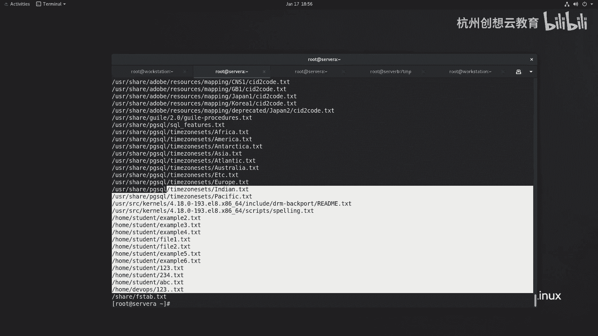
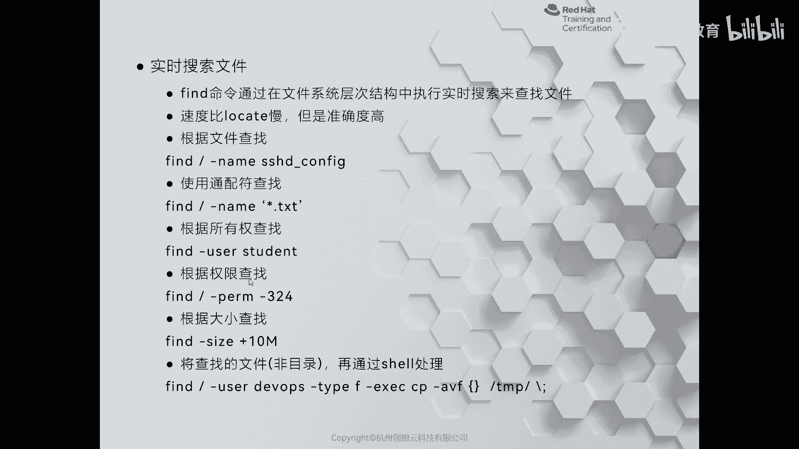
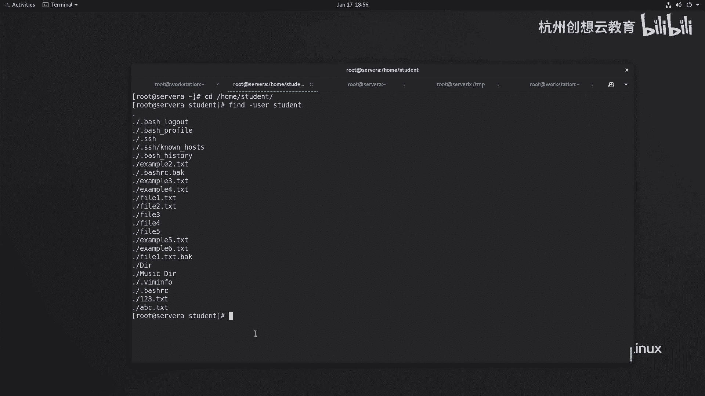
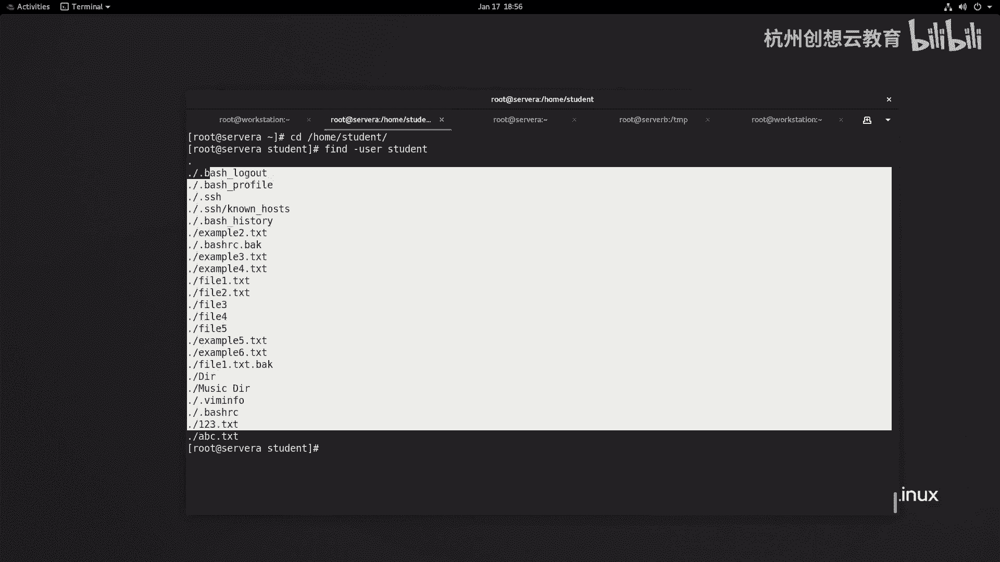
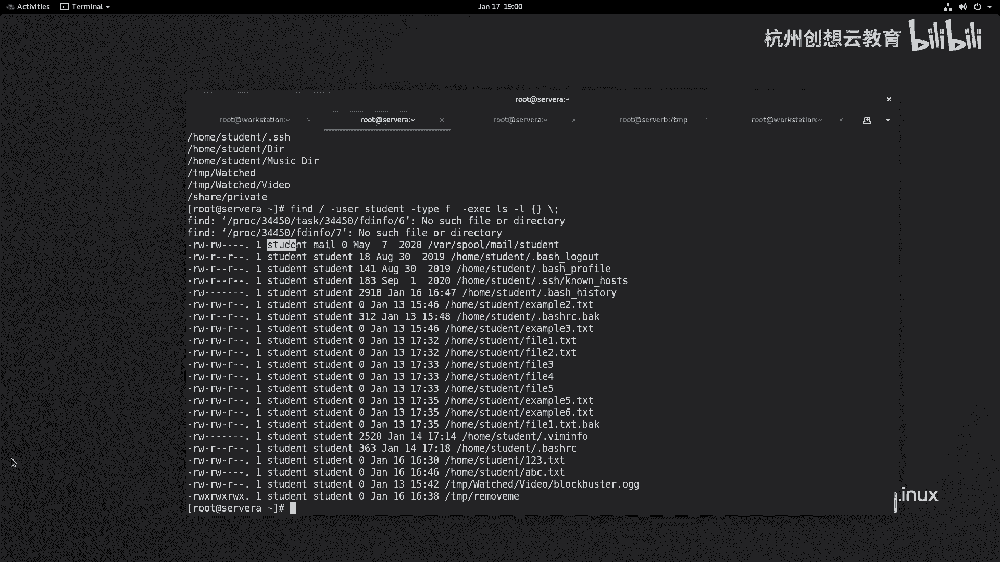

# 红帽认证系列工程师RHCE RH124-Chapter15：访问Linux文件系统 - P3：15-3-访问Linux文件系统-查找系统中的文件 🔍


在本节课程中，我们将学习如何在Linux文件系统中查找文件。当无法准确记住文件位置时，`locate`和`find`命令是强大的工具。我们将介绍这两个命令的基本用法、区别以及一些实用技巧。

## 使用 `locate` 命令进行快速查找

上一节我们介绍了文件系统的基本结构，本节中我们来看看如何快速定位文件。`locate`命令通过查询一个预先生成的数据库（索引）来查找文件名和路径，因此速度非常快。但需要注意的是，该数据库默认每24小时更新一次，可能无法反映最新的文件变化。

如果使用`locate`命令找不到新创建的文件，可能是因为数据库尚未更新。此时，可以使用`updatedb`命令手动更新数据库，或者等待系统自动更新。

以下是`locate`命令的一些使用示例：

*   `locate nginx.conf`：查找名为`nginx.conf`的文件。
*   `locate passwd`：查找所有包含“passwd”字符串的文件路径。
*   `locate -n 5 passwd`：仅显示前5个包含“passwd”的查找结果。

## 使用 `find` 命令进行精确查找

与`locate`不同，`find`命令会实时遍历文件系统进行搜索。虽然速度相对较慢，但其精准度更高，并且支持丰富的搜索条件。

`find`命令的基本语法结构是：
```bash
find [路径] [选项] [条件]
```





以下是`find`命令根据不同条件查找文件的示例：

*   **按文件名查找**：
    *   `find / -name “ssh_config”`：在根目录(`/`)下精确查找名为`ssh_config`的文件。
    *   `find / -name “*.txt”`：在根目录下查找所有以`.txt`结尾的文件（使用通配符`*`）。



*   **按文件所有者查找**：
    *   `find /home -user student`：在`/home`目录下查找所有属于`student`用户的文件。



*   **按文件类型查找**：
    *   `find / -user student -type d`：在根目录下查找属于`student`用户的所有目录（`-type d`表示目录）。

`find`命令的功能非常强大，可以通过`man find`查看完整手册，以了解更多的搜索条件，例如按文件大小(`-size`)、修改时间(`-mtime`)或权限(`-perm`)进行查找。

## 高级技巧：使用 `-exec` 处理查找结果

为了进一步提升效率，`find`命令可以与`-exec`选项结合使用，对搜索到的文件直接执行操作。

其语法结构如下：
```bash
find [路径] [条件] -exec [命令] {} \;
```
其中，`{}`代表`find`命令找到的每个文件，`\;`是命令的结束符。

例如，以下命令会查找属于`student`用户的普通文件，并用`ls -l`命令列出它们的详细信息：
```bash
find / -user student -type f -exec ls -l {} \;
```

## 总结



本节课中我们一起学习了在Linux系统中查找文件的两种主要方法。`locate`命令基于数据库索引，速度快但非实时；`find`命令实时搜索文件系统，速度较慢但精准灵活，并支持复杂条件与后续操作。掌握这两个工具将极大提升你在Linux环境下的文件管理效率。